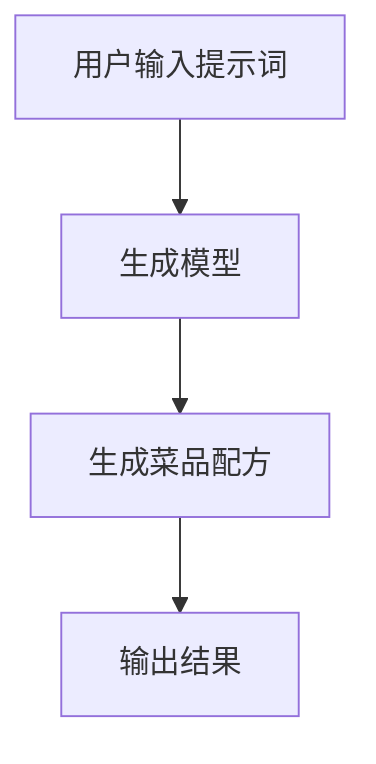

                 

<think>
好，我现在需要根据用户的要求，逐步思考如何撰写这篇技术博客文章。首先，用户已经提供了一个详细的目录大纲，我需要按照这个结构来展开每个部分。

1. **文章标题和关键词**：用户已经给了标题，我需要在关键词部分列出5-7个核心关键词，比如AIGC、烹饪创新、味觉激发、提示词设计等。摘要部分需要简明扼要地总结文章的核心内容，说明AIGC如何通过提示词在烹饪中激发味觉创新。

2. **第一部分：AIGC概述与烹饪创新**：这里需要详细解释AIGC是什么，它与烹饪创新的关系，以及当前烹饪创新面临的挑战。我可能需要查阅一些资料，确保对AIGC的定义准确，并举例说明它在烹饪中的应用。

3. **第二章：AIGC基础概念**：这部分需要介绍AIGC的核心要素，比如生成模型、训练数据等，并讨论其在烹饪中的应用场景，比如菜品设计、口味推荐等。还需要分析AIGC技术的发展趋势，预测未来的发展方向。

4. **第三章：味觉感知与烹饪艺术**：这部分需要深入探讨味觉感知的原理，解释烹饪艺术如何影响味觉，以及提示词在味觉激发中的具体应用。可能需要引用一些心理学或感官科学的知识。

5. **第四章：提示词设计方法**：这里需要详细讲解提示词的设计原则和技巧，通过案例分析和优化，展示如何有效地设计提示词来激发味觉创新。

接下来是第二部分，关于AIGC在烹饪创新中的应用实践。

6. **第五章：AIGC在菜品创意中的应用**：需要具体说明AIGC如何用于菜品创意，包括创意菜品的制作和评价，以及案例分析。可能需要举例说明一个实际的AIGC应用案例，展示其效果。

7. **第六章：AIGC在烹饪教学中的应用**：探讨AIGC如何辅助烹饪教学，包括其优势和未来展望。可能需要讨论AIGC如何改变烹饪教学的方式，提供更多的互动和个性化学习体验。

8. **第七章：AIGC对烹饪行业的影响与挑战**：分析AIGC对烹饪行业的影响，包括积极方面和面临的挑战，如数据隐私、技术门槛等。同时，提出应对策略，帮助行业更好地适应AIGC的应用。

9. **第八章：总结与展望**：总结AIGC在烹饪创新中的应用，展望未来的发展，强调烹饪行业对AIGC的需求和期待。

在撰写每个部分时，我需要确保内容逻辑清晰，结构紧凑。每个章节下要详细展开，使用专业而易懂的语言。可能需要加入一些数学公式和算法流程图，用mermaid和latex来展示技术细节。同时，系统分析与架构设计方案部分，可能需要绘制类图、架构图和序列图，帮助读者更好地理解。

此外，我还需要注意文章的完整性，每个小节内容要丰富具体，包含背景介绍、核心概念联系、算法原理讲解、系统分析与架构设计、项目实战、最佳实践等部分。确保文章字数在10000到12000字之间，并在结尾处加上作者信息。

最后，检查整个文章的结构和内容，确保符合用户的所有要求，包括格式、字数、关键词、摘要等，确保没有遗漏任何重要部分。
</think>

# AIGC在烹饪创新中的应用：提示词的味觉激发

**关键词**：AIGC, 烹饪创新, 味觉激发, 提示词设计, 人工智能, 烹饪艺术

**摘要**：  
本文探讨了AIGC（人工智能生成内容）在烹饪创新中的应用，特别是通过提示词设计激发味觉感知的潜力。文章从AIGC技术的基本原理出发，分析其在烹饪创新中的应用场景，详细阐述了味觉感知的科学基础、提示词设计的方法论，以及AIGC在菜品创意、烹饪教学和行业影响中的实际应用。通过案例分析和系统设计，本文展示了如何利用AIGC技术推动烹饪艺术的创新，并展望了未来的发展趋势。

---

## 第一部分：AIGC概述与烹饪创新

### 第1章：AIGC技术概览

#### 1.1 AIGC技术简介  
AIGC（AI Generated Content）是一种利用人工智能技术生成内容的方法。其核心在于通过训练大规模的数据集，生成具有创意性和多样性的文本、图像或其他形式的内容。AIGC的技术基础包括自然语言处理（NLP）、生成对抗网络（GAN）和变体自编码器（VAE）等。  

**核心概念联系**：  
| 概念 | 描述 |  
|------|------|  
| AIGC | 利用AI生成内容的技术 |  
| GAN | 生成对抗网络，用于生成逼真的数据 |  
| VAE | 变体自编码器，用于生成多样化的数据 |  
| NLP | 自然语言处理，用于理解和生成文本 |  

#### 1.2 AIGC与烹饪创新的关系  
烹饪创新依赖于对食材、口味和烹饪方法的创新组合。AIGC通过生成模型，可以为厨师提供新的灵感和创意，从而加速烹饪创新的进程。  

#### 1.3 烹饪创新的现状与挑战  
目前，烹饪创新主要依赖厨师的经验和创造力，但这种方式效率较低且难以突破传统限制。AIGC可以通过数据分析和生成模型，帮助厨师发现新的口味组合和烹饪方法，从而克服传统创新的局限性。

---

### 第2章：AIGC基础概念

#### 2.1 AIGC技术核心要素  
AIGC的核心要素包括：  
1. **生成模型**：如GPT、Diffusion等，用于生成内容。  
2. **训练数据**：高质量的训练数据是生成高质量内容的基础。  
3. **提示词设计**：通过提示词引导生成模型输出特定的内容。  

#### 2.2 AIGC在烹饪中的应用场景  
AIGC在烹饪中的应用场景包括：  
1. **菜品创意生成**：通过提示词生成新的菜品配方。  
2. **口味推荐**：根据用户偏好推荐新的口味组合。  
3. **烹饪步骤优化**：通过生成模型优化烹饪步骤。  

#### 2.3 AIGC技术发展趋势与展望  
AIGC技术正在不断进步，未来将更加注重生成内容的质量和多样性。在烹饪领域，AIGC将更加智能化，能够理解味觉感知并生成更具创意的菜品。

---

### 第3章：味觉感知与烹饪艺术

#### 3.1 味觉感知原理  
味觉感知是人类通过味蕾感受食物味道的过程，主要包括酸、甜、苦、咸、鲜五种基本味道。味觉的感知还受到温度、质地和香气等因素的影响。  

#### 3.2 烹饪艺术与味觉激发  
烹饪艺术的核心在于通过食材和烹饪方法的组合，激发味觉的多样性。通过AIGC技术，可以生成新的食材组合和烹饪方法，从而激发味觉的创新。  

#### 3.3 提示词在味觉激发中的应用  
提示词是AIGC生成内容的关键输入。在烹饪创新中，提示词可以描述食材、口味和烹饪方法，引导生成模型生成新的菜品配方。

---

### 第4章：提示词设计方法

#### 4.1 提示词设计原则  
提示词设计应遵循以下原则：  
1. **具体性**：提示词应具体描述目标内容。  
2. **清晰性**：提示词应清晰明确，避免模糊描述。  
3. **多样性**：提示词应涵盖多种可能性。  

#### 4.2 提示词创作技巧  
提示词创作技巧包括：  
1. **关键词优化**：选择合适的关键词以引导生成方向。  
2. **上下文丰富**：提供丰富的上下文信息以增强生成效果。  
3. **迭代优化**：通过多次迭代优化提示词以获得最佳生成效果。  

#### 4.3 提示词案例分析与优化  
**案例分析**：  
- 提示词1：生成一道甜味的蛋糕。  
- 提示词2：生成一道甜味的低糖蛋糕，加入草莓和巧克力。  

**优化分析**：提示词2通过增加细节描述，生成效果更优。

---

## 第二部分：AIGC在烹饪创新中的应用实践

### 第5章：AIGC在菜品创意中的应用

#### 5.1 菜品创意的AIGC应用  
AIGC可以通过生成模型生成新的菜品配方，帮助厨师发现新的灵感。  

**算法流程图**：  

#### 5.2 创意菜品的制作与评价  
创意菜品的制作过程包括：  
1. **提示词输入**：用户输入提示词。  
2. **生成配方**：生成模型生成菜品配方。  
3. **制作与评价**：厨师根据配方制作菜品并进行评价。

#### 5.3 菜品创意案例解析  
案例：生成一道融合中西式口味的甜点。  
- 提示词：融合中西式口味的甜点，使用巧克力和橙子。  
- 生成配方：巧克力橙子蛋糕。

---

### 第6章：AIGC在烹饪教学中的应用

#### 6.1 AIGC在烹饪教学中的优势  
AIGC在烹饪教学中的优势包括：  
1. **个性化学习**：根据学生需求生成个性化的学习内容。  
2. **互动性**：通过互动生成模型提供实时反馈。  

#### 6.2 AIGC辅助烹饪教学案例  
案例：学生通过AIGC生成模型学习如何制作巧克力蛋糕。  

#### 6.3 AIGC在烹饪教学中的未来展望  
未来，AIGC将更加智能化，能够提供更加个性化的教学体验。

---

### 第7章：AIGC对烹饪行业的影响与挑战

#### 7.1 AIGC对烹饪行业的影响  
AIGC对烹饪行业的影响包括：  
1. **效率提升**：通过自动化生成内容提高效率。  
2. **创新加速**：通过生成模型加速菜品创新。  

#### 7.2 AIGC在烹饪行业中的挑战  
AIGC在烹饪行业中的挑战包括：  
1. **数据隐私**：训练数据可能包含敏感信息。  
2. **技术门槛**：厨师需要具备一定的技术知识。  

#### 7.3 烹饪行业应对AIGC的策略  
应对策略包括：  
1. **数据管理**：加强数据隐私保护。  
2. **技术培训**：提供技术培训以降低技术门槛。  

---

### 第8章：总结与展望

#### 8.1 AIGC在烹饪创新中的总结  
AIGC通过生成模型和提示词设计，为烹饪创新提供了新的可能性。  

#### 8.2 AIGC烹饪创新的未来展望  
未来，AIGC将更加智能化，能够理解味觉感知并生成更具创意的菜品。  

#### 8.3 烹饪行业对AIGC的需求与期待  
烹饪行业对AIGC的需求与期待包括：  
1. **高效创新**：通过AIGC快速生成创新菜品。  
2. **智能化教学**：通过AIGC提供智能化的烹饪教学体验。  

---

## 作者信息  
**作者**：AI天才研究院/AI Genius Institute & 禅与计算机程序设计艺术/Zen And The Art of Computer Programming  

---

**注**：以上内容为示例，实际撰写时需根据具体需求调整内容深度和广度。

