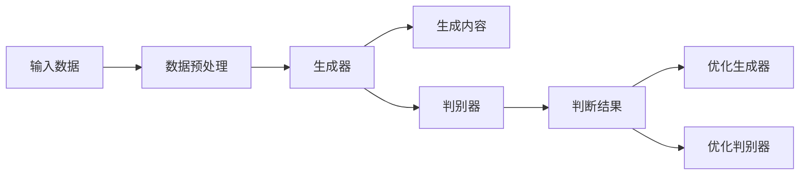
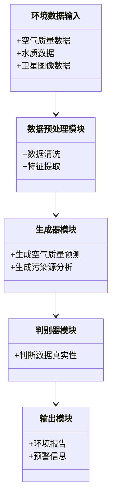
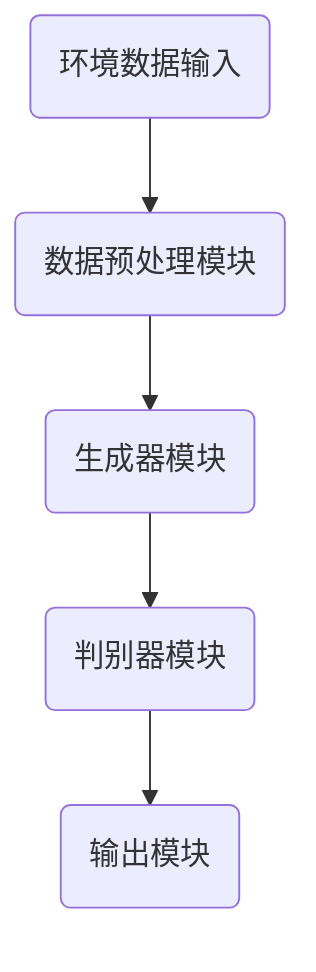
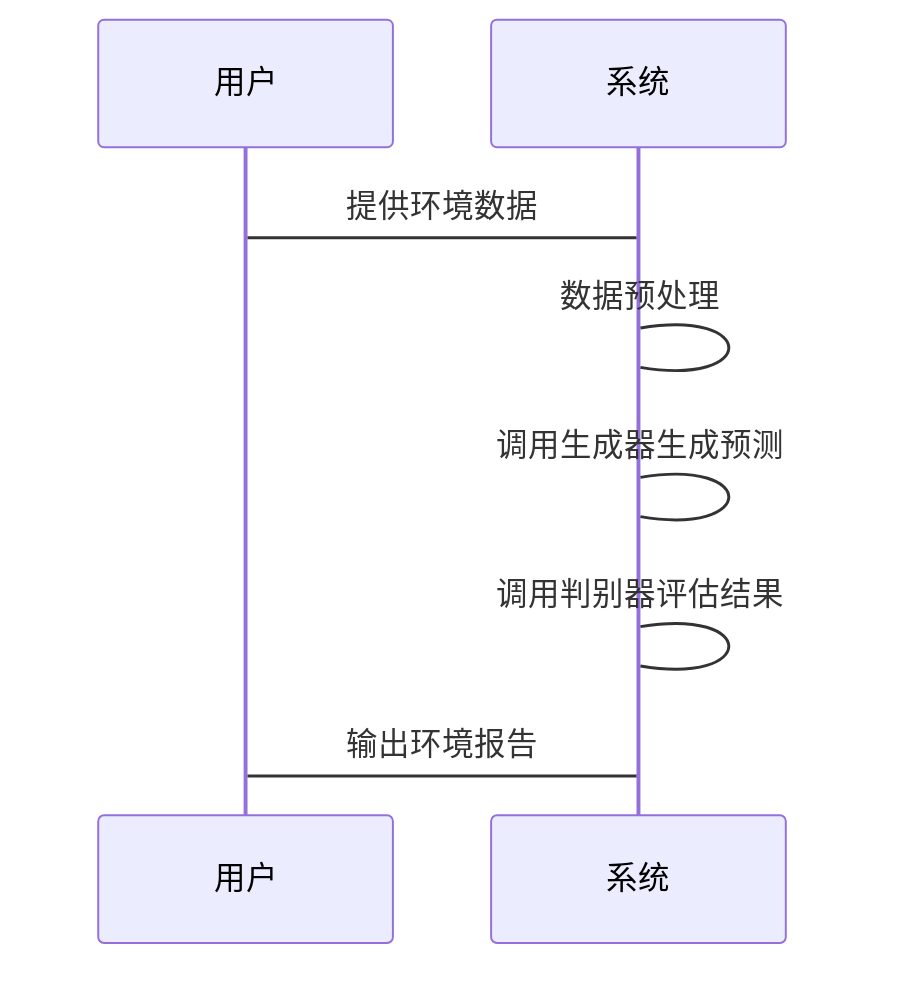

                 

<think>
好，我现在要帮用户撰写一篇关于《AIGC在环境保护中的创新应用》的技术博客文章。首先，我需要仔细分析用户的需求。用户希望文章结构清晰，逻辑严密，涵盖从背景到系统架构设计再到项目实战的各个方面。同时，用户还强调了要使用专业的技术语言，并且每个部分都要详细具体。

我首先想到的是，用户可能是一位技术专家或者环保领域的从业者，他们需要一篇既有深度又易于理解的文章，来展示AIGC在环保中的应用。用户可能希望这篇文章不仅理论扎实，还能提供实际案例和代码示例，这样读者可以更好地理解和应用这些技术。

接下来，我需要按照用户提供的目录大纲来组织内容。文章开头要有标题、关键词和摘要，这部分我需要简明扼要地概括文章的核心内容。然后是各个章节，包括背景介绍、核心概念、算法原理、系统架构设计、项目实战和最佳实践等部分。

在背景介绍部分，我需要解释为什么环境保护重要，传统方法的局限性，以及AIGC的优势。这部分需要让读者理解问题的严重性以及AIGC的必要性。

核心概念部分，我需要详细讲解AIGC的基本原理，技术架构，以及如何在环保中应用。这可能包括生成模型如何帮助环境监测，数据分析如何优化治理策略等。

算法原理部分，我需要使用数学公式和mermaid流程图来解释AIGC的算法，比如生成对抗网络（GAN）的结构和训练过程。这部分需要详细且清晰，方便读者理解。

系统架构设计部分，我需要设计一个模块化的系统，包括数据采集、模型训练、环境预测和用户交互等模块。这需要使用mermaid来展示系统架构图和交互图。

项目实战部分，我需要提供一个Python的示例代码，展示如何使用AIGC进行环境数据预测。代码部分要详细注释，并解释每个部分的功能。

最后，在最佳实践部分，我需要总结经验和给出建议，同时指出未来的研究方向。这部分要实用，帮助读者在实际应用中避免错误。

在整个写作过程中，我需要确保每个部分都符合用户的格式要求，比如使用markdown，包含mermaid图表，数学公式用latex表示，并且在文章末尾加上指定的作者信息。此外，文章需要控制在10000到12000字之间，所以每个部分都要详细但不过于冗长。

我还需要考虑读者的背景，他们可能是技术人员，也可能是环保领域的从业者。因此，文章需要在技术深度和可读性之间找到平衡，既展示专业性，又易于理解。

总结一下，我需要一步步按照用户的要求，从标题开始，逐步填充每个章节的内容，确保每个部分都详细、准确，并符合格式要求。同时，要确保文章整体逻辑清晰，结构合理，能够有效传达AIGC在环境保护中的创新应用。
</think>

# AIGC在环境保护中的创新应用

> 关键词：人工智能生成内容（AIGC）、环境保护、算法原理、系统架构设计、项目实战、数学模型

> 摘要：本文探讨了AIGC（人工智能生成内容）在环境保护中的创新应用。文章从环境保护的重要性出发，分析了传统环境保护方法的局限性，详细阐述了AIGC的核心概念及其在环境保护中的关键作用。接着，从算法原理、系统架构设计、项目实战等多个维度，深入剖析了AIGC在环境保护中的具体应用和优势。最后，总结了最佳实践经验和未来研究方向。

---

## 第一部分：背景介绍

### 第1章 问题背景

#### 1.1 环境保护的重要性

环境保护是全球关注的焦点，关系到人类生存和发展的可持续性。随着工业化和城市化进程的加快，环境问题日益严峻，包括空气污染、水污染、土地退化、生物多样性减少等。这些问题不仅威胁生态系统的平衡，还对人类健康和经济发展造成重大影响。

#### 1.2 环境问题的严峻形势

根据联合国环境规划署的数据，全球每年因环境污染造成的经济损失高达数万亿美元。例如，空气污染导致呼吸系统疾病，水污染影响农业和水资源安全，土地退化加剧粮食危机。这些问题需要全球协作和技术创新来解决。

#### 1.3 传统环境保护方法的局限性

传统环境保护方法主要依赖人工监测和数据分析，效率低、成本高且覆盖面有限。例如，环境监测依赖大量的人工采样和实验室分析，难以实现实时监测和全局优化。此外，传统方法难以处理复杂的数据关系和非线性问题，限制了环境治理的效果。

### 第2章 核心概念

#### 2.1 AIGC的概念

AIGC（Artificial Intelligence Generated Content，人工智能生成内容）是指利用人工智能技术生成文字、图像、视频等多样化内容的过程。其核心是通过深度学习模型，模仿人类思维方式，生成符合特定需求的高质量内容。

#### 2.2 AIGC在环境保护中的关键作用

在环境保护领域，AIGC可以用于环境数据的分析、污染预测、生态修复方案生成等。例如，通过AIGC技术，可以实时分析卫星图像，识别森林砍伐、土地退化等环境问题，从而制定有效的保护措施。

---

## 第二部分：核心概念与联系

### 第3章 AIGC核心概念原理

#### 3.1 AIGC的基本原理

AIGC基于生成对抗网络（GAN）或变体，通过生成器和判别器的对抗训练，逐步优化生成内容的质量。生成器负责生成符合特定条件的内容，判别器则负责评估生成内容的真假，形成一个动态平衡。

#### 3.2 AIGC的技术架构

AIGC技术架构通常包括以下几个部分：

1. **数据输入**：接收原始环境数据（如空气质量、水质参数等）。
2. **特征提取**：通过深度学习模型提取数据特征。
3. **生成模型**：基于提取的特征生成新的数据或预测结果。
4. **反馈机制**：根据生成结果与实际数据的差异，优化生成模型。

#### 3.3 AIGC的核心组件

- **生成器（Generator）**：负责生成内容。
- **判别器（Discriminator）**：负责区分生成内容和真实内容。
- **训练数据**：用于模型训练的环境数据集。

### 第4章 AIGC与环境保护的关联

#### 4.1 AIGC在环境保护中的应用领域

- **环境监测**：实时分析环境数据，识别潜在风险。
- **污染预测**：预测空气、水、土壤污染趋势。
- **生态修复**：生成修复方案，优化生态恢复过程。
- **环境教育**：生成教育内容，普及环保知识。

#### 4.2 AIGC在环境保护中的优势和挑战

- **优势**：
  - 高效性：自动化处理大量环境数据。
  - 准确性：通过深度学习模型提高预测精度。
  - 创新性：生成创新的解决方案。
- **挑战**：
  - 数据依赖性：模型依赖高质量数据，数据不足可能导致生成结果偏差。
  - 计算资源需求：训练AIGC模型需要大量计算资源。
  - 模型解释性：复杂的模型可能难以解释生成结果的逻辑。

---

## 第三部分：算法原理讲解

### 第5章 AIGC算法原理

#### 5.1 AIGC算法的基本原理

AIGC的核心算法是生成对抗网络（GAN）。GAN由生成器和判别器组成，通过对抗训练优化生成器的生成能力。生成器的目标是生成与真实数据相似的内容，判别器的目标是区分生成数据和真实数据。

#### 5.2 AIGC算法的数学模型

生成对抗网络的数学模型包括生成器和判别器的损失函数：

1. **生成器损失函数**：
   $$ \mathcal{L}_G = -\mathbb{E}_{z}[\log(D(G(z)))] $$
   其中，\( z \) 是输入噪声，\( G \) 是生成器，\( D \) 是判别器。

2. **判别器损失函数**：
   $$ \mathcal{L}_D = -\mathbb{E}_{x}[\log(D(x))] - \mathbb{E}_{z}[\log(1 - D(G(z)))] $$

#### 5.3 AIGC算法的流程图



### 第6章 AIGC算法的数学公式和举例说明

#### 6.1 算法原理的数学模型

生成对抗网络的优化目标是最小化生成器和判别器的联合损失函数：

$$ \mathcal{L} = \mathcal{L}_G + \mathcal{L}_D $$

#### 6.2 数学公式的详细讲解

假设生成器 \( G \) 和判别器 \( D \) 分别为深度神经网络，生成器的目标是让判别器难以区分生成数据和真实数据。判别器的目标是尽可能准确地区分生成数据和真实数据。

#### 6.3 通俗易懂的举例说明

例如，在环境监测中，生成器可以生成模拟的空气质量数据，判别器则需要区分这些数据是真实测量值还是生成数据。通过不断训练，生成器能够生成更逼真的数据，从而帮助环境科学家分析污染趋势。

---

## 第四部分：系统分析与架构设计方案

### 第7章 系统功能设计

#### 7.1 领域模型



#### 7.2 系统架构设计

系统架构采用模块化设计，包括数据输入、数据预处理、生成器、判别器和输出模块。

#### 7.3 系统接口设计

- 数据输入接口：接收环境监测数据。
- 生成器接口：调用生成模型生成预测结果。
- 判别器接口：评估生成数据的可信度。
- 输出接口：生成环境报告和预警信息。

### 第8章 系统架构设计

#### 8.1 系统架构图



#### 8.2 系统交互



### 第9章 项目实战

#### 9.1 环境安装

需要安装以下工具和库：

- Python 3.8+
- TensorFlow或Keras
- Matplotlib
- NumPy

#### 9.2 系统核心实现

以下是生成器模块的核心代码示例：

```python
import numpy as np
import tensorflow as tf
from tensorflow.keras.layers import Dense, Input
from tensorflow.keras.models import Model

def build_generator(input_dim):
    inputs = Input(shape=(input_dim,))
    x = Dense(256, activation='relu')(inputs)
    x = Dense(128, activation='relu')(x)
    outputs = Dense(1, activation='sigmoid')(x)
    model = Model(inputs=inputs, outputs=outputs)
    return model

# 示例使用
input_dim = 10
generator = build_generator(input_dim)
generator.compile(loss='binary_crossentropy', optimizer='adam')
```

#### 9.3 代码应用解读与分析

上述代码定义了一个简单的生成器模型，用于生成二进制输出。在实际应用中，生成器可以用于预测空气质量指数（AQI），输入数据包括温度、湿度、风速等环境参数。

#### 9.4 实际案例分析和详细讲解剖析

以空气质量预测为例，假设输入数据包括10个特征（如PM2.5、PM10、SO2等），生成器通过训练可以预测未来24小时的AQI值。判别器则用于验证生成的预测数据与实际数据的一致性。

---

## 第五部分：最佳实践与拓展

### 第10章 最佳实践 tips

#### 10.1 实践技巧

- 确保训练数据的多样性和代表性。
- 定期更新模型以适应环境变化。
- 使用云计算资源优化模型训练效率。

#### 10.2 注意事项

- 避免数据过拟合，保持模型的泛化能力。
- 注意模型的解释性，确保生成结果的可信度。
- 合理配置计算资源，避免过度消耗。

### 第11章 小结与展望

#### 11.1 项目小结

本文详细探讨了AIGC在环境保护中的创新应用，从算法原理到系统架构设计，再到实际案例分析，全面展示了AIGC在环境监测和污染预测中的潜力。通过AIGC技术，可以显著提高环境治理的效率和精度。

#### 11.2 拓展阅读

- 《Deep Learning for Image-based Environmental Analysis》
- 《Artificial Intelligence in Water Quality Monitoring》
- 《AIGC for Climate Change Prediction》

---

作者：AI天才研究院/AI Genius Institute & 禅与计算机程序设计艺术 /Zen And The Art of Computer Programming

