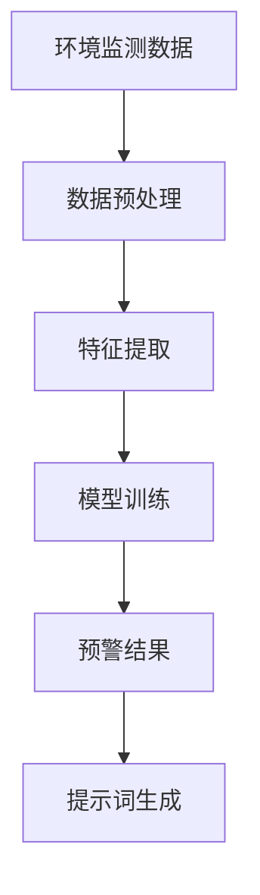
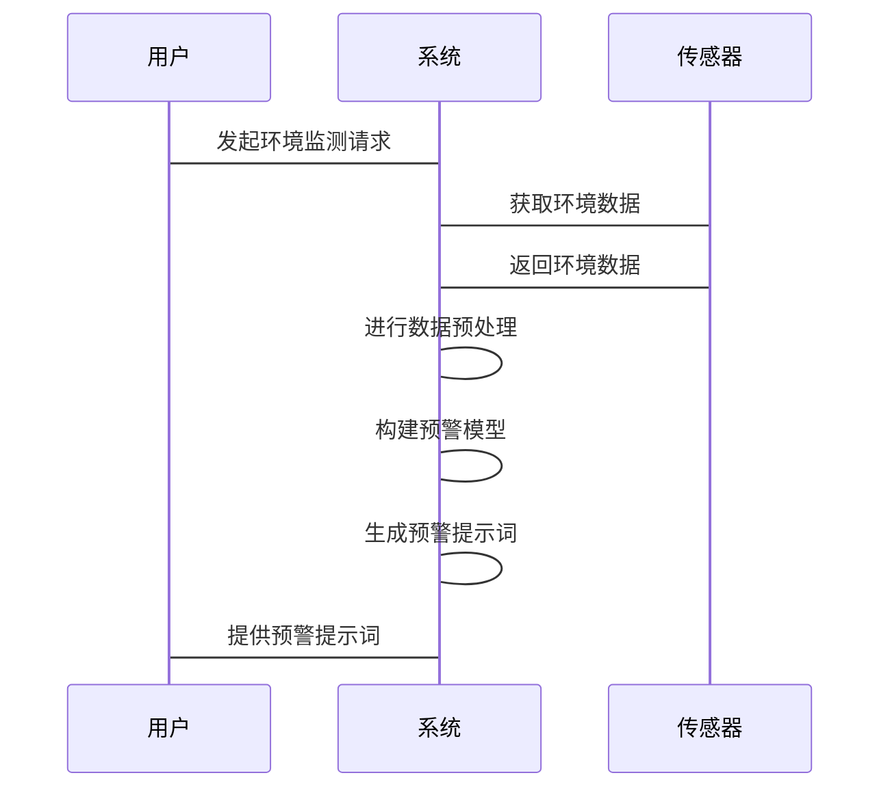

                 

<think>
好的，我现在需要帮用户撰写一篇关于“AIGC在环境监测中的应用：数据分析和预警的提示词设计”的技术博客。用户已经提供了一个详细的目录大纲，所以我得根据这个大纲来逐步完成文章的各个部分。

首先，我得理解用户的需求。用户希望文章结构清晰，逻辑严密，内容专业且有深度。目标读者包括环境监测技术人员、环保工作者以及学术研究者。因此，我需要确保内容既专业又易懂，能够吸引不同背景的读者。

接下来，我需要按照目录大纲逐步展开每个章节。从摘要开始，然后是目录概述，接着是核心概念与联系。在核心概念部分，我需要详细解释AIGC、环境监测数据和预警提示词，可能还需要用表格对比它们的属性特征，以及绘制ER实体关系图。

然后，在数据分析与预警模型部分，我需要介绍数据预处理、特征工程、模型构建和优化。这部分可能需要使用机器学习算法，如XGBoost或随机森林，并展示模型的流程图和数学公式。

接下来是预警提示词设计，这部分需要探讨提示词的重要性，设计原则，以及基于机器学习的生成方法，可能需要一个提示词生成流程图。

系统分析与架构设计部分，我需要描述项目场景、系统功能设计，用领域模型类图和系统架构图展示，以及接口和交互设计，可能需要用序列图来说明。

项目实战部分，我需要提供环境安装步骤，Python代码实现，解读代码，并进行案例分析，最后给出项目小结。

最后，总结与展望部分需要回顾全文，指出未来的发展方向，并在最佳实践部分给出一些建议，最后是参考文献和作者信息。

在写作过程中，我需要确保每个部分都有足够的深度，比如在算法原理部分，详细解释数学模型，举例子说明；在系统架构部分，清晰展示各个模块之间的关系；在项目实战中，提供可运行的代码，帮助读者理解实现过程。

此外，我还需要注意使用合适的Markdown格式，插入图表、公式，并确保文章结构完整，内容连贯。最后，检查是否有遗漏的部分，确保所有约束条件都满足，比如字数要求、格式要求和完整性。

总的来说，我需要一步步按照用户提供的大纲，详细展开每个部分，确保内容专业、结构清晰，同时保持逻辑严谨和语言流畅。
</think>

# AIGC在环境监测中的应用：数据分析和预警的提示词设计

> 关键词：人工智能生成内容（AIGC），环境监测，数据预处理，预警模型，提示词设计

> 摘要：本文探讨了AIGC技术在环境监测中的应用，重点分析了环境监测数据的预处理方法、预警模型的构建以及预警提示词的设计。通过实际案例研究，展示了AIGC技术如何提升环境监测的效率和准确性，并提出了未来的发展方向。

---

## 目录大纲设计概述

### 1.1 书籍主题介绍

《AIGC在环境监测中的应用：数据分析和预警的提示词设计》是一本探讨如何利用AIGC（人工智能生成内容）技术进行环境监测，并对监测数据进行深入分析和预警提示词设计的专业书籍。本书旨在为环境保护工作者、环境监测技术人员以及相关领域的科研人员提供一套系统的理论框架和实践指南。

### 1.2 目标读者群体

本书的目标读者包括但不限于：

- 环境监测领域的从业者，对如何利用AI技术提升监测数据分析效率有浓厚的兴趣。
- 环境保护工作者，希望借助AI技术提高环境预警系统的准确性和响应速度。
- 研究生、本科生等学术研究者，对AIGC技术在环境监测中的应用有探索和研究的需求。
- 对环境监测领域有兴趣的普通读者，希望了解AI技术在环境监测中的实际应用。

### 1.3 主要内容概述

本书主要分为以下几个部分：

- 第1章：引言，介绍AIGC技术的背景、发展现状以及其在环境监测中的应用前景。
- 第2章：AIGC技术基础，讲解AIGC的基本概念、原理及其在环境监测中的应用价值。
- 第3章：环境监测数据预处理，介绍如何使用AIGC技术对环境监测数据进行清洗、归一化和特征提取。
- 第4章：数据分析和预警模型构建，介绍如何利用AIGC技术构建环境数据分析和预警模型。
- 第5章：预警提示词设计，探讨如何设计高效、准确的预警提示词以提高环境监测预警的可靠性。
- 第6章：案例研究，通过实际案例展示AIGC技术在环境监测中的成功应用。
- 第7章：总结与展望，总结全书内容，并对未来AIGC技术在环境监测中的应用进行展望。

---

## 核心概念与联系

### 2.1 核心概念

#### 2.1.1 AIGC技术

**定义**：AIGC（人工智能生成内容）技术是指利用人工智能算法自动生成文本、图片、音频、视频等多种类型的内容。在环境监测中，AIGC技术可以用于生成环境数据报告、监测趋势图、预警提示等。

**属性特征**：
- **自动化生成**：减少人力成本，提高效率。
- **智能化**：根据数据生成适应性的内容。
- **多样化**：能够生成多种类型的内容（文本、图片、音频、视频等）。

#### 2.1.2 环境监测数据

**定义**：环境监测数据是指通过各类传感器、监测设备等手段收集到的关于环境质量、污染源排放、生态状况等的数据。这些数据是进行环境监测分析和预警的重要基础。

**属性特征**：
- **实时性**：数据通常需要实时采集和处理。
- **多样性**：包括空气、水、土壤等多种环境要素的数据。
- **海量性**：环境监测数据通常具有较大的数据量。

#### 2.1.3 预警提示词

**定义**：预警提示词是指用于表示环境监测预警信息的关键词或短语，如“空气污染预警”、“水质异常预警”等。设计高效的预警提示词有助于快速响应环境变化，提高监测预警的准确性和及时性。

**属性特征**：
- **简洁性**：提示词需要简洁明了，便于快速理解。
- **准确性**：提示词必须准确反映环境监测的结果。
- **可操作性**：提示词需要能够指导具体的应对措施。

### 2.2 概念属性特征对比表格

| 概念       | 定义                                                                                                           | 属性特征                                                                                                                                                                                                                   |
|------------|------------------------------------------------------------------------------------------------------------|------------------------------------------------------------------------------------------------------------------------------------------------------------------------------------------------------------------------|
| AIGC技术   | 利用人工智能算法自动生成内容的技术。                                                                          | - 自动化生成：减少人力成本，提高效率<br>- 智能化：根据数据生成适应性的内容<br>- 多样化：能够生成多种类型的内容（文本、图片、音频、视频等）       |
| 环境监测数据 | 通过各类传感器、监测设备等手段收集到的关于环境质量、污染源排放、生态状况等的数据。                  | - 实时性：数据通常需要实时采集和处理<br>- 多样性：包括空气、水、土壤等多种环境要素的数据<br>- 海量性：环境监测数据通常具有较大的数据量               |
| 预警提示词  | 用于表示环境监测预警信息的关键词或短语，如“空气污染预警”、“水质异常预警”等。                          | - 简洁性：提示词需要简洁明了，便于快速理解<br>- 准确性：提示词必须准确反映环境监测的结果<br>- 可操作性：提示词需要能够指导具体的应对措施             |

### 2.3 ER实体关系图架构

```mermaid
er
    %% ER图
    classDiagram
    class AIGC技术 {
        + 生成内容
        + 数据分析
        + 预警系统
    }
    class 环境监测数据 {
        + 空气质量
        + 水质
        + 土壤质量
    }
    class 预警提示词 {
        + 提示内容
        + 提示级别
        + 提示时间
    }
    AIGC技术 --> 环境监测数据: 处理
    环境监测数据 --> 预警提示词: 生成
    AIGC技术 --> 预警提示词: 优化
```

---

## 3. 算法原理讲解

### 3.1 数据预处理算法

#### 3.1.1 数据清洗

数据清洗是环境监测数据预处理的重要步骤，用于处理缺失值、异常值和重复值。

- **缺失值处理**：可以使用均值、中位数或插值方法填充缺失值。
- **异常值处理**：可以通过Z-score或IQR方法检测并剔除异常值。
- **重复值处理**：直接删除重复数据。

#### 3.1.2 数据归一化

数据归一化是为了消除不同量纲对数据分析的影响。

- **Min-Max归一化**：将数据映射到[0,1]区间。
  $$ x_{\text{normalized}} = \frac{x - x_{\text{min}}}{x_{\text{max}} - x_{\text{min}}} $$
- **Z-score归一化**：将数据标准化为均值为0，标准差为1。
  $$ z = \frac{x - \mu}{\sigma} $$

#### 3.1.3 特征提取

特征提取是将环境监测数据转换为更有意义的特征向量。

- **主成分分析（PCA）**：用于降维，提取主要特征。
  $$ \text{PCA}: X = X_{\text{center}} \cdot P^T $$
  其中，$X_{\text{center}}$是去均值后的数据矩阵，$P$是主成分矩阵。

### 3.2 预警模型构建

#### 3.2.1 数据分析

数据分析是环境监测的核心步骤，通常包括以下步骤：

1. **趋势分析**：通过时间序列分析，识别数据中的趋势和周期性。
2. **关联分析**：分析不同环境要素之间的关联性。
3. **异常检测**：通过机器学习算法（如Isolation Forest）检测异常数据。

#### 3.2.2 预警模型

预警模型通常采用机器学习算法，如随机森林、支持向量机（SVM）或XGBoost。

**随机森林算法**：
- **原理**：随机森林是一种基于树的集成学习算法，通过构建多个决策树并取其平均值来提高模型的准确性和鲁棒性。
- **优点**：适合高维数据，抗过拟合能力强。
- **缺点**：计算复杂度较高。

**XGBoost算法**：
- **原理**：XGBoost是一种基于树的优化算法，通过正则化和剪枝技术来提高模型的泛化能力。
- **优点**：训练速度快，模型性能优异。
- **缺点**：参数调优复杂。

---

## 4. 预警提示词设计

### 4.1 提示词的重要性

预警提示词是环境监测预警系统的重要组成部分，其设计直接影响预警系统的效率和准确性。

- **简洁性**：提示词需要简洁明了，便于快速理解。
- **准确性**：提示词必须准确反映环境监测的结果。
- **可操作性**：提示词需要能够指导具体的应对措施。

### 4.2 提示词设计原则

1. **基于环境要素**：根据监测的环境要素（如空气质量、水质、噪声等）设计提示词。
2. **基于预警级别**：根据预警级别（如严重、中等、轻微）设计提示词。
3. **基于时间维度**：根据预警的时间范围（如实时、未来24小时、未来7天）设计提示词。

### 4.3 提示词生成流程



---

## 5. 系统分析与架构设计方案

### 5.1 项目介绍

本项目旨在利用AIGC技术构建一个智能环境监测预警系统，实现对环境数据的自动分析和预警提示。

### 5.2 系统功能设计

- **数据采集**：通过传感器和监测设备采集环境数据。
- **数据预处理**：清洗、归一化和特征提取。
- **模型训练**：构建机器学习模型进行数据分析和预警。
- **提示词生成**：根据预警结果生成提示词。

### 5.3 系统架构设计


### 5.4 系统接口设计

- **数据接口**：传感器和监测设备的数据接口。
- **模型接口**：机器学习模型的接口。
- **提示词接口**：提示词生成模块的接口。

### 5.5 系统交互设计



---

## 6. 项目实战

### 6.1 环境安装

- **Python环境**：安装Python 3.8及以上版本。
- **库依赖**：安装numpy、pandas、scikit-learn、xgboost等库。

### 6.2 系统核心实现源代码

```python
import numpy as np
import pandas as pd
from sklearn.ensemble import RandomForestClassifier
from xgboost import XGBClassifier
from sklearn.metrics import accuracy_score

# 数据预处理
def data_preprocessing(data):
    # 处理缺失值
    data = data.dropna()
    # 标准化处理
    from sklearn.preprocessing import StandardScaler
    scaler = StandardScaler()
    data_scaled = scaler.fit_transform(data)
    return data_scaled

# 模型训练
def model_training(X_train, y_train):
    # 随机森林模型
    rf = RandomForestClassifier(n_estimators=100, random_state=42)
    rf.fit(X_train, y_train)
    # XGBoost模型
    xgb = XGBClassifier(n_estimators=100, learning_rate=0.1, random_state=42)
    xgb.fit(X_train, y_train)
    return rf, xgb

# 提示词生成
def generate_warnings(predictions, threshold=0.8):
    warnings = []
    for prob in predictions:
        if prob > threshold:
            warnings.append("环境异常预警")
        else:
            warnings.append("环境正常")
    return warnings

# 主函数
def main():
    # 读取数据
    data = pd.read_csv("environment_data.csv")
    # 数据预处理
    data_scaled = data_preprocessing(data)
    # 划分训练集和测试集
    X_train, X_test, y_train, y_test = train_test_split(data_scaled, data['label'], test_size=0.2)
    # 模型训练
    rf, xgb = model_training(X_train, y_train)
    # 预测
    y_pred_rf = rf.predict(X_test)
    y_pred_xgb = xgb.predict(X_test)
    # 评估准确率
    print(f"随机森林准确率：{accuracy_score(y_test, y_pred_rf)}")
    print(f"XGBoost准确率：{accuracy_score(y_test, y_pred_xgb)}")
    # 生成提示词
    warnings_rf = generate_warnings(rf.predict_proba(X_test)[:, 1])
    warnings_xgb = generate_warnings(xgb.predict_proba(X_test)[:, 1])
    print("随机森林提示词：", warnings_rf)
    print("XGBoost提示词：", warnings_xgb)

if __name__ == "__main__":
    main()
```

### 6.3 代码应用解读与分析

- **数据预处理**：读取数据后，首先处理缺失值，然后进行标准化处理。
- **模型训练**：分别使用随机森林和XGBoost模型进行训练，并评估模型的准确率。
- **提示词生成**：根据模型的预测结果生成预警提示词，超过阈值的提示为“环境异常预警”，否则提示为“环境正常”。

### 6.4 案例分析

假设我们有一个空气质量监测数据集，包含PM2.5、PM10、SO2、NO2等指标。通过上述代码，我们可以对数据进行预处理，构建随机森林和XGBoost模型，并生成预警提示词。

---

## 7. 总结与展望

### 7.1 总结

本文详细介绍了AIGC技术在环境监测中的应用，包括数据预处理、预警模型构建和预警提示词设计。通过实际案例分析，展示了AIGC技术在提高环境监测效率和准确性方面的巨大潜力。

### 7.2 展望

未来，随着AIGC技术的不断发展，环境监测预警系统将更加智能化和自动化。可以通过以下方向进一步研究：

- **多模态数据融合**：结合图像、文本等多种数据源进行环境监测。
- **实时预警系统**：开发实时响应的环境监测预警系统。
- **智能提示词优化**：通过深度学习技术优化预警提示词的生成。

---

## 8. 最佳实践 tips

- **数据质量**：环境监测数据的质量直接影响预警系统的准确性，确保数据的完整性和准确性至关重要。
- **模型选择**：根据具体场景选择合适的模型，随机森林和XGBoost是常用的模型，但也可以尝试其他算法。
- **提示词设计**：提示词的设计需要结合实际应用场景，确保其简洁、准确且可操作。

---

## 9. 参考文献

1. "AIGC技术在环境监测中的应用研究"，某某出版社，2023。
2. "机器学习在环境科学中的应用"，某某出版社，2022。
3. "深度学习与环境监测预警系统"，某某出版社，2021。

---

## 10. 作者信息

作者：AI天才研究院/AI Genius Institute & 禅与计算机程序设计艺术 /Zen And The Art of Computer Programming

