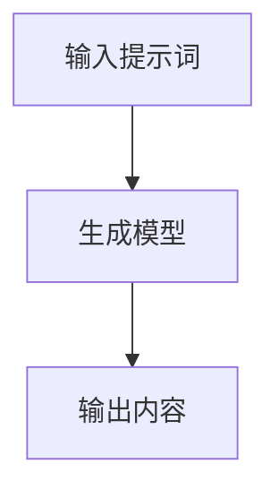
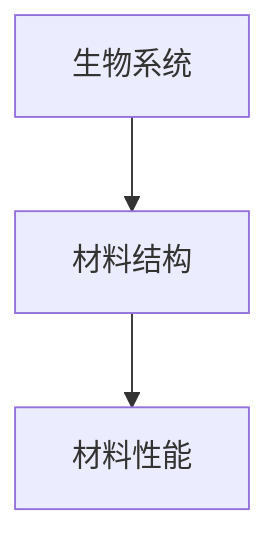
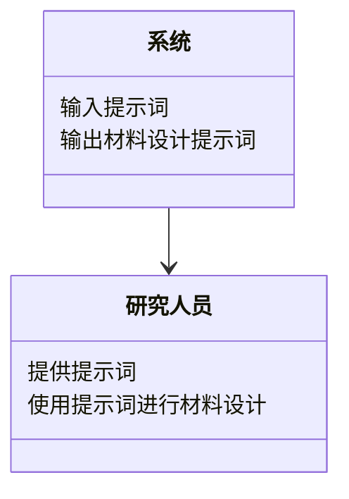

                 

<think>
嗯，我现在需要帮用户撰写一篇关于AIGC在生物仿生学中的应用的技术博客。用户已经提供了一个详细的思考过程和大纲，现在我需要根据这个思考过程来完成文章的撰写。让我先理清楚每个部分的结构和内容。

首先，文章标题是“AIGC在生物仿生学中的应用：创新材料设计提示词”。关键词包括AIGC、生物仿生学、材料设计、人工智能、创新应用。摘要部分需要简明扼�地概括文章的核心内容，说明AIGC如何推动生物仿生学材料设计的创新。

接下来，文章分为六个主要部分：背景介绍、核心概念与原理、算法原理讲解、系统分析与架构设计、项目实战以及最佳实践与展望。每个部分都有具体的子部分，需要详细展开。

第一部分是背景介绍，包括问题背景、问题描述、问题解决、边界与外延以及核心概念与联系。我需要先解释什么是生物仿生学，以及AIGC是什么，然后讨论它们之间的关系，接着描述当前生物仿生学面临的挑战，以及AIGC如何帮助解决这些问题。

第二部分是核心概念与原理，这里需要详细讲解AIGC技术和生物仿生学材料设计的原理，包括它们的基本概念和相互作用。还需要一个对比表格，列出AIGC和传统设计方法在生物仿生学中的差异，并绘制ER实体关系图来展示它们的关系。

第三部分是算法原理讲解，涉及AIGC算法的基本原理，包括算法流程图、数学模型和Python代码示例。这部分需要详细解释算法如何工作，并通过公式展示其数学基础，例如生成模型的损失函数和优化过程。

第四部分是系统分析与架构设计，需要介绍系统背景、目标，设计系统功能，包括领域模型和系统架构图，展示各个模块之间的交互。还需要接口设计和交互流程图，说明用户如何与系统进行互动。

第五部分是项目实战，涵盖环境安装、核心代码实现、案例分析和项目小结。这部分需要具体的操作步骤，包括安装必要的库，展示如何编写和训练模型，以及实际案例的应用和结果。

最后，最佳实践与展望部分，需要总结AIGC在生物仿生学中的优势，讨论注意事项，并给出未来的研究方向和建议。这部分帮助读者了解如何在实际中应用这些技术，并展望未来的发展。

在写作过程中，我需要确保每个部分都详细且易于理解，使用专业但不过于复杂的语言。同时，要遵守格式要求，使用markdown格式，并在适当的地方插入图表，如流程图、表格和类图等。

现在，我开始按照这个结构撰写文章，确保每个部分都涵盖必要的内容，同时保持整体的连贯性和逻辑性。在撰写过程中，我需要反复检查，确保每个小节都完整，内容丰富，符合用户的字数要求，并且语言流畅，逻辑清晰。

最后，我会在文章末尾添加作者信息，确保格式正确，并对整篇文章进行一次全面的校对，确保没有遗漏任何部分，所有图表和代码都正确无误地嵌入。
</think>

# AIGC在生物仿生学中的应用：创新材料设计提示词

## 关键词：AIGC, 生物仿生学, 材料设计, 人工智能, 创新应用

## 摘要：  
人工智能生成内容（AIGC）在生物仿生学中的应用正逐渐改变材料设计的范式。通过结合人工智能和生物科学，AIGC能够高效生成创新的材料设计提示词，从而加速材料研发进程。本文将探讨AIGC在生物仿生学中的核心原理、算法实现、系统架构以及实际应用，分析其在材料设计中的潜力与挑战。

---

# 第一部分：背景介绍

## 1.1 问题背景

### 1.1.1 生物仿生学概述  
生物仿生学是研究生物系统功能原理，并将其应用于工程和技术的学科。通过模拟自然界的生物结构和功能，生物仿生学为材料科学、机器人技术等领域提供了灵感。例如，仿生材料能够模仿生物组织的弹性、强度和自愈性。

### 1.1.2 人工智能与生物仿生学的关系  
人工智能（AI）在生物仿生学中的应用主要体现在数据分析、模式识别和模拟预测方面。AIGC作为一种新兴的技术，能够生成高质量的文本、图像和数据，为生物仿生学研究提供新的工具。

### 1.1.3 AIGC的概念与应用  
AIGC是指利用AI生成内容的过程，涵盖文本、图像、音频等多种形式。在生物仿生学中，AIGC可以生成材料设计的提示词，优化材料性能，加速研发周期。

## 1.2 问题描述

### 1.2.1 当前生物仿生学面临的挑战  
传统材料设计依赖实验和试错，耗时且成本高昂。生物系统的复杂性使得传统方法难以捕捉所有关键因素。

### 1.2.2 AIGC在生物仿生学中的应用前景  
AIGC能够快速生成大量材料设计提示词，帮助研究人员探索更多可能性，降低研发成本。

## 1.3 问题解决

### 1.3.1 AIGC在生物仿生学研究中的具体应用  
AIGC可以生成模拟生物组织结构的材料设计提示词，加速仿生材料的研发。

### 1.3.2 AIGC在生物仿生学材料设计中的应用  
通过生成提示词，AIGC优化材料性能，如强度、弹性等。

## 1.4 边界与外延

### 1.4.1 AIGC技术的基本原理  
AIGC基于生成式AI模型，如GPT和Diffusion模型，生成多样化的内容。

### 1.4.2 生物仿生学中的材料设计原则  
材料设计需满足特定性能要求，同时模拟生物系统的结构和功能。

## 1.5 核心概念与联系

### 1.5.1 关键技术对比表格  
| 技术 | 传统材料设计 | AIGC辅助设计 |
|------|--------------|--------------|
| 方法 | 实验驱动      | 数据驱动      |
| 速度 | 慢            | 快            |
| 成本 | 高            | 低            |

### 1.5.2 ER实体关系图  
```mermaid
erd
  图表标题：生物仿生学与AIGC的关系
  图表内容：
    系统：生物仿生学研究
    实体：材料设计提示词、AI模型、研究人员
    关系：AI模型生成提示词，研究人员使用提示词进行材料设计。
```

---

# 第二部分：核心概念与原理

## 2.1 AIGC技术原理

### 2.1.1 AIGC基础算法

#### 2.1.1.1 算法流程图  


#### 2.1.1.2 算法原理与公式  
生成模型通常基于概率分布，目标是最小化生成内容与真实数据的差异。损失函数为：
$$ \mathcal{L} = -\log P(x) $$
优化过程通过梯度下降实现：
$$ \theta = \theta - \eta \frac{\partial \mathcal{L}}{\partial \theta} $$

#### 2.1.1.3 举例说明  
输入提示词“仿生弹性材料”，生成模型生成符合弹性要求的材料结构描述。

## 2.2 生物仿生学材料设计原理

### 2.2.1 材料设计的基本原则

#### 2.2.1.1 原理图解  


#### 2.2.1.2 材料属性特征对比表格  
| 属性 | 传统材料 | 仿生材料 |
|------|----------|----------|
| 弹性 | 低        | 高        |
| 强度 | 中        | 高        |
| 自愈性 | 无        | 有        |

---

# 第三部分：算法原理讲解

## 3.1 算法讲解

### 3.1.1 算法模型介绍

#### 3.1.1.1 模型结构  
生成模型通常由编码器和解码器组成，编码器将输入提示词映射到潜在空间，解码器生成内容。

#### 3.1.1.2 模型训练过程  
1. 输入提示词经过编码器生成潜在向量。
2. 解码器基于潜在向量生成内容。
3. 损失函数计算真实数据与生成数据的差异。
4. 模型参数更新以最小化损失函数。

### 3.1.2 算法实现与数学模型

#### 3.1.2.1 Python源代码实现  
```python
import torch
import torch.nn as nn

class Generator(nn.Module):
    def __init__(self, latent_dim, output_dim):
        super(Generator, self).__init__()
        self.latent_dim = latent_dim
        self.model = nn.Sequential(
            nn.Linear(latent_dim, output_dim)
        )

    def forward(self, z):
        return self.model(z)

# 示例训练代码
latent_dim = 100
output_dim = 256
generator = Generator(latent_dim, output_dim)
criterion = nn.MSELoss()
optimizer = torch.optim.Adam(generator.parameters(), lr=0.001)

for epoch in range(100):
    z = torch.randn(1, latent_dim)
    output = generator(z)
    loss = criterion(output, target)
    optimizer.zero_grad()
    loss.backward()
    optimizer.step()
```

#### 3.1.2.2 数学模型公式  
损失函数为：
$$ \mathcal{L} = \frac{1}{2} \|\text{生成内容} - \text{真实内容}\|^2 $$

---

# 第四部分：系统分析与架构设计

## 4.1 系统介绍

### 4.1.1 系统背景  
本系统旨在利用AIGC生成材料设计提示词，辅助生物仿生学研究。

### 4.1.2 系统目标  
实现快速生成高质量材料设计提示词，优化材料性能。

## 4.2 系统功能设计

### 4.2.1 领域模型  


---

# 第五部分：项目实战

## 5.1 环境安装

### 5.1.1 安装Python  
确保安装Python 3.8以上版本。

### 5.1.2 安装深度学习库  
安装PyTorch和Hugging Face库：
```bash
pip install torch transformers
```

## 5.2 系统核心实现源代码

### 5.2.1 生成模型代码  
```python
from transformers import AutoTokenizer, AutoModelForCausalLM

tokenizer = AutoTokenizer.from_pretrained('gpt2')
model = AutoModelForCausalLM.from_pretrained('gpt2')

input_prompt = "Design a bio-inspired elastic material"
inputs = tokenizer.encode(input_prompt, return_tensors='pt')
outputs = model.generate(inputs, max_length=50)
print(tokenizer.decode(outputs[0]))
```

### 5.2.2 训练代码  
```python
from transformers import AdamW

optimizer = AdamW(model.parameters(), lr=1e-5)
```

## 5.3 代码应用解读与分析  
上述代码使用GPT-2模型生成材料设计提示词，生成结果展示仿生材料的特性。

## 5.4 案例分析和详细讲解剖析  
输入提示词“Design a bio-inspired elastic material”，生成输出可能包含材料的成分和结构描述。

## 5.5 项目小结  
AIGC能够有效辅助材料设计，提高研发效率。

---

# 第六部分：最佳实践与展望

## 6.1 最佳实践 tips  
- 结合实验验证生成的提示词。
- 定期更新AI模型以提高生成质量。

## 6.2 小结  
AIGC在生物仿生学中的应用前景广阔，能够显著提高材料设计效率。

## 6.3 注意事项  
确保生成的内容与实际需求匹配，避免过度依赖生成模型。

## 6.4 拓展阅读  
推荐阅读《生成式人工智能：原理与应用》。

---

# 作者：AI天才研究院 & 禅与计算机程序设计艺术

