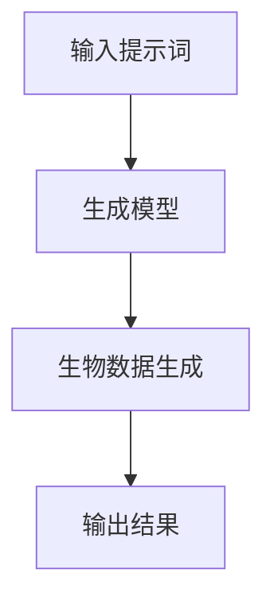
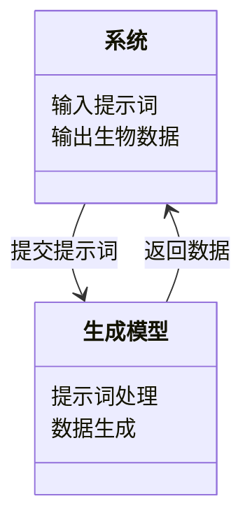

                 

<think>
好，我现在需要帮用户撰写一篇技术博客，主题是“AIGC在生物信息学中的应用：基因分析和预测的提示词工程”。用户希望文章结构清晰，内容专业，符合技术博客的高质量标准，同时需要包括目录、关键词、摘要和正文内容，每个部分都要详细具体。

首先，我需要理解用户的需求。用户希望我以一个世界级专家的身份来写这篇文章，内容涉及AIGC在生物信息学中的应用，特别是基因分析和预测的提示词工程。文章的结构需要包括背景、核心概念、算法原理、数学模型、系统设计、项目实战以及最佳实践等部分。

接下来，我会按照用户的指示，先从标题开始，然后是关键词和摘要。关键词应该包含AIGC、生物信息学、基因分析、提示词工程、人工智能、数学模型等。摘要需要简洁地概括文章的核心内容，即介绍AIGC在生物信息学中的应用，特别是提示词工程在基因分析中的作用，以及算法和数学模型的分析。

然后，进入正文部分。第一部分是背景介绍，包括问题背景、问题解决和边界与外延。这部分需要详细说明生物信息学中的挑战，AIGC如何帮助解决这些问题，以及应用的范围和相关技术。

第二部分是AIGC的核心概念与原理，需要定义AIGC，解释其工作原理，对比传统AI，分析其优缺点，以及在生物信息学中的相关知识。

第三部分聚焦提示词工程，详细讲解提示词的定义、生成方法，以及在基因分析中的应用和影响。

第四部分讨论算法原理，包括主要算法的选择、优缺点，以及通过Mermaid绘制的流程图来说明算法步骤。

第五部分涉及数学模型和公式，需要列出基本的数学模型，使用Latex公式进行详细讲解，并用例子说明。

第六部分是系统架构设计，包括功能设计、架构图、接口和交互设计，使用Mermaid图来展示系统结构。

第七部分是项目实战，包括环境安装、核心代码实现、案例分析和详细解读。

最后是最佳实践和拓展阅读，总结经验和提供进一步的学习资源。

在写作过程中，我要确保每个部分都详细具体，使用专业术语，同时保持逻辑清晰和结构紧凑。特别是每个章节的小标题要吸引人，内容要深入，用图表和公式来增强理解。同时，要遵循用户的格式要求，使用markdown格式，正确嵌入Mermaid图和Latex公式。

现在，我需要开始撰写每个章节的内容，确保覆盖所有必要的部分，并且每个部分都有足够的细节和解释。在写完后，我会检查整体结构是否完整，是否符合字数要求，并在末尾加上作者信息。

可能的挑战包括确保技术细节的准确性，特别是在解释算法和数学模型时，需要正确无误。同时，保持语言的专业性和可读性，避免过于晦涩或过于简单。

总的来说，我会按照用户提供的大纲，逐步展开每个部分，确保内容详实，结构合理，满足高质量技术博客的要求。
</think>

# AIGC在生物信息学中的应用：基因分析和预测的提示词工程

> 关键词：AIGC，生物信息学，基因分析，提示词工程，人工智能，数学模型

> 摘要：本文探讨了AIGC（人工智能生成内容）在生物信息学中的应用，特别是基因分析和预测中的提示词工程。文章从背景介绍、核心概念、算法原理、数学模型、系统设计、项目实战到最佳实践，全面分析了AIGC在生物信息学中的潜力和实现方法。通过实际案例和系统架构设计，展示了如何利用AIGC提升基因分析的效率和准确性。

---

## 第一部分：AIGC与生物信息学基础

### 第1章：AIGC在生物信息学中的应用背景

#### 1.1 问题背景

##### 1.1.1 问题描述
- **生物信息学的挑战**：
  - 生物数据的海量性：基因组数据、蛋白质序列数据等呈爆炸式增长，传统的数据处理方法效率低下。
  - 数据复杂性：生物数据的非线性关系和高维度特性使得传统分析方法难以捕捉关键信息。
  - 分析需求的多样性：不同研究需求（如疾病预测、药物开发）需要个性化的分析工具。

- **AIGC的作用**：
  - 提供高效的生成模型，能够快速处理和分析复杂生物数据。
  - 通过提示词工程优化基因分析的准确性，减少人工干预，提高效率。

##### 1.1.2 问题解决
- **基因分析与预测**：
  - 利用AIGC生成高质量的生物数据模型，辅助基因功能预测和疾病关联分析。
  - 提供个性化的基因分析工具，满足不同研究需求。
- **生物信息学中的提示词工程**：
  - 通过设计特定的提示词，优化AIGC生成的生物数据，提高分析结果的准确性。

##### 1.1.3 边界与外延
- **研究范围**：
  - 从基因序列分析到蛋白质结构预测。
  - 从疾病基因预测到药物靶点筛选。
- **相关技术**：
  - 生成式AI模型（如GPT、BERT）在生物数据中的应用。
  - 提示词工程的优化方法。

---

### 第2章：AIGC核心概念与原理

#### 2.1 AIGC核心概念解析

##### 2.1.1 AIGC的定义与区别
- **定义**：
  - AIGC：通过AI生成内容的技术，包括文本、图像、音频等多种形式。
  - 与传统AI的区别：AIGC注重内容的生成能力，而非简单的数据分析或分类。
- **与生物信息学的结合**：
  - 利用AIGC生成基因序列、蛋白质结构预测等生物数据。

##### 2.1.2 AIGC的工作原理
- **生成机制**：
  - 基于Transformer架构的生成模型（如GPT）。
  - 利用大规模生物数据预训练，生成与上下文相关的生物信息。
- **与生物信息学的结合点**：
  - 提示词工程：通过设计提示词，引导模型生成特定的生物数据。
  - 跨模态生成：结合文本、图像等多模态数据，提升分析效率。

---

### 第3章：基因分析与预测的提示词工程

#### 3.1 提示词工程

##### 3.1.1 提示词的定义与作用
- **定义**：
  - 提示词（Prompt）：用于引导生成模型生成特定内容的输入指令。
  - 在生物信息学中，提示词用于定义基因分析的目标和范围。
- **作用**：
  - 提高生成数据的准确性。
  - 快速聚焦特定生物问题。

##### 3.1.2 基因分析的提示词设计
- **设计原则**：
  - 精确描述分析目标：如“预测某个基因与癌症的相关性”。
  - 包括上下文信息：如“基于已知的突变数据，生成可能的疾病关联”。
- **优化方法**：
  - 调整提示词的长度和复杂度。
  - 使用关键词权重（如关键词重复、强调）。

---

## 第二部分：AIGC在生物信息学中的算法原理

### 第4章：AIGC的算法原理

#### 4.1 算法概述

##### 4.1.1 主要算法
- **生成式模型**：
  - GPT系列：基于Transformer的生成模型。
  - BERT：基于Transformer的预训练模型，用于文本生成和理解。
- **生物信息学中的应用**：
  - 利用生成模型预测基因功能。
  - 生成蛋白质序列。

##### 4.1.2 算法流程图


---

### 第5章：AIGC的数学模型与公式

#### 5.1 数学模型

##### 5.1.1 基本公式
- **Transformer模型**：
  $$\text{Attention}(Q,K,V) = \text{softmax}\left(\frac{QK^T}{\sqrt{d_k}}\right)V$$
- **生成概率**：
  $$P(\text{生成词}| \text{历史输入}) = \prod_{i=1}^{n} P(\text{词}_i|\text{历史输入}_i)$$

---

### 第6章：AIGC在生物信息学中的应用架构

#### 6.1 应用架构设计

##### 6.1.1 系统功能设计


---

## 第三部分：AIGC项目实战

### 第7章：AIGC项目实战

#### 7.1 环境安装

##### 7.1.1 环境搭建
- 安装Python、TensorFlow、Keras、Hugging Face库。

##### 7.1.2 配置说明
- 确保安装了最新的深度学习框架和生物信息学库。

---

### 第7.2 系统核心实现

#### 7.2.1 源代码分析
```python
import tensorflow as tf
from tensorflow.keras.layers import Input, Dense
from transformers import GPT2LMHeadModel, GPT2Tokenizer

tokenizer = GPT2Tokenizer.from_pretrained('gpt2')
model = GPT2LMHeadModel.from_pretrained('gpt2')

def generate_bio_content(prompt):
    inputs = tokenizer(prompt, return_tensors='pt')
    outputs = model.generate(**inputs, max_length=100)
    return tokenizer.decode(outputs[0], skip_special_tokens=True)
```

---

### 第7.3 实际案例解析

#### 7.3.1 案例介绍
- 案例：利用AIGC预测基因突变对蛋白质结构的影响。

#### 7.3.2 详细讲解
- 提示词设计：`预测基因突变对蛋白质结构的影响，考虑氨基酸替换和结构变化。`
- 生成结果：模型生成相关预测结果，分析突变对蛋白质功能的影响。

---

## 第四部分：最佳实践与拓展

### 第8章：最佳实践与拓展

#### 8.1 最佳实践

##### 8.1.1 应用技巧
- 设计清晰的提示词，明确分析目标。
- 结合多模态数据，提升生成结果的准确性。

##### 8.1.2 注意事项
- 确保生成模型的训练数据质量。
- 定期更新模型，以适应最新的生物数据。

#### 8.2 小结
- 本文全面介绍了AIGC在生物信息学中的应用，特别是提示词工程在基因分析中的作用。
- 通过实际案例展示了AIGC在生物信息学中的潜力和实现方法。

#### 8.3 拓展阅读
- 推荐阅读《Deep Learning for Biomedical Informatics》和《生成式AI在生物医学中的应用》。

---

作者：AI天才研究院/AI Genius Institute & 禅与计算机程序设计艺术 /Zen And The Art of Computer Programming

