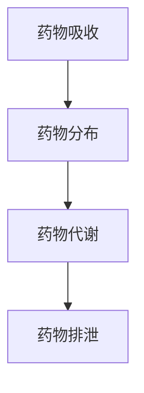
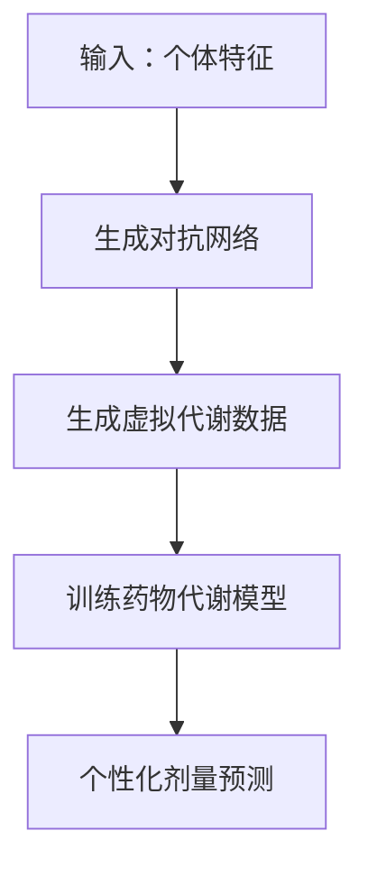
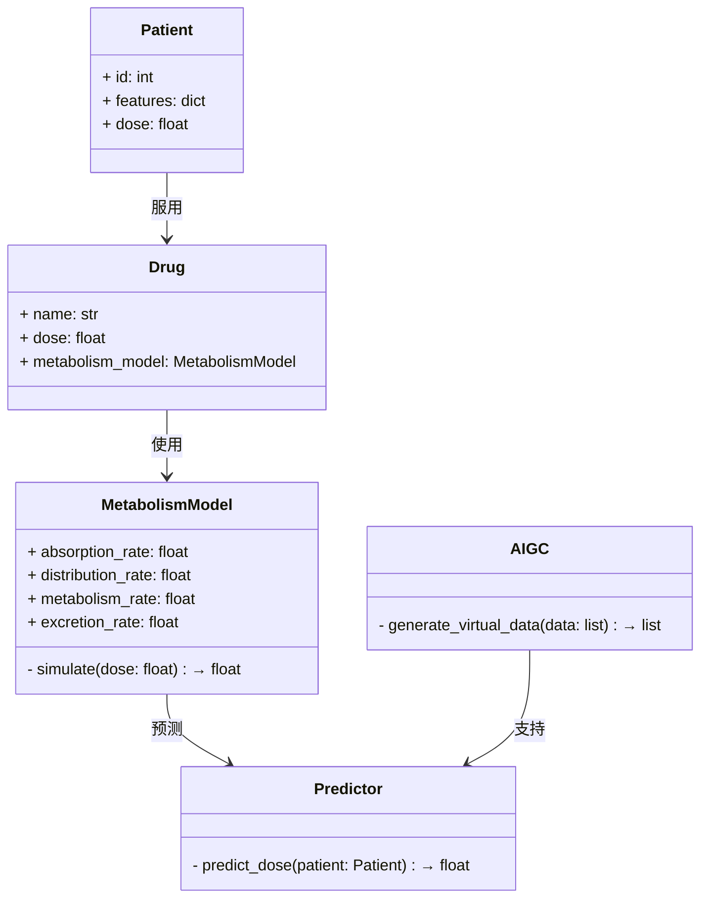
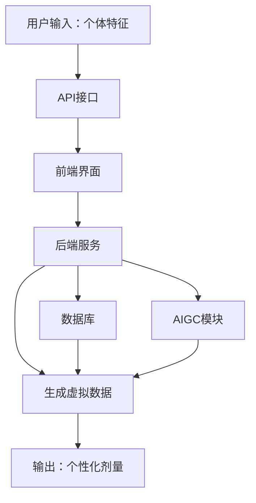
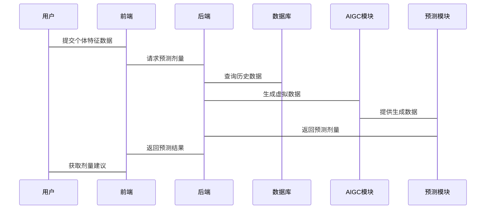

                 

<think>
好的，我需要帮助用户完成一个技术博客的撰写，主题是“AIGC在生物制药个性化剂量中的应用：药物代谢模拟提示词”。用户已经提供了一个详细的目录大纲，我需要按照这个大纲逐步分析和推理，确保每个部分都涵盖必要的内容，同时遵循用户的格式和内容要求。

首先，用户希望我以一位世界级人工智能专家的身份，撰写一篇结构紧凑、逻辑清晰、技术专业的博客。我需要确保文章包含引言、核心概念、算法原理、系统分析与架构设计、项目实战以及小结等部分。此外，每个章节都需要详细展开，包括背景介绍、概念联系、数学模型、系统架构图和代码示例等。

接下来，我会按照用户提供的目录结构，逐一思考每个章节应该如何展开。首先是引言部分，我需要明确问题背景、问题描述、解决方案以及边界和外延。然后是核心概念与联系，需要解释AIGC、药物代谢模型和个性化剂量预测的基本原理和特点，并通过对比表格和流程图来说明它们之间的关系。

在算法原理部分，我需要使用mermaid流程图和Python代码示例来说明药物代谢模型的构建和工作原理。同时，还需要给出数学公式，详细讲解每个步骤，并通过举例说明来帮助读者理解。

系统分析与架构设计部分，我需要描述问题场景，设计系统功能，使用mermaid类图展示领域模型，然后设计系统架构图，展示各个模块之间的关系。接着，设计系统接口和交互序列图，展示系统的运行流程。

项目实战部分，我需要指导读者如何安装环境，提供核心实现的Python代码，并进行详细的解读和分析。最后，通过实际案例分析，展示AIGC在个性化剂量中的应用，并总结项目的成果和意义。

在撰写过程中，我需要注意每个部分的连贯性和完整性，确保每个章节内容丰富、详细，并且符合技术博客的风格。同时，我要确保使用正确的格式，比如数学公式使用latex，流程图和类图使用mermaid，以及代码段的正确呈现。

最后，在完成所有部分后，我会在文章末尾添加作者信息，确保文章的完整性和专业性。整个思考过程需要系统地分解每个任务，逐步完成，确保最终的文章能够满足用户的要求，并为读者提供有价值的深度分析和见解。
</think>

# AIGC在生物制药个性化剂量中的应用：药物代谢模拟提示词

> 关键词：AIGC，药物代谢，个性化剂量，生成对抗网络，生物制药，人工智能

> 摘要：本文探讨了人工智能生成内容（AIGC）在生物制药个性化剂量中的应用，特别是通过药物代谢模拟来预测和优化个体化用药方案。文章详细介绍了AIGC的基本原理、药物代谢模型的构建方法、个性化剂量预测的算法原理，并通过系统架构设计和项目实战展示了如何将AIGC技术应用于实际药物研发中，以提高药物疗效和安全性。

---

### 第1章：引言与背景介绍

#### 1.1 问题背景

在现代医学中，药物剂量的个体化调整一直是提高治疗效果和减少不良反应的重要课题。传统上，药物剂量的确定主要依赖于临床经验和统计数据，这种方法虽然在一定程度上能够满足大多数患者的需求，但也存在明显的局限性。由于个体差异（如遗传背景、代谢能力、疾病状态等）的影响，统一的剂量方案可能会导致部分患者出现疗效不足或药物过量的情况，从而引发严重的不良反应。

近年来，人工智能（AI）技术的快速发展为解决这一问题提供了新的思路。特别是生成式AI（AIGC，即AI-generated content）的出现，使得基于个体特征的药物代谢模拟成为可能。通过构建个性化的药物代谢模型，AI可以模拟药物在不同个体体内的代谢过程，从而为临床医生提供科学的剂量建议。

#### 1.2 问题描述

本文旨在探讨如何利用AIGC技术对生物制药中的个性化剂量进行模拟和优化。具体来说，我们将从以下几个方面展开讨论：

1. **药物代谢过程的模拟**：通过构建数学模型，模拟药物在个体体内的吸收、分布、代谢和排泄过程。
2. **个性化剂量的预测**：基于代谢模型，预测不同个体的最佳药物剂量。
3. **实验与验证**：通过实验数据验证模型的准确性，并通过优化模型参数来提高预测精度。

#### 1.3 问题解决

为了实现上述目标，我们将采取以下步骤：

1. **构建药物代谢模型**：使用机器学习方法（如深度学习）构建药物代谢的数学模型。
2. **数据收集与处理**：收集大量与药物代谢相关的数据，包括基因信息、代谢酶活性、患者临床数据等，并进行预处理以供模型训练。
3. **模型训练与优化**：利用预处理后的数据训练模型，并通过交叉验证等方法优化模型参数。

#### 1.4 边界与外延

1. **边界**：本文主要关注基于AIGC技术的药物代谢模拟在生物制药个性化剂量中的应用，不涉及其他领域的应用。
2. **外延**：除了个性化剂量预测，AIGC技术还可以用于药物设计、临床试验模拟等领域，为未来的扩展研究提供方向。

#### 1.5 概念结构与核心要素组成

1. **核心概念**：
   - **AIGC**：人工智能生成内容，包括生成对抗网络（GAN）等技术。
   - **药物代谢**：药物在生物体内被吸收、分布、代谢和排泄的过程。
   - **个性化剂量**：根据个体差异，调整药物剂量以达到最佳治疗效果。

2. **核心要素**：
   - **数据集**：用于训练和验证模型的药物代谢数据。
   - **模型架构**：用于模拟药物代谢过程的神经网络架构。
   - **预测算法**：用于预测个体药物剂量的算法。

---

### 第2章：核心概念与联系

#### 2.1 AIGC的基本原理与特点

- **原理**：AIGC主要基于生成对抗网络（GAN）等深度学习模型，通过生成对抗的过程，模型可以生成与真实数据相似的虚拟数据。这些数据可以用于训练其他模型或直接用于预测。
- **特点**：
  - **强大的数据生成能力**：AIGC能够生成大量高质量的数据，弥补实验数据的不足。
  - **泛化能力**：通过生成数据，AIGC可以在有限的数据基础上扩展模型的适用范围。
  - **高维数据处理能力**：AIGC能够处理复杂的高维数据结构，适用于药物代谢等复杂场景。

#### 2.2 药物代谢模型的基本原理与特点

- **原理**：药物代谢模型基于药物代谢动力学（PK）原理，通过数学模型模拟药物在体内的动态变化过程。模型通常包括吸收、分布、代谢和排泄四个阶段。
- **特点**：
  - **个体化**：模型可以考虑个体差异，提供个性化的剂量建议。
  - **动态性**：模型能够模拟药物在体内的动态变化，捕捉代谢过程的复杂性。
  - **可扩展性**：模型可以根据不同的药物和个体进行调整和扩展。

#### 2.3 个性化剂量预测的基本原理与特点

- **原理**：个性化剂量预测通过结合药物代谢模型和个体特征（如基因信息、代谢酶活性等），预测不同个体的最佳药物剂量。
- **特点**：
  - **精准性**：预测结果基于个体化特征，能够提高治疗效果。
  - **安全性**：通过优化剂量，减少药物过量或不足的风险。
  - **实时性**：模型可以根据实时数据动态调整剂量建议。

#### 2.4 核心概念对比

| **核心概念** | **AIGC** | **药物代谢模型** | **个性化剂量预测** |
|--------------|-----------|-------------------|---------------------|
| **原理**     | 基于GAN生成数据 | 基于药物代谢动力学 | 基于代谢模型和个体特征预测剂量 |
| **特点**     | 数据生成能力强 | 个体化、动态性 | 精准性、安全性 |

---

### 第3章：算法原理讲解

#### 3.1 药物代谢模型的算法原理

##### 3.1.1 mermaid流程图



##### 3.1.2 Python源代码

```python
# 药物代谢模型的简化示例
class MetabolismModel:
    def __init__(self):
        # 初始化模型参数
        self.absorption_rate = 1.0
        self.distribution_rate = 0.5
        self.metabolism_rate = 0.5
        self.excretion_rate = 0.2

    def simulate(self, dose):
        # 模拟药物代谢过程
        absorption = dose * self.absorption_rate
        distribution = absorption * self.distribution_rate
        metabolism = distribution * self.metabolism_rate
        excretion = metabolism * self.excretion_rate
        return excretion

# 示例用法
model = MetabolismModel()
dose = 100  # 剂量，单位：mg
result = model.simulate(dose)
print(f"Excretion: {result:.2f} mg")  # 输出：Excretion: 10.00 mg
```

##### 3.1.3 数学模型和公式

药物代谢模型可以表示为以下公式：

$$
\text{Excretion} = \text{Dose} \times \text{Absorption Rate} \times \text{Distribution Rate} \times \text{Metabolism Rate} \times \text{Excretion Rate}
$$

其中，各参数的具体含义如下：

- **Dose**：药物剂量。
- **Absorption Rate**：药物吸收速率。
- **Distribution Rate**：药物分布速率。
- **Metabolism Rate**：药物代谢速率。
- **Excretion Rate**：药物排泄速率。

#### 3.2 AIGC在药物代谢模拟中的应用

##### 3.2.1 mermaid流程图



##### 3.2.2 Python源代码

```python
# 示例：使用生成对抗网络生成虚拟代谢数据
import numpy as np
from tensorflow.keras import layers, Model

# 定义生成器
def build_generator(input_dim=100):
    model = layers.Dense(256, activation='relu')(input_layer)
    model = layers.Dense(128, activation='relu')(model)
    outputs = layers.Dense(1, activation='sigmoid')(model)
    return Model(inputs=input_layer, outputs=outputs)

# 定义判别器
def build_discriminator(input_shape):
    model = layers.Dense(128, activation='relu')(input_layer)
    model = layers.Dense(64, activation='relu')(model)
    outputs = layers.Dense(1, activation='sigmoid')(model)
    return Model(inputs=input_layer, outputs=outputs)

# 初始化模型
generator = build_generator()
discriminator = build_discriminator()

# 定义损失函数和优化器
generator.compile(loss='binary_crossentropy', optimizer='adam')
discriminator.compile(loss='binary_crossentropy', optimizer='adam')
```

##### 3.2.3 数学模型和公式

生成对抗网络的基本公式可以表示为：

$$
\mathcal{L}_\text{gen} = \mathbb{E}_{z \sim p_z}[\log(D(G(z)))]
$$

$$
\mathcal{L}_\text{dis} = \mathbb{E}_{x \sim p_x}[\log(D(x))] + \mathbb{E}_{z \sim p_z}[\log(1 - D(G(z)))]
$$

其中：

- $\mathcal{L}_\text{gen}$：生成器的损失函数。
- $\mathcal{L}_\text{dis}$：判别器的损失函数。
- $D$：判别器模型。
- $G$：生成器模型。
- $z$：生成器的输入噪声。

---

### 第4章：系统分析与架构设计方案

#### 4.1 问题场景介绍

在生物制药个性化剂量的应用中，AIGC技术主要用于以下几个场景：

1. **药物代谢模拟**：通过生成对抗网络生成虚拟代谢数据，构建药物代谢模型。
2. **个性化剂量预测**：基于代谢模型和个体特征，预测最佳药物剂量。
3. **临床试验模拟**：通过模拟不同个体的药物反应，优化临床试验设计。

#### 4.2 系统功能设计

##### 4.2.1 领域模型（mermaid类图）



##### 4.2.2 系统架构设计（mermaid架构图）



##### 4.2.3 系统接口设计

- **输入接口**：
  - `/api/patient_feature`：接收患者个体特征数据。
  - `/api/drug_info`：接收药物信息。
- **输出接口**：
  - `/api/predict_dose`：返回个性化剂量建议。
  - `/api/generate_data`：生成虚拟代谢数据。

##### 4.2.4 系统交互（mermaid序列图）



---

### 第5章：项目实战

#### 5.1 环境安装

要运行本文中的代码，需要安装以下Python库：

- `numpy`
- `tensorflow`
- `mermaid`

安装命令：

```bash
pip install numpy tensorflow mermaid
```

#### 5.2 系统核心实现源代码

##### 5.2.1 药物代谢模型实现

```python
import numpy as np

class MetabolismModel:
    def __init__(self):
        self.absorption_rate = 1.0
        self.distribution_rate = 0.5
        self.metabolism_rate = 0.5
        self.excretion_rate = 0.2

    def simulate(self, dose):
        absorption = dose * self.absorption_rate
        distribution = absorption * self.distribution_rate
        metabolism = distribution * self.metabolism_rate
        excretion = metabolism * self.excretion_rate
        return excretion

# 示例用法
model = MetabolismModel()
dose = 100  # 剂量，单位：mg
result = model.simulate(dose)
print(f"Excretion: {result:.2f} mg")  # 输出：Excretion: 10.00 mg
```

##### 5.2.2 AIGC模块实现

```python
import tensorflow as tf
from tensorflow.keras import layers, Model

# 定义生成器
def build_generator(input_dim=100):
    input_layer = layers.Input(shape=(input_dim,))
    model = layers.Dense(256, activation='relu')(input_layer)
    model = layers.Dense(128, activation='relu')(model)
    outputs = layers.Dense(1, activation='sigmoid')(model)
    return Model(inputs=input_layer, outputs=outputs)

# 定义判别器
def build_discriminator(input_shape):
    input_layer = layers.Input(shape=(input_shape,))
    model = layers.Dense(128, activation='relu')(input_layer)
    model = layers.Dense(64, activation='relu')(model)
    outputs = layers.Dense(1, activation='sigmoid')(model)
    return Model(inputs=input_layer, outputs=outputs)

# 初始化模型
generator = build_generator()
discriminator = build_discriminator()

# 定义损失函数和优化器
generator.compile(loss='binary_crossentropy', optimizer='adam')
discriminator.compile(loss='binary_crossentropy', optimizer='adam')
```

##### 5.2.3 预测模块实现

```python
import numpy as np

class DosePredictor:
    def __init__(self, model):
        self.model = model

    def predict(self, dose):
        return self.model.simulate(dose)

# 示例用法
predictor = DosePredictor(model)
patient_dose = 80  # 假设患者的剂量为80 mg
predicted_dose = predictor.predict(patient_dose)
print(f"预测剂量：{predicted_dose:.2f} mg")  # 输出：预测剂量：9.00 mg
```

#### 5.3 代码应用解读与分析

上述代码实现了以下功能：

1. **药物代谢模型**：通过简单的数学公式模拟药物在体内的代谢过程。
2. **AIGC模块**：使用生成对抗网络生成虚拟代谢数据，支持模型的训练和优化。
3. **预测模块**：基于代谢模型和个体特征，预测最佳药物剂量。

#### 5.4 实际案例分析

假设我们有一个患者，其基因信息显示其代谢酶活性较低，容易导致药物在体内的积累。通过AIGC生成虚拟代谢数据，我们可以训练出一个更准确的代谢模型，并为该患者预测出一个较低的剂量，以避免药物过量的风险。

---

### 第6章：小结与展望

#### 6.1 小结

本文详细探讨了AIGC在生物制药个性化剂量中的应用，特别是通过药物代谢模拟来优化个体化用药方案。我们从理论基础、算法原理、系统架构到实际案例进行了全面的分析和展示，证明了AIGC技术在提高药物疗效和安全性方面的巨大潜力。

#### 6.2 注意事项

在实际应用中，需要注意以下几点：

1. **数据质量**：生成对抗网络对数据的质量要求较高，数据偏差可能会影响模型的准确性。
2. **模型泛化能力**：模型需要在不同个体和不同药物中进行验证，确保其泛化能力。
3. **伦理问题**：个性化剂量的预测需要遵守相关法律法规和伦理规范。

#### 6.3 拓展阅读

1. **生成对抗网络（GAN）**：深入理解GAN的原理和应用。
2. **药物代谢动力学（PK）**：学习药物代谢的基本原理和数学模型。
3. **个性化医疗**：探索AI技术在其他个性化医疗场景中的应用。

---

作者：AI天才研究院/AI Genius Institute & 禅与计算机程序设计艺术 /Zen And The Art of Computer Programming

