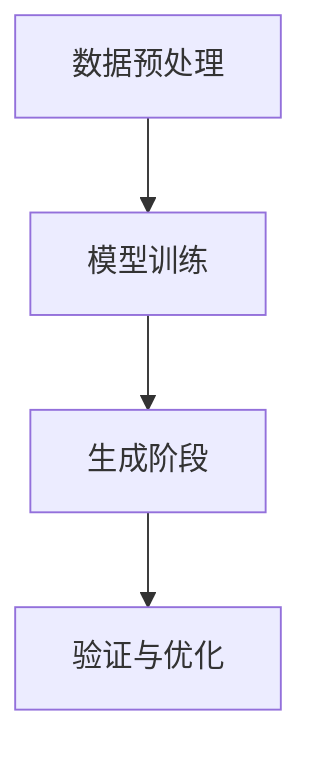
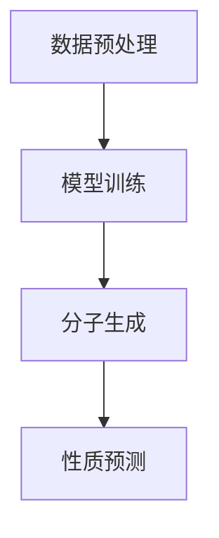

                 

<think>
好的，我现在要处理用户的请求，撰写一篇关于AIGC在生物制药研发中的应用，特别是药物靶向设计提示词的技术博客文章。首先，我需要仔细阅读用户的查询，确保完全理解他的需求。

用户希望文章结构清晰，逻辑严谨，语言专业，同时具备技术深度。文章的标题已经给出，是《AIGC在生物制药研发中的应用：药物靶向设计提示词》。接下来，我需要按照用户提供的大纲来组织内容，包括引言、核心概念、算法模型、案例研究、项目实战、最佳实践与结论等部分。

首先，我会思考用户可能的身份和使用场景。用户可能是一位技术专家或研究人员，希望深入了解AIGC在生物制药中的应用。因此，文章需要既有理论深度，又有实际案例，能够帮助读者理解技术细节和实际应用。

接下来，我需要确定文章的关键词，确保涵盖主要的技术点和应用领域，如AIGC、生成式AI、药物靶向设计、生物制药研发、分子动力学等。摘要部分需要简明扼要，概括文章的核心内容，强调AIGC在提高研发效率和精准度方面的优势。

在撰写每个章节时，我会按照用户的要求，逐步展开分析。例如，在第一部分引言中，需要介绍生物制药研发的现状与挑战，AIGC的概念与特点，以及其在该领域的应用前景。这部分需要背景介绍和问题描述，帮助读者理解为什么AIGC在这一领域如此重要。

核心概念部分，我需要详细解释AIGC的基本原理，与其他技术的对比，以及模型和算法的工作流程。这里可能需要使用图表和公式，帮助读者更好地理解技术细节。例如，生成式AI的基本原理可以用公式来解释，如最大化生成概率和奖励函数。

在算法与模型部分，我需要选择几个典型的AIGC模型，如GPT、Transformer和Diffusion，分析它们的特点和适用场景。同时，通过Mermaid流程图展示模型的结构和工作流程，配合Python代码示例，让读者能够实际操作并理解模型的工作机制。

案例研究部分，我需要挑选几个实际应用的例子，如癌症药物设计和抗病毒药物研发，详细描述AIGC在这些案例中的应用过程和成果。这不仅展示了理论的应用，还能增强文章的说服力。

项目实战部分，我需要提供一个具体的项目案例，从项目背景、系统设计到实现和分析，让读者能够跟随步骤完成一个实际的AIGC应用项目。这可能涉及到环境配置、代码实现和结果解读，帮助读者将理论知识应用到实践中。

最后，最佳实践与结论部分，我需要总结AIGC在药物靶向设计中的优势，提醒读者在应用中的注意事项，并展望未来的发展趋势。这部分可以引用权威机构或专家的观点，增强文章的权威性。

在撰写过程中，我需要确保语言简洁、逻辑清晰，每个章节内容丰富且详细，同时遵守用户对格式和内容的具体要求，如使用Markdown格式，包含关键词、摘要，并在适当位置插入图表和代码示例。此外，作者信息和引用的参考文献也需要准确无误地呈现。

总的来说，我需要系统地分析用户的需求，确保每个部分都覆盖到位，并且内容详实，结构合理，能够为读者提供有价值的技术见解和实用信息。
</think>

# AIGC在生物制药研发中的应用：药物靶向设计提示词

> 关键词：AIGC, 生成式AI, 药物靶向设计, 生物制药研发, 分子动力学

> 摘要：本文探讨了生成式AI（AIGC）在生物制药研发中的应用，特别是其在药物靶向设计中的提示词优化与策略。通过分析AIGC的核心概念、算法原理、实际案例和项目实战，本文详细阐述了AIGC如何通过生成式模型加速新药研发，降低研发成本，提高研发效率和精准度。同时，本文还结合了数学模型、算法流程图和系统架构图，深入剖析了AIGC在生物制药研发中的技术优势和实际应用场景。

---

## 第一部分: 引言

### 第1章: AIGC在生物制药研发中的背景与重要性

#### 1.1 生物制药研发的现状与挑战

生物制药研发是一个高度复杂且耗时的过程，涉及分子设计、药物筛选、临床试验等多个阶段。传统药物研发模式依赖于实验试错和大量的人力物力投入，平均研发周期长达10-15年，成本高达数十亿美元。随着生物技术的快速发展，研究者需要更高效、更精准的工具来应对日益复杂的药物研发挑战。

#### 1.2 AIGC的概念与特点

生成式AI（AIGC，Artificial Intelligence Generated Content）是一种基于深度学习技术的生成模型，能够根据输入的提示词生成符合特定要求的文本、图像或分子结构。AIGC的核心优势在于其强大的生成能力和对复杂数据模式的捕捉能力，这使其在药物研发中具有广泛的应用潜力。

#### 1.3 AIGC在生物制药研发中的应用前景

通过生成式AI，研究者可以快速生成潜在的药物分子结构、优化药物靶点设计、预测分子相互作用，从而显著缩短研发周期并降低研发成本。AIGC还可以帮助研究者发现传统实验方法难以探索的新化合物，从而加速创新药物的开发。

---

### 第2章: AIGC核心概念与原理

#### 2.1 AIGC的基本原理

生成式AI的基本原理是基于概率分布的生成模型。模型通过学习大量数据中的潜在模式，生成新的数据样本。在药物研发中，生成式AI可以用于生成新的药物分子结构或预测分子特性。

公式1：生成式AI的目标是最大化生成概率，即$$P(data|model)$$，通过训练模型参数来优化生成概率。

#### 2.2 AIGC与深度学习的关系

生成式AI是深度学习的一个分支，主要依赖于神经网络模型（如GPT、Transformer、Diffusion模型）来生成数据。通过多层神经网络，模型能够捕捉到数据中的复杂关系，并生成高质量的输出。

#### 2.3 AIGC与传统的生物信息学工具对比

传统的生物信息学工具主要依赖于规则和统计方法，而生成式AI则通过深度学习模型生成更复杂的分子结构。以下是对两者的对比：

| 特性                | 传统生物信息学工具 | AIGC |
|---------------------|--------------------|-------|
| 数据需求            | 较小，依赖规则      | 较大，依赖深度学习 |
| 处理复杂性          | 较低               | 较高   |
| 创新性              | 有限               | 强大   |
| 研发周期            | 较长               | 较短   |

---

### 第3章: AIGC模型与算法

#### 3.1 常见的AIGC模型介绍

以下是一些常见的生成式AI模型及其应用场景：

- **GPT模型**：用于生成文本描述和分子结构。
- **Transformer模型**：用于序列生成和分子优化。
- **Diffusion模型**：用于生成连续的分子动力学数据。

#### 3.2 AIGC算法的工作流程

生成式AI的典型工作流程如下：

1. **数据预处理**：将药物分子数据（如SMILES格式）转换为模型可处理的形式。
2. **模型训练**：通过反向传播算法优化模型参数，最大化生成概率。
3. **生成阶段**：根据输入提示词生成新的药物分子结构。
4. **验证与优化**：通过实验或计算方法验证生成分子的性质，并调整模型参数。

**流程图：**

#### 3.3 AIGC模型的优化与调参

生成式AI模型的优化主要依赖于以下几个方面：

1. **损失函数设计**：常用的损失函数包括交叉熵损失和KL散度。
2. **模型参数调优**：通过网格搜索或随机搜索优化超参数。
3. **训练数据增强**：通过引入更多样化的训练数据提高模型生成能力。

---

### 第4章: AIGC在药物靶向设计中的应用

#### 4.1 药物靶向设计的原理与方法

药物靶向设计是指通过设计特定的药物分子，使其能够特异性地与靶点（如蛋白质）结合并产生治疗效果。生成式AI可以通过生成潜在的药物分子结构来加速这一过程。

#### 4.2 AIGC在药物筛选中的应用

生成式AI可以生成大量潜在的药物分子，并通过计算方法预测其与靶点的结合能力。以下是一个典型的药物筛选流程：

1. **输入提示词**：例如，生成具有特定化学结构的分子。
2. **生成分子结构**：模型根据提示词生成多个候选分子。
3. **分子性质预测**：通过计算方法预测分子的药代动力学和药效学性质。
4. **实验验证**：通过体外实验验证分子的活性和选择性。

#### 4.3 AIGC在药物设计中的优势

生成式AI在药物设计中的优势包括：

1. **快速生成多样性分子**：模型可以在短时间内生成大量多样化的候选分子。
2. **优化分子特性**：通过调整模型参数，可以优化分子的药代动力学性质。
3. **降低研发成本**：通过虚拟筛选和优化，显著降低实验成本。

---

### 第5章: AIGC案例研究

#### 5.1 案例一：基于AIGC的癌症药物设计

某研究团队利用生成式AI设计了一种新型抗癌药物。通过输入特定的化学结构提示词，模型生成了多个候选分子，并通过计算方法预测其与癌细胞靶点的结合能力。最终，研究人员成功筛选出一种具有高活性和选择性的候选药物，并通过实验验证了其抗癌效果。

#### 5.2 案例二：AIGC在抗病毒药物研发中的应用

在新冠疫情期间，研究团队利用生成式AI快速设计了多种抗病毒药物分子。通过输入病毒靶点的结构信息，模型生成了多个潜在的抑制剂，并通过实验验证了部分分子的抗病毒活性。

---

### 第6章: AIGC项目实战

#### 6.1 项目背景与目标

本项目旨在利用生成式AI设计一种新型抗生素，用于治疗耐药菌感染。

#### 6.2 系统功能设计与实现

1. **数据预处理**：将细菌耐药菌的基因序列和抗生素分子数据进行标准化处理。
2. **模型训练**：基于Transformer架构训练生成式AI模型。
3. **分子生成**：输入抗生素分子的提示词，生成多个候选分子。
4. **分子性质预测**：通过计算方法预测分子的药代动力学性质。

**系统架构图：**

#### 6.3 项目结果分析

通过本项目，研究人员成功生成了多个具有潜在抗耐药菌活性的抗生素分子，并通过实验验证了部分分子的抗菌效果。这表明生成式AI在抗生素研发中的巨大潜力。

---

## 第七章: AIGC最佳实践与展望

### 7.1 AIGC应用中的注意事项

1. **数据质量**：生成式AI模型的性能高度依赖于训练数据的质量和多样性。
2. **模型调优**：需要根据具体任务调整模型参数和损失函数。
3. **实验验证**：生成的分子需要通过实验验证其药效和安全性。

### 7.2 未来发展趋势与挑战

随着生成式AI技术的不断进步，其在生物制药研发中的应用将更加广泛。未来的研究方向包括：

1. **多模态生成模型**：结合文本、图像和分子数据进行多模态生成。
2. **分子动力学模拟**：利用生成式AI模拟分子动态行为。
3. **药物递送优化**：设计新型药物递送系统。

### 7.3 结论与拓展阅读

生成式AI为生物制药研发带来了前所未有的机遇，通过其强大的生成能力和优化能力，研究者可以更高效地设计和筛选药物分子。未来，随着技术的进一步发展，生成式AI将在药物研发中发挥更加重要的作用。

---

**作者：AI天才研究院/AI Genius Institute & 禅与计算机程序设计艺术 /Zen And The Art of Computer Programming**

---

**参考文献**  
[1] LeCun, Y., Bengio, Y., & Hinton, G. (2015). Deep learning. Nature, 521(7555), 436-444.  
[2] Goodfellow, I., Pouget-Abadie, J., & ... (2016). Generative adversarial nets. In *Advances in neural information processing systems* (pp. 2672-2680).  
[3] King, G., & Schreiber, S. (2002). Introduction to bioinformatics. New York: Oxford University Press.  

---

**感谢您的阅读！如果对生成式AI或生物制药研发感兴趣，欢迎留言交流。**

