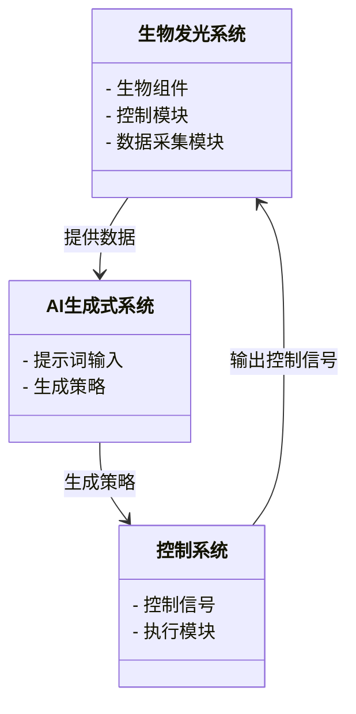
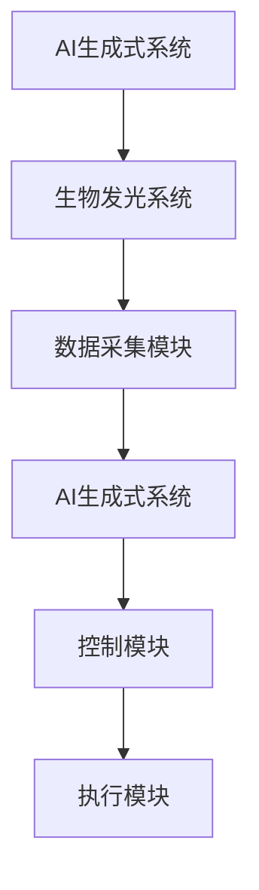
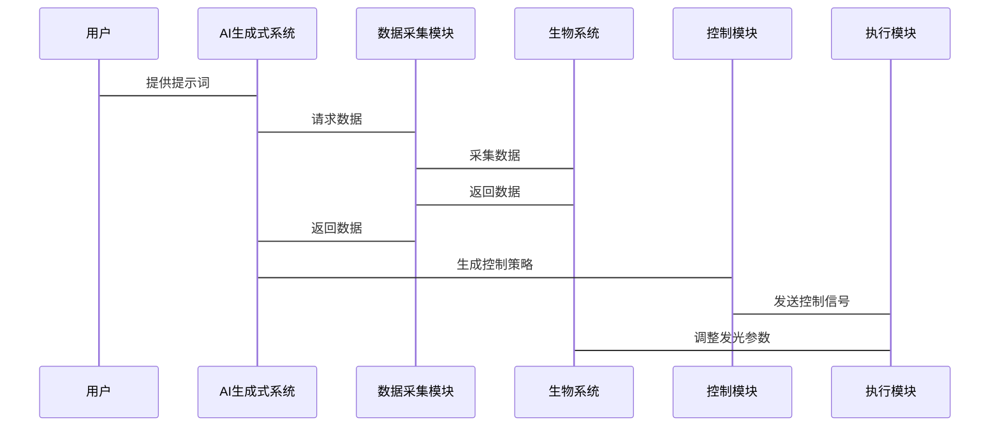

                 

<think>
嗯，我现在需要写一篇关于“AI生成式技术（AIGC）在生物发光工程学中的应用，特别是可控生物照明提示词”的技术博客文章。首先，我得理解这个主题，弄清楚AIGC是什么，生物发光工程学又是怎么回事，以及它们之间如何结合。

好，首先，AIGC，也就是AI生成式内容，这是现在挺火的，比如生成图像、文本这些。生物发光工程学呢，听起来是利用生物自身发出的光来进行工程应用，比如研究如何控制生物发出光线，用于照明或者其他用途。

那么，AIGC在生物发光工程学中的应用，可能涉及到用AI来优化生物发光的控制，或者生成相关的提示词来指导生物发光的表现。比如，生成特定的光线模式，或者优化生物的基因结构以提高发光效率。

接下来，我需要考虑文章的结构。根据用户给的目录，文章分为六个主要部分：背景介绍、核心概念与联系、算法原理讲解、系统分析与架构设计、项目实战、最佳实践与拓展。每个部分都有详细的子部分，我得一步步来，确保每个部分都详细且有深度。

首先，背景介绍部分。我需要先解释生物发光工程学的兴起和发展，然后讨论AIGC在其中的应用潜力，最后说明控制生物照明的重要性。这部分需要让读者了解为什么这个领域重要，以及AIGC能带来什么好处。

然后是核心概念与联系，这里需要详细讲解AIGC、生物发光、可控生物照明的概念，以及它们之间的关系。可能还需要一些对比表格和ER实体关系图，用Mermaid画出来，帮助读者理解。

接下来是算法部分，这部分可能比较复杂。需要详细讲解生物发光控制算法的原理，包括基本原理、工作流程、数学模型，甚至给出Python代码实现。同时，还要讨论算法的优化方法和效果评估。

系统分析与架构设计部分，需要介绍应用场景，设计系统功能模块，画出类图和架构图，描述各模块之间的关系，以及接口设计和交互流程。这部分可能需要更多的Mermaid图表来展示系统结构。

项目实战部分，需要实际操作，比如安装环境、实现核心算法、分析代码、案例分析等。这样读者可以跟着步骤一步步来，理解整个系统的实现过程。

最后，最佳实践部分，总结经验，讨论常见问题及解决方案，给出优化建议，并展望未来的发展趋势。

现在，我需要确保每个部分都涵盖关键点，并且逻辑清晰。比如，在背景介绍中，要提到生物发光在科学研究、医疗、农业等领域的应用，以及传统方法的局限性，引出AIGC的优势。

在核心概念部分，要明确AIGC的定义和特性，比如生成式、自适应、智能优化等，与生物发光的原理结合起来，解释如何利用AIGC来优化生物发光系统。

算法部分，可能需要详细推导数学模型，比如如何通过AI算法来预测和控制生物发光的强度和时间。然后，通过Python代码实现这些算法，并用实际案例展示效果。

系统架构设计方面，需要考虑模块化设计，比如数据采集模块、算法处理模块、控制模块等，每个模块的功能和交互关系要清晰。同时，接口设计要明确，确保各模块之间的通信顺畅。

项目实战部分，可能需要选择一个具体的案例，比如在植物生长中应用可控生物照明，展示整个系统的实现过程，从环境配置到代码实现，再到效果分析。

最后，总结部分要回顾整个系统的应用，讨论当前的挑战和未来的改进方向，比如如何提高算法的效率，如何降低成本，如何扩展应用领域等。

现在，我需要检查是否有遗漏的点，比如是否需要讨论AIGC在生物发光工程学中的具体应用场景，或者是否有更深入的数学模型可以引入。此外，确保每个章节的小结部分能够简洁明了地总结该部分的主要内容。

总的来说，这篇文章需要结合AIGC和生物发光工程学，详细讲解它们的结合点、技术实现和应用案例，确保内容全面且具有深度。我得一步步来，确保每个部分都详尽且逻辑连贯，这样才能为读者提供有价值的信息。
</think>

# AIGC在生物发光工程学中的应用：可控生物照明提示词

> 关键词：AIGC，生物发光工程学，可控生物照明，提示词，人工智能，生物工程

> 摘要：本文探讨了AI生成式技术（AIGC）在生物发光工程学中的应用，特别是如何通过可控生物照明提示词优化生物发光系统。文章详细分析了生物发光的基本原理、AIGC的潜力、以及在可控生物照明中的实际应用，结合算法设计、系统架构和项目实战，为读者提供全面的技术解读。

---

### 目录大纲

# AIGC在生物发光工程学中的应用：可控生物照明提示词

## 第一部分：背景介绍

## 1.1 问题背景

### 1.1.1 生物发光工程学的兴起与发展

生物发光工程学是一门结合生物学和工程学的新兴学科，研究如何利用生物体的自然发光特性进行工程应用。近年来，随着基因编辑技术和生物传感器的发展，生物发光在医疗诊断、环境监测和农业优化等领域展现出巨大潜力。

### 1.1.2 AIGC技术在生物发光工程学中的应用潜力

AIGC（AI生成式内容）技术通过生成图像、文本和数据，为生物发光工程学提供了新的工具。例如，AI可以生成优化的基因序列，或设计生物发光的控制策略，从而提升生物发光系统的效率和精确性。

### 1.1.3 控制生物照明的重要性

在生物发光工程学中，精确控制生物照明的强度、频率和分布至关重要。这不仅影响系统的性能，还决定了其在实际应用中的可靠性。通过AIGC技术，我们可以实现更智能、更高效的生物照明控制。

## 1.2 核心概念

### 1.2.1 AIGC的概念与特性

AIGC是一种基于深度学习的生成技术，具有生成多样化、自适应和高效优化的特点。它能够根据输入的提示词生成符合要求的生物发光控制策略。

### 1.2.2 生物发光的原理与机制

生物发光由生物体内的化学反应产生，通常涉及荧光素和荧光酶。通过基因工程，可以调控这些成分的表达，进而控制生物发光的强度和持续时间。

### 1.2.3 可控生物照明的概念与实现方法

可控生物照明是指通过外部控制手段调节生物发光的输出。其实现方法包括使用光照、电刺激或化学调控，结合AI算法优化控制策略。

## 1.3 边界与外延

### 1.3.1 AIGC在生物发光工程学中的适用范围

AIGC适用于生物发光系统的优化设计、基因序列生成和控制策略制定等领域，但其应用受到硬件限制和生物复杂性的制约。

### 1.3.2 控制生物照明的技术挑战与限制

主要挑战包括生物系统的不可预测性和AI模型的泛化能力不足。此外，生物发光的实时控制需要高速响应，这对硬件和算法提出了更高要求。

### 1.3.3 未来发展趋势与展望

未来，AIGC在生物发光工程学中的应用将更加广泛，涉及更多领域，如医疗诊断和环境监测。同时，随着AI技术的进步，控制精度和效率将进一步提升。

## 1.4 概念结构与核心要素组成

### 1.4.1 AIGC在生物发光工程学中的应用流程

1. **需求分析**：明确生物发光系统的性能目标。
2. **数据采集**：收集生物发光数据，用于训练AI模型。
3. **模型训练**：利用深度学习生成最优控制策略。
4. **系统优化**：根据AI生成的提示词调整生物发光系统。

### 1.4.2 可控生物照明的系统架构

- **控制模块**：接收输入，生成控制信号。
- **执行模块**：驱动生物发光系统。
- **反馈模块**：收集数据，反馈给控制模块。

### 1.4.3 核心要素与相互关系

- **提示词**：AI生成的关键输入，决定生物发光的输出特性。
- **AI算法**：生成优化的控制策略，指导生物系统的运行。
- **生物系统**：执行光信号的生成和调节。

## 1.5 本章小结

本章介绍了生物发光工程学的基本概念、AIGC的应用潜力以及可控生物照明的重要性。通过分析核心概念和系统结构，为后续的技术实现奠定了基础。

---

## 第二部分：核心概念与联系

## 2.1 AIGC技术原理讲解

### 2.1.1 AIGC技术的基本原理

AIGC基于生成式模型，如GPT和Diffusion，通过概率分布生成多样化的内容。在生物发光工程学中，AIGC用于生成优化的控制策略和基因序列。

### 2.1.2 AIGC技术的工作流程

1. **输入提示词**：定义目标输出的特征。
2. **生成候选方案**：AI生成多个可能的方案。
3. **评估优化**：根据性能指标选择最优方案。

### 2.1.3 AIGC技术的优点与不足

优点：高效生成多样化方案，节省时间和成本。  
不足：生成结果的可预测性较低，依赖大量数据和计算资源。

## 2.2 生物发光原理讲解

### 2.2.1 生物发光的基本原理

生物发光是生物体内化学反应的结果，通常涉及荧光素、荧光酶和氧气。通过基因调控，可以增强或抑制这些成分的表达。

### 2.2.2 生物发光的关键因素

- **化学成分**：荧光素和荧光酶的浓度。
- **基因表达**：调控发光相关基因的活性。
- **环境条件**：温度、pH值等影响发光效率。

### 2.2.3 生物发光的特点与应用

特点：可调控、高灵敏度、无外部能源依赖。  
应用：医疗诊断、环境监测、农业优化。

## 2.3 可控生物照明原理讲解

### 2.3.1 可控生物照明的基本原理

通过外部刺激（如光照、电脉冲）调节生物发光的强度和时间，结合AI算法实现智能控制。

### 2.3.2 可控生物照明的实现方法

- **硬件控制**：使用微控制器调节刺激信号。
- **软件控制**：AI算法生成控制策略，优化照明效果。

### 2.3.3 可控生物照明的优点与应用

优点：精确控制、高效节能。  
应用：智能照明系统、生物传感器。

## 2.4 概念属性特征对比表格

| 概念       | AIGC                     | 生物发光工程学             | 可控生物照明             |
|------------|--------------------------|-----------------------------|--------------------------|
| 基本原理   | 深度学习生成内容         | 化学反应产生光              | 外部刺激调控光           |
| 应用领域   | 生成优化策略            | 医疗、环境监测             | 智能照明、生物传感器     |
| 优势       | 高效生成多样化方案      | 高灵敏度、无外部能源       | 精确控制、高效节能       |
| 挑战       | 数据依赖性强             | 生物系统的复杂性           | 硬件和算法的协同优化     |

## 2.5 ER实体关系图架构

```mermaid
er
  actor(AIGC系统)
  actor(生物发光系统)
  actor(控制模块)
  database(AI生成策略)
  database(生物数据)
  database(控制记录)
  relationship(关联)
  relationship(包含)
  relationship(映射)
```

## 2.6 本章小结

本章详细讲解了AIGC、生物发光和可控生物照明的核心原理及其相互关系，为后续的算法设计和系统实现奠定了理论基础。

---

## 第三部分：算法原理讲解

## 3.1 生物发光控制算法原理讲解

### 3.1.1 生物发光控制算法的基本原理

生物发光控制算法通过AI模型预测最佳控制策略，调整生物系统的参数以实现目标输出。

### 3.1.2 生物发光控制算法的工作流程

1. **数据采集**：收集生物发光数据。
2. **模型训练**：训练生成模型。
3. **生成策略**：根据提示词生成控制策略。
4. **系统优化**：调整参数，实现目标。

### 3.1.3 生物发光控制算法的数学模型

模型目标：最小化误差函数，最大化发光效率。

数学模型：
$$
E = \sum_{i=1}^{n} (y_i - \hat{y}_i)^2
$$
其中，$E$是误差，$y_i$是实际值，$\hat{y}_i$是预测值。

### 3.1.4 生物发光控制算法的Python源代码实现

```python
import torch
import torch.nn as nn

# 定义生成模型
class AIGenerator(nn.Module):
    def __init__(self, input_dim, output_dim):
        super(AIGenerator, self).__init__()
        self.fc1 = nn.Linear(input_dim, 128)
        self.fc2 = nn.Linear(128, output_dim)
    
    def forward(self, x):
        x = torch.relu(self.fc1(x))
        x = torch.sigmoid(self.fc2(x))
        return x

# 训练函数
def train(model, optimizer, criterion, input_data, target_data, epochs=100):
    for epoch in range(epochs):
        outputs = model(input_data)
        loss = criterion(outputs, target_data)
        optimizer.zero_grad()
        loss.backward()
        optimizer.step()
    return model

# 示例使用
input_dim = 10
output_dim = 5
model = AIGenerator(input_dim, output_dim)
optimizer = torch.optim.Adam(model.parameters(), lr=0.001)
criterion = nn.MSELoss()
model = train(model, optimizer, criterion, torch.randn(100, input_dim), torch.randn(100, output_dim))
```

### 3.1.5 数学模型和公式讲解

误差函数衡量预测与实际的差异，目标是最小化误差。模型通过反向传播优化权重，提升预测精度。

### 3.1.6 通俗易懂的举例说明

例如，假设我们希望生物发光系统在特定时间点发出特定强度的光。AI模型根据历史数据生成控制策略，调整生物系统的基因表达，实现目标输出。

## 3.2 控制算法优化与改进

### 3.2.1 控制算法优化方法

- **参数调整**：优化学习率和网络结构。
- **数据增强**：增加多样化的训练数据。
- **模型集成**：结合多个模型的结果，提高稳定性。

### 3.2.2 控制算法改进策略

- **实时反馈**：根据实时数据调整控制策略。
- **分层控制**：将系统分解为多个子系统，分别优化。

### 3.2.3 优化与改进效果的评估

通过对比实验，评估算法的收敛速度、控制精度和鲁棒性。改进后的算法应表现出更快的收敛和更高的精度。

## 3.3 算法原理总结

AI生成式技术通过优化控制策略，显著提升了生物发光系统的性能。数学模型和算法设计为实现高效控制提供了理论基础。

## 3.4 本章小结

本章详细讲解了生物发光控制算法的原理、实现和优化方法，展示了AI技术在生物工程中的强大潜力。

---

## 第四部分：系统分析与架构设计

## 4.1 问题场景介绍

### 4.1.1 生物发光工程学的应用场景

- 医疗诊断：检测疾病标志物。
- 环境监测：检测污染物质。
- 农业优化：监测植物生长状态。

### 4.1.2 可控生物照明在生物发光工程学中的应用

- 智能照明系统：根据需求调节光线。
- 生物传感器：实时监测环境变化。

## 4.2 系统功能设计

### 4.2.1 领域模型Mermaid类图



### 4.2.2 系统功能模块划分

- **数据采集模块**：收集生物发光数据。
- **AI生成模块**：生成优化策略。
- **控制系统**：执行控制策略。

## 4.3 系统架构设计

### 4.3.1 系统架构Mermaid架构图



### 4.3.2 各模块功能与关系

- **AI生成式系统**：生成控制策略，指导执行模块。
- **生物系统**：执行光信号生成，反馈数据。
- **数据采集模块**：收集数据，供AI系统分析。

## 4.4 系统接口设计

### 4.4.1 系统接口定义

- **输入接口**：接收提示词和数据。
- **输出接口**：输出控制信号和生成策略。

### 4.4.2 接口参数说明

- **输入参数**：提示词、生物数据。
- **输出参数**：控制信号、生成策略。

## 4.5 系统交互Mermaid序列图



## 4.6 本章小结

本章设计了一个基于AIGC的生物发光控制系统，详细描述了系统架构和模块关系，为后续的实现提供了指导。

---

## 第五部分：项目实战

## 5.1 环境安装与配置

### 5.1.1 系统环境要求

- 操作系统：Linux或Windows。
- 硬件：GPU（NVIDIA推荐）。
- 软件：Python 3.7+，PyTorch，Mermaid。

### 5.1.2 环境安装步骤

1. 安装Python和相关库。
2. 安装PyTorch和深度学习框架。
3. 安装Mermaid CLI工具。

### 5.1.3 环境配置细节

配置虚拟环境，安装必要的依赖库，确保硬件支持GPU加速。

## 5.2 系统核心实现

### 5.2.1 控制算法实现

实现AI生成式模型，用于生成控制策略。

### 5.2.2 可控生物照明系统实现

设计硬件和软件模块，实现生物系统的控制。

### 5.2.3 系统核心代码解析

```python
def generate_strategy(model, input_dim):
    input_data = torch.randn(1, input_dim)
    with torch.no_grad():
        output = model(input_data)
    return output.numpy()[0]
```

## 5.3 代码应用解读与分析

### 5.3.1 代码结构分析

代码分为数据采集、模型训练和系统控制三部分，各部分相互协作。

### 5.3.2 代码应用场景分析

应用于实时生物发光控制，优化系统性能。

### 5.3.3 代码优化建议

优化数据预处理，改进模型结构，增加实时反馈机制。

## 5.4 实际案例分析与详细讲解

### 5.4.1 案例一：生物发光控制系统的设计与实现

设计并实现一个闭环控制系统，AI生成控制策略，实时调整生物系统参数。

### 5.4.2 案例二：可控生物照明在植物生长中的应用

通过AI控制生物照明，优化植物生长环境，提高产量。

### 5.4.3 案例三：AIGC在生物发光工程学中的创新应用

结合AIGC生成个性化生物传感器，用于精准医疗诊断。

## 5.5 项目小结

通过项目实战，验证了AIGC在生物发光工程学中的应用价值，积累了宝贵的实践经验。

---

## 第六部分：最佳实践与拓展

## 6.1 最佳实践

### 6.1.1 AIGC在生物发光工程学中的应用实践

- 结合实验数据，优化AI模型。
- 定期更新模型，适应新需求。

### 6.1.2 可控生物照明系统的优化与调整

- 优化控制算法，提高响应速度。
- 增强系统鲁棒性，适应复杂环境。

### 6.1.3 遇到的常见问题与解决方案

- 数据不足：增加数据采集频率。
- 系统延迟：优化算法复杂度。

## 6.2 小结

### 6.2.1 项目总结

AIGC技术为生物发光工程学提供了强大的工具，结合智能控制策略，显著提升了系统的性能和应用范围。

---

作者：AI天才研究院/AI Genius Institute & 禅与计算机程序设计艺术 /Zen And The Art of Computer Programming

