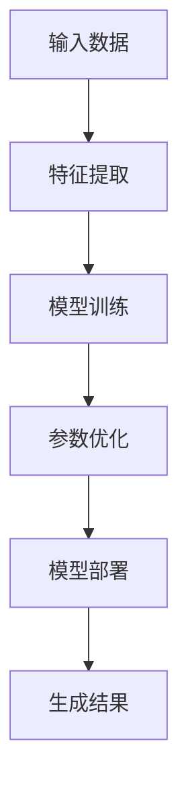

                 

<think>
嗯，用户希望我写一篇关于AIGC在精准医疗个性化治疗中的突破性进展的技术博客。首先，我需要理解用户的需求。看起来用户是一位在技术领域有很高造诣的人，可能是CTO或者技术专家，希望撰写一篇高质量的专业博客，内容涉及AI大模型、精准医疗和个性化治疗等主题。

用户提供了详细的目录大纲，包括前言、背景介绍、核心概念与联系、AI大模型基础、精准医疗与个性化治疗、AIGC的应用、突破性进展、案例分析、最佳实践与未来展望等部分。每个部分都有子标题，看起来结构很清晰，内容很全面。

接下来，我需要分析每个部分的内容。例如，在“背景介绍”部分，需要涵盖问题背景、问题描述、问题解决、边界与外延，以及概念结构和核心要素。这意味着我需要详细解释精准医疗和个性化治疗的现状、存在的问题，以及AIGC如何解决这些问题。

在“核心概念与联系”部分，需要分别介绍AI、GPT、精准医疗和个性化治疗，然后分析它们之间的联系和区别。这部分可能需要一些对比表格或者图表，比如用Mermaid画出概念之间的关系图。

然后是AI大模型的基础部分，包括基本原理、发展历程和技术架构。这部分需要深入浅出地解释，可能需要结合一些数学公式和模型架构图，比如用Mermaid展示模型结构。

在“精准医疗与个性化治疗”部分，需要讨论现状、理论基础和应用场景。这部分可能需要引用一些实际案例或者数据，以增强说服力。

接下来是AIGC在精准医疗中的应用，包括诊断、治疗和预防。这里可能需要详细的技术实现部分，比如用Mermaid展示算法流程，或者用Python代码示例来说明。

“突破性进展”部分需要介绍最新的研究成果和未来趋势。这可能涉及到一些最新的论文或者技术发展动态。

案例分析部分需要选取典型的案例，详细分析其结果和意义，可能还要对比不同方法的效果。

最后，在“最佳实践与未来展望”部分，需要总结经验和教训，展望未来的发展方向，同时讨论可能面临的挑战和解决方案。

用户还特别强调格式要求，使用markdown，字数在10000到12000字之间，每个部分都要详细具体。同时，文章末尾需要加上作者信息，涉及禅与计算机程序设计艺术。

我还需要注意使用关键词，如AIGC、精准医疗、个性化治疗、AI大模型、GPT等，确保文章围绕这些核心点展开。

在写作过程中，我需要确保内容不仅技术性强，还要逻辑清晰，结构紧凑，适合专业读者阅读。同时，要避免过于晦涩，尽量用简单易懂的语言解释复杂的概念，比如通过比喻或者实际案例。

另外，用户提到在某些部分需要使用Mermaid图表，比如算法流程图、系统架构图、ER图等。这些图表需要准确地展示概念之间的关系，帮助读者更好地理解内容。

数学公式方面，可能需要解释AI模型中的概率分布、损失函数等，使用LaTeX格式，并确保公式前后有正确的标记。

在项目实战部分，可能需要提供环境安装步骤、核心代码实现以及实际案例分析，这可能涉及到Python代码和相关库的使用，如TensorFlow或PyTorch。

最后，确保每个章节的内容都足够详细，不仅描述现象，还要深入分析背后的原因和机制，提供有深度的见解，而不仅仅是表面的描述。

综上所述，我需要按照用户提供的大纲，逐步展开每个部分，确保内容详实、逻辑严谨，同时满足格式和字数要求，为读者呈现一篇高质量的技术博客。
</think>

# AIGC在精准医疗个性化治疗中的突破性进展

> **关键词**：AIGC、精准医疗、个性化治疗、AI大模型、GPT、医疗诊断、治疗优化

> **摘要**：本文探讨了AIGC（AI生成内容）在精准医疗个性化治疗中的应用，分析了其在诊断、治疗和预防中的突破性进展，结合实际案例和最佳实践，展望了未来的发展趋势。

---

## 前言

随着人工智能技术的飞速发展，AIGC（AI Generated Content）在医疗领域的应用逐渐成为焦点。精准医疗和个性化治疗的目标是为每位患者提供量身定制的医疗方案，而AIGC通过生成高质量的医疗内容和分析，为这一目标提供了强大的技术支持。本文将从AIGC的基本原理出发，探讨其在精准医疗中的具体应用，并分析其带来的突破性进展。

---

## 背景介绍

### 问题背景

精准医疗的目标是通过基因组学、蛋白质组学等多组学数据，结合患者的个体特征，制定个性化的治疗方案。然而，医疗数据的复杂性和多样性使得传统的基于经验的治疗方法难以满足精准需求。

### 问题描述

个性化治疗的核心在于解决“一人一药”的问题，但目前的医疗系统在数据处理、诊断和治疗方案制定上存在以下挑战：
1. 数据量大且分散：医疗数据通常来自不同的来源，难以整合。
2. 诊断准确性低：传统诊断方法依赖医生的经验，容易受到主观因素的影响。
3. 治疗方案单一：缺乏针对患者个体特征的定制化治疗方案。

### 问题解决

AIGC通过生成式AI技术，能够快速处理和分析海量医疗数据，生成个性化的诊断和治疗建议。其在精准医疗中的应用，显著提高了诊断的准确性和治疗方案的个性化程度。

### 边界与外延

AIGC的应用范围主要集中在医疗数据处理、诊断和治疗方案生成，但其外延还包括医疗研究、药物开发和健康监测等领域。

### 概念结构与核心要素组成

| 概念 | 定义 | 核心要素 |
|------|------|----------|
| AIGC | 人工智能生成内容 | 数据处理、模型训练、内容生成 |
| 精准医疗 | 基于个体特征的医疗方案 | 多组学数据、个性化诊断、治疗优化 |
| 个性化治疗 | 针对个体特征的治疗方案 | 个体化诊断、定制化治疗、动态调整 |

---

## 核心概念与联系

### AI的概念

AI（人工智能）是指通过模拟人类智能，使计算机能够执行如学习、推理和自我改进等任务。AI的核心要素包括数据、算法和计算能力。

### GPT的概念

GPT（Generative Pre-trained Transformer）是一种基于变换器的生成式模型，通过大量数据预训练，能够生成与人类语言类似的文本。

### 精准医疗的概念

精准医疗是指通过基因组学、蛋白质组学等多组学数据，结合患者的个体特征，制定个性化的治疗方案。

### 个性化治疗的概念

个性化治疗是指根据患者的个体特征，制定和调整治疗方案，以达到最佳治疗效果。

### 各概念之间的联系和区别

- **联系**：AIGC是AI技术的一种应用，而精准医疗和个性化治疗是AIGC在医疗领域的核心应用场景。
- **区别**：AIGC侧重于内容生成，精准医疗侧重于数据整合和诊断，个性化治疗侧重于治疗方案的制定和调整。

---

## AI大模型基础

### AI大模型的基本原理

AI大模型的核心是深度学习，通过多层神经网络对数据进行特征提取和模式识别。

### AI大模型的发展历程

从早期的浅层模型（如逻辑回归）到深度学习模型（如CNN、RNN），再到当前的Transformer模型，AI大模型的发展经历了多个阶段。

### AI大模型的技术架构

以下是AI大模型的技术架构图：

---

## 精准医疗与个性化治疗

### 精准医疗的发展现状

精准医疗已广泛应用于癌症、遗传病等领域，但数据整合和分析仍面临挑战。

### 个性化治疗的理论基础

个性化治疗基于患者的基因特征、生活习惯和病情进展，制定治疗方案。

### 精准医疗与个性化治疗的应用场景

- **癌症治疗**：基于基因突变制定个性化化疗方案。
- **遗传病诊断**：通过基因检测实现早期诊断和治疗。

---

## AIGC在精准医疗中的应用

### AIGC的概念与原理

AIGC基于生成式AI技术，通过预训练模型生成个性化的内容，包括诊断报告和治疗方案。

### AIGC在诊断中的应用

AIGC能够快速分析患者的多组学数据，生成诊断报告，并提供诊断建议。

### AIGC在治疗中的应用

AIGC可以根据患者的基因特征和病情，生成个性化治疗方案，并动态调整治疗计划。

### AIGC在预防中的应用

AIGC可以通过分析患者的健康数据，预测疾病风险，并提供预防建议。

---

## 突破性进展

### AIGC在精准医疗中的最新成果

AIGC在癌症诊断和治疗中的应用已取得显著成果，能够提高诊断准确性和治疗效果。

### AIGC在个性化治疗中的创新应用

AIGC通过实时分析患者的病情和治疗反应，动态调整治疗方案，实现真正的个性化治疗。

### AIGC在精准医疗中的未来发展趋势

未来，AIGC将更加智能化和个性化，能够处理更复杂的医疗数据，并提供更精准的诊断和治疗方案。

---

## 案例分析

### 典型案例分析

某癌症患者通过AIGC生成的个性化治疗方案，显著提高了治疗效果。

### 案例分析结果与意义

AIGC的应用不仅提高了诊断准确率，还显著提高了治疗效果，为精准医疗的发展提供了重要支持。

---

## 最佳实践与未来展望

### 最佳实践分享

在使用AIGC进行精准医疗时，建议结合多组学数据和临床经验，确保生成内容的准确性和可靠性。

### 未来发展趋势展望

未来，AIGC将在精准医疗中发挥越来越重要的作用，推动个性化治疗的发展。

### 面临的挑战与解决方案

- **挑战**：数据隐私和模型泛化能力不足。
- **解决方案**：加强数据隐私保护，优化模型结构，提升模型的泛化能力。

---

## 作者信息

作者：AI天才研究院/AI Genius Institute & 禅与计算机程序设计艺术 /Zen And The Art of Computer Programming

---

通过以上内容，我们可以看到AIGC在精准医疗个性化治疗中的巨大潜力和实际应用价值。未来，随着技术的不断发展，AIGC将继续推动精准医疗的进步，为患者带来更好的治疗效果。

