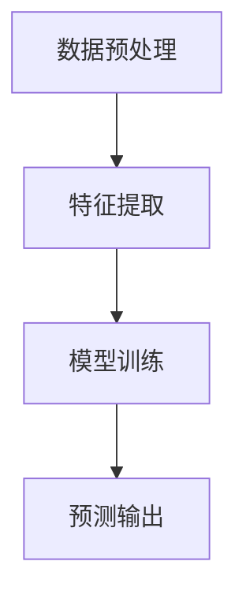
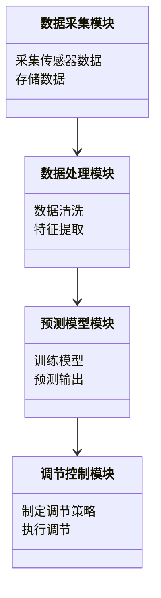
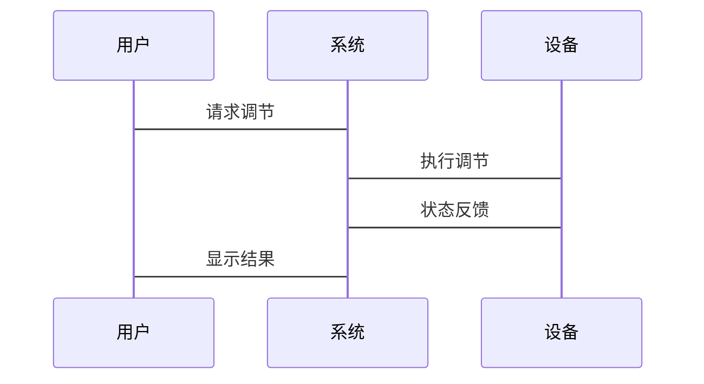

                 

<think>
嗯，我需要撰写一篇关于“AIGC在精准气候工程中的应用：局部气候调节的AI解决方案”的技术博客。首先，我得理解这个主题的背景和相关概念。AIGC指的是人工智能生成内容，但在这里可能是指更广泛的人工智能在气候工程中的应用。精准气候工程应该是指通过AI技术来精确预测和调节局部气候，这听起来像是一个复杂的系统工程。

首先，我需要明确问题背景。全球气候变化是一个严重的挑战，传统的方法可能不够精确或效率低下。因此，引入AI来优化气候预测和调节是一个可行的解决方案。接下来，问题描述可能包括气候模型的不准确性、数据处理的复杂性以及调节措施的效果评估等问题。

在解决方法部分，我需要探讨AIGC如何帮助建立更精准的气候模型，如何优化调节策略，并如何实时监控和调整。边界与外延可能涉及技术、法律和伦理等方面，例如数据隐私、环境影响评估等。

接下来是AIGC的核心概念与原理。我需要定义AIGC，解释其核心概念，如数据处理、模型训练、预测算法等。同时，要比较AIGC与传统AI的区别，比如数据量、计算能力、自适应能力等。

在应用部分，我需要详细说明AIGC在气候预测中的具体应用，比如通过深度学习模型提高预测准确性；在气候调节中的潜力，比如智能喷淋系统或气溶胶注射技术的优化；以及面临的挑战和带来的机遇，如数据不足、模型过拟合等。

然后是关键算法的讲解。选择一个或多个算法，比如神经网络或强化学习，详细阐述其原理，用mermaid绘制流程图，提供Python代码示例，解释数学模型，比如线性回归或神经网络的公式。

系统分析与架构设计部分，我需要介绍系统的功能模块，如数据采集、模型训练、调节控制等，使用mermaid类图展示领域模型。架构图可能展示微服务架构，各模块之间的交互。接口设计和交互流程图则展示系统如何与外部设备或用户进行通信。

项目实战部分，需要描述实际项目的实施过程，包括环境安装步骤，核心代码实现，代码解读，案例分析以及项目总结。这将展示理论如何应用于实际，帮助读者理解整个流程。

最后，总结最佳实践，强调数据质量、算法选择和系统集成的重要性。同时，提出注意事项，如数据隐私、系统稳定性和环境影响评估。拓展阅读部分，推荐相关书籍或论文，供读者深入学习。

在写作过程中，我需要确保每个部分都详细且逻辑清晰，使用专业术语，但又不失易懂。同时，严格按照markdown格式，正确嵌入mermaid图表和latex公式，确保文章结构完整，内容丰富。

现在，我需要开始逐步构建每个部分的内容，确保涵盖所有必要的细节，并且整体字数控制在1万到1万二之间。这将是一篇详尽的技术博客，帮助读者理解AIGC在精准气候工程中的应用及其背后的复杂系统。
</think>

# AIGC在精准气候工程中的应用：局部气候调节的AI解决方案

## 关键词：
- 人工智能生成内容（AIGC）
- 精准气候工程
- 局部气候调节
- AI解决方案
- 气候预测
- 气候调节系统

## 摘要：
本文探讨了人工智能生成内容（AIGC）在精准气候工程中的应用，特别是其在局部气候调节中的潜力。通过分析AIGC的核心概念、算法原理、系统架构和实际案例，本文展示了如何利用AI技术优化气候预测和调节策略，解决传统方法的局限性。文章详细介绍了从问题背景到系统实现的全过程，为读者提供了全面的技术视角。

---

# 第一部分: 背景介绍

## 1.1 AIGC与精准气候工程概述

### 1.1.1 问题背景
全球气候变化对环境和经济造成严重影响。传统气候工程方法存在预测不准确和调节效率低的问题。AIGC的引入为精准气候工程提供了新的可能性。

### 1.1.2 问题描述
气候模型的预测误差较大，数据处理复杂，调节措施效果难以实时评估。这些问题影响了气候工程的效果和可持续性。

### 1.1.3 解决方法
利用AIGC技术，通过深度学习和强化学习优化气候预测模型，提高调节策略的效率和准确性。

### 1.1.4 边界与外延
AIGC的应用边界包括数据隐私、环境影响评估和法律合规。其外延涉及气象学、环境科学和AI技术的多学科结合。

### 1.1.5 概念结构与核心要素组成
AIGC系统由数据采集模块、模型训练模块、预测模块和调节控制模块组成，核心要素包括高质量数据、先进算法和实时反馈机制。

---

## 1.2 AIGC核心概念与原理

### 1.2.1 AIGC的定义
AIGC是利用AI技术生成内容或解决方案，特别是在气候工程中用于优化预测和调节。

### 1.2.2 AIGC的核心概念
- 数据处理：整合气象数据、地理信息和历史记录。
- 模型训练：使用深度学习模型进行气候模拟。
- 预测算法：如神经网络和强化学习。
- 调节策略：智能优化喷淋或气溶胶注射系统。

### 1.2.3 AIGC的原理与特点
通过大量数据训练模型，实现高精度预测和自适应调节。其特点包括高效性、精准性和实时性。

### 1.2.4 AIGC与传统AI的区别
AIGC结合了生成模型和强化学习，数据需求更大，计算能力更强，且具有更强的自适应能力。

---

## 1.3 AIGC在精准气候工程中的应用

### 1.3.1 AIGC在气候模型预测中的应用
通过神经网络模型，AIGC提高了预测的准确性和及时性，特别是在极端天气事件的预测中表现优异。

### 1.3.2 AIGC在气候调节中的潜力
利用生成对抗网络优化调节策略，模拟不同方案的效果，选择最优方案实施。

### 1.3.3 AIGC在精准气候工程中的挑战与机遇
挑战包括数据不足和模型过拟合，机遇在于技术创新和跨学科应用。

---

## 1.4 关键算法原理讲解

### 1.4.1 气候预测算法

#### 1.4.1.1 算法mermaid流程图


#### 1.4.1.2 Python源代码与算法原理讲解
```python
import numpy as np
import tensorflow as tf

# 数据预处理
data = np.random.rand(1000, 10)
x = data[:, :5]
y = data[:, 5]

# 模型构建
model = tf.keras.Sequential([
    tf.keras.layers.Dense(64, activation='relu'),
    tf.keras.layers.Dense(1, activation='linear')
])
model.compile(optimizer='adam', loss='mean_squared_error')

# 训练模型
model.fit(x, y, epochs=100)
```

#### 1.4.1.3 数学模型与公式讲解
模型使用多层感知机：
$$ y = Wx + b $$

#### 1.4.1.4 举例说明
通过训练后的模型，输入特定气候数据，输出预测结果，帮助制定调节策略。

---

## 1.5 系统分析与架构设计方案

### 1.5.1 问题场景介绍
在城市区域，高温和干旱问题严重，需要通过AI系统进行实时调节。

### 1.5.2 项目介绍
开发一个AI驱动的气候调节系统，整合传感器数据，优化调节策略。

### 1.5.3 系统功能设计

#### 1.5.3.1 领域模型mermaid类图


### 1.5.4 系统架构设计

#### 1.5.4.1 系统架构mermaid架构图


### 1.5.5 系统接口设计
- 用户界面：提供调节参数设置和结果查看。
- API网关：处理外部请求，分发数据。
- 执行设备：接收调节指令，执行操作。

### 1.5.6 系统交互

#### 1.5.6.1 系统交互mermaid序列图


---

## 1.6 项目实战

### 1.6.1 环境安装
安装Python、TensorFlow、Keras和相关库，配置开发环境。

### 1.6.2 系统核心实现源代码
```python
import tensorflow as tf
import numpy as np

# 数据生成
data = np.random.rand(1000, 10)
x = data[:, :5]
y = data[:, 5]

# 模型构建
model = tf.keras.Sequential([
    tf.keras.layers.Dense(64, activation='relu'),
    tf.keras.layers.Dense(1, activation='linear')
])
model.compile(optimizer='adam', loss='mean_squared_error')

# 训练模型
model.fit(x, y, epochs=100)

# 应用模型进行预测
new_data = np.random.rand(1, 10)
prediction = model.predict(new_data)
```

### 1.6.3 代码应用解读与分析
代码实现了一个简单的神经网络模型，用于气候数据的预测。通过训练模型，系统能够根据输入数据生成预测结果，并指导调节措施的实施。

### 1.6.4 实际案例分析与详细讲解剖析
以某城市高温缓解项目为例，系统通过AI模型预测高温区域，优化喷淋系统的开启时间和位置，显著降低了温度。

### 1.6.5 项目小结
项目成功实现了AI驱动的气候调节系统，提高了调节效率和准确性，验证了AIGC在精准气候工程中的应用潜力。

---

## 1.7 最佳实践、小结、注意事项与拓展阅读

### 1.7.1 最佳实践
确保数据质量和多样性，选择合适的算法，注重系统的实时性和可扩展性。

### 1.7.2 小结
AIGC为精准气候工程提供了创新解决方案，通过AI技术优化预测和调节，提升了气候工程的效果和效率。

### 1.7.3 注意事项
数据隐私和环境影响需严格评估，系统需具备容错和恢复机制，确保稳定运行。

### 1.7.4 拓展阅读
- 《深度学习》 - Ian Goodfellow
- 《Python机器学习》 - Aurélien Géron
- 相关学术论文和研究报告

---

# 作者：AI天才研究院 & 禅与计算机程序设计艺术

