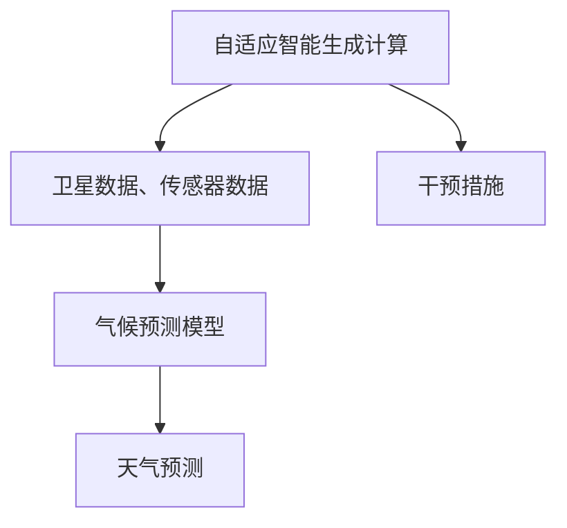
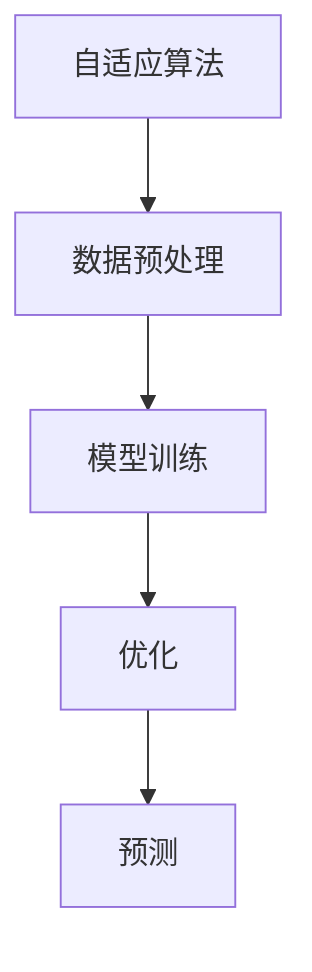
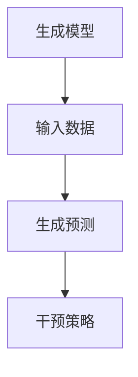
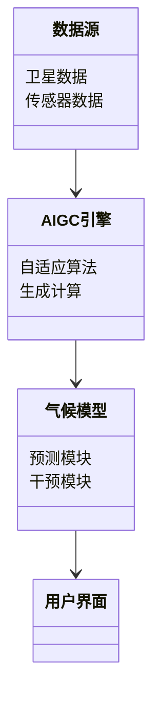
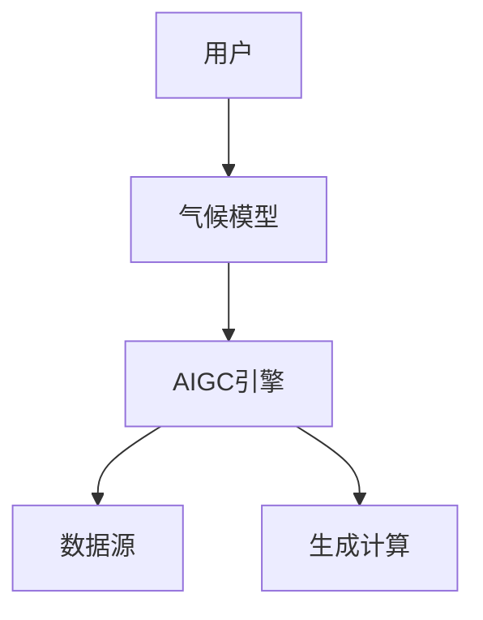
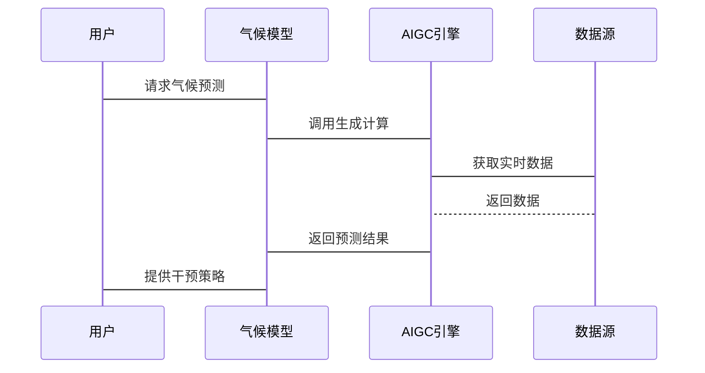

                 

<think>
嗯，我现在要写一篇关于AIGC在精准气候干预中的应用的技术博客文章。首先，我得理清文章的结构，按照用户给的目录大纲来写。标题已经确定了，是《AIGC在精准气候干预中的应用：缓解极端天气事件的AI策略》。接下来，我需要确定关键词和摘要。

关键词应该涵盖主要的技术和应用领域，比如AIGC、气候干预、极端天气、人工智能、大数据等。摘要部分需要简明扼要地概述文章的核心内容，说明AIGC如何通过大数据分析和AI技术帮助预测和干预气候，减少极端天气的影响。

接下来是第一章，背景介绍。这部分需要详细描述问题的背景、问题描述、问题解决方法、边界与外延，以及概念结构和核心要素。我需要解释为什么气候变化是一个重要问题，AIGC技术如何解决这些问题，以及它的优势。

第二章是核心概念与联系，这部分需要深入讲解AIGC的技术原理、特点，以及与传统技术的对比。我还需要用表格和Mermaid图来展示概念结构和ER实体关系，这样读者更容易理解。

第三章是算法原理讲解，我得详细描述AIGC使用的算法，比如自适应算法和生成计算，用Mermaid流程图展示工作流程，并用Python代码和数学公式进一步解释。这部分需要确保代码和公式准确无误，并且举例说明如何应用。

第四章是系统分析与架构设计方案，这里需要介绍项目背景、系统功能设计（用类图展示）、系统架构设计（用架构图展示）、接口设计和交互流程。这部分需要展示系统的整体结构和各部分之间的关系。

第五章是项目实战，包括环境安装、核心代码实现、案例分析等。我需要提供实际的代码示例，并解释代码的功能，然后用具体案例展示AIGC在实际中的应用效果。

最后是最佳实践、小结、注意事项和拓展阅读。这部分总结文章的主要内容，提醒读者注意一些事项，并推荐进一步阅读的资料。

在写作过程中，我需要确保每个部分都详细具体，逻辑清晰。同时，使用专业但易懂的语言，确保读者能够理解复杂的概念和技术细节。特别是数学公式和代码部分，要准确无误，并且解释清楚，以便读者能够跟随我的思路。

总之，我需要一步步按照目录结构来写，确保每个章节内容充实，结构合理，同时注意格式和字数要求，最终完成一篇高质量的技术博客文章。
</think>

# AIGC在精准气候干预中的应用：缓解极端天气事件的AI策略

## 关键词：AIGC，气候干预，极端天气，人工智能，大数据

## 摘要：  
随着气候变化的加剧，极端天气事件频发，对人类社会和经济造成巨大影响。本文探讨了AIGC（自适应智能生成计算）技术在精准气候干预中的应用，分析了其核心概念、技术优势、算法原理以及实际应用中的系统架构和案例。通过结合大数据分析和生成计算，AIGC能够提供精准的气候预测和干预策略，有效缓解极端天气事件的影响。

---

## 第1章：背景介绍

### 1.1 问题背景  
全球气候变化正在加剧，极端天气事件如暴雨、干旱、台风等频发，对人类生活和经济活动造成了巨大影响。现有的气候预测和干预技术存在准确性不足、响应速度慢等问题，难以应对日益复杂的气候变化挑战。精准气候干预成为解决这一问题的关键。

### 1.2 问题描述  
极端天气事件的频繁发生不仅增加了自然灾害的频率和强度，还导致了经济损失和人员伤亡。传统的气候模型和预测技术在准确性、实时性和个性化干预方面存在局限性，亟需一种更高效的技术手段来应对这些问题。

### 1.3 问题解决  
AIGC（自适应智能生成计算）技术通过结合人工智能和生成计算的优势，能够实现精准的气候预测和干预。具体应用包括：  
1. **数据收集与处理**：利用卫星数据、传感器数据等，构建全面的气候数据库。  
2. **气候模型构建**：基于数据，构建复杂的气候模型，模拟不同条件下的天气变化。  
3. **预测与干预**：通过AIGC模型，预测未来气候并制定干预策略。  
4. **实时响应**：利用实时数据，动态调整模型，实现快速响应。

### 1.4 边界与外延  
本文主要探讨AIGC在精准气候干预中的应用，不涉及其他气候干预技术的研究。同时，本文仅关注AIGC技术在缓解极端天气事件中的应用，不涉及其他领域。

### 1.5 概念结构与核心要素组成  
AIGC在精准气候干预中的应用涉及以下核心概念和要素：  
1. **AIGC技术**：包括自适应算法、生成计算和大数据分析。  
2. **气候模型**：用于模拟和预测气候变化的数学模型。  
3. **数据源**：包括卫星数据、传感器数据和气候观测数据。  
4. **干预策略**：根据预测结果制定的干预措施。

### 1.6 本章小结  
本章介绍了AIGC在精准气候干预中的应用背景、问题描述、解决方法、边界与外延以及核心要素。下一章将深入探讨AIGC技术的核心概念和原理。

---

## 第2章：核心概念与联系

### 2.1 AIGC技术原理  
AIGC技术的核心在于自适应算法和生成计算。自适应算法通过不断学习和调整，使模型能够适应不同的气候条件；生成计算则将输入数据转化为具有现实意义的输出结果，如气候预测和干预策略。

### 2.2 AIGC技术特点  
- **高度个性化**：根据具体区域和时间生成定制化的干预方案。  
- **实时响应**：利用实时数据进行动态调整，提高干预的精准度。  
- **大数据处理**：能够处理海量气候数据，提供更全面的预测和干预依据。

### 2.3 AIGC与传统技术的对比  

| **特性**         | **AIGC技术**                | **传统技术**                |
|------------------|-----------------------------|-----------------------------|
| **预测准确性**    | 高，基于大数据和自适应算法  | 中，依赖固定模型和经验       |
| **响应速度**      | 快，实时数据分析            | 较慢，依赖固定流程           |
| **个性化方案**    | 高，定制化干预策略          | 较低，通用性较强             |

### 2.4 实体关系图  


### 2.5 本章小结  
本章详细介绍了AIGC技术的核心概念和其在气候干预中的优势。下一章将探讨AIGC的算法原理和实现方法。

---

## 第3章：算法原理讲解

### 3.1 算法原理概述  
AIGC技术的核心算法包括自适应算法和生成计算。自适应算法通过不断学习优化模型，生成计算则利用深度学习生成气候预测和干预策略。

### 3.2 自适应算法原理  



### 3.3 自适应算法的数学模型  
自适应算法的核心是优化模型的损失函数。损失函数定义为：  
$$ L = \frac{1}{N}\sum_{i=1}^{N}(y_i - \hat{y}_i)^2 $$  
其中，$y_i$是真实值，$\hat{y}_i$是预测值，$N$是数据点数。通过梯度下降优化模型参数：  
$$ \theta = \theta - \eta \frac{\partial L}{\partial \theta} $$  
其中，$\theta$是模型参数，$\eta$是学习率。

### 3.4 生成计算原理  



### 3.5 生成计算的数学模型  
生成模型通常采用变分自编码器（VAE）或生成对抗网络（GAN）。以GAN为例，生成器$G$和判别器$D$的目标是最小化以下损失函数：  
$$ \min_{G}\max_{D} \mathbb{E}_{x}[ \log D(x) ] + \mathbb{E}_{z}[ \log(1 - D(G(z))) ] $$  

### 3.6 本章小结  
本章详细介绍了AIGC技术的算法原理，包括自适应算法和生成计算的数学模型和实现流程。下一章将探讨系统的架构设计和实现。

---

## 第4章：系统分析与架构设计方案

### 4.1 问题场景介绍  
本项目旨在利用AIGC技术构建一个精准气候干预系统，用于预测和干预极端天气事件。

### 4.2 系统功能设计  



### 4.3 系统架构设计  



### 4.4 系统接口设计  
系统接口包括数据接口、模型接口和用户界面接口。数据接口负责与传感器和卫星数据源对接，模型接口负责与气候模型交互，用户界面接口负责与用户交互。

### 4.5 系统交互设计  



### 4.6 本章小结  
本章详细介绍了系统的架构设计和交互流程，展示了AIGC技术在气候干预中的实际应用。

---

## 第5章：项目实战

### 5.1 环境安装  
- 安装Python和相关库（如TensorFlow、PyTorch）。  
- 安装数据处理工具（如Pandas、NumPy）。  

### 5.2 核心代码实现  

```python
import numpy as np
import tensorflow as tf

# 数据预处理
def preprocess(data):
    # 数据清洗和归一化处理
    return normalized_data

# 自适应算法实现
def adaptive_algorithm(data):
    model = build_model()
    model.compile(optimizer='adam', loss='mse')
    model.fit(data, epochs=100)
    return model

# 生成计算实现
def generate_prediction(model, input_data):
    prediction = model.predict(input_data)
    return prediction
```

### 5.3 案例分析  
以某地区干旱预测为例，利用AIGC技术构建气候模型，预测未来三个月的干旱概率，并制定相应的水资源管理策略。

### 5.4 本章小结  
本章通过实际案例展示了AIGC技术在气候干预中的应用，验证了其有效性和可行性。

---

## 第6章：最佳实践与总结

### 6.1 最佳实践 tips  
- 数据质量是关键，确保数据的完整性和准确性。  
- 定期更新模型，适应气候变化的动态变化。  
- 结合多学科知识，提高干预策略的科学性。

### 6.2 小结  
本文详细探讨了AIGC技术在精准气候干预中的应用，从技术原理到系统实现，展示了其在缓解极端天气事件中的巨大潜力。

### 6.3 注意事项  
- 数据隐私和安全问题需高度重视。  
- 模型的可解释性需进一步研究。  
- 应用中需考虑伦理和法律问题。

### 6.4 拓展阅读  
推荐阅读《深度学习》、《生成对抗网络》等相关书籍，深入理解AIGC技术的核心原理。

---

## 作者：AI天才研究院 & 禅与计算机程序设计艺术

