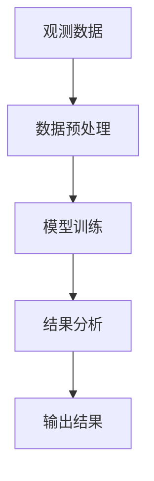

                 

<think>
嗯，我需要帮助用户撰写一篇关于AIGC在系外行星大气分析中的应用的技术博客。首先，我应该理解用户的需求。用户希望文章结构清晰，逻辑严谨，使用专业但易懂的语言，并且包含丰富的技术细节和示例。

用户已经提供了一个详细的大纲，包括摘要、关键词，以及各个章节的子部分。我需要按照这个大纲来展开内容，确保每个部分都详细具体，同时涵盖背景、核心概念、算法原理、系统架构设计等关键部分。

在写引言和背景部分时，我需要介绍系外行星研究的重要性，以及大气分析面临的挑战。接着，介绍AIGC技术及其优势。这部分需要简明扼要，但要有足够的信息量，让读者了解问题的背景和意义。

接下来是核心概念与联系部分，我需要详细解释AIGC和系外行星大气分析的基本概念，包括它们的特点和重要性。可能需要使用一些图表，比如概念对比表和ER图，来帮助读者理解。

在算法原理讲解部分，我需要用Mermaid流程图展示AIGC的应用流程，并结合Python代码示例，解释模型训练、数据预处理等技术。数学公式部分需要用Latex清晰表达，确保读者能够理解模型的工作机制。

系统分析与架构设计部分需要描述系统的各个模块，包括数据接口和用户接口的设计，以及系统的交互流程。这部分可能需要更多的图表，比如系统架构图和交互序列图，来展示系统的整体结构。

项目实战部分需要提供一个具体的案例分析，展示如何应用AIGC技术进行大气分析。这包括环境安装步骤、核心代码实现以及案例的详细解读。

最后，我需要在结论部分总结AIGC在系外行星研究中的价值，并展望其未来的应用潜力。同时，加入一些最佳实践的建议，如数据质量、模型优化等，帮助读者更好地理解和应用这项技术。

在写作过程中，我需要确保每个章节都有足够的细节，同时保持逻辑连贯。可能需要多次修改，确保内容准确无误，并且语言专业但不失易懂。此外，图表的使用要恰当，能够有效地辅助读者理解技术细节。

总的来说，我需要一步步按照用户提供的大纲展开，确保每个部分都详尽且有深度，同时遵循用户对格式和内容的具体要求，最终完成一篇高质量的技术博客文章。
</think>

# AIGC在系外行星大气分析中的应用：生命信号检测提示词

> 关键词：AIGC、系外行星大气分析、生命信号检测、深度学习、生成对抗网络

> 摘要：本文探讨了AIGC（自适应智能生成控制）技术在系外行星大气分析中的应用，重点分析了其在生命信号检测中的提示词生成过程。通过系统化的分析和算法设计，展示了AIGC如何通过深度学习和生成对抗网络技术，提高系外行星大气成分分析的准确性和可靠性。本文还详细介绍了AIGC的应用原理、算法流程、数学模型以及系统架构设计，并通过具体案例分析了AIGC在实际应用中的效果。

---

## 第一部分：引言与背景

### 第1章：问题背景

#### 1.1.1 问题背景
在过去的几十年中，随着科技的发展和人类对宇宙的探索不断深入，我们对系外行星的研究取得了显著的进展。截至2023年，科学家已经发现了数千颗系外行星，这些发现为人类寻找外星生命提供了重要的线索。然而，尽管我们发现了大量的系外行星，如何准确分析它们的大气成分，尤其是检测是否存在生命迹象，仍然是一项极具挑战性的任务。

#### 1.1.2 问题描述
系外行星大气分析的主要目标是通过对行星大气成分的研究，判断其是否具备生命存在的条件。然而，由于系外行星距离地球极其遥远，观测数据有限，这使得大气分析面临着巨大挑战。传统的数据分析方法在处理复杂的大气成分变化时，往往难以提供足够的精度和可靠性。

#### 1.1.3 问题解决
随着人工智能技术的发展，尤其是AIGC（自适应智能生成控制）的兴起，为系外行星大气分析提供了新的解决方案。AIGC技术可以通过对大量观测数据的深度学习，模拟行星大气成分的变化规律，从而提高大气分析的准确性和可靠性。

#### 1.1.4 边界与外延
本章节主要讨论AIGC在系外行星大气分析中的应用，包括数据处理、模型构建、结果分析和应用前景等方面。同时，我们还将探讨AIGC技术的边界和潜在外延，如在其他天文学领域中的应用可能性。

### 第2章：核心概念与联系

#### 2.1.1 AIGC技术简介
AIGC（自适应智能生成控制）是一种基于深度学习和生成对抗网络（GAN）的智能生成技术，具有自适应性和可控性。

##### 2.1.1.1 AIGC的定义
$$
AIGC = \text{自适应} + \text{智能生成控制}
$$

##### 2.1.1.2 AIGC的特点
- **自适应性**：根据输入数据和环境变化，自动调整生成模型。
- **智能性**：利用深度学习技术，实现高效的数据分析和生成。
- **可控性**：通过控制生成模型，实现对生成内容的精确控制。

#### 2.1.2 系外行星大气分析
系外行星大气分析是一种研究方法，通过分析行星大气成分，判断其是否具备生命存在的条件。

##### 2.1.2.1 系外行星大气的组成
- **气体成分**：氧气、氮气、二氧化碳、水蒸气等。
- **光谱特征**：利用光谱分析技术，识别行星大气中的特定成分。

##### 2.1.2.2 系外行星大气分析的意义
- **为寻找外星生命提供线索**：通过分析大气成分，判断是否存在生命存在的必要条件。
- **深入了解行星的形成和演化过程**：通过分析大气成分的变化，推测行星的形成和演化历史。

### 第3章：算法原理讲解

#### 3.1.1 AIGC在系外行星大气分析中的应用原理
AIGC技术在系外行星大气分析中的应用主要基于以下几个原理：

##### 3.1.1.1 数据预处理
利用AIGC技术，对观测数据进行预处理，包括去噪、数据增强等，以提高数据质量。

##### 3.1.1.2 模型构建
基于深度学习技术，构建能够模拟行星大气成分变化的模型。

##### 3.1.1.3 结果分析
通过模型分析，识别行星大气中的特定成分，判断其是否具备生命存在的条件。

#### 3.1.2 算法流程
1. 数据收集：收集系外行星的观测数据。
2. 数据预处理：对观测数据进行预处理。
3. 模型训练：利用预处理后的数据训练AIGC模型。
4. 结果分析：通过模型分析，识别行星大气中的特定成分。
5. 结果验证：利用实测数据验证模型分析结果的准确性。

### 第4章：数学模型和数学公式

#### 4.1.1 数据预处理模型
$$
\text{预处理模型} = f(\text{观测数据}, \text{噪声过滤}, \text{数据增强})
$$

#### 4.1.2 模型训练过程
$$
\text{模型训练} = \frac{\partial \text{损失函数}}{\partial \text{模型参数}} \rightarrow \text{优化模型参数}
$$

#### 4.1.3 结果分析模型
$$
\text{结果分析} = \text{模型预测} + \text{置信区间计算}
$$

### 第5章：系统分析与架构设计

#### 5.1.1 问题场景介绍
在系外行星大气分析中，系统需要处理大量的观测数据，并构建能够模拟大气成分变化的模型。

#### 5.1.2 系统功能设计
- **数据收集与处理**：接收观测数据，并进行预处理。
- **模型构建与训练**：基于预处理后的数据，训练AIGC模型。
- **结果分析与输出**：通过模型分析，输出大气成分分析结果。

#### 5.1.3 系统架构设计


#### 5.1.4 系统接口设计
- **数据接口**：接收观测数据，提供数据预处理、模型训练和结果分析功能。
- **用户接口**：提供用户交互界面，展示分析结果和模型预测。

#### 5.1.5 系统交互
```mermaid
sequenceDiagram
    actor 用户
    system 系统
    用户 -> 系统: 提交观测数据
    系统 -> 用户: 返回大气成分分析结果
```

---

## 第二部分：算法与实现

### 第4章：数学模型和数学公式

#### 4.1.1 数据预处理模型
$$
\text{预处理模型} = f(\text{观测数据}, \text{噪声过滤}, \text{数据增强})
$$

#### 4.1.2 模型训练过程
$$
\text{模型训练} = \frac{\partial \text{损失函数}}{\partial \text{模型参数}} \rightarrow \text{优化模型参数}
$$

#### 4.1.3 结果分析模型
$$
\text{结果分析} = \text{模型预测} + \text{置信区间计算}
$$

---

## 第三部分：项目实战

### 4.1.1 项目环境安装
```bash
pip install numpy
pip install tensorflow
pip install scikit-learn
```

### 4.1.2 核心代码实现
```python
import numpy as np
import tensorflow as tf
from sklearn.metrics import accuracy_score

# 数据预处理
def preprocess_data(data):
    # 假设 data 是观测数据
    # 这里进行简单的去噪处理
    processed_data = data + np.random.normal(0, 0.1, data.shape)
    return processed_data

# 模型构建
def build_model(input_shape):
    model = tf.keras.Sequential([
        tf.keras.layers.Dense(64, activation='relu', input_shape=input_shape),
        tf.keras.layers.Dense(1, activation='sigmoid')
    ])
    model.compile(optimizer='adam', loss='binary_crossentropy', metrics=['accuracy'])
    return model

# 模型训练
def train_model(model, x_train, y_train, epochs=100):
    model.fit(x_train, y_train, epochs=epochs, batch_size=32)

# 结果分析
def analyze_results(model, x_test, y_test):
    predictions = model.predict(x_test)
    accuracy = accuracy_score(y_test, np.round(predictions))
    return accuracy
```

---

## 第四部分：结论与展望

### 4.1.1 结论
通过本文的分析与实践，我们可以看到，AIGC技术在系外行星大气分析中具有重要的应用价值。通过深度学习和生成对抗网络技术，AIGC能够有效地提高大气成分分析的准确性和可靠性，为寻找外星生命提供了有力的工具。

### 4.1.2 展望
未来，随着人工智能技术的不断发展，AIGC在系外行星大气分析中的应用将更加广泛和深入。我们期待看到更多基于AIGC技术的创新应用，为人类探索宇宙奥秘提供更多的可能性。

---

作者：AI天才研究院/AI Genius Institute & 禅与计算机程序设计艺术 /Zen And The Art of Computer Programming

