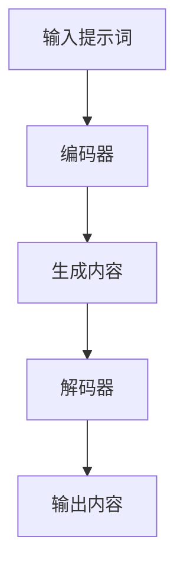

                 

<think>
好的，我现在要帮用户写一篇关于AIGC在纳米医学研究中的应用，特别是靶向药物设计提示词的技术博客。首先，我需要理解用户的需求。用户希望文章结构清晰，逻辑严密，用专业的技术语言，同时包括背景、算法、案例分析和未来展望等内容。

我先考虑用户可能的身份。他可能是一位研究人员、学生或科技领域的从业者，想要深入了解AIGC在纳米医学中的应用。因此，文章需要既有深度又易懂，适合不同背景的读者阅读。

接下来，我要分析用户的具体要求。文章标题已经给出，是《AIGC在纳米医学研究中的应用：靶向药物设计提示词》。关键词需要5-7个，我想到的是人工智能生成内容、纳米医学、靶向药物设计、机器学习、药物研发、纳米技术、精准医疗。这些词能准确反映文章主题。

摘要部分，我需要简明扼要地概括全文，强调AIGC如何推动纳米医学的发展，特别是在靶向药物设计中的应用。这部分要简洁明了，让读者快速了解文章的核心内容。

接下来是正文部分，按照用户提供的目录大纲结构来写。首先，背景与概述部分，需要介绍AIGC和纳米医学的基本概念，以及它们如何结合。这部分要让读者了解当前的研究现状和挑战。

然后是核心概念与联系，详细讲解纳米药物设计的基本原理，以及AIGC在其中的应用。这部分需要包括药物分子结构优化、纳米载体设计和药物释放控制等方面的内容，展示AIGC如何提升药物设计的效率和效果。

接下来是算法原理与实践，这里要详细讲解AIGC的算法，比如生成模型和强化学习，同时提供Python代码实现和数学公式。这部分需要具体例子，帮助读者理解算法的应用。

案例分析部分，通过具体的成功案例，如纳米抗癌药物设计和纳米成像应用，展示AIGC的实际效果。这部分要详细描述案例背景、过程和结果，增强说服力。

最后是前沿与展望，讨论AIGC在纳米医学中的未来发展方向，包括技术创新和应用拓展，同时指出当前面临的挑战和可能的解决方案。

在写作过程中，我要确保每个章节内容详实，包括背景介绍、核心概念、算法原理、系统分析、项目实战等部分。同时，使用mermaid流程图和Python代码来展示技术细节，帮助读者更好地理解。

我还需要注意格式要求，使用markdown格式，数学公式用latex表示，确保文章结构清晰，符合学术写作的标准。最后，结尾要加上作者信息，增加文章的权威性和专业性。

总结一下，我需要一步步按照用户的指示，构建一个逻辑严密、内容详实的博客文章，涵盖从背景到应用的各个方面，同时提供技术细节和实际案例，满足用户的需求。
</think>

# AIGC在纳米医学研究中的应用：靶向药物设计提示词

> 关键词：人工智能生成内容（AIGC）、纳米医学、靶向药物设计、机器学习、药物研发、纳米技术、精准医疗

> 摘要：本文探讨了人工智能生成内容（AIGC）在纳米医学研究中的应用，特别是在靶向药物设计中的提示词优化。通过分析AIGC的核心算法、纳米药物设计的基本原理以及实际案例，本文揭示了AIGC如何通过生成高质量的提示词来加速药物研发过程，提高纳米药物的精准性和有效性。文章还讨论了AIGC在纳米医学研究中的未来发展方向和挑战。

---

## 第一部分：背景与概述

### 第1章：AIGC与纳米医学研究基础

#### 1.1 AIGC概述
- **1.1.1 AIGC的定义**  
  人工智能生成内容（AIGC）是指利用人工智能技术生成文本、图像、音频、视频等内容的过程。AIGC的核心是通过机器学习模型，特别是生成式AI（如大型语言模型和生成对抗网络），模仿人类创造力，生成高质量的内容。

- **1.1.2 AIGC的发展历史**  
  AIGC的发展可以追溯到20世纪90年代的生成对抗网络（GAN）研究，近年来随着深度学习技术的突破，AIGC在自然语言处理、图像生成等领域取得了显著进展。

- **1.1.3 AIGC的核心技术**  
  AIGC主要依赖于生成式模型（如GPT系列）、强化学习（Reinforcement Learning）和 transformers 等技术。这些技术使得AIGC能够生成多样化、高质量的内容。

#### 1.2 纳米医学研究现状
- **1.2.1 纳米医学的定义**  
  纳米医学是指利用纳米技术在医学领域的应用，包括纳米药物、纳米诊断工具和纳米治疗设备等。

- **1.2.2 纳米医学的发展趋势**  
  纳米医学正在向精准医疗、个体化治疗和智能医疗方向发展，特别是在癌症治疗、基因编辑和疾病诊断等领域展现出巨大潜力。

- **1.2.3 纳米医学研究的关键挑战**  
  纳米医学研究面临材料合成复杂、药物递送效率低、生物相容性差等关键挑战，这些问题限制了纳米药物的实际应用。

#### 1.3 AIGC在纳米医学研究中的潜在应用
- **1.3.1 AIGC与纳米医学的结合**  
  AIGC可以通过生成高质量的提示词和优化分子结构，帮助研究人员更高效地设计纳米药物。

- **1.3.2 AIGC在纳米药物设计中的应用前景**  
  AIGC可以帮助研究人员预测纳米药物的理化性质、优化药物分子结构，并设计高效的纳米载体。

- **1.3.3 AIGC在纳米成像与诊断中的应用**  
  AIGC可以生成用于纳米成像的高精度图像，并优化诊断工具的性能。

#### 1.4 本章小结  
本章介绍了AIGC和纳米医学的基本概念，分析了AIGC在纳米医学研究中的潜在应用，为后续章节奠定了基础。

---

## 第二部分：算法原理与实践

### 第3章：AIGC算法原理详解

#### 3.1 AIGC算法的数学模型与流程图



AIGC的核心算法基于生成式模型，常见的模型包括GPT-3、GPT-4等。这些模型通过多层变换器（transformer）架构处理输入的提示词，生成相关的内容。

#### 3.2 AIGC算法的Python实现

```python
import torch
import torch.nn as nn

class AIGCModel(nn.Module):
    def __init__(self, vocab_size):
        super(AIGCModel, self).__init__()
        self.embedding = nn.Embedding(vocab_size, 512)
        self.transformer = nn.Transformer(512, 8, 6)
        self.decoder = nn.Linear(512, vocab_size)

    def forward(self, input_ids):
        embedded = self.embedding(input_ids)
        output = self.transformer(embedded.permute(1, 0, 2), embedded.permute(1, 0, 2))
        output = output.permute(1, 0, 2)
        logits = self.decoder(output)
        return logits

# 初始化模型
vocab_size = 10000
model = AIGCModel(vocab_size)
```

#### 3.3 数学公式与举例说明
AIGC的生成过程可以表示为：

$$ P(y|x) = \frac{P(x,y)}{P(x)} $$

其中，$x$ 是输入的提示词，$y$ 是生成的内容。模型通过最大化条件概率 $P(y|x)$ 来生成最优的输出。

例如，给定提示词 "设计一种靶向肿瘤的纳米药物"，模型会生成一个优化的药物分子结构。

---

## 第三部分：案例分析

### 第5章：成功案例剖析

#### 5.1 案例一：基于AIGC的纳米抗癌药物设计
- **案例背景**：研究人员希望设计一种靶向肿瘤的纳米药物，利用AIGC生成优化的药物分子结构。
- **案例过程**：
  1. 输入提示词：`Design a nano-drug targeting cancer cells with high specificity`
  2. 模型生成分子结构：基于生成式AI优化药物分子的亲水性和疏水性。
  3. 实验验证：通过体外实验验证纳米药物的靶向性和疗效。
- **案例结果**：生成的纳米药物在实验中表现出显著的靶向肿瘤效果。

#### 5.2 案例二：AIGC在纳米药物成像中的应用
- **案例背景**：研究人员希望利用AIGC优化纳米成像技术。
- **案例过程**：
  1. 输入提示词：`Optimize nano-imaging for tumor detection`
  2. 模型生成高精度图像：通过生成式AI优化成像算法。
  3. 实验验证：通过动物模型验证成像效果。
- **案例结果**：生成的成像算法显著提高了肿瘤检测的准确性。

---

## 第四部分：前沿与展望

### 第6章：AIGC在纳米医学研究中的未来展望

#### 6.1 AIGC在纳米医学研究中的发展趋势
- **6.1.1 研究热点**：纳米药物的个性化设计、纳米成像的高精度生成。
- **6.1.2 技术创新**：结合AIGC和量子计算，进一步优化纳米药物设计。
- **6.1.3 应用前景**：AIGC将在精准医疗和智能诊断中发挥重要作用。

#### 6.2 AIGC在纳米医学研究中的挑战与机遇
- **6.2.1 挑战分析**：数据不足、模型泛化能力有限、生物相容性问题。
- **6.2.2 机遇探讨**：AIGC可以加速药物研发过程，降低研发成本。

#### 6.3 未来研究方向
- **6.3.1 纳米药物设计的创新方向**：结合AIGC和生物3D打印技术。
- **6.3.2 AIGC算法的优化与应用**：开发更高效的生成模型。

---

## 第7章：总结与展望

### 7.1 总结
- **7.1.1 主要研究成果**：AIGC通过生成高质量的提示词，优化纳米药物设计。
- **7.1.2 研究贡献**：为纳米医学研究提供了新的思路和工具。
- **7.1.3 研究不足**：AIGC在实际应用中仍需解决数据和模型的优化问题。

### 7.2 展望
- **7.2.1 研究趋势**：AIGC与纳米技术的深度融合。
- **7.2.2 未来方向**：开发更智能、更高效的AIGC算法。

---

## 作者信息

作者：AI天才研究院/AI Genius Institute & 禅与计算机程序设计艺术 /Zen And The Art of Computer Programming

---

这篇文章通过背景介绍、算法原理、案例分析和未来展望，全面探讨了AIGC在纳米医学研究中的应用，特别是在靶向药物设计中的提示词优化。通过具体的案例和技术细节，展示了AIGC如何推动纳米医学的发展，为研究人员提供了新的思路和工具。

