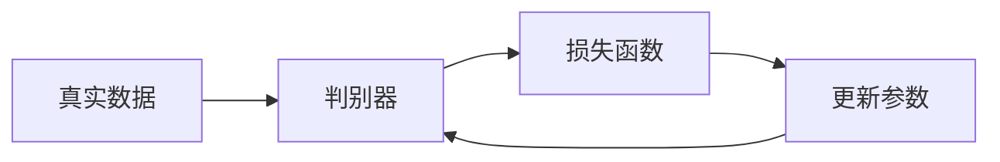
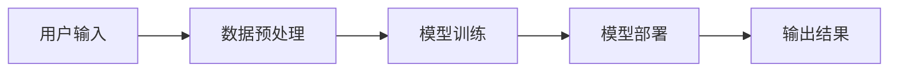
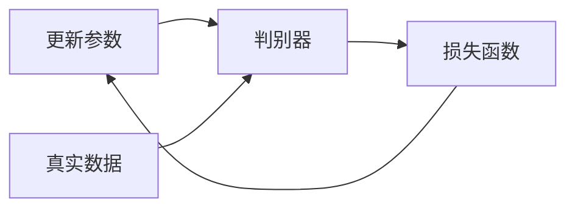

                 

<think>
嗯，我现在需要帮用户撰写一篇关于AIGC在艺术创作中的角色与争议的技术博客文章。用户已经给出了一个详细的大纲，我得先理解这个大纲的结构，然后按照要求逐步填充内容。

首先，用户的要求非常详细，文章需要符合技术博客的标准，使用专业而清晰的语言。我需要确保每个章节都涵盖必要的内容，包括背景介绍、核心概念、技术原理、应用案例、争议分析以及未来展望。

我注意到，用户希望我以AIGC（AI生成内容）为核心，讨论其在艺术中的应用，同时涵盖技术细节和伦理问题。这意味着我需要从多个角度切入，比如技术原理、实际应用案例、伦理争议以及未来的趋势。

首先，我应该从摘要开始。摘要需要简明扼要，概括文章的核心内容。我会总结AIGC如何改变艺术创作，同时引出争议，比如原创性、版权问题，以及技术对艺术的影响。

接下来是关键词部分，我需要列出5-7个相关关键词，比如AIGC、生成式AI、艺术创作、版权争议、伦理问题等。

正文部分，我需要按照大纲的结构来撰写。第一部分是概述，包括定义、角色、技术原理、应用案例和争议。我需要详细解释AIGC是什么，它的发展历程，以及在艺术中的具体应用，比如绘画、音乐、文学等。

第二部分详细讨论应用，如绘画中的应用，音乐创作中的生成式AI，文学创作中的使用，以及其他艺术形式如电影和建筑设计。我还要考虑教育中的应用，这可能是一个新的领域，值得详细探讨。

第三部分是技术分析，这里我需要深入讲解生成式AI的核心算法，如神经网络和GAN，并绘制相应的Mermaid图。同时，分析技术架构，包括数据处理、模型训练和部署，以及性能评估和安全隐私问题。

第四部分是争议与挑战，我需要讨论原创性与版权、伦理问题，以及对艺术市场和法律监管的影响。这部分需要平衡技术带来的好处和潜在的问题，引用一些实际案例来支持论点。

最后是未来展望，分析AIGC的发展趋势，预测它如何影响艺术创作，并探讨其社会和文化意义。

在撰写过程中，我需要确保每个章节都有足够的细节，包括技术原理的数学模型、算法流程图，以及实际应用案例。同时，语言要专业但不失易懂，适合技术博客的读者。

我还需要检查每个部分是否符合用户的要求，比如是否有足够的数学公式、系统架构图以及代码示例。这些元素能够增强文章的技术深度，使其更具权威性。

最后，我需要确保文章的结构合理，逻辑清晰，每个章节之间有良好的过渡。同时，注意使用正确的markdown格式，确保图表和公式正确嵌入。

总之，我需要一步步按照大纲填充内容，确保每个部分都详尽且符合用户的要求，最终完成一篇高质量的技术博客文章。
</think>

# AIGC在艺术创作中的角色与争议

> 关键词：AIGC（生成式AI）、艺术创作、生成对抗网络（GAN）、版权争议、人工智能伦理

> 摘要：本文探讨了AIGC（AI Generated Content）在艺术创作中的角色及其引发的争议。通过分析AIGC的技术原理、应用场景、优势与局限性，本文揭示了AIGC如何改变艺术创作的格局。同时，文章深入讨论了AIGC引发的伦理争议、对传统艺术创作的影响以及其在艺术市场中的角色。最后，本文展望了AIGC的未来发展趋势及其对艺术创作的潜在影响。

---

## 第一部分：AIGC概述

### 1.1 AIGC的概念与背景

#### 1.1.1 AIGC的定义
AIGC（AI Generated Content）是指由人工智能系统生成的内容，包括文本、图像、音乐、视频等多种形式。AIGC的核心在于利用算法模拟人类的创造力，生成具有艺术价值的作品。

#### 1.1.2 AIGC的发展历程
AIGC的发展可以追溯到20世纪末，随着深度学习技术的进步，特别是生成对抗网络（GAN）的提出，AIGC技术逐渐成熟。近年来，随着大模型（如GPT-3、DALL-E）的广泛应用，AIGC在艺术领域的应用愈发广泛。

### 1.2 AIGC在艺术创作中的角色

#### 1.2.1 AIGC在艺术创作中的应用场景
AIGC在艺术创作中的应用场景包括绘画、音乐、文学、电影和建筑设计等。例如，AI可以生成抽象画作或协助音乐创作。

#### 1.2.2 AIGC的优势与局限
- **优势**：高效性、多样性、启发性。
- **局限**：缺乏情感、原创性争议。

### 1.3 AIGC的技术原理

#### 1.3.1 AIGC的核心算法
AIGC的核心算法包括神经网络和生成对抗网络（GAN）。**以下是一个简单的GAN流程图：**

#### 1.3.2 AIGC的技术架构
AIGC的技术架构包括数据处理、模型训练和部署。以下是一个简单的架构图：

---

## 第二部分：AIGC在艺术创作中的应用

### 2.1 AIGC在绘画中的应用

#### 2.1.1 AIGC生成的艺术作品分析
以DALL-E为例，用户输入文字描述，AI生成对应图像。例如，输入“一只独角兽在森林中漫步”，AI生成一幅精美的插画。

#### 2.1.2 绘画应用案例
- **案例1**：AI生成抽象画作，艺术家进行二次创作。
- **案例2**：AI辅助素描，帮助初学者快速生成草图。

### 2.2 AIGC在音乐创作中的应用

#### 2.2.1 AIGC在音乐创作中的作用
AI可以生成旋律、编曲，甚至模仿特定音乐风格。例如，用户输入“古典音乐风格”，AI生成一首交响乐。

#### 2.2.2 音乐创作应用案例
- **案例1**：AI生成流行歌曲的副歌部分，人类作词人填写歌词。
- **案例2**：AI辅助音乐制作人快速生成音乐片段。

### 2.3 AIGC在文学创作中的应用

#### 2.3.1 AIGC在文学创作中的贡献
AI可以生成小说段落、诗歌，甚至创作完整的故事框架。例如，用户输入“科幻小说”，AI生成一段惊险的情节。

#### 2.3.2 文学创作应用案例
- **案例1**：AI生成悬疑小说的开头，作者继续编写后续情节。
- **案例2**：AI辅助诗人创作诗歌，提供灵感和建议。

### 2.4 AIGC在其他艺术形式中的应用

#### 2.4.1 AIGC在电影制作中的应用
AI可以生成电影场景、剪辑片段，甚至协助编剧创作剧本。例如，AI生成电影海报的设计灵感。

#### 2.4.2 AIGC在建筑设计中的应用
AI可以生成建筑设计草图，辅助建筑师快速构思方案。例如，用户输入“现代简约风格”，AI生成一系列建筑平面图。

### 2.5 AIGC在艺术教育中的应用

#### 2.5.1 AIGC对艺术教育的影响
AI可以作为教学工具，帮助学生理解艺术风格，生成参考图像。例如，AI生成梵高风格的向日葵，供学生临摹。

#### 2.5.2 艺术教育中的AIGC应用案例
- **案例1**：AI生成艺术作品，供学生分析和讨论。
- **案例2**：AI辅助学生创作数字艺术作品，提升创作效率。

---

## 第三部分：AIGC技术分析

### 3.1 AIGC核心算法详解

#### 3.1.1 神经网络
神经网络是AIGC的核心，通过多层神经元模拟人类大脑的学习过程。例如，卷积神经网络（CNN）常用于图像生成。

#### 3.1.2 生成对抗网络（GAN）
GAN由生成器和判别器组成，生成器生成假数据，判别器区分真伪数据。以下是一个简单的GAN算法流程图：

### 3.2 AIGC技术架构解析

#### 3.2.1 数据处理
数据处理包括数据清洗、特征提取等步骤。例如，图像生成任务中，需要对图像数据进行归一化处理。

#### 3.2.2 模型训练
模型训练涉及选择优化算法（如Adam）、设置超参数（如学习率）。例如，训练GAN时，需要平衡生成器和判别器的损失函数。

#### 3.2.3 模型部署
模型部署包括将训练好的模型封装成API，供用户调用。例如，使用Flask框架搭建一个AIGC生成图像的Web服务。

### 3.3 AIGC性能评估

#### 3.3.1 评价指标
常用的评价指标包括生成图像的质量（如PSNR、SSIM）、生成内容的多样性（如Inception Score）。

#### 3.3.2 性能优化
性能优化包括调整模型架构、优化训练参数、使用分布式训练等。例如，使用Batch Normalization技术加速训练过程。

### 3.4 AIGC安全与隐私

#### 3.4.1 数据安全
数据安全是AIGC技术中的重要问题，需防止数据泄露和滥用。例如，使用加密技术保护训练数据。

#### 3.4.2 隐私保护
隐私保护包括匿名化处理、数据脱敏等措施。例如，处理用户输入时，确保数据不泄露个人信息。

---

## 第四部分：争议与挑战

### 4.1 AIGC引发的伦理问题

#### 4.1.1 原创性与版权
AIGC生成的作品是否具有版权？例如，AI生成的画作是否属于创作人或公司？

#### 4.1.2 人工智能伦理
AIGC的使用是否会导致失业？例如，AI生成音乐是否会影响音乐制作人的收入？

### 4.2 AIGC对人类艺术创作的影响

#### 4.2.1 艺术创作的变革
AIGC使艺术创作更加高效，但也可能削弱人类的创造力。例如，AI生成艺术作品是否取代人类艺术家？

#### 4.2.2 艺术创作的价值
AIGC生成的作品是否有价值？例如，AI生成的画作能否进入艺术 galleries?

### 4.3 AIGC在艺术市场中的角色

#### 4.3.1 市场接受度
AIGC生成的作品是否被市场认可？例如，NFT市场的AI生成艺术作品是否受欢迎？

#### 4.3.2 市场影响分析
AIGC可能降低艺术创作的门槛，但也可能导致市场饱和。例如，AI生成的艺术作品可能影响传统艺术家的销售。

### 4.4 AIGC的法律监管

#### 4.4.1 现有法律框架
目前，法律尚未明确AIGC生成作品的版权归属。例如，某些国家可能将AIGC作品视为法人作品。

#### 4.4.2 监管挑战与对策
如何监管AIGC的使用？例如，建立AIGC生成作品的登记制度，确保版权可追溯。

---

## 第五部分：未来展望

### 5.1 AIGC的发展趋势

#### 5.1.1 技术进步
AIGC技术将更加智能化，生成作品的质量和多样性将进一步提升。例如，AI生成4K分辨率的图像。

#### 5.1.2 应用拓展
AIGC将应用于更多领域，如虚拟现实、增强现实等。例如，AI生成虚拟世界的场景设计。

### 5.2 AIGC对艺术创作的未来影响

#### 5.2.1 新的艺术形式
AIGC将催生新的艺术形式，如交互式艺术、动态艺术。例如，用户与AI互动生成动态艺术作品。

#### 5.2.2 艺术创作的未来面貌
AIGC将使艺术创作更加民主化，普通人也能轻松创作高质量的作品。例如，AI辅助工具将普及，人人都可以成为艺术家。

### 5.3 AIGC的社会与文化意义

#### 5.3.1 艺术与科技的融合
AIGC将推动艺术与科技的深度融合，创造更多可能性。例如，AI与增强现实结合，生成沉浸式艺术体验。

#### 5.3.2 社会文化的变革
AIGC将改变人们对艺术的认知，推动文化创新。例如，AI生成的艺术作品可能成为新的文化符号。

---

## 作者：AI天才研究院/AI Genius Institute & 禅与计算机程序设计艺术 /Zen And The Art of Computer Programming

---

这篇文章系统地探讨了AIGC在艺术创作中的角色与争议，从技术原理到实际应用，再到伦理和法律问题，最后展望了未来的发展趋势。通过深入分析，我们可以看到AIGC不仅是一种技术工具，更是一种推动艺术创新的力量，同时也带来了诸多值得深思的挑战。

