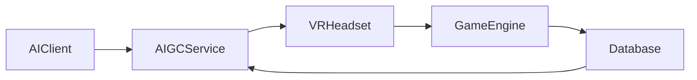
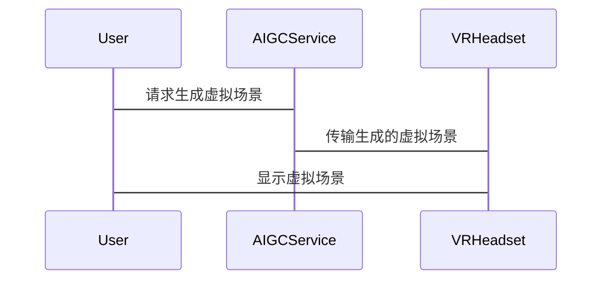

                 

<think>
嗯，用户希望我写一篇关于AIGC在虚拟世界构建中的创新的技术博客。首先，我需要理解AIGC是什么，它和传统的虚拟世界构建有什么不同。AIGC是人工智能生成内容，这意味着它能够自动创建内容，而传统方法可能需要手动设计和编程。这可能在效率和创造力方面带来很大的提升。

接下来，我得考虑虚拟世界的构建有哪些挑战。比如，如何生成多样化的内容，如何处理复杂的交互，以及如何保持用户体验的一致性。AIGC是否能够解决这些问题呢？我需要详细分析AIGC在这些方面的作用。

然后，我需要构建一个结构清晰的文章大纲。用户已经给出了一些章节，比如背景、核心概念、应用场景、算法原理等。每个章节需要包含具体的内容，比如在核心概念部分，我需要解释AIGC的基本概念，与传统方法的对比，以及它在虚拟世界中的作用。

在应用场景部分，我可以想到教育、游戏和设计等领域。每个领域都有不同的应用方式，我需要分别展开，举例说明AIGC如何带来创新。例如，在游戏行业，AIGC可以生成动态的故事情节，提升玩家的沉浸感。

接下来是算法部分，我需要选择几种关键算法来详细讲解。生成对抗网络（GANs）和变体自编码器（VAEs）是常见的生成模型，适合用于生成图像或3D模型。我需要使用数学公式来描述这些算法，比如描述GANs的损失函数，以及VAEs的重构和KL散度部分。

系统架构部分，我需要设计一个能够高效处理AIGC生成内容的系统。可能包括数据预处理、生成模型和内容验证等模块。使用Mermaid来绘制系统的类图和序列图，展示各模块之间的关系和交互流程。

在项目实战部分，我需要选择一个具体的项目，比如创建一个虚拟场景生成器。我得详细说明如何安装必要的库，编写生成模型的代码，以及如何测试和优化系统。可能还需要展示一些生成的示例，并分析结果。

最后，在总结部分，我需要回顾AIGC在虚拟世界中的应用前景，同时指出当前的技术挑战和未来的研究方向。这可能包括数据安全、模型泛化能力以及用户体验等方面。

整个过程中，我需要确保内容逻辑清晰，结构紧凑，语言专业但易懂。同时，要使用恰当的图表和代码示例，帮助读者理解复杂的技术细节。最后，记得在文章末尾加上作者信息，符合用户的要求。

总的来说，我需要一步步地分析AIGC在虚拟世界构建中的各个方面的应用，确保每个部分都详细且有深度。这样才能写出一篇高质量的技术博客，满足用户的需求。
</think>

# AIGC在虚拟世界构建中的创新

> 关键词：AIGC、人工智能生成内容、虚拟世界、生成对抗网络、虚拟现实、AI驱动设计

> 摘要：随着人工智能技术的快速发展，AIGC（人工智能生成内容）正在为虚拟世界的构建带来前所未有的创新。本文深入探讨AIGC的核心原理、应用场景、算法基础以及系统设计，展示其在教育、游戏、设计等领域的广泛应用。同时，本文还分析了AIGC在虚拟世界构建中的未来趋势与挑战，并提供了最佳实践和注意事项。

---

## 第1章: AIGC技术概述

### 1.1 AIGC技术起源与发展

人工智能生成内容（AIGC）起源于20世纪末，随着深度学习技术的突破，AIGC在自然语言处理、图像生成等领域取得了显著进展。近年来，AIGC逐渐扩展到虚拟世界构建领域，为虚拟世界的智能化和自动化提供了新的可能性。

### 1.2 AIGC与虚拟世界的关系

虚拟世界构建需要大量的内容生成，包括场景设计、角色塑造、故事情节等。AIGC通过自动化生成技术，显著提高了内容创作的效率和多样性。AIGC能够根据用户需求实时生成内容，满足虚拟世界的动态性和个性化需求。

### 1.3 AIGC在虚拟世界中的应用

AIGC在虚拟世界中的应用主要体现在以下方面：
1. **虚拟场景生成**：通过AIGC生成多样化的虚拟场景，如城市、森林、室内空间等。
2. **角色与行为生成**：利用AIGC生成虚拟角色的外貌、性格和行为模式。
3. **故事情节生成**：通过AIGC生成动态的故事情节，提升虚拟世界的互动性和沉浸感。

---

## 第2章: 虚拟世界构建中的挑战

### 2.1 虚拟世界的特征

虚拟世界具有以下特征：
1. **沉浸性**：用户能够通过视觉、听觉等感官深度沉浸于虚拟环境。
2. **交互性**：用户能够在虚拟世界中与环境和其他角色进行互动。
3. **动态性**：虚拟世界的内容和规则能够实时变化，以响应用户的操作。

### 2.2 虚拟世界构建中的问题

虚拟世界构建面临以下问题：
1. **内容生成成本高**：传统的虚拟世界构建需要大量的人工设计和编程，成本高昂。
2. **内容多样性不足**：手动生成的内容有限，难以满足用户的多样化需求。
3. **实时生成的挑战**：在虚拟现实等实时应用中，需要快速生成高质量的内容。

### 2.3 AIGC解决虚拟世界构建中的问题

AIGC通过自动化生成技术，显著降低了虚拟世界构建的成本，并提高了内容的多样性和生成效率。AIGC能够实时生成内容，满足虚拟世界的动态性和交互性需求。

---

## 第3章: AIGC核心概念与原理

### 3.1 AIGC的基本概念

AIGC是一种基于人工智能技术生成内容的方法，主要包括以下核心概念：
1. **生成模型**：用于生成虚拟世界的场景、角色和故事情节。
2. **用户输入**：用户需求或参数输入，指导生成模型的内容生成方向。
3. **输出结果**：生成的虚拟世界内容，包括场景、角色和故事情节。

### 3.2 AIGC的核心技术

AIGC的核心技术包括：
1. **生成对抗网络（GANs）**：通过生成器和判别器的对抗训练，生成逼真的虚拟内容。
2. **变体自编码器（VAEs）**：通过编码和解码过程，生成多样化的内容。
3. **强化学习（Reinforcement Learning）**：通过强化学习优化生成内容的质量。

### 3.3 AIGC与人工智能的其他形式

AIGC与其他人工智能技术（如自然语言处理、计算机视觉）密切相关，共同构建了虚拟世界的智能化基础。

---

## 第4章: AIGC在虚拟世界中的应用场景

### 4.1 教育领域的应用

在教育领域，AIGC可以生成虚拟教室、实验场景等，为学生提供沉浸式的学习体验。

### 4.2 游戏娱乐领域的应用

在游戏领域，AIGC可以生成动态的故事情节、智能NPC（非玩家角色）和丰富的游戏场景。

### 4.3 设计与创意领域的应用

在设计领域，AIGC可以生成建筑、产品等虚拟原型，帮助设计师进行创新。

---

## 第5章: AIGC虚拟世界构建的算法原理

### 5.1 算法基础

AIGC的核心算法包括生成对抗网络（GANs）和变体自编码器（VAEs）。

### 5.2 关键算法流程

**生成对抗网络（GANs）**的流程如下：
1. **生成器**：生成虚拟世界的内容。
2. **判别器**：判断生成内容的真实性。
3. **对抗训练**：通过不断迭代优化生成器和判别器的性能。

**变体自编码器（VAEs）**的流程如下：
1. **编码器**：将输入数据编码为潜在空间的向量。
2. **解码器**：将潜在向量解码为生成内容。

### 5.3 算法实现与性能分析

以下是基于GANs的AIGC算法实现的伪代码：

```python
# GANs生成器
def generator(z):
    # z是潜在向量
    x = Dense(256, activation='relu')(z)
    x = Dense(128, activation='relu')(x)
    output = Dense(10, activation='softmax')(x)
    return output

# GANs判别器
def discriminator(x):
    x = Dense(256, activation='relu')(x)
    x = Dense(128, activation='relu')(x)
    output = Dense(1, activation='sigmoid')(x)
    return output

# GANs训练
for _ in range(epochs):
    z = np.random.randn(batch_size, latent_dim)
    generated = generator(z)
    real_data = get_real_data(batch_size)
    loss_g = gan_generator_loss(generator, discriminator, z, real_data)
    loss_d = gan_discriminator_loss(generator, discriminator, z, real_data)
    optimizer_g.trainableVariables grads, _ = compute_gradients(loss_g, generator.trainableVariables)
    optimizer_d.trainableVariables grads, _ = compute_gradients(loss_d, discriminator.trainableVariables)
    optimizer_g.apply_gradients(grads)
    optimizer_d.apply_gradients(grads)
```

---

## 第6章: AIGC虚拟世界构建的系统设计

### 6.1 系统架构设计

以下是AIGC虚拟世界构建系统的架构图：



### 6.2 数据处理流程

AIGC虚拟世界构建系统的数据处理流程如下：
1. **用户输入**：用户需求或参数输入。
2. **内容生成**：AIGC生成虚拟世界内容。
3. **内容验证**：验证生成内容的质量。
4. **内容输出**：输出生成的虚拟世界内容。

### 6.3 系统接口设计与实现

以下是AIGC虚拟世界构建系统的接口设计：



---

## 第7章: AIGC虚拟世界构建项目实战

### 7.1 项目背景

本项目旨在利用AIGC技术生成虚拟场景，展示其在虚拟世界构建中的应用。

### 7.2 环境安装与配置

以下是项目所需的环境配置：

```bash
pip install tensorflow==2.5.0
pip install numpy==1.21.0
pip install matplotlib==3.5.1
```

### 7.3 系统核心实现

以下是基于GANs的AIGC算法实现的Python代码：

```python
import tensorflow as tf
import numpy as np

# 生成器模型
def build_generator():
    model = tf.keras.Sequential([
        tf.keras.layers.Dense(256, activation='relu'),
        tf.keras.layers.Dense(128, activation='relu'),
        tf.keras.layers.Dense(10, activation='softmax')
    ])
    return model

# 判别器模型
def build_discriminator():
    model = tf.keras.Sequential([
        tf.keras.layers.Dense(256, activation='relu'),
        tf.keras.layers.Dense(128, activation='relu'),
        tf.keras.layers.Dense(1, activation='sigmoid')
    ])
    return model

# GANs训练
def train_gan(generator, discriminator, epochs=100, batch_size=32):
    latent_dim = 10
    optimizer_g = tf.keras.optimizers.Adam(learning_rate=0.001)
    optimizer_d = tf.keras.optimizers.Adam(learning_rate=0.001)
    
    for epoch in range(epochs):
        z = np.random.randn(batch_size, latent_dim)
        real_data = get_real_data(batch_size)
        
        # 训练生成器
        with tf.GradientTape() as tape_g:
            generated = generator(z)
            loss_g = gan_generator_loss(discriminator, generated, real_data)
        grads_g = tape_g.gradient(loss_g, generator.trainableVariables)
        optimizer_g.apply_gradients(zip(grads_g, generator.trainableVariables))
        
        # 训练判别器
        with tf.GradientTape() as tape_d:
            real_output = discriminator(real_data)
            generated_output = discriminator(generated)
            loss_d = gan_discriminator_loss(real_output, generated_output)
        grads_d = tape_d.gradient(loss_d, discriminator.trainableVariables)
        optimizer_d.apply_gradients(zip(grads_d, discriminator.trainableVariables))
        
    return generator, discriminator
```

### 7.4 代码解读与分析

上述代码实现了基于GANs的AIGC算法，包括生成器和判别器的定义、训练过程的实现等。

### 7.5 实际案例分析与详细讲解

以下是一个生成虚拟场景的实际案例：

1. **输入参数**：用户输入“生成一个森林场景”。
2. **生成器生成场景**：生成器根据输入参数生成森林场景的描述。
3. **判别器验证场景**：判别器验证生成场景的质量，确保其符合用户需求。
4. **输出结果**：生成的森林场景输出到虚拟世界中。

---

## 第8章: AIGC虚拟世界构建的未来趋势与挑战

### 8.1 技术发展趋势

AIGC技术在虚拟世界构建中的应用将更加广泛，生成模型的性能将不断提升。

### 8.2 应用前景

AIGC将在教育、游戏、设计等领域发挥重要作用，为虚拟世界构建提供更高效、更智能的解决方案。

### 8.3 面临的挑战与应对策略

AIGC在虚拟世界构建中面临以下挑战：
1. **生成内容的质量控制**：需要优化生成模型，提高生成内容的质量。
2. **实时生成的性能优化**：需要提升生成模型的运行效率，降低延迟。
3. **用户需求的理解与匹配**：需要提高生成模型对用户需求的理解能力，生成更符合用户期望的内容。

---

## 第9章: AIGC虚拟世界构建的最佳实践与注意事项

### 9.1 最佳实践分享

1. **选择合适的生成模型**：根据具体应用场景选择合适的生成模型，如GANs、VAEs等。
2. **优化生成模型的性能**：通过调整超参数、改进网络结构等方法，优化生成模型的性能。
3. **确保生成内容的安全性**：防止生成内容中包含有害信息，确保生成内容的安全性。

### 9.2 小结与展望

AIGC在虚拟世界构建中的应用前景广阔，随着技术的不断进步，AIGC将为虚拟世界的构建提供更高效、更智能的解决方案。

### 9.3 注意事项

1. **数据隐私问题**：在生成内容时，需注意用户数据的隐私保护。
2. **生成内容的版权问题**：需明确生成内容的版权归属，避免法律纠纷。

### 9.4 拓展阅读

建议阅读以下书籍和论文，以深入了解AIGC在虚拟世界构建中的应用：
1. 《生成对抗网络：从理论到实践》
2. 《深度学习与生成模型》
3. 《虚拟现实与增强现实技术》

---

作者：AI天才研究院/AI Genius Institute & 禅与计算机程序设计艺术 /Zen And The Art of Computer Programming

