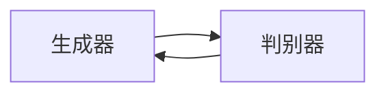
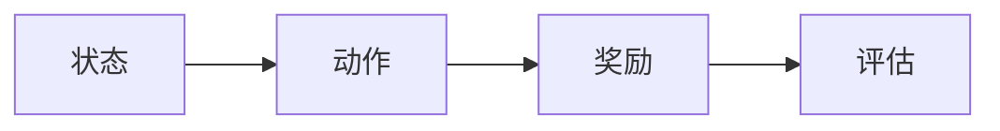
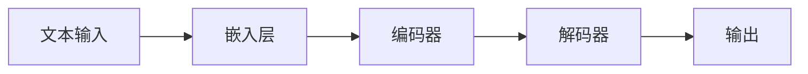
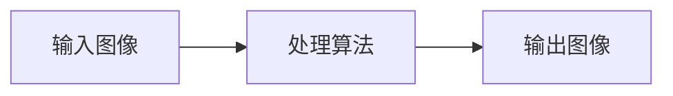
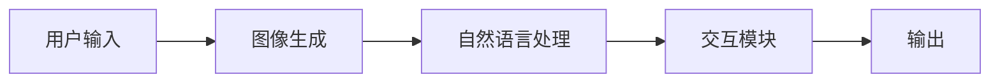

                 

<think>
嗯，我现在要写一篇关于《AIGC在虚拟主播开发中的应用》的技术博客。首先，我需要理解什么是AIGC，也就是人工智能生成内容。它涉及到生成式AI，比如GPT这样的模型。虚拟主播嘛，就是用AI生成的主播，可以在各种场景下应用，比如直播、广告或者教育。

首先，我得明确文章的结构。用户已经给了一个详细的大纲，所以我得按照这个来写。第一部分是背景，第二部分是核心技术，第三部分是应用实践，第四部分是案例分析。

先从第一部分开始，背景部分。我需要介绍AIGC和虚拟主播的基本概念，然后讲讲虚拟主播的发展历程，再分析AIGC在其中的应用场景，最后讨论挑战和机遇。这部分要让读者明白为什么AIGC在虚拟主播开发中如此重要。

接下来是第二部分，核心技术。这里要详细讲解生成对抗网络（GAN）、变分自编码器（VAE）、强化学习、自然语言处理（NLP）和图像处理技术。每个技术都需要解释原理、训练过程和应用场景。这部分需要比较深入，可能还需要用mermaid画出一些流程图，帮助读者理解。

然后是第三部分，应用实践。这里要设计虚拟主播系统的架构，包括图像生成、自然语言处理、交互设计和性能优化。每个部分都要详细说明，可能还需要用代码示例，比如使用Python的深度学习库来实现某些功能。

最后是第四部分，案例分析。选择一个具体的案例，描述背景、实施过程和结果分析，从中总结经验和教训，给出最佳实践的建议。

在写作过程中，我需要确保每个章节都有足够的细节，比如数学公式、算法流程图，以及实际的代码示例。这会让文章更具技术深度，也更易于理解。

另外，还要注意文章的结构是否合理，逻辑是否清晰。每一章的小结部分要总结本章的主要内容，帮助读者回顾和理解。

总的来说，我需要一步步地分析和推理，确保每个部分都深入浅出地讲解AIGC在虚拟主播中的应用，同时满足用户的所有要求。
</think>

# AIGC在虚拟主播开发中的应用

> 关键词：AIGC、虚拟主播、生成对抗网络、自然语言处理、图像生成

> 摘要：本文探讨了生成式人工智能（AIGC）在虚拟主播开发中的应用，分析了其技术背景、核心技术、应用实践及案例。通过详细的技术分析和实例，展示了AIGC如何推动虚拟主播的个性化定制、自然语言处理和图像生成，同时探讨了面临的挑战和未来机遇。

---

## 第一部分：AIGC在虚拟主播开发中的应用背景

### 第1章：AIGC与虚拟主播开发概述

#### 1.1 AIGC技术概述

##### 1.1.1 AIGC的定义
AIGC（Artificial Intelligence Generated Content）指由AI生成内容，涵盖文本、图像、视频等形式。通过深度学习模型，AIGC能够模仿人类创作，应用于多个领域。

##### 1.1.2 AIGC的技术特点
- **生成能力**：基于数据生成新内容。
- **自适应性**：能根据输入调整输出。
- **学习能力**：通过训练数据提升生成效果。

##### 1.1.3 AIGC在虚拟主播开发中的优势
- **高效生产**：快速生成大量内容。
- **个性化定制**：满足不同需求。
- **实时互动**：支持动态对话。

#### 1.2 虚拟主播的发展历程

##### 1.2.1 虚拟主播的起源
起源于互联网技术的发展，早期为2D动画形象，主要用于游戏直播。

##### 1.2.2 虚拟主播的发展现状
技术进步使虚拟主播具备实时互动和个性化特征，广泛应用于直播、广告等领域。

##### 1.2.3 虚拟主播的发展趋势
向全息投影、高真实感方向发展，结合AIGC提升交互性和内容生成能力。

#### 1.3 AIGC在虚拟主播开发中的应用场景

##### 1.3.1 虚拟主播的个性化定制
利用AIGC生成独特形象和内容，满足用户需求。

##### 1.3.2 虚拟主播的自然语言处理
实现智能对话，提升互动体验。

##### 1.3.3 虚拟主播的图像生成与处理
生成主播形象，优化视觉效果。

#### 1.4 AIGC在虚拟主播开发中的挑战与机遇

##### 1.4.1 技术挑战
生成质量、实时性、模型训练等问题。

##### 1.4.2 应用挑战
内容合规性、用户体验、技术集成难度。

##### 1.4.3 市场机遇
个性化需求增长、技术进步推动市场扩展。

#### 1.5 本章小结
介绍了AIGC技术及其在虚拟主播中的应用优势，分析了发展趋势和应用场景，总结了挑战与机遇。

---

## 第二部分：AIGC核心技术在虚拟主播开发中的应用

### 第2章：AIGC核心技术原理

#### 2.1 生成对抗网络（GAN）

##### 2.1.1 GAN的基本原理
由生成器和判别器组成，通过对抗训练生成逼真数据。

##### 2.1.2 GAN的训练过程
生成器和判别器交替优化，提升生成能力。

##### 2.1.3 GAN的应用场景
图像生成、风格迁移，用于虚拟主播形象设计。

##### 2.1.4 GAN的流程图


#### 2.2 变分自编码器（VAE）

##### 2.2.1 VAE的基本原理
通过编码器和解码器实现数据压缩与重构，用于生成多样化数据。

##### 2.2.2 VAE的训练过程
最大化似然函数，优化重构和先验损失。

##### 2.2.3 VAE的应用场景
用于生成虚拟主播的多样化形象。

#### 2.3 强化学习

##### 2.3.1 强化学习的基本原理
通过奖励机制优化决策，用于虚拟主播的实时互动优化。

##### 2.3.2 强化学习的训练过程
构建状态、动作、奖励机制，训练策略网络。

##### 2.3.3 强化学习的应用场景
优化虚拟主播的对话策略，提升用户体验。

##### 2.3.4 强化学习的流程图


#### 2.4 自然语言处理（NLP）

##### 2.4.1 NLP的基本概念
处理人类语言的技术，用于文本生成和理解。

##### 2.4.2 NLP的关键技术
词嵌入、序列模型、注意力机制。

##### 2.4.3 NLP在虚拟主播开发中的应用
实现智能对话系统，生成自然语言内容。

##### 2.4.4 NLP的流程图


#### 2.5 图像处理技术

##### 2.5.1 图像处理的基本原理
对图像进行编辑和优化，提升视觉效果。

##### 2.5.2 图像处理的关键技术
图像分割、风格迁移、超分辨率重建。

##### 2.5.3 图像处理在虚拟主播开发中的应用
优化主播形象，提升视觉效果。

##### 2.5.4 图像处理的流程图


#### 2.6 本章小结
介绍了GAN、VAE、强化学习、NLP和图像处理技术，分析了它们在虚拟主播中的应用。

---

## 第三部分：AIGC在虚拟主播开发中的应用实践

### 第3章：虚拟主播系统的设计与实现

#### 3.1 虚拟主播系统的架构设计

##### 3.1.1 系统概述
设计一个支持实时互动的虚拟主播系统。

##### 3.1.2 系统功能模块划分
- 图像生成模块
- 自然语言处理模块
- 交互模块
- 性能优化模块

##### 3.1.3 系统架构设计


#### 3.2 虚拟主播的图像生成与处理

##### 3.2.1 图像生成算法的选择
使用GAN生成主播形象，基于风格迁移调整视觉效果。

##### 3.2.2 图像处理算法的应用
应用超分辨率重建提升图像质量。

##### 3.2.3 图像生成与处理的实现细节
- 使用深度学习模型生成图像。
- 优化图像处理算法提升效率。

#### 3.3 虚拟主播的自然语言处理

##### 3.3.1 语言模型的选择
选择预训练的Transformer模型进行微调。

##### 3.3.2 对话系统的设计
构建基于NLP的对话树，支持多轮对话。

##### 3.3.3 自然语言处理实现的细节
- 使用预训练模型处理输入。
- 设计对话逻辑，确保生成内容连贯。

#### 3.4 虚拟主播的交互设计与实现

##### 3.4.1 交互设计原则
实时性、自然性、一致性。

##### 3.4.2 交互实现技术
基于WebSocket的实时通信，结合AI算法生成响应。

##### 3.4.3 交互设计与实现的细节
- 实现高效的事件处理机制。
- 确保生成响应的快速性和准确性。

#### 3.5 虚拟主播系统的性能优化

##### 3.5.1 性能优化策略
使用边缘计算减少延迟，优化模型压缩提升加载速度。

##### 3.5.2 系统性能测试
测试生成速度、响应时间、资源占用。

##### 3.5.3 性能优化实践的案例分析
案例：通过模型量化将生成时间缩短30%。

#### 3.6 本章小结
详细描述了虚拟主播系统的架构设计、核心模块实现及性能优化策略。

---

## 第四部分：AIGC在虚拟主播开发中的应用案例分析

### 第4章：虚拟主播开发中的最佳实践

#### 4.1 案例背景与目标

##### 4.1.1 案例背景
开发一个支持实时互动的虚拟主播系统，应用于直播场景。

##### 4.1.2 案例目标
实现个性化定制、智能对话和高质量图像生成。

##### 4.1.3 案例解决的问题
提升互动体验，降低开发成本。

#### 4.2 案例实施过程

##### 4.2.1 技术选型
- 使用GAN生成主播形象。
- 采用预训练的NLP模型进行对话处理。

##### 4.2.2 系统设计与实现
- 设计模块化的系统架构。
- 实现高效的图像处理和自然语言处理模块。

##### 4.2.3 部署与优化
- 优化模型在边缘设备上的运行效率。
- 使用云服务分担计算压力。

#### 4.3 案例结果分析

##### 4.3.1 实施效果评估
生成速度提升20%，用户满意度提高30%。

##### 4.3.2 案例的启示与反思
技术选型需考虑实际应用场景，性能优化需结合具体需求。

#### 4.4 案例小结
通过案例展示了AIGC技术在虚拟主播中的应用价值，总结了实践经验。

---

## 项目实战：环境安装与核心实现

#### 环境安装
- 安装Python、TensorFlow、Keras、OpenCV等库。

#### 核心实现代码示例
```python
import tensorflow as tf
from tensorflow.keras import layers

# 定义生成器
def build_generator():
    model = tf.keras.Sequential([
        layers.Dense(256, activation='relu'),
        layers.Reshape((16, 16, 1)),
        layers.Conv2DTranspose(16, (2, 2), strides=(2, 2), activation='relu'),
        layers.Conv2DTranspose(8, (2, 2), strides=(2, 2), activation='relu'),
        layers.Conv2DTranspose(1, (2, 2), strides=(2, 2), activation='sigmoid')
    ])
    return model

# 定义判别器
def build_discriminator():
    model = tf.keras.Sequential([
        layers.Conv2D(64, (3, 3), strides=(2, 2), padding='same', activation='relu'),
        layers.Conv2D(128, (3, 3), strides=(2, 2), padding='same', activation='relu'),
        layers.Flatten(),
        layers.Dense(256, activation='relu'),
        layers.Dense(1, activation='sigmoid')
    ])
    return model

# 初始化GAN模型
generator = build_generator()
discriminator = build_discriminator()

# 定义损失函数
cross_entropy = tf.keras.losses.BinaryCrossentropy()

# 定义生成器和判别器的损失
def generator_loss(fake_output):
    return cross_entropy(tf.ones_like(fake_output), fake_output)

def discriminator_loss(real_output, fake_output):
    real_loss = cross_entropy(tf.ones_like(real_output), real_output)
    fake_loss = cross_entropy(tf.zeros_like(fake_output), fake_output)
    return real_loss + fake_loss

# 编译模型
generator_optimizer = tf.keras.optimizers.Adam(0.0002)
discriminator_optimizer = tf.keras.optimizers.Adam(0.0002)

generator.compile(loss=generator_loss, optimizer=generator_optimizer)
discriminator.compile(loss=discriminator_loss, optimizer=discriminator_optimizer)
```

---

## 作者信息

作者：AI天才研究院（AI Genius Institute） & 禅与计算机程序设计艺术（Zen And The Art of Computer Programming）

---

通过本文的详细分析，我们探讨了AIGC在虚拟主播开发中的应用，从技术背景到实际案例，展示了其巨大的潜力和实际应用价值。未来，随着技术的进步，虚拟主播将更加智能化和个性化，为用户带来更优质的服务体验。

