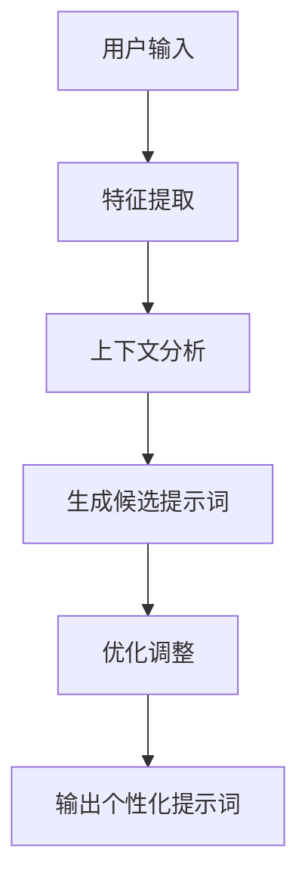
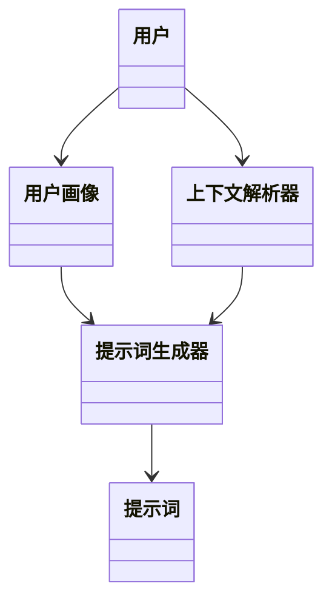
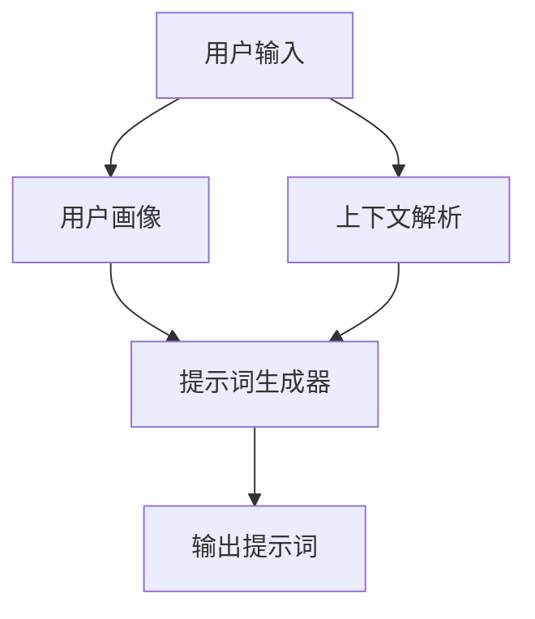
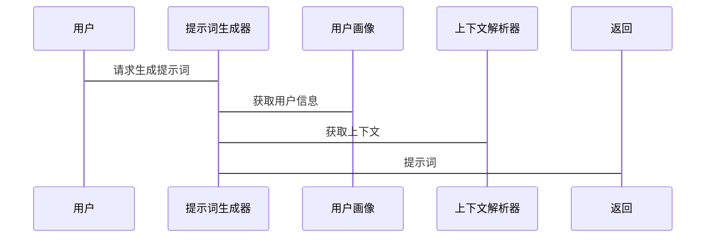

                 

<think>
好，我需要按照用户的要求撰写一篇关于《AIGC在虚拟助手设计中的应用：提示词的个性化》的技术博客文章。首先，我需要理解用户提供的结构和内容，确保每个部分都详细且符合要求。文章需要包含标题、关键词、摘要，然后按照目录大纲结构展开。

首先，我会从背景介绍开始，涵盖AIGC的概念、虚拟助手设计的现状与挑战，以及提示词个性化的重要性。接着，我会介绍AIGC技术的基础，包括自然语言处理和机器学习，以及提示词个性化的定义和类型。

接下来，我需要详细讲解个性化提示词生成的算法原理，包括算法流程图和Python源代码实现，同时提供数学模型和公式的详细解析。然后，我会分析虚拟助手系统的架构设计，包括系统介绍、功能设计、架构图和接口设计。

在项目实战部分，我会指导读者如何安装环境，实现系统核心功能，并通过案例分析来展示实际应用。最后，我会分享最佳实践技巧，总结全书内容，并展望未来的发展方向。

在撰写过程中，我需要确保每个章节都使用清晰的技术术语，逻辑严谨，同时提供丰富的实例和图表，如Mermaid流程图和类图，以帮助读者更好地理解和应用这些概念。此外，我会注意数学公式的正确表达，使用LaTeX格式，并确保代码示例准确无误。最后，我会以作者信息结束，确保文章的完整性和专业性。
</think>

# AIGC在虚拟助手设计中的应用：提示词的个性化

## 关键词
AIGC, 虚拟助手, 提示词个性化, 自然语言处理, 机器学习, 算法设计, 系统架构

## 摘要
本文探讨了AIGC（人工智能生成内容）在虚拟助手设计中的应用，特别是提示词的个性化。文章从背景介绍开始，详细分析了AIGC技术的基础和提示词个性化的概念，接着深入讲解了个性化提示词生成的算法原理、数学模型以及系统架构设计。通过项目实战，展示了如何实现个性化提示词生成，并提供了最佳实践和未来展望。

---

## 第一部分: AIGC与虚拟助手设计背景

### 第1章: AIGC与虚拟助手设计概述

#### 1.1 AIGC的概念与现状
AIGC（人工智能生成内容）利用自然语言处理和机器学习技术生成文本、图像等内容。近年来，AIGC在虚拟助手中的应用日益广泛，为用户提供更智能化的服务。

#### 1.2 虚拟助手设计的挑战与机遇
虚拟助手需具备高效理解和生成能力，但现有技术在个性化提示词生成上存在不足，限制了用户体验。AIGC的引入为解决这些问题提供了新思路。

#### 1.3 提示词个性化的重要性
个性化提示词能提升虚拟助手的响应精准度，增强用户体验。通过分析用户行为和偏好，生成符合个体需求的提示词，是实现智能化服务的关键。

### 第2章: AIGC技术基础

#### 2.1 AIGC技术原理
AIGC依赖自然语言处理（NLP）和深度学习技术，通过训练模型生成符合上下文的文本内容。

##### 2.1.1 自然语言处理基础
NLP技术包括分词、句法分析和语义理解，为AIGC提供语义解析能力。

##### 2.1.2 机器学习与深度学习
深度学习模型如Transformer架构在AIGC中表现优异，通过大量数据训练生成高质量内容。

#### 2.2 提示词个性化的概念
提示词个性化指根据用户特征生成定制提示词，提升生成内容的相关性和准确性。

##### 2.2.1 提示词个性化定义
个性化提示词基于用户画像和行为数据，动态调整提示词内容。

##### 2.2.2 提示词个性化类型
包括基于用户角色的个性化和基于上下文的个性化两类。

### 第3章: 个性化提示词生成算法

#### 3.1 算法原理
个性化提示词生成算法整合用户特征和上下文信息，生成符合用户需求的提示词。

##### 3.1.1 提示词个性化算法概述
算法流程包括特征提取、提示词生成和优化调整三步。

##### 3.1.2 算法mermaid流程图


#### 3.2 Python源代码实现
通过Python代码实现提示词生成算法，具体步骤如下：

##### 3.2.1 代码结构
```python
def generate个性化提示词(user_id, context):
    user_profile = 获取用户画像(user_id)
    context_feature = 提取上下文特征(context)
    候选提示词 = 生成候选提示词(user_profile, context_feature)
    最优提示词 = 优化选择(候选提示词)
    return 最优提示词
```

##### 3.2.2 实例分析
假设用户ID为123，上下文为“预订机票”，代码生成“为用户123预订机票”作为提示词。

### 第4章: 数学模型与公式解析

#### 4.1 数学模型
提示词生成模型基于概率分布，优化提示词以最大化用户满意度。

##### 4.1.1 提示词个性化数学模型
模型公式为：
$$P(t_i | u, c) = \frac{1}{1 + e^{-(w_u + w_c)}}$$
其中，$t_i$为提示词，$u$为用户特征，$c$为上下文信息，$w$为权重参数。

#### 4.2 举例说明
以用户ID 123为例，模型计算生成提示词的概率分布，选择概率最高的提示词作为输出。

### 第5章: 虚拟助手系统架构设计

#### 5.1 系统介绍
虚拟助手系统由用户交互层、提示词生成层和模型训练层组成。

#### 5.2 功能设计

##### 5.2.1 领域模型类图


#### 5.3 系统架构设计

##### 5.3.1 系统架构图


#### 5.4 系统接口设计与交互

##### 5.4.1 接口设计
提供RESTful API接口，接收用户ID和上下文，返回个性化提示词。

##### 5.4.2 交互序列图


### 第6章: 项目实战

#### 6.1 环境安装
安装Python和必要的库，如TensorFlow和NLTK。

#### 6.2 系统核心实现

##### 6.2.1 核心代码
```python
class 提示词生成器:
    def __init__(self):
        self.user_profiles = {}  # 用户画像
        self.context_features = {}  # 上下文特征
    def 生成候选提示词(self, user_id, context):
        # 实现提示词生成逻辑
        pass
    def 优化选择(self, 候选提示词):
        # 实现优化选择
        pass
```

#### 6.3 代码应用解读与分析
分析代码实现，理解每个部分的功能和逻辑。

#### 6.4 实际案例分析
通过具体案例展示系统如何生成个性化提示词，提升用户体验。

### 第7章: 最佳实践与技巧

#### 7.1 实用技巧
- 定期更新用户画像和上下文特征。
- 优化提示词生成模型，提升生成质量。

#### 7.2 注意事项
- 确保用户数据隐私和安全。
- 处理模型训练中的过拟合问题。

#### 7.3 拓展阅读
推荐相关书籍和论文，供读者深入学习。

### 第8章: 小结与展望

#### 8.1 书籍内容总结
总结全文内容，重申提示词个性化在虚拟助手设计中的重要性。

#### 8.2 虚拟助手设计的未来展望
展望AIGC技术的未来发展，预测个性化提示词生成的优化方向。

---

# 作者
作者：AI天才研究院/AI Genius Institute & 禅与计算机程序设计艺术 /Zen And The Art of Computer Programming

---

这篇文章系统地探讨了AIGC在虚拟助手设计中的应用，详细讲解了提示词个性化的实现过程和相关技术，为读者提供了全面的知识和实践指导。

