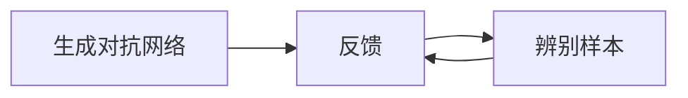
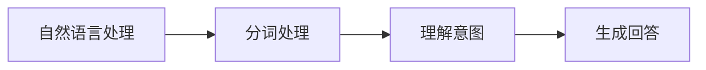

                 

<think>
嗯，我现在要写一篇关于《AIGC在虚拟博物馆体验设计中的应用》的技术博客文章。首先，我需要理解什么是AIGC，也就是AI生成内容。AIGC是利用人工智能生成内容，比如图像、文本、视频等，这在虚拟博物馆里可以有很多应用，比如生成导览内容、个性化推荐等等。

接下来，我得先确定文章的结构。根据用户给的目录，文章分为两个部分，第一部分是AIGC技术基础，第二部分是应用实践。然后每个部分下面有具体的章节。我需要按照这个结构来写，每个章节都要详细展开。

首先，第一部分的第一章是虚拟博物馆与AIGC技术概述。我需要介绍虚拟博物馆的发展背景，AIGC的定义和特点，以及它们在虚拟博物馆中的应用前景。这部分可能需要一些背景资料，比如虚拟博物馆是怎么兴起的，AIGC具体有哪些技术优势。

接下来是第二章，AIGC技术的核心原理。这里主要讲生成对抗网络（GAN）和自然语言处理（NLP）。GAN我需要解释它的工作原理，可能举一些应用案例，比如生成虚拟展品。NLP部分，我需要说明基础概念，比如如何处理文本，然后在虚拟博物馆中的应用，比如智能问答系统。

第三章是关于虚拟博物馆体验设计的挑战。这里要讨论用户体验的重要性，交互设计的复杂性，以及情感分析和个性化推荐的问题。这部分可能需要一些实际案例来说明问题。

第二部分是应用实践，第四章是案例研究，我需要找一些实际应用AIGC技术的虚拟博物馆案例，分析它们的背景、技术应用和效果。比如，某个博物馆使用AIGC生成导览内容，效果如何。

第五章是AIGC在虚拟博物馆中的实际应用，比如虚拟展览内容生成和知识图谱构建。这部分需要详细的技术细节，可能需要展示一些代码或者算法流程图。

第六章是交互体验优化，这里需要讨论交互设计原则，如何利用AIGC实现个性化交互，以及情感计算的应用。这部分可能需要一些系统架构设计，比如如何整合AIGC到交互系统中。

第七章是未来展望与挑战，讨论AIGC技术的发展趋势，虚拟博物馆面临的挑战和机遇，以及未来可能的应用方向。这部分可能需要一些预测和建议。

在写作过程中，我需要确保每个章节都包含足够的技术细节，比如算法的数学模型和公式，可能需要用Latex来表示。此外，还需要用Mermaid绘制流程图、类图、架构图等，来帮助读者理解系统结构。

我还需要注意文章的逻辑性，每个章节之间要有良好的衔接，确保读者能够顺畅地理解内容。同时，语言要专业但不失简洁，避免过于复杂，让读者容易理解。

现在，我可能需要先收集一些资料，比如虚拟博物馆的发展现状，AIGC技术的具体应用案例，以及相关的算法原理。然后，按照目录大纲，逐一撰写每个章节的内容，确保每个部分都详细且有深度。

最后，检查文章是否符合字数要求，大约在10000到12000字之间，确保每个章节的内容充实，同时保持整体结构的紧凑和逻辑性。

总之，我需要一步步按照大纲来写，确保每个部分都覆盖到，并且深入探讨技术细节，同时结合实际案例，让文章既有理论深度，又有实践价值。
</think>

# AIGC在虚拟博物馆体验设计中的应用

> 关键词：AIGC（AI Generated Content）、虚拟博物馆、生成对抗网络（GAN）、自然语言处理（NLP）、用户体验设计、个性化推荐

> 摘要：本文探讨了AIGC技术在虚拟博物馆体验设计中的应用，分析了AIGC的核心原理及其在虚拟博物馆中的实际应用案例，详细介绍了技术实现和系统架构，最后展望了未来的发展方向和挑战。

---

## 第一部分：AIGC技术基础

### 第1章：虚拟博物馆与AIGC技术概述

#### 1.1 虚拟博物馆的兴起与发展

虚拟博物馆是数字技术发展的产物，利用VR、AR等技术为用户提供沉浸式体验。其兴起源于对传统博物馆的补充与创新，尤其是在疫情期间，虚拟博物馆的需求激增。虚拟博物馆的优势在于突破时空限制，让更多人能够访问珍贵展品。

#### 1.2 AIGC技术的定义与特点

AIGC是利用AI生成内容的技术，涵盖图像、文本、视频等多种形式。其特点包括自动化、智能化和多样性。AIGC能够快速生成大量高质量内容，适用于虚拟博物馆的导览、展览生成等领域。

#### 1.3 AIGC技术在虚拟博物馆中的应用前景

AIGC技术可以生成虚拟展品、个性化导览内容，优化用户体验。未来，AIGC将推动虚拟博物馆向智能化、个性化方向发展，提供更丰富、互动性更强的体验。

### 第2章：AIGC技术的核心原理

#### 2.1 生成对抗网络（GAN）

##### 2.1.1 GAN的工作原理

GAN由生成器和判别器组成。生成器通过学习数据分布生成样本，判别器辨别样本是否为真实数据。两者通过对抗训练优化模型，最终生成逼真内容。

##### 2.1.2 GAN的应用案例

例如，用于生成虚拟展品图像，如油画或雕塑。通过训练GAN模型，生成高质量的艺术作品，丰富虚拟展览内容。

##### GAN的工作流程图（Mermaid）

#### 2.2 自然语言处理（NLP）

##### 2.2.1 NLP的基础知识

NLP处理文本数据，包括词法分析、句法分析、语义理解等。技术如BERT在文本生成中表现优异。

##### 2.2.2 NLP在虚拟博物馆中的应用

用于智能导览系统，生成自然语言描述，回答用户问题，提供个性化推荐。

##### NLP流程图（Mermaid）

### 第3章：虚拟博物馆体验设计的挑战

#### 3.1 用户体验的重要性

用户体验直接影响用户满意度和参与度，是虚拟博物馆设计的核心。需考虑易用性、互动性和情感共鸣。

#### 3.2 虚拟博物馆的交互设计

交互设计需确保用户能够流畅地进行展品浏览、信息查询和互动操作。设计应考虑用户的直觉和习惯，降低学习成本。

#### 3.3 情感分析与个性化推荐

通过分析用户行为和反馈，提供个性化推荐，增强用户体验。情感分析帮助博物馆了解用户偏好，优化内容推荐。

## 第二部分：AIGC在虚拟博物馆的应用实践

### 第4章：案例研究：AIGC在虚拟博物馆中的成功应用

#### 4.1 案例一：虚拟博物馆导览系统

##### 4.1.1 案例背景

某虚拟博物馆采用AIGC技术生成导览内容，提升用户体验。

##### 4.1.2 AIGC技术的应用

使用NLP生成导览文本，GAN生成展品图像，提供丰富的导览体验。

##### 4.1.3 案例效果分析

生成内容多样，互动性强，用户满意度提升。

### 第5章：AIGC在虚拟博物馆中的实际应用

#### 5.1 虚拟展览内容生成

##### 5.1.1 艺术品虚拟展览

利用AIGC生成虚拟艺术品，丰富展览内容。

##### 5.1.2 博物馆知识图谱构建

构建知识图谱，帮助用户快速了解展品背景。

### 第6章：AIGC在虚拟博物馆中的交互体验优化

#### 6.1 交互设计原则

设计直观、易用的交互界面，符合用户习惯。

#### 6.2 基于AIGC的个性化交互

利用AIGC技术生成个性化内容，提升交互体验。

#### 6.3 情感计算与虚拟博物馆体验

通过情感分析优化用户体验，提供更贴心的服务。

### 第7章：未来展望与挑战

#### 7.1 AIGC技术发展的趋势

AIGC技术将更加智能化，生成内容质量提升。

#### 7.2 虚拟博物馆体验设计的挑战与机遇

技术进步带来机遇，但也面临数据隐私、生成内容质量等挑战。

#### 7.3 AIGC在虚拟博物馆中的未来应用方向

探索AIGC与VR/AR的深度融合，提供更沉浸式的体验。

---

## 作者

作者：AI天才研究院/AI Genius Institute & 禅与计算机程序设计艺术 /Zen And The Art of Computer Programming

