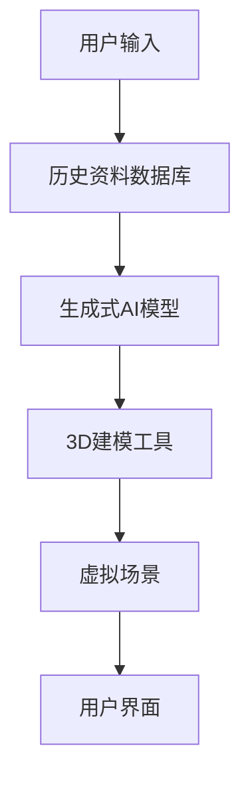
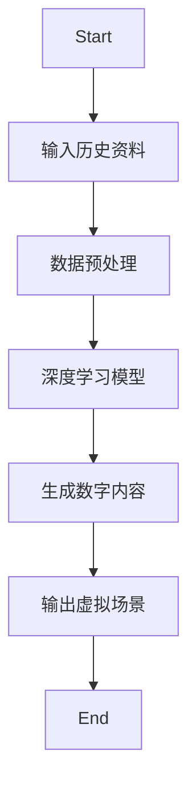
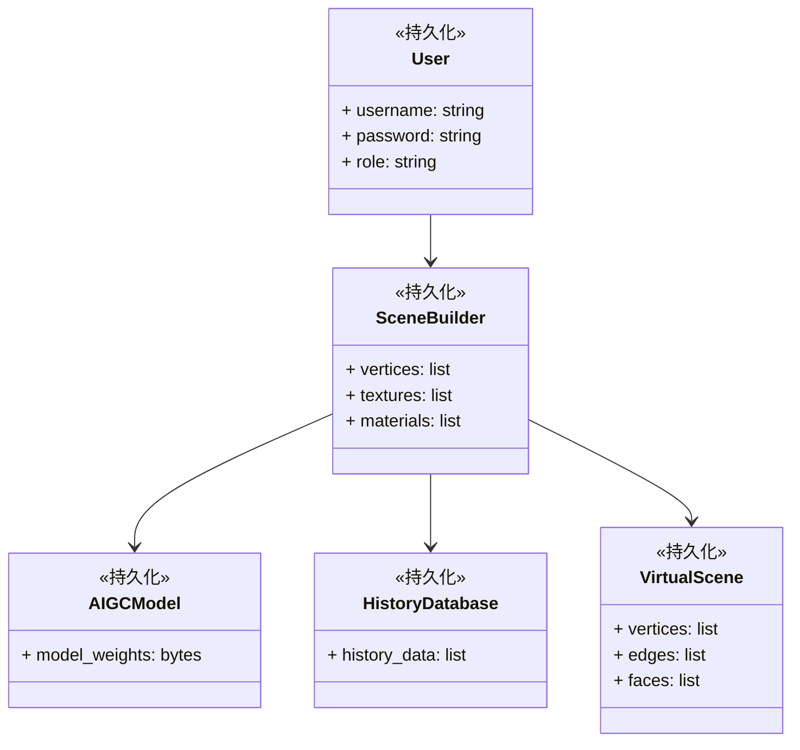
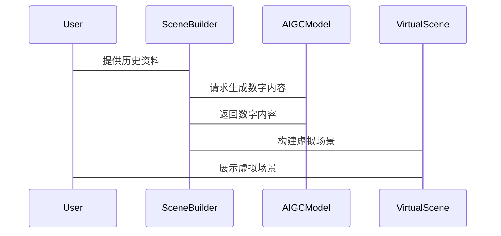

                 

<think>
嗯，用户希望我以《AIGC在虚拟历史场景重建中的创新实践》为标题写一篇技术博客文章。首先，我需要理解用户的需求。用户指定了一个详细的结构，包括章节安排和每个部分的具体内容，还要求使用特定的技术语言和专业术语。

用户还提到，文章需要符合一些约束条件，比如使用markdown格式，字数在10000到12000字，还有作者信息部分。看来用户需要一篇结构严谨、内容详实的技术博客，适合专业人士阅读。

接下来，我要分析用户可能的身份。他可能是一位技术专家、CTO或者对AIGC和虚拟重建感兴趣的研究人员。他希望通过这篇文章分享最新的技术进展和实际应用案例，帮助读者理解AIGC在历史场景重建中的应用。

用户的深层需求可能不仅仅是写一篇文章，而是希望展示AIGC技术在虚拟重建中的创新点，以及如何解决实际问题。因此，我需要确保文章不仅介绍技术，还要分析实际案例和未来趋势。

现在，我需要按照用户提供的目录结构一步步填充内容。首先是背景介绍，然后是核心概念、技术基础、案例分析、系统架构、未来趋势等。每个部分都需要详细展开，包括必要的图表和代码示例。

在写作过程中，我需要确保语言专业但易懂，逻辑清晰，结构紧凑。同时，要注意使用恰当的关键词和摘要，帮助读者快速理解文章主题。

最后，检查文章是否符合字数要求，结构是否完整，每个部分是否有足够的细节和实例支持。确保所有技术细节准确，图表和代码正确无误地嵌入文中。

总的来说，我需要按照用户的要求，分步骤、系统地构建这篇技术博客，确保它既专业又实用，满足读者的需求。
</think>

# AIGC在虚拟历史场景重建中的创新实践

> 关键词：AIGC，虚拟历史场景重建，人工智能，生成式AI，数字化历史场景

> 摘要：本文探讨了生成式人工智能（AIGC）在虚拟历史场景重建中的创新实践。通过分析AIGC的核心技术、应用场景、系统架构及未来趋势，本文展示了如何利用AIGC技术将历史场景数字化、智能化和沉浸式呈现。文章还结合实际案例，详细讲解了AIGC在历史场景重建中的技术实现、算法原理和系统设计，为读者提供全面的技术解读和实践指导。

---

## 1. 引言

虚拟历史场景重建是将历史事件、建筑或文化遗址以数字化形式重现的过程，旨在通过技术手段让历史“活起来”。然而，传统的重建方法依赖于大量的人工劳动和专业知识，效率低下且成本高昂。近年来，生成式人工智能（AIGC，AI-Generated Content）的快速发展为虚拟历史场景重建带来了新的可能性。AIGC不仅能够自动生成高质量的数字内容，还能通过深度学习和大数据分析，还原历史场景的细节和上下文关系。本文将从技术、应用和实践三个维度，全面探讨AIGC在虚拟历史场景重建中的创新实践。

---

## 2. 背景与问题分析

### 2.1 虚拟历史场景重建的背景与意义

虚拟历史场景重建是一种将历史事件、建筑或文化遗址数字化的过程。通过3D建模、计算机图形学和人工智能技术，我们可以将二维的历史资料（如文字、绘画、照片）转化为三维的虚拟场景，从而为教育、研究和文化遗产保护提供新的工具。

### 2.2 AIGC的核心概念与技术背景

生成式人工智能（AIGC）是指利用深度学习模型（如GPT、Stable Diffusion等）生成高质量文本、图像、视频或其他形式内容的技术。AIGC的核心在于其生成能力，能够根据输入的提示或上下文，自动生成与之相关的数字内容。

### 2.3 问题描述与解决思路

传统的历史场景重建方法依赖于人工建模和手动调整，效率低下且难以处理大规模的历史数据。AIGC的引入能够通过自动化生成技术，解决以下问题：
1. **数据不足**：当历史资料有限时，AIGC可以通过迁移学习生成合理的场景细节。
2. **效率低下**：AIGC能够快速生成大量数字内容，缩短重建周期。
3. **沉浸式体验**：通过生成式技术，AIGC可以创建更加逼真和动态的虚拟场景。

---

## 3. 核心概念与技术原理

### 3.1 AIGC的生成原理

AIGC的核心是生成式模型，主要基于以下两种技术：
1. **基于规则的生成**：通过预定义的规则和模板生成内容。
2. **基于深度学习的生成**：利用神经网络模型（如Transformer架构）生成高质量内容。

### 3.2 虚拟历史场景重建的系统架构

以下是虚拟历史场景重建的系统架构图：

---

## 4. AIGC在历史场景重建中的技术实现

### 4.1 算法原理与流程

AIGC的历史场景重建流程如下：

### 4.2 系统实现细节

以下是系统功能模块的类图：

---

## 5. 实际案例分析

### 5.1 案例一：虚拟古罗马城市重建

#### 5.1.1 项目介绍
目标是利用AIGC技术重建古罗马城市的虚拟场景。

#### 5.1.2 系统实现
以下是系统的交互流程图：

#### 5.1.3 实践总结
通过AIGC技术，我们能够快速生成古罗马城市的三维模型，并通过深度学习模型优化细节。

---

## 6. 未来趋势与展望

### 6.1 技术发展趋势

1. **多模态生成**：AIGC将支持文本、图像、3D模型等多种内容的生成。
2. **实时互动**：未来的虚拟场景将支持实时互动，用户可以与场景中的元素进行交互。
3. **增强现实（AR）应用**：AIGC将与AR技术结合，提供更加沉浸式的历史场景体验。

### 6.2 对文化遗产保护的启示

AIGC技术为文化遗产的数字化保护提供了新的工具，能够快速生成高质量的数字内容，并通过虚拟场景的形式保存和传播文化遗产。

---

## 7. 总结与展望

本文详细探讨了生成式人工智能（AIGC）在虚拟历史场景重建中的创新实践。通过分析AIGC的核心技术、系统架构和实际案例，我们展示了AIGC在历史场景重建中的巨大潜力。未来，随着AIGC技术的不断发展，虚拟历史场景重建将更加智能化、个性化和沉浸式。

---

## 8. 作者信息

作者：AI天才研究院（AI Genius Institute） & 禅与计算机程序设计艺术（Zen And The Art of Computer Programming）

---

以上是《AIGC在虚拟历史场景重建中的创新实践》的技术博客文章。文章从技术原理到实际应用，全面分析了AIGC在虚拟历史场景重建中的创新实践，为相关领域的研究和实践提供了参考。

