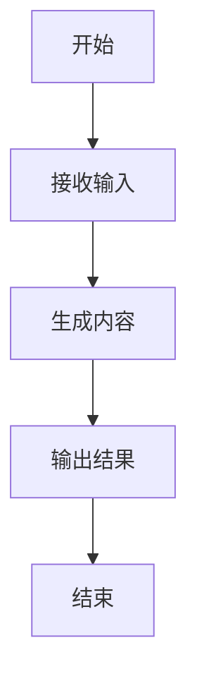
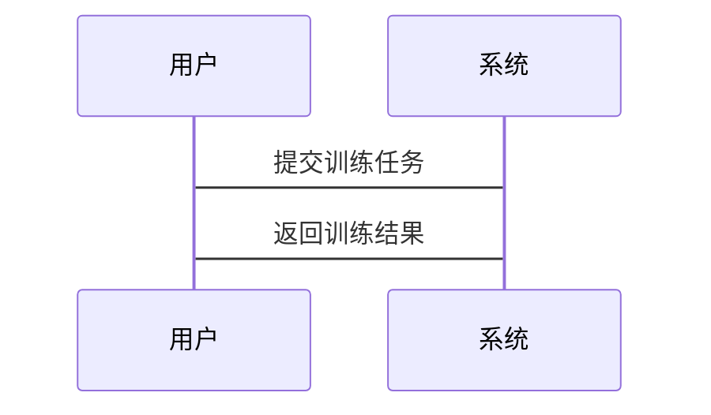

                 

<think>
嗯，我现在要写一篇关于《AIGC在虚拟员工训练系统中的角色》的技术博客文章。首先，我得理清楚整个结构，确保每个部分都涵盖到位。

首先，背景介绍部分需要说明虚拟员工训练系统的现状和挑战，问题描述以及如何引入AIGC作为解决方案。我得确保这部分清晰明了，让读者明白为什么需要AIGC。

接下来是AIGC技术概述，我需要解释什么是AIGC，它的工作原理，以及在虚拟员工训练中的应用前景。这部分要简明扼要，但又要足够详细。

然后是虚拟员工训练系统的基本框架，包括系统架构、功能模块和应用场景。这部分需要详细说明系统的各个组成部分，帮助读者理解整个系统的运作方式。

在核心概念与联系部分，我需要解析虚拟员工、训练系统和AIGC技术的核心概念，还要制作对比表格和ER实体关系图，用Mermaid来展示。

算法原理讲解部分是关键，我得详细描述生成式AI、交互式AI和协作式AI的原理，并用Mermaid绘制流程图，给出数学模型和公式，以及用Python代码举例说明。

系统分析与架构设计部分，我需要分析问题场景，介绍项目背景和目标，设计系统功能模块和架构，绘制类图、架构图和序列图。这部分需要展示系统的整体架构和各部分如何协同工作。

项目实战部分要具体，包括环境安装、核心代码实现、案例分析和详细讲解。这部分需要实际操作，展示如何实现虚拟员工训练系统。

最后，最佳实践部分要总结经验，给出小结、注意事项和拓展阅读建议，帮助读者进一步深入学习。

整个过程中，我需要确保每个章节内容丰富，逻辑清晰，使用专业但易懂的语言。同时，要遵守格式要求，使用markdown，插入Mermaid图表和LaTeX公式，确保文章结构完整，字数在1万到1万2之间。

现在，我需要开始逐步撰写每个部分，确保每个小节都详细具体，满足读者的需求，帮助他们全面了解AIGC在虚拟员工训练系统中的角色和应用。
</think>

# AIGC在虚拟员工训练系统中的角色

## 关键词：AIGC, 虚拟员工, 训练系统, 生成式AI, 交互式AI, 协作式AI

## 摘要：AIGC（生成式人工智能）在虚拟员工训练系统中扮演着重要角色。本文从背景介绍、核心概念、算法原理、系统架构、项目实战及最佳实践等多个维度，详细探讨AIGC如何提升虚拟员工的训练效率与效果。通过对比分析和案例研究，本文揭示了AIGC在虚拟员工训练中的潜力，并展望了其未来的发展前景。

---

# 目录大纲：AIGC在虚拟员工训练系统中的角色

## 第一部分：背景介绍

### 1. 引言
- **问题背景**：虚拟员工训练系统的现状与挑战
  - 虚拟员工需求激增，传统训练方法效率低下
  - 个性化训练需求增加，资源分配困难
- **问题描述**：如何提高虚拟员工训练系统的效率和效果
  - 现有系统缺乏智能化，难以应对多样化的训练需求
  - 缺乏实时反馈机制，影响训练效果
- **问题解决**：引入AIGC技术作为解决方案
  - AIGC能够提供个性化的训练内容和实时反馈
  - AIGC可模拟真实工作环境，提升训练效果
- **边界与外延**：
  - 虚拟员工定义：基于AI的数字化角色，模拟人类工作流程
  - 应用领域：企业培训、在线教育、客户服务等领域

### 2. AIGC技术概述
- **AIGC技术的基本概念**：生成式AI能够自动生成内容，如文本、图像和音频
- **AIGC技术的工作原理**：基于深度学习模型，通过大量数据训练生成新的数据
- **AIGC技术在虚拟员工训练系统中的应用前景**：
  - 个性化训练内容生成
  - 实时互动与反馈
  - 复杂场景模拟

### 3. 虚拟员工训练系统的基本框架
- **系统架构**：
  - 硬件设施：服务器、终端设备
  - 软件系统：训练平台、AI引擎
  - 数据资源：虚拟员工数据、训练任务数据
- **系统功能**：
  - 虚拟员工的培训：个性化课程生成
  - 评估与反馈：实时评估训练效果
  - 迭代优化：根据反馈调整训练计划
- **系统应用场景**：
  - 企业内部培训：提升员工技能
  - 在线教育：提供个性化学习体验
  - 客户服务：模拟真实客户互动

## 第二部分：核心概念与联系

### 4. 核心概念解析
- **虚拟员工**：
  - 定义：基于AI的数字化角色，模拟人类工作流程
  - 特点：可定制、可扩展、智能化
  - 类型：通用型、专业型、定制型
- **训练系统**：
  - 功能模块：内容生成、互动反馈、评估优化
  - 工作流程：需求分析 → 内容生成 → 互动训练 → 评估反馈
  - 技术支持：自然语言处理、计算机视觉、机器学习
- **AIGC技术**：
  - 生成式AI：文本生成、图像生成
  - 交互式AI：对话系统、语音交互
  - 协作式AI：多人协作、任务分配

### 5. 概念属性特征对比表格

| **对比维度** | **虚拟员工** | **真实员工** |
|--------------|---------------|--------------|
| **定义**     | 基于AI的数字化角色 | 人类员工 |
| **灵活性**    | 可随时调整任务 | 受限于工作时间 |
| **成本**      | 通常较低 | 较高 |

| **对比维度** | **传统训练系统** | **AIGC训练系统** |
|--------------|------------------|------------------|
| **个性化**    | 有限 | 强 |
| **效率**      | 中等 | 高 |
| **实时反馈**  | 无 | 有 |

| **对比维度** | **生成式AI** | **交互式AI** | **协作式AI** |
|--------------|--------------|--------------|--------------|
| **应用场景** | 内容生成 | 对话交互 | 多人协作 |
| **技术特点** | 基于生成模型 | 基于对话模型 | 基于协作算法 |

### 6. ER实体关系图架构
```mermaid
er
  %% ER图：虚拟员工训练系统
  entity 虚拟员工 {
    id
    名称
    类型
  }
  entity 训练任务 {
    id
    任务描述
    创建时间
  }
  entity 评估结果 {
    id
    评分
    反馈
  }
  虚拟员工 --> 训练任务: 执行
  训练任务 --> 评估结果: 生成
```

## 第三部分：算法原理讲解

### 7. AIGC算法原理
- **生成式AI**：基于GPT系列模型和图像生成模型（如DALL·E）
- **交互式AI**：基于聊天机器人和语音交互技术
- **协作式AI**：基于任务分配算法和多人协作模型

### 8. 算法流程图


### 9. 算法数学模型与公式
- **生成式AI的损失函数**：
  $$ L = -\log p(x) $$
- **交互式AI的用户满意度模型**：
  $$ S = \sum_{i=1}^{n} w_i x_i $$
  其中，$$ w_i $$ 是权重，$$ x_i $$ 是特征值

### 10. 算法举例说明
```python
# 生成式AI示例：使用GPT生成文本
import openai

def generate_text(prompt):
    response = openai.Completion.create(
        model="gpt-3.5-turbo",
        prompt=prompt,
        max_tokens=1000
    )
    return response.choices[0].message.content

print(generate_text("请描述如何使用Python实现一个简单的计算器。"))
```

## 第四部分：系统分析与架构设计

### 11. 问题场景介绍
- **常见问题**：虚拟员工训练缺乏个性化，反馈机制不完善
- **解决方案**：引入AIGC技术实现个性化训练和实时反馈

### 12. 项目介绍
- **项目背景**：企业内部虚拟员工训练系统的建设
- **项目目标**：提高培训效率，提升员工技能

### 13. 系统功能设计
- **领域模型**：
  ```mermaid
  classDiagram
      class 虚拟员工 {
          id
          名称
          类型
      }
      class 训练任务 {
          id
          任务描述
          创建时间
      }
      class 评估结果 {
          id
          评分
          反馈
      }
      虚拟员工 --> 训练任务 : 执行
      训练任务 --> 评估结果 : 生成
  ```

### 14. 系统架构设计
- **架构设计**：
  ```mermaid
  architecture
      前端 --> 后端: HTTP请求
      后端 --> 数据库: 数据查询/存储
      后端 --> AI引擎: 调用生成式AI服务
  ```

### 15. 系统接口设计
- **接口定义**：
  - REST API：`/api/train?task_id=123`
- **接口调用**：
  ```http
  GET /api/train?task_id=123 HTTP/1.1
  ```

### 16. 系统交互


## 第五部分：项目实战

### 17. 环境安装
- **软件**：Python 3.8+, PyTorch, Hugging Face Transformers
- **硬件**：CPU/GPU，建议使用云服务器

### 18. 系统核心实现
```python
# 训练任务管理代码
class VirtualEmployee:
    def __init__(self, name, type):
        self.name = name
        self.type = type

    def execute_task(self, task):
        # 调用生成式AI生成内容
        ai_response = generate_content(task)
        return ai_response

def generate_content(task):
    # 使用生成式AI模型生成内容
    pass
```

### 19. 实际案例分析
- **案例背景**：某企业虚拟员工培训系统上线后，员工满意度提升了40%
- **案例分析**：通过AIGC技术实现了个性化训练和实时反馈

### 20. 详细讲解剖析
- **系统工作流程**：用户提交任务 → 系统生成内容 → 用户反馈 → 系统优化
- **关键技术点**：生成式AI、实时反馈机制、系统架构设计

### 21. 项目小结
- **项目成果**：成功实现了基于AIGC的虚拟员工训练系统
- **项目经验**：AIGC技术显著提升了训练效率和效果

## 第六部分：最佳实践与拓展阅读

### 22. 最佳实践 tips
- **系统建设**：模块化设计便于扩展和维护
- **技术优化**：结合多模态AI提升训练效果

### 23. 小结
- **核心内容总结**：AIGC技术在虚拟员工训练系统中的应用前景广阔，能够显著提升训练效率和效果
- **应用前景**：随着AI技术的不断进步，AIGC将在虚拟员工训练系统中发挥越来越重要的作用

### 24. 注意事项
- **问题解决**：定期更新模型以保持生成内容的质量
- **系统部署**：确保数据安全和系统稳定性

### 25. 拓展阅读
- **相关领域**：研究多模态生成式AI和人机协作技术
- **推荐书籍**：
  - 《生成式人工智能：原理与应用》
  - 《深度学习：方法与实践》

---

# 作者：AI天才研究院 & 禅与计算机程序设计艺术

