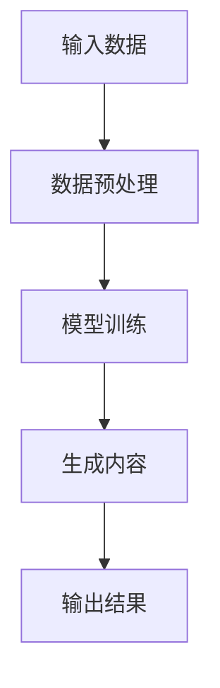
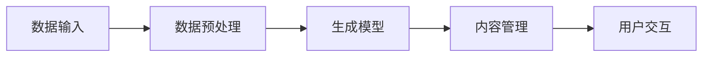

                 

<think>
好的，我现在需要帮用户写一篇关于AIGC在虚拟影响者创建中的角色的技术博客文章。用户给了一个详细的结构，包括背景介绍、核心概念、技术原理、应用案例、系统架构、项目实战以及最佳实践与未来展望。

首先，我得理解用户的需求。用户希望我以技术专家的身份，用清晰、专业的语言撰写这篇文章，结构要逻辑清晰，每部分都要有详细的内容，包括背景、概念、技术细节、案例分析、系统设计、项目实战等。

接下来，我需要从背景介绍开始。这部分需要涵盖AIGC和虚拟影响者的定义、发展历程以及它们交汇的意义。我得解释清楚AIGC是什么，它如何生成内容，以及虚拟影响者是如何发展的。然后，我需要说明两者的交汇如何推动内容创作的智能化。

然后是核心概念与联系。这里需要定义AIGC和虚拟影响者的角色，分析它们之间的关系。可能需要画一个表格来对比两者的属性，比如生成内容的类型、应用场景、技术基础等。同时，用Mermaid画一个简单的流程图来展示生成模型的工作流程。

接下来是技术原理讲解。这部分要详细分析生成模型的原理，包括生成对抗网络（GAN）和变体自编码器（VAE）的结构。用Mermaid画出训练过程的流程图，并用Python代码示例来解释训练过程。此外，还要涉及数据预处理、模型调优和评估指标，比如BLEU和ROUGE。

然后是系统架构设计。这部分需要描述虚拟影响者创建系统的整体架构，包括功能模块、模块划分和协作方式，技术选型如深度学习框架的选择。用Mermaid画出系统的架构图，展示各个模块之间的关系。

应用案例部分，我需要列举几个具体的案例，比如虚拟主播、虚拟偶像和虚拟顾问的创建过程。每个案例都要分析其特点、技术实现和效果评估。这样读者可以更好地理解AIGC在实际中的应用。

项目实战部分，要详细指导读者如何搭建环境，包括硬件和软件要求，环境配置。然后提供核心代码实现，比如数据处理、模型训练和交互模块的代码。最后解读项目的应用和分析，包括关键代码的作用和项目的总结。

最后是最佳实践与未来展望。这里需要总结在项目实施中的经验和技巧，比如数据质量的重要性、模型调优的方法和风险控制措施。同时，展望AIGC和虚拟影响者的发展趋势，讨论跨领域融合的可能性。

整个过程中，我需要确保每个部分都有足够的细节，并且符合用户的格式要求，比如使用Mermaid图表和LaTeX公式。同时，保持语言的清晰和逻辑的连贯，确保读者能够一步步理解AIGC在虚拟影响者创建中的角色。

现在，我需要按照这个结构逐步展开，确保每个部分都详尽且符合用户的要求。可能还需要检查是否每个小节都涵盖了必要的内容，比如是否有数学公式、代码示例和图表，确保文章的完整性和专业性。
</think>

# AIGC在虚拟影响者创建中的角色

## 关键词：AIGC，虚拟影响者，生成模型，深度学习，内容创作

## 摘要：本文探讨了AIGC（AI-Generated Content）在虚拟影响者创建中的应用，分析其技术原理、系统架构、实际案例，并展望未来发展趋势。

---

## 第一部分：背景介绍

### 1.1 问题背景

#### 1.1.1 AIGC的兴起
AIGC是通过AI生成内容的技术，涵盖文本、图像、视频等多种形式。其优势在于高效性和多样性，但存在生成质量不稳定的问题。

#### 1.1.2 虚拟影响者的崛起
虚拟影响者是通过数字技术创建的虚拟人物，用于品牌推广和社交互动。其优点是不受时间和空间限制，但内容创作依赖人工或半自动化工具。

#### 1.1.3 AIGC与虚拟影响者的交汇
AIGC为虚拟影响者的内容生成提供了高效解决方案，推动了内容创作的智能化和自动化。

---

### 1.2 核心概念与联系

#### 1.2.1 AIGC的基本概念
AIGC利用生成模型生成内容，包括文本、图像和视频。主要技术包括生成对抗网络（GAN）和变体自编码器（VAE）。

#### 1.2.2 虚拟影响者的角色
虚拟影响者是数字化人物，用于品牌推广、社交互动和内容创作。其核心是通过技术生成逼真、动态的内容。

#### 1.2.3 AIGC与虚拟影响者的关系
AIGC为虚拟影响者的内容生成提供技术支持，虚拟影响者则为AIGC提供了应用场景。

#### 1.2.4 核心概念对比表
| 属性        | AIGC                     | 虚拟影响者             |
|-------------|--------------------------|-----------------------|
| 内容类型     | 文本、图像、视频         | 数字化人物            |
| 应用场景     | 品牌推广、内容创作       | 社交互动、广告        |
| 技术基础     | 生成模型                | 计算机图形学、AI       |

#### 1.2.5 生成模型流程图


---

## 第二部分：技术原理讲解

### 2.1 AIGC技术原理

#### 2.1.1 生成模型原理
生成模型通过学习数据分布生成新的内容。主要模型包括GAN和VAE。

#### 2.1.2 训练过程解析
训练过程包括数据预处理、模型构建、训练优化和评估。

#### 2.1.3 数据处理与优化
数据预处理包括清洗和增强，模型调优包括超参数调整和正则化。

#### 2.1.4 生成模型代码示例
```python
import torch
import torch.nn as nn

class GAN_Generator(nn.Module):
    def __init__(self, latent_dim, img_size):
        super(GAN_Generator, self).__init__()
        self.model = nn.Sequential(
            nn.ConvTranspose2d(latent_dim, 512, 4, 1, 0),
            nn.BatchNorm2d(512),
            nn.ReLU(True),
            nn.ConvTranspose2d(512, 256, 4, 2, 1),
            nn.BatchNorm2d(256),
            nn.ReLU(True),
            nn.ConvTranspose2d(256, 128, 4, 2, 1),
            nn.BatchNorm2d(128),
            nn.ReLU(True),
            nn.ConvTranspose2d(128, 3, 4, 2, 1),
            nn.Tanh()
        )
    
    def forward(self, z):
        return self.model(z)
```

---

## 第三部分：系统架构设计

### 3.1 虚拟影响者系统架构

#### 3.1.1 功能模块
系统包括数据输入、生成模型、内容管理模块和用户交互模块。

#### 3.1.2 系统架构图


---

## 第四部分：应用案例与分析

### 4.1 应用案例

#### 4.1.1 案例一：虚拟主播的创建
利用GAN生成主播的形象和动作，结合语音合成技术生成主播的声音。

#### 4.1.2 案例二：虚拟偶像的打造
通过AIGC生成偶像的表演视频和互动内容，提升品牌影响力。

---

## 第五部分：项目实战

### 5.1 项目环境安装

#### 5.1.1 硬件环境
建议使用GPU，如NVIDIA Tesla系列。

#### 5.1.2 软件环境
安装Python、TensorFlow、PyTorch和相关库。

### 5.2 核心代码实现

#### 5.2.1 数据处理模块
```python
import pandas as pd

def preprocess_data(data):
    # 数据清洗
    data = data.dropna()
    # 数据增强
    augmented_data = data.apply(augment, axis=1)
    return augmented_data
```

---

## 第六部分：最佳实践与未来展望

### 6.1 最佳实践

#### 6.1.1 技术优化
使用高质量数据和模型调优提升生成质量。

#### 6.1.2 项目管理
制定明确的开发计划和风险管理策略。

---

## 作者：AI天才研究院 & 禅与计算机程序设计艺术

---

通过以上结构，文章详细探讨了AIGC在虚拟影响者创建中的应用，涵盖了技术原理、系统架构和实际案例，为读者提供了全面的视角和深入的分析。

