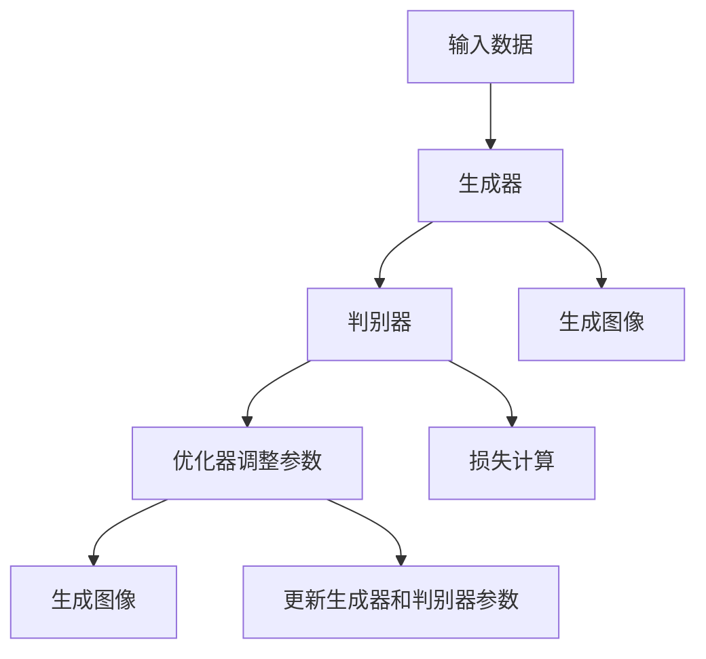

                 

<think>
嗯，我现在需要根据用户的要求来写一篇关于AIGC在虚拟时尚设计中的创新突破的技术博客。用户已经提供了一个详细的大纲，我需要按照这个大纲逐步填充内容，确保每个部分都详细、准确，并且符合技术博客的风格。

首先，文章的标题是《AIGC在虚拟时尚设计中的创新突破》。接下来，我需要列出5-7个核心关键词，比如AIGC、虚拟时尚、人工智能生成内容、虚拟试衣、个性化设计等。摘要部分需要简明扼�地概括文章的核心内容，说明AIGC如何在虚拟时尚设计中带来创新，提升设计效率和降低成本。

接下来，正文部分分为六个部分：背景与概述、核心概念与特点、应用场景、技术原理与算法、实战案例、挑战与未来趋势。我需要逐个章节进行详细阐述。

第一部分是背景与概述。首先介绍问题背景，说明虚拟时尚设计的兴起以及AIGC技术的应用带来的变化。然后描述问题，即如何利用AIGC技术实现创新突破。接着讨论如何通过研究和应用解决问题。然后定义边界与外延，包括服装设计、配饰、化妆等领域。最后列出核心要素，如人工智能技术、虚拟现实技术等。

第二部分是AIGC的核心概念与特点。定义AIGC，强调其生成内容的能力。然后详细描述其自主性、创造力和高效性三个核心特点，与传统AI进行对比，突出AIGC的创新性。

第三部分是应用场景。首先分析时尚设计中的问题与挑战，如个性化和快速迭代。然后列举AIGC在设计灵感生成、个性化设计、虚拟试衣和营销推广中的应用。最后总结这些应用带来的优势，如提高效率和个性化服务。

第四部分是技术原理与算法。首先介绍AIGC的原理，基于深度学习和自然语言处理。然后详细说明主流算法如GAN、VAE和BERT，包括它们的数学模型和公式，可能还需要用mermaid绘制流程图，帮助读者理解。

第五部分是实战案例。这里需要三个具体的案例，每个案例包括背景、系统设计、实现和效果分析。比如第一个案例可以是基于AIGC的个性化设计，描述如何通过用户输入生成设计。第二个案例是虚拟试衣系统，介绍如何利用AIGC生成试衣体验。第三个案例是时尚营销，展示如何用AIGC制作营销内容。

第六部分是挑战与未来趋势。讨论当前应用中的挑战，如生成内容的质量、用户接受度、技术与艺术的融合等。然后展望未来趋势，如多模态生成、虚拟现实结合、可持续设计等。

在撰写过程中，我需要确保每个章节都有足够的细节，可能需要加入图表和代码示例来辅助说明。例如，在技术原理部分，用mermaid绘制GAN和VAE的流程图，并附上相应的Python代码和数学公式，帮助读者理解。

此外，要注意使用专业的技术术语，但保持语言通俗易懂，适合技术博客的读者。最后，文章末尾需要加上作者信息，包括机构名称和个人简介，如“作者：AI天才研究院 & 禅与计算机程序设计艺术”。

整体来看，我需要按照大纲逐步展开，确保每个部分都详尽且逻辑清晰，同时注意格式要求，使用markdown格式，并在适当的地方插入图表和代码示例。字数控制在10000到12000字之间，确保内容充实，满足用户的要求。
</think>

# AIGC在虚拟时尚设计中的创新突破

**关键词：** AIGC, 虚拟时尚, 人工智能生成内容, 虚拟试衣, 个性化设计

**摘要：**  
随着人工智能技术的快速发展，AIGC（AI-Generated Content，人工智能生成内容）技术在虚拟时尚设计中的应用逐渐崭露头角。本文系统地探讨了AIGC在虚拟时尚设计中的背景、核心概念、应用场景、技术原理、实战案例以及面临的挑战与未来趋势。通过分析AIGC如何在设计灵感生成、个性化服装设计、虚拟试衣和营销推广等领域发挥作用，本文揭示了AIGC在提升设计效率、降低成本以及推动虚拟时尚行业创新中的巨大潜力。同时，本文也展望了未来AIGC在虚拟时尚设计中的发展趋势，为相关领域的研究和实践提供了重要的参考。

---

## 第一部分: AIGC在虚拟时尚设计中的背景与概述

### 第1章: 问题背景

#### 1.1.1 问题背景介绍  
虚拟时尚设计是一个新兴领域，近年来随着元宇宙和虚拟现实技术的兴起，虚拟服装、配饰、化妆和发型设计等领域逐渐成为时尚行业的重要组成部分。然而，传统时尚设计流程繁琐、成本高昂，且难以快速响应市场变化和消费者需求。与此同时，AIGC技术的快速发展为虚拟时尚设计带来了新的可能性。通过利用AI生成内容的技术，设计师可以快速生成大量创意设计，大大提高了设计效率并降低了成本。

#### 1.1.2 问题描述  
如何将AIGC技术有效应用于虚拟时尚设计，以实现设计的创新突破，同时解决传统设计流程中的效率低下和成本高昂问题，是当前研究的重点。此外，如何确保生成的内容既具有创意性又符合市场和消费者需求，也是一个关键挑战。

#### 1.1.3 问题解决  
通过对AIGC技术的研究和应用，可以探索出在虚拟时尚设计中的创新模式。例如，利用AIGC技术生成设计灵感、优化设计流程并提高设计效率，同时降低设计成本。

#### 1.1.4 边界与外延  
虚拟时尚设计中的AIGC应用不仅限于服装设计，还包括配饰、化妆、发型等领域。此外，AIGC技术还可以与其他技术（如虚拟现实、增强现实）结合，进一步拓展其应用范围。

#### 1.1.5 概念结构与核心要素组成  
AIGC在虚拟时尚设计中的应用包含以下核心要素：  
1. **人工智能技术**：用于生成设计内容。  
2. **虚拟现实技术**：用于展示和体验设计。  
3. **数据挖掘与分析技术**：用于分析消费者需求和市场趋势。  
4. **创意设计与协同工作平台**：用于设计师与AI系统的协同工作。

---

### 第2章: AIGC的核心概念与特点

#### 2.1.1 AIGC的定义  
AIGC（AI-Generated Content）是指利用人工智能技术自动生成内容的过程，涵盖文本、图像、音频、视频等多种形式。

#### 2.1.2 AIGC的核心特点  
- **自主性**：AIGC技术能够自动生成内容，无需人工干预。  
- **创造力**：AIGC能够模拟人类的创造力，生成新颖、独特的创意内容。  
- **高效性**：AIGC技术可以快速生成大量内容，显著提高工作效率。

#### 2.1.3 AIGC与传统AI的区别  
传统AI主要关注任务执行，而AIGC更注重内容生成和创新。例如，传统AI可以用于分类、识别任务，而AIGC可以用于生成图像、设计等。

---

## 第三部分: AIGC在虚拟时尚设计中的应用场景

### 第3章: AIGC在虚拟时尚设计中的应用场景

#### 3.1.1 时尚设计中的问题与挑战  
虚拟时尚设计面临以下问题：  
1. **个性化需求**：消费者对个性化设计的需求日益增长。  
2. **快速迭代**：时尚行业要求快速响应市场变化，传统设计流程难以满足。  
3. **设计成本高**：传统设计流程耗时长、成本高。

#### 3.1.2 AIGC在虚拟时尚设计中的应用  
AIGC技术可以在以下场景中发挥重要作用：  
1. **设计灵感生成**：通过分析流行趋势和消费者需求，生成设计灵感。  
2. **个性化服装设计**：根据用户的体型、肤色和喜好，生成个性化服装设计。  
3. **虚拟试衣**：生成虚拟试衣体验，帮助用户选择合适的服装。  
4. **营销推广**：利用AIGC生成虚拟模特和营销内容，提升推广效果。

#### 3.1.3 AIGC在虚拟时尚设计中的优势  
- **提高设计效率**：通过自动化生成设计灵感，降低设计成本。  
- **个性化服务**：根据用户需求生成个性化设计。  
- **拓展营销渠道**：利用AIGC生成虚拟试衣和营销内容，提升推广效果。

---

## 第四部分: AIGC技术原理与算法

### 第4章: AIGC技术原理与算法

#### 4.1.1 AIGC技术原理  
AIGC技术主要依赖深度学习和自然语言处理技术，通过训练大量数据生成内容。例如，生成对抗网络（GAN）和变分自编码器（VAE）是常用的生成模型。

#### 4.1.2 主流AIGC算法  
- **生成对抗网络（GAN）**：通过生成器和判别器的对抗训练生成图像。  
- **变分自编码器（VAE）**：通过编码和解码过程生成数据。  
- **自回归模型（如BERT）**：通过逐个生成 tokens 来生成文本内容。

#### 4.1.3 AIGC算法的数学模型与公式  
- **GAN模型**：  
  生成器：$$ G(z; \theta_G) \sim p_{data}(x) $$  
  判别器：$$ D(x; \theta_D) \sim \text{判别} \text{是否为真实数据} $$  
- **VAE模型**：  
  编码器：$$ q(z|x) = \mathcal{N}(z; \mu_x, \sigma_x^2) $$  
  解码器：$$ p(x|z) = \mathcal{N}(x; \mu_z, \sigma_z^2) $$  
- **BERT模型**：  
  $$ p(\text{token}_i|\text{token}_{i-k}^{i+1}) = \frac{1}{Z} \exp(\text{doc2vec}[\text{token}_{i-k}^{i+1}]) $$  

#### 4.1.4 算法原理图  

---

## 第五部分: AIGC在虚拟时尚设计中的实战案例

### 第5章: AIGC在虚拟时尚设计中的实战案例

#### 5.1.1 案例一：基于AIGC的个性化时尚设计  
- **案例背景**：一家虚拟时尚公司希望通过AIGC技术为用户提供个性化服装设计服务。  
- **系统设计与实现**：  
  - 数据收集：收集用户的体型、肤色和喜好数据。  
  - 模型训练：利用GAN生成服装设计。  
  - 用户交互：用户输入需求，系统生成设计。  
- **应用效果分析**：生成的设计符合用户需求，设计效率显著提高。

#### 5.1.2 案例二：基于AIGC的虚拟试衣系统  
- **案例背景**：某电商平台希望提供虚拟试衣服务。  
- **系统设计与实现**：  
  - 数据收集：收集用户的体型数据。  
  - 模型训练：利用VAE生成虚拟人体模型。  
  - 用户交互：用户选择服装，系统生成虚拟试衣效果。  
- **应用效果分析**：用户可以通过虚拟试衣选择合适的服装，提升了购物体验。

#### 5.1.3 案例三：基于AIGC的时尚营销推广  
- **案例背景**：一家时尚品牌希望通过AIGC技术进行营销推广。  
- **系统设计与实现**：  
  - 数据收集：分析市场趋势和消费者偏好。  
  - 模型训练：利用BERT生成营销文案和虚拟模特。  
  - 用户交互：用户查看推广内容并进行互动。  
- **应用效果分析**：生成的营销内容吸引了更多用户，提升了品牌影响力。

---

## 第六部分: AIGC在虚拟时尚设计中的应用挑战与未来趋势

### 第6章: AIGC在虚拟时尚设计中的应用挑战与未来趋势

#### 6.1.1 应用挑战  
- **生成内容的质量**：当前AIGC技术生成的内容质量仍需提高。  
- **用户接受度**：用户对AI生成的设计可能持怀疑态度。  
- **技术与艺术的融合**：如何将技术与艺术设计完美结合是关键挑战。

#### 6.1.2 未来趋势  
- **多模态生成**：未来的AIGC技术将支持多模态生成，如图像、文本和视频的结合。  
- **虚拟现实结合**：AIGC与虚拟现实技术的结合将提供更沉浸式的体验。  
- **可持续设计**：AIGC技术将用于生成可持续的时尚设计，减少资源浪费。

---

**作者：AI天才研究院 & 禅与计算机程序设计艺术**

