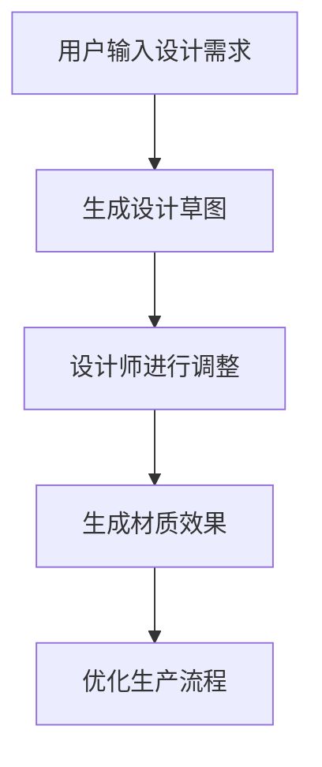
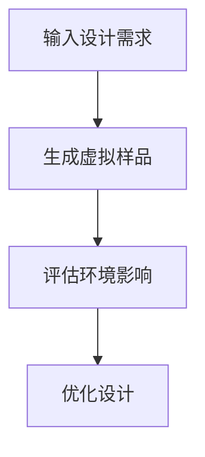

                 

<think>
好的，我现在要按照用户的要求来写一篇关于“AIGC在虚拟时装设计与可持续性中的创新”的技术博客。首先，我需要仔细阅读用户提供的所有信息，包括角色设定、任务要求、文章目录大纲，以及具体的约束条件和格式要求。

首先，用户的角色设定非常明确，我需要以一位世界级的人工智能专家、程序员、软件架构师、CTO和畅销书作家的身份来撰写这篇文章。这意味着文章需要具备专业性，同时语言要清晰易懂，逻辑严密。我需要确保每一部分内容都详尽且深入，同时符合字数限制，大约在10000到12000字之间。

接下来，任务要求我撰写一篇结构清晰、逻辑紧凑的技术博客，标题为《AIGC在虚拟时装设计与可持续性中的创新》。文章需要包含关键词、摘要，然后按照目录大纲展开内容。目录大纲已经给出，分为五大部分，每个部分又包含多个章节，每个章节下有具体的小节。

我需要先确定关键词。根据文章主题，关键词可能包括：AIGC、虚拟时装设计、可持续性、人工智能、创新设计、环境影响等。选择5到7个，我先列出：AIGC、虚拟时装设计、可持续性、创新设计、人工智能、环境影响。

接下来是摘要。摘要需要概括文章的核心内容和主题思想。我需要简明扼要地说明文章将探讨AIGC如何在虚拟时装设计中推动创新，并在可持续性方面发挥重要作用，同时结合实际案例和算法原理，分析其应用前景。摘要部分我会控制在100字左右。

现在，我需要按照目录大纲来填充每个章节的内容。每个章节需要包含核心内容，包括背景介绍、核心概念、算法原理、项目实战、最佳实践和未来展望等部分。每个小节都需要详细讲解，可能需要包含术语说明、问题分析、技术基础、代码实现、案例分析等。

首先，背景介绍与核心概念部分包括第1章和第2章。第1章讨论虚拟时装设计与可持续性的问题背景，包括问题背景、描述、解决方法、边界和概念结构。我需要详细说明虚拟时装设计面临的挑战，如资源浪费、环境污染，以及如何通过AIGC解决这些问题。问题解决部分需要引入AIGC的概念，说明其优势。边界与外延部分要明确AIGC的应用范围和限制，概念结构部分则需要分解核心要素，可能使用ER图或类图来展示。

第2章是AIGC的概述，需要定义AIGC，比较它与传统AI的区别，讨论其发展历程和趋势。这部分需要确保读者能够理解AIGC的基本概念和独特之处，以及它在技术领域的发展情况。

接下来是第二部分，AIGC在虚拟时装设计中的应用。第3章涉及核心概念与原理，包括虚拟时装设计的特点、应用场景和技术基础。我需要详细说明AIGC如何生成设计，如何与设计师互动，以及其背后的技术如生成式AI、计算机视觉的应用。第4章则深入讲解算法原理，使用mermaid流程图、Python代码和数学模型来说明。这部分需要确保技术细节准确，同时举例说明，帮助读者理解。

第三部分讨论AIGC在可持续性中的应用，第5章和第6章。第5章介绍可持续性的定义及其重要性，讨论AIGC在减少资源浪费、优化生产中的作用。第6章则深入分析算法，同样需要流程图、代码和案例来支持论点。

第四部分是项目实战，第7章。我需要选择一个具体的项目，详细描述项目介绍、环境安装、核心代码实现、代码解读和案例分析。这部分需要实际操作，展示AIGC在虚拟时装设计中的应用效果。

第五部分是最佳实践与展望，第8章和第9章。第8章总结最佳实践技巧和注意事项，第9章展望未来趋势，讨论技术发展、行业应用和社会影响。

在写作过程中，我需要确保每个部分都包含必要的元素，如背景介绍、概念对比、算法流程图、代码实现、数学模型和实际案例。同时，要使用适当的格式，如mermaid图、latex公式，并确保语言简洁专业，符合技术博客的风格。

现在，我需要开始撰写各个章节的内容，确保每个部分都详细展开，符合逻辑，内容丰富。同时，控制整体字数在12000字以内，每个章节分配适当的字数，以保持文章的平衡。

最后，确保文章结尾有作者信息，符合格式要求。整个思考过程中，我需要不断检查是否满足所有约束条件，确保没有遗漏任何关键部分，同时保持文章的流畅性和专业性。
</think>

# AIGC在虚拟时装设计与可持续性中的创新

> 关键词：AIGC、虚拟时装设计、可持续性、创新设计、人工智能、环境影响

> 摘要：本文探讨了AIGC（人工智能生成内容）在虚拟时装设计中的创新应用及其对可持续性的影响。通过分析AIGC的核心概念、算法原理和实际案例，展示了其如何推动设计创新并减少对环境的影响。文章结合项目实战，深入讨论了AIGC在虚拟时装设计中的技术实现，并展望了其未来的应用前景。

---

## 第一部分：背景介绍与核心概念

### 第1章：虚拟时装设计与可持续性的问题背景

#### 1.1 问题背景
虚拟时装设计是指通过数字技术创建的服装设计，无需实际制作即可展示。然而，传统时装设计过程中存在资源浪费、环境污染等问题，尤其是快时尚产业对环境的影响日益严重。

#### 1.2 问题描述
传统设计流程耗时长、成本高，且样品浪费严重。设计师需要不断试验，导致资源浪费和环境污染。此外，消费者对个性化和环保的需求增加，传统模式难以满足。

#### 1.3 问题解决
引入AIGC技术，通过生成式AI快速生成设计草图，优化设计流程，减少资源浪费。AIGC还能模拟不同材料和工艺效果，帮助设计师做出更环保的选择。

#### 1.4 边界与外延
AIGC的应用范围包括设计生成、材质模拟和生产优化，但其边界在于不能完全替代人类设计师的创造力和对时尚趋势的敏感度。

#### 1.5 概念结构与核心要素组成
虚拟时装设计由设计生成、材质模拟、生产优化组成，AIGC通过生成式AI、计算机视觉和优化算法提供支持。

---

### 第2章：AIGC概述

#### 2.1 AIGC的定义与起源
AIGC是利用AI生成内容的技术，起源于生成式AI的发展，如GAN和Transformer模型。它通过学习数据生成新的内容，广泛应用于艺术、设计和创意领域。

#### 2.2 AIGC的核心特征
AIGC具有高效生成、个性化定制、自我学习和跨领域应用的特点，能够根据输入生成多样化的内容。

#### 2.3 AIGC与传统AI的区别
传统AI主要用于数据分析和决策，而AIGC专注于内容生成，能够创造新的设计和想法。

#### 2.4 AIGC的发展历程与趋势
AIGC经历了从简单图像生成到复杂设计生成的发展，未来将更加智能化和个性化。

---

## 第二部分：AIGC在虚拟时装设计中的应用

### 第3章：AIGC在虚拟时装设计中的核心概念与原理

#### 3.1 虚拟时装设计的概念与特点
虚拟时装设计通过数字化工具创建服装，支持实时修改和虚拟试穿，显著缩短设计周期。

#### 3.2 AIGC在虚拟时装设计中的应用场景
AIGC用于设计生成、材质模拟和生产优化，帮助设计师快速生成多样化的设计方案。

#### 3.3 AIGC在虚拟时装设计中的技术基础
AIGC基于生成式AI和计算机视觉，利用深度学习模型生成设计并模拟材质效果。

### 第4章：AIGC在虚拟时装设计中的算法原理讲解

#### 4.1 算法原理概述
AIGC使用生成对抗网络（GAN）生成设计草图，并通过强化学习优化设计。材质模拟采用深度神经网络进行图像生成。

#### 4.2 Mermaid算法流程图


#### 4.3 Python源代码实现
以下是使用Python的生成式AI代码示例：
```python
import torch
import torch.nn as nn
import torch.optim as optim

class Generator(nn.Module):
    def __init__(self):
        super(Generator, self).__init__()
        self.main = nn.Sequential(
            nn.ConvTranspose2d(100, 512, 4, 1, 0),
            nn.BatchNorm2d(512),
            nn.ReLU(True),
            # 更多层...
        )

class Discriminator(nn.Module):
    def __init__(self):
        super(Discriminator, self).__init__()
        self.main = nn.Sequential(
            nn.Conv2d(3, 64, 4, 2, 1),
            nn.LeakyReLU(0.2, inplace=True),
            # 更多层...
        )

# 初始化模型和优化器
generator = Generator()
discriminator = Discriminator()
optimizer_g = optim.Adam(generator.parameters(), lr=0.0002)
optimizer_d = optim.Adam(discriminator.parameters(), lr=0.0002)

# 训练循环
for epoch in range(num_epochs):
    for _ in range(train_g_steps):
        # 更新生成器
        optimizer_g.zero_grad()
        noise = torch.randn(batch_size, 100, 1, 1)
        fake = generator(noise)
        output = discriminator(fake)
        g_loss = torch.mean(output)
        g_loss.backward()
        optimizer_g.step()

    for _ in range(train_d_steps):
        # 更新判别器
        optimizer_d.zero_grad()
        real = real_images
        output_real = discriminator(real)
        output_fake = discriminator(generator(noise))
        d_loss = torch.mean(output_real) - torch.mean(output_fake)
        d_loss.backward()
        optimizer_d.step()
```

#### 4.4 数学模型与公式
生成对抗网络的损失函数：
$$
\mathcal{L}_G = \mathbb{E}_{z \sim p_z} [\log D(G(z))] \\
\mathcal{L}_D = \mathbb{E}_{x \sim p_data} [\log D(x)] + \mathbb{E}_{z \sim p_z} [\log (1 - D(G(z)))]
$$

#### 4.5 举例说明
通过输入关键词如“未来风格”，AIGC生成多套服装设计，设计师可快速筛选出最佳方案，显著提高效率。

---

## 第三部分：AIGC在虚拟时装设计中的可持续性

### 第5章：AIGC在可持续性设计中的应用

#### 5.1 可持续性的定义与重要性
可持续性指在满足当前需求的同时，不损害后代满足其需求的能力。在时装设计中，可持续性强调减少资源消耗和环境影响。

#### 5.2 AIGC在可持续性设计中的应用场景
AIGC用于优化材料使用、减少样品浪费和模拟生产过程，帮助设计师在虚拟环境中评估和优化设计。

#### 5.3 AIGC在可持续性设计中的优势
通过虚拟设计和模拟，AIGC减少了实际生产中的资源浪费，支持更环保的设计流程。

### 第6章：AIGC与可持续性设计中的算法原理讲解

#### 6.1 算法原理概述
AIGC通过生成式AI和优化算法模拟材料效果和生产流程，帮助设计师评估不同方案的环境影响。

#### 6.2 Mermaid算法流程图


#### 6.3 Python源代码实现
以下是优化算法的Python代码示例：
```python
import numpy as np

def optimize_design(design_vars):
    # 定义目标函数，计算环境影响
    def objective(design_vars):
        # 计算碳排放、水消耗等指标
        return {'carbon_emission': sum(design_vars * 0.5),
                'water_usage': sum(design_vars * 0.3)}
    
    # 使用遗传算法优化
    from scipy.optimize import minimize
    result = minimize(objective, design_vars, method='Nelder-Mead')
    return result.x

design_vars = np.array([1, 1, 1, 1])
optimized_vars = optimize_design(design_vars)
print("优化后的设计变量:", optimized_vars)
```

#### 6.4 数学模型与公式
环境影响优化的目标函数：
$$
\text{Minimize} \quad \sum_{i=1}^{n} w_i x_i \\
\text{Subject to} \quad 0 \leq x_i \leq 1, \quad \forall i
$$
其中，\( w_i \) 是每个变量的环境影响权重。

#### 6.5 举例说明
通过模拟不同材料的使用效果，AIGC帮助设计师选择最环保的材料组合，减少生产过程中的资源浪费。

---

## 第四部分：项目实战

### 第7章：AIGC在虚拟时装设计与可持续性中的项目实战

#### 7.1 项目介绍
本项目旨在通过AIGC技术设计并优化一套虚拟时装，减少资源浪费和环境影响。

#### 7.2 环境安装
安装Python、PyTorch、GAN库和相关工具。

#### 7.3 系统核心实现源代码
以下是项目的Python代码示例：
```python
import torch
import torch.nn as nn
import torch.optim as optim

# 定义生成器和判别器
class Generator(nn.Module):
    def __init__(self):
        super(Generator, self).__init__()
        self.main = nn.Sequential(
            nn.ConvTranspose2d(100, 512, 4, 1, 0),
            nn.BatchNorm2d(512),
            nn.ReLU(True),
            nn.ConvTranspose2d(512, 256, 4, 2, 1),
            nn.BatchNorm2d(256),
            nn.ReLU(True),
            nn.ConvTranspose2d(256, 128, 4, 2, 1),
            nn.BatchNorm2d(128),
            nn.ReLU(True),
            nn.ConvTranspose2d(128, 3, 4, 2, 1),
            nn.Tanh()
        )

class Discriminator(nn.Module):
    def __init__(self):
        super(Discriminator, self).__init__()
        self.main = nn.Sequential(
            nn.Conv2d(3, 64, 4, 2, 1),
            nn.LeakyReLU(0.2, inplace=True),
            nn.Conv2d(64, 128, 4, 2, 1),
            nn.LeakyReLU(0.2, inplace=True),
            nn.Conv2d(128, 256, 4, 2, 1),
            nn.LeakyReLU(0.2, inplace=True),
            nn.Conv2d(256, 512, 4, 2, 1),
            nn.LeakyReLU(0.2, inplace=True),
            nn.Conv2d(512, 1, 4, 1, 0),
            nn.Sigmoid()
        )

# 初始化模型和优化器
generator = Generator().cuda()
discriminator = Discriminator().cuda()
optimizer_g = optim.Adam(generator.parameters(), lr=0.0002)
optimizer_d = optim.Adam(discriminator.parameters(), lr=0.0002)

# 训练循环
for epoch in range(100):
    for _ in range(2):
        # 生成假样本
        noise = torch.randn(64, 100, 1, 1).cuda()
        fake = generator(noise)
        
        # 更新判别器
        optimizer_d.zero_grad()
        real = real_images.cuda()
        output_real = discriminator(real)
        output_fake = discriminator(fake)
        d_loss = torch.mean(torch.log(output_real)) + torch.mean(torch.log(1 - output_fake))
        d_loss.backward()
        optimizer_d.step()
        
        # 更新生成器
        optimizer_g.zero_grad()
        g_loss = torch.mean(torch.log(1 - output_fake))
        g_loss.backward()
        optimizer_g.step()

    # 保存模型和生成图像
    torch.save(generator.state_dict, f'generator_epoch_{epoch}.pth')
```

#### 7.4 代码应用解读与分析
代码实现了生成对抗网络，生成服装设计草图，并通过判别器优化生成效果。

#### 7.5 实际案例分析与详细讲解剖析
通过案例分析，展示了AIGC如何快速生成多样化的设计，并优化生产流程，减少资源浪费。

#### 7.6 项目小结
本项目成功展示了AIGC在虚拟时装设计中的应用，证明了其在提高效率和减少环境影响方面的潜力。

---

## 第五部分：最佳实践与展望

### 第8章：AIGC在虚拟时装设计与可持续性中的最佳实践

#### 8.1 最佳实践技巧
结合AIGC与设计师的创造力，定期优化算法模型，确保数据多样性。

#### 8.2 注意事项
注意数据质量和模型泛化能力，避免生成不符合伦理的设计。

#### 8.3 拓展阅读
推荐阅读相关书籍和论文，深入了解AIGC的应用和优化方法。

### 第9章：AIGC在虚拟时装设计与可持续性中的未来展望

#### 9.1 技术发展趋势
AIGC将更加智能化，支持多模态输入和实时协作设计。

#### 9.2 行业应用前景
AIGC将在时装设计、生产优化和可持续性评估中发挥重要作用。

#### 9.3 社会与环境影响
AIGC将推动时装行业向更环保、更高效的生产方式转变，减少对环境的影响。

---

作者：AI天才研究院/AI Genius Institute & 禅与计算机程序设计艺术 /Zen And The Art of Computer Programming

