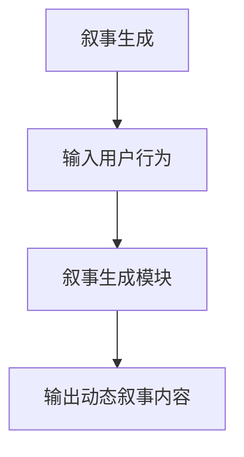
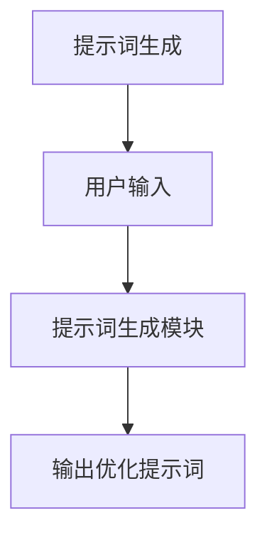
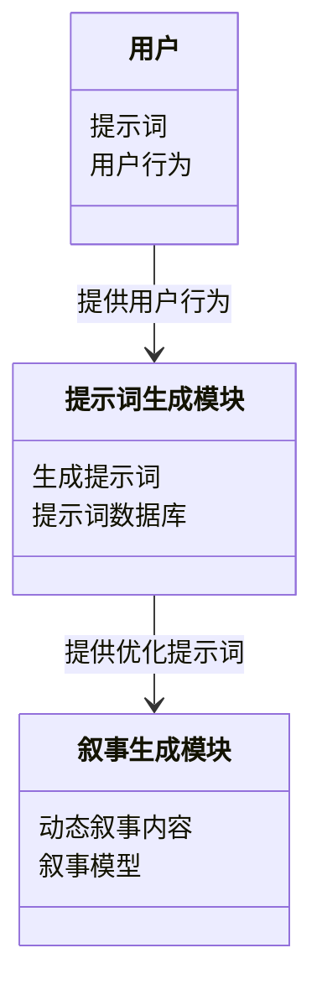
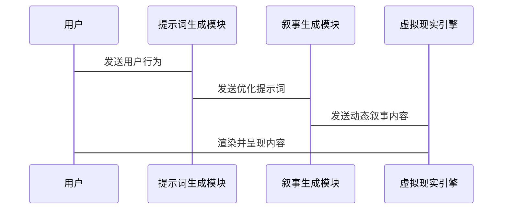

                 

<think>
嗯，我现在需要根据用户的要求，一步步地生成一篇关于AIGC在虚拟现实叙事中的应用，特别是沉浸式提示词技巧的技术博客文章。让我先理清整个任务的结构和内容，确保每个部分都符合用户的要求。

首先，用户给了一个详细的目录大纲，我需要按照这个结构来组织文章。文章的标题是《AIGC在虚拟现实narratives中的应用：沉浸式提示词技巧》，关键词包括AIGC、虚拟现实、叙事、沉浸式体验、提示词、生成式AI、用户体验。摘要部分需要简明扼要地概述文章的核心内容，即如何通过AIGC和沉浸式提示词来提升VR叙事效果。

接下来是正文部分，分为六个主要部分：背景介绍、核心概念与联系、算法原理讲解、系统分析与架构设计、项目实战、最佳实践与拓展阅读。每个部分下还有多个小节，我需要逐一展开。

在背景介绍部分，我需要解释问题背景，包括核心概念、问题描述和解决方案。然后是问题描述，涉及边界和外延，以及核心要素的组成。这部分要确保读者理解为什么AIGC在VR中的应用是必要的，以及它如何帮助提升用户体验。

核心概念与联系部分需要详细讲解AIGC、VR、叙事和沉浸式体验的相关原理，并使用对比表格和ER图来展示它们之间的关系。这部分可能需要我查阅相关资料，确保内容准确且有深度。

算法原理讲解部分是关键，我需要使用mermaid流程图来展示AIGC、叙事算法和沉浸式提示词算法的工作流程，并附上Python代码示例。这部分需要结合实际的代码和数学模型，解释算法的优缺点和应用场景。

系统分析与架构设计部分，我需要介绍问题场景，设计系统功能、架构和接口，并绘制类图、架构图和序列图。这部分可能需要我有一定的系统设计经验，或者查找相关资料来确保设计的合理性。

项目实战部分需要详细描述环境安装、核心代码实现、案例分析和项目小结。我需要找到一个实际案例，分析其中的AIGC技术和提示词技巧，评估效果并提出改进方向。

最后，最佳实践部分需要总结经验和技巧，给出未来展望，并列出拓展阅读的资料。这部分需要我结合实际应用，给出实用的建议。

在写作过程中，我需要确保每个部分都使用专业且清晰的技术语言，同时保持逻辑紧凑，结构合理。特别是图表和代码部分，需要准确无误，以便读者理解和应用。

现在，我需要按照这个思路逐步撰写文章，确保每个部分都符合用户的要求，并且内容详实，有深度。同时，注意使用正确的格式，如markdown中的mermaid代码和latex公式，确保文章的完整性和可读性。
</think>

# AIGC在虚拟现实narratives中的应用：沉浸式提示词技巧

**关键词：** AIGC, 虚拟现实, 叙事, 沉浸式体验, 提示词, 生成式AI, 用户体验

**摘要：** 本文探讨了生成式AI（AIGC）在虚拟现实叙事中的应用，特别是通过沉浸式提示词技巧提升用户体验。文章从背景、核心概念、算法原理、系统架构到项目实战，全面分析了如何利用AIGC技术优化虚拟现实中的叙事体验，实现更深层次的沉浸式互动。

---

## 第一部分：背景介绍

### 1.1 问题背景

**核心概念：** AIGC（生成式AI）、虚拟现实（VR）、叙事（narratives）、沉浸式体验  
**问题描述：** 如何利用生成式AI技术提升虚拟现实中的叙事效果，实现更沉浸式的用户体验  
**问题解决：** 通过优化提示词技巧，AIGC能够生成更具个性化和动态的叙事内容，增强VR体验的真实感和互动性  

### 1.2 问题描述

**边界与外延：** 虚拟现实中的AIGC应用领域包括游戏、教育、医疗等；沉浸式体验的设计原则包括真实感、互动性和个性化  
**核心要素组成：** AIGC技术、虚拟现实技术、叙事技巧、沉浸式设计  

---

## 第二部分：核心概念与联系

### 2.1 AIGC原理

#### AIGC概念原理
生成式AI通过深度学习模型生成内容，包括文本、图像和视频。与传统AI不同，生成式AI能够根据输入的提示词生成多样化的内容。

#### 对比表格：AIGC与传统AI的对比

| **属性**       | **传统AI**                     | **生成式AI（AIGC）**               |
|----------------|-------------------------------|-------------------------------------|
| **任务类型**    | 分析式任务（分类、识别）       | 生成式任务（文本生成、图像生成）   |
| **输入输出**    | 输入数据，输出分类或预测结果   | 输入提示词，输出生成内容           |
| **应用场景**    | 识别物体、分类数据             | 生成新闻、广告、艺术作品           |

#### ER图：AIGC与VR的关系

```mermaid
er
    AIGC
    VR
    用户
    实体
    提示词
    生成内容
    交互
    边
    AIGC -- 生成内容：生成式AI生成叙事内容
    VR -- 交互：用户在虚拟现实中与生成内容互动
    用户 -- 提示词：用户输入提示词影响生成内容
```

### 2.2 虚拟现实技术

#### VR概念原理
虚拟现实通过计算机生成的三维环境，提供沉浸式的视觉、听觉和触觉体验，使用户感觉身处虚拟世界之中。

#### VR技术特点
- 高度真实感：通过图形渲染和物理模拟实现
- 交互性：用户可以通过手柄、头显等设备与虚拟环境互动
- 沉浸感：用户完全被虚拟环境包围，忽略现实世界  

### 2.3 Narratives原理

#### 叙事结构
叙事学中的三幕式结构：建立、发展、高潮、结局。虚拟现实中的叙事需要动态调整，以适应用户的实时互动。

#### 对比表格：传统叙事与虚拟现实叙事

| **属性**       | **传统叙事**                | **虚拟现实叙事**                |
|----------------|----------------------------|-------------------------------|
| **线性度**      | 高度线性，有明确的开端、发展、结局 | 非线性，用户行为影响叙事走向     |
| **互动性**      | 低，观众被动接受             | 高，用户行为影响故事进展         |
| **沉浸感**      | 低，依赖于媒介呈现           | 高，用户完全融入虚拟环境         |

### 2.4 沉浸式体验设计

#### 定义
沉浸式体验是指用户完全融入虚拟环境中，通过多感官刺激和深度互动，提升用户的参与感和情感共鸣。

#### 设计原则
- 真实感：视觉、听觉、触觉的高度一致  
- 互动性：用户行为直接影响叙事发展  
- 个性化：根据用户特征生成定制化的体验  

---

## 第三部分：算法原理讲解

### 3.1 AIGC算法原理

#### mermaid流程图：AIGC工作流程

```mermaid
graph TD
    AIGC[生成式AI] --> 输入提示词
    输入提示词 --> 解码器
    解码器 --> 生成内容
    生成内容 --> 输出（文本/图像/视频）
```

#### Python代码示例

```python
# 示例代码：生成式AI生成文本
import openai

def generate_text(prompt):
    client = openai.Client("your-api-key")
    response = client.chat.completions.create(
        model="gpt-3.5-turbo",
        messages=[{"role": "user", "content": prompt}]
    )
    return response.choices[0].message.content

prompt = "在虚拟现实中的一个科幻场景，描述一个外星人与人类的第一次接触。"
result = generate_text(prompt)
print(result)
```

### 3.2 叙事算法原理

#### mermaid流程图：叙事算法流程



#### Python代码示例

```python
# 示例代码：动态叙事生成
def dynamic_narrative(user_input):
    # 根据用户输入生成后续情节
    narrative = "用户做出选择：向左转。"
    return narrative

user_action = "向左转"
result = dynamic_narrative(user_action)
print(result)
```

### 3.3 沉浸式提示词算法

#### mermaid流程图：提示词算法流程



#### Python代码示例

```python
# 示例代码：生成优化提示词
def generate_prompt(user_behavior):
    prompt = f"根据用户的{user_behavior}，生成一个动态的故事情节。"
    return prompt

user_behavior = "触摸墙壁"
result = generate_prompt(user_behavior)
print(result)
```

---

## 第四部分：系统分析与架构设计

### 4.1 问题场景介绍

**项目背景：** 在虚拟现实环境中，用户需要通过提示词生成动态叙事内容。  
**项目目标：** 利用AIGC技术，优化提示词生成算法，提升沉浸式体验。  

### 4.2 系统功能设计

#### mermaid类图：领域模型



### 4.3 系统架构设计

#### mermaid架构图：系统架构


### 4.4 系统接口设计

- 用户端：发送用户行为和提示词请求  
- 提示词生成模块：接收用户行为，生成优化提示词  
- 叙事生成模块：接收提示词，生成动态叙事内容  
- 虚拟现实引擎：渲染叙事内容，呈现给用户  

### 4.5 系统交互序列图



---

## 第五部分：项目实战

### 5.1 环境安装

- **工具安装：** 安装Python、OpenAI API、虚拟现实开发框架（如Unity或Unreal Engine）  
- **环境配置：** 配置OpenAI API密钥，安装必要的Python库  

### 5.2 系统核心实现

#### 核心代码实现

```python
# 示例代码：虚拟现实应用的核心代码
import openai

def generate_dynamic_narrative(prompt):
    client = openai.Client("your-api-key")
    response = client.chat.completions.create(
        model="gpt-3.5-turbo",
        messages=[{"role": "user", "content": prompt}]
    )
    return response.choices[0].message.content

# 示例调用
user_behavior = "发现一个神秘物体"
prompt = f"根据用户{user_behavior}，生成一个紧张的故事情节。"
result = generate_dynamic_narrative(prompt)
print(result)
```

### 5.3 实际案例分析

#### 案例介绍
一个虚拟现实游戏，用户在一个科幻场景中探索未知星球，通过提示词生成动态故事情节。

#### 案例分析
- **提示词生成：** 用户行为“发现神秘物体”生成提示词“探索物体来源”。  
- **动态叙事生成：** 根据提示词生成紧张的剧情，如“突然出现一只外星生物”。  

### 5.4 项目小结

**总结：** 通过AIGC和优化提示词，系统能够动态生成丰富的内容，显著提升用户体验。  
**未来展望：** 结合更先进的生成式模型和增强现实技术，实现更真实的沉浸式体验。  

---

## 第六部分：最佳实践与拓展阅读

### 6.1 最佳实践Tips

- **提示词优化：** 使用具体且详细的提示词，避免模糊描述。  
- **实时反馈：** 设计实时的用户反馈机制，提升互动性。  
- **多感官刺激：** 结合视觉、听觉和触觉，增强沉浸感。  

### 6.2 小结

**内容回顾：** 本文详细探讨了生成式AI在虚拟现实叙事中的应用，通过沉浸式提示词技巧优化用户体验。从算法原理到系统架构，再到实际案例，全面展示了AIGC技术的强大潜力和实际应用价值。

---

**作者：AI天才研究院/AI Genius Institute & 禅与计算机程序设计艺术 /Zen And The Art of Computer Programming**

