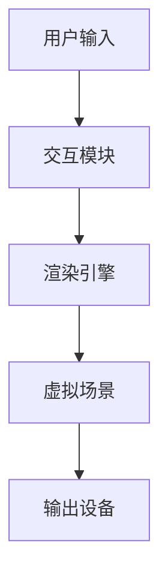
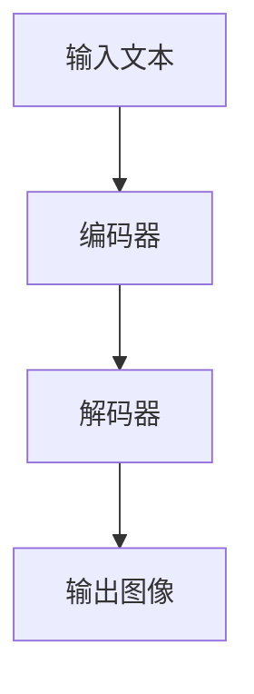
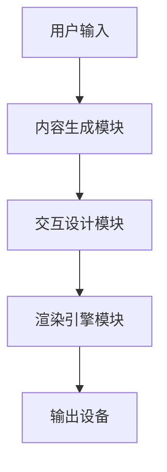
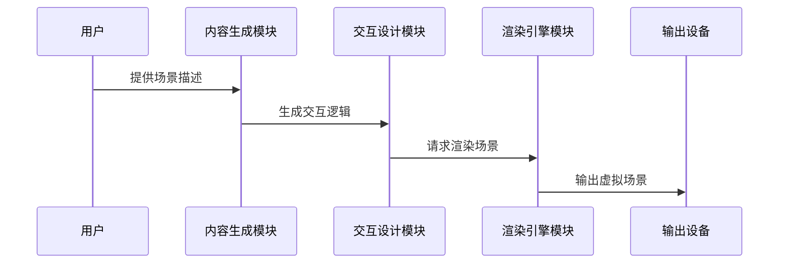

                 

<think>
好的，我现在需要帮用户写一篇关于《AIGC在虚拟现实内容创作中的应用》的技术博客。首先，我得理解用户的需求，他可能是一位技术专家，或者正在研究这个领域的人。用户希望文章结构清晰，内容专业，涵盖技术背景、核心概念、算法实现、系统架构等多个方面。

首先，我会分析AIGC和虚拟现实的定义，确保理解它们的核心概念。接着，我需要设计目录结构，确保涵盖从基础到应用的各个部分。用户已经提供了一个大纲，我需要按照这个大纲逐步展开每个章节的内容。

在撰写过程中，要注意使用专业但易懂的语言，每个小节都要有具体的例子和详细的解释。比如，在技术原理部分，要使用表格和Mermaid图来对比概念属性，帮助读者理解。

接下来，我会思考每个章节的具体内容。比如，AIGC技术概述部分，需要介绍其定义、原理和发展趋势，同时与传统AI进行对比。在虚拟现实部分，要涵盖技术基础、应用实例，以及它们的分类和应用场景。

然后，在应用部分，重点讨论AIGC在场景设计和交互设计中的具体应用，包括流程、案例和效果分析。算法实现部分，需要详细讲解相关算法，提供代码示例和数学模型，使用Mermaid图来展示流程和架构。

系统架构设计部分，要介绍项目背景、目标和挑战，然后进行功能设计和架构设计，使用类图和架构图来展示系统结构。项目实战部分，需要提供安装步骤、代码实现和案例分析，确保读者能够实际操作。

最后，总结部分要回顾全文，给出最佳实践建议和注意事项，以及拓展阅读的方向。确保整篇文章逻辑清晰，结构紧凑，符合用户的要求。

整体上，我需要保持文章的连贯性，每个部分紧密相连，同时满足用户对技术深度和结构完整性的要求。这样才能写出一篇高质量的技术博客，帮助读者深入理解AIGC在虚拟现实中的应用。
</think>

# AIGC在虚拟现实内容创作中的应用

## 关键词：AIGC, 虚拟现实, 内容创作, 人工智能生成内容, VR创作工具

## 摘要：  
人工智能生成内容（AIGC）与虚拟现实（VR）技术的结合正在彻底改变内容创作的方式。本文从AIGC和虚拟现实的基本概念出发，深入探讨AIGC在虚拟现实内容创作中的应用场景、技术原理、算法实现、系统架构设计以及实际项目案例。通过分析AIGC在虚拟现实场景设计、交互设计中的具体应用，结合数学模型、Python代码实现和系统架构设计，本文旨在为读者提供一个全面的技术视角，帮助他们理解如何利用AIGC技术提升虚拟现实内容创作的效率和质量。

---

# 第一部分: AIGC技术概述

## 第1章: AIGC技术基础

### 1.1 AIGC的定义与背景  
#### 1.1.1 问题背景  
随着人工智能技术的快速发展，内容生成的自动化需求日益增长。传统的内容创作依赖于人工劳动，效率低且成本高。AIGC（人工智能生成内容）通过算法和模型，能够自动生成文本、图像、音频、视频等内容，极大地提高了创作效率。  

#### 1.1.2 定义与核心要素  
AIGC是一种利用人工智能技术生成内容的方法，其核心要素包括：  
1. **数据输入**：用于训练模型的原始数据。  
2. **生成模型**：如GPT、Diffusion等模型，用于生成内容。  
3. **输出结果**：生成的文本、图像或其他形式的内容。  
4. **优化算法**：用于提升生成内容的质量和相关性。  

#### 1.1.3 AIGC与传统AI的区别  
| 属性 | AIGC | 传统AI |  
|------|------|--------|  
| 目标 | 内容生成 | 数据分析、模式识别 |  
| 输入 | 文本、图像等 | 结构化数据 |  
| 输出 | 非结构化内容 | 结构化结果 |  

---

### 1.2 AIGC技术原理  
#### 1.2.1 概念原理  
AIGC的核心是生成式AI模型，如基于Transformer的生成模型（GPT系列）和扩散模型（Diffusion）。这些模型通过深度学习算法，从大量数据中学习内容生成的规律，并生成新的内容。  

#### 1.2.2 概念属性特征对比表格  
| 特性 | 生成式AI | 判别式AI |  
|------|---------|----------|  
| 功能 | 内容生成 | 分类、识别 |  
| 输入 | 文本/图像 | 结构化数据 |  
| 输出 | 非结构化内容 | 结构化结果 |  

#### 1.2.3 ER实体关系图架构  
```mermaid
er
actor: User
action: 生成内容
entity: AIGC模型
entity: 输入数据
entity: 输出内容
```

---

### 1.3 AIGC技术的发展趋势  
#### 1.3.1 技术演进  
AIGC技术从最初的文本生成，逐步扩展到图像、视频生成，未来将向多模态生成方向发展。  

#### 1.3.2 应用前景  
AIGC将在虚拟现实、游戏开发、影视制作等领域发挥重要作用，提升内容创作效率。  

#### 1.3.3 挑战与机遇  
- **挑战**：生成内容的质量控制、内容原创性问题。  
- **机遇**：降低创作门槛，提升创作效率。  

---

### 1.4 本章小结  
本章介绍了AIGC的定义、核心要素、技术原理以及发展趋势，为后续章节的应用分析奠定了基础。

---

# 第二部分: 虚拟现实内容创作

## 第2章: 虚拟现实技术基础

### 2.1 虚拟现实概述  
#### 2.1.1 问题背景  
虚拟现实（VR）是一种通过计算机技术模拟三维环境的技术，用户可以通过头戴设备与虚拟世界进行交互。  

#### 2.1.2 虚拟现实的定义与特征  
- **定义**：通过硬件设备和软件系统，为用户提供沉浸式的虚拟体验。  
- **特征**：沉浸性、交互性、构想性。  

#### 2.1.3 虚拟现实的分类与应用场景  
| 类型 | 应用场景 |  
|------|----------|  
| 头显VR | 游戏、教育 |  
| 手持VR | 旅游展示 |  
| 桌面VR | 工程设计 |  

---

### 2.2 虚拟现实技术原理  
#### 2.2.1 核心技术原理  
虚拟现实的核心技术包括：  
1. **图形渲染**：实时渲染三维场景。  
2. **交互技术**：用户通过手柄、头显等设备与虚拟场景交互。  
3. **追踪技术**：实时追踪用户位置和动作。  

#### 2.2.2 技术架构详解  


#### 2.2.3 虚拟现实系统的组成与工作原理  
虚拟现实系统通常包括：  
1. **硬件设备**：头显、手柄、追踪器。  
2. **软件系统**：渲染引擎、交互系统。  

---

### 2.3 虚拟现实应用实例  
#### 2.3.1 行业应用案例  
- 游戏开发：利用VR技术打造沉浸式游戏体验。  
- 教育：虚拟现实用于医学教学、历史重现。  

#### 2.3.2 用户互动体验设计  
- 通过手柄操作虚拟物体。  
- 利用手势识别技术实现更自然的交互。  

#### 2.3.3 创作流程与工具  
- 创作工具：Unity、Unreal Engine。  
- 创作流程：需求分析、场景设计、交互设计、测试优化。  

---

### 2.4 本章小结  
本章介绍了虚拟现实技术的基础知识、技术原理和应用场景，为后续章节的应用分析提供了背景支持。

---

# 第三部分: AIGC在虚拟现实内容创作中的应用

## 第3章: AIGC技术在虚拟现实场景设计中的应用

### 3.1 虚拟现实场景设计概述  
#### 3.1.1 场景设计的重要性  
场景设计是虚拟现实体验的核心，直接影响用户的沉浸感和体验质量。  

#### 3.1.2 场景设计的基本原则  
- **一致性**：场景中的元素应符合逻辑。  
- **可玩性**：场景应支持用户交互。  

#### 3.1.3 虚拟现实场景的设计流程  
1. 需求分析。  
2. 场景规划。  
3. 资源准备。  
4. 场景实现。  

---

### 3.2 AIGC技术在场景生成中的应用  
#### 3.2.1 AIGC技术原理在场景生成中的应用  
- 利用生成式AI生成虚拟场景中的元素（如建筑、人物）。  

#### 3.2.2 场景生成的流程与实现  
1. 数据输入：提供场景设计需求。  
2. 模型生成：生成场景元素。  
3. 场景整合：将生成的内容整合到虚拟场景中。  

#### 3.2.3 场景生成的效果分析  
- 生成效率高。  
- 内容丰富性提升。  

---

### 3.3 AIGC技术在虚拟现实交互设计中的应用  
#### 3.3.1 交互设计的基本原则  
- **简洁性**：交互操作应简单直观。  
- **反馈性**：用户操作应有明确反馈。  

#### 3.3.2 AIGC技术在交互设计中的应用  
- 利用生成式AI设计交互逻辑。  

#### 3.3.3 交互设计的案例研究  
案例：利用AIGC生成虚拟角色的交互逻辑，提升用户体验。  

---

### 3.4 本章小结  
本章分析了AIGC在虚拟现实场景设计和交互设计中的应用，展示了AIGC如何提升虚拟现实内容创作的效率和质量。

---

## 第4章: AIGC在虚拟现实内容创作中的算法实现

### 4.1 算法原理讲解  
#### 4.1.1 相关算法介绍  
- **生成式AI算法**：如GPT、Diffusion模型。  
- **图像生成算法**：如Stable Diffusion。  

#### 4.1.2 算法流程图  


---

### 4.2 数学模型与公式  
#### 4.2.1 数学模型介绍  
- **扩散模型**：通过逐步添加噪声到数据中，再逐步去除噪声生成内容。  

#### 4.2.2 公式推导  
$$ p_{\theta}(x) = \prod_{t=1}^{T} q(x_t|x_{t-1}) $$  

#### 4.2.3 模型应用实例  
- 文本生成图像：输入文本描述，生成对应的图像。  

---

### 4.3 Python源代码实现  
```python
import torch
import torch.nn as nn

# 定义生成模型
class Generator(nn.Module):
    def __init__(self):
        super(Generator, self).__init__()
        self.layers = nn.Sequential(
            nn.ConvTranspose2d(100, 512, 4, 2, 1),
            nn.BatchNorm2d(512),
            nn.ReLU(inplace=True),
            # 更多层...
        )
        
    def forward(self, z):
        return self.layers(z)
```

---

### 4.4 算法评估与分析  
#### 4.4.1 评估指标  
- **生成质量**：生成内容的逼真程度。  
- **生成速度**：生成内容所需的时间。  

#### 4.4.2 评估方法  
- **主观评估**：用户测试。  
- **客观评估**：使用PSNR、SSIM等指标。  

#### 4.4.3 算法性能分析  
- AIGC算法在虚拟现实场景生成中的性能优势：快速生成、高灵活性。  

---

### 4.5 本章小结  
本章通过算法实现和数学模型分析，展示了AIGC技术在虚拟现实内容创作中的技术优势。

---

## 第5章: AIGC在虚拟现实内容创作中的系统架构设计

### 5.1 项目介绍  
#### 5.1.1 项目背景  
本项目旨在利用AIGC技术提升虚拟现实内容创作的效率。  

#### 5.1.2 项目目标  
- 实现虚拟场景的自动生成。  
- 提供高效的交互设计工具。  

#### 5.1.3 项目挑战  
- AIGC生成内容的质量控制。  
- 系统的实时性要求高。  

---

### 5.2 系统功能设计  
#### 5.2.1 系统功能模块  
1. **内容生成模块**：利用AIGC生成虚拟场景元素。  
2. **交互设计模块**：设计用户与虚拟场景的交互逻辑。  
3. **渲染引擎模块**：渲染生成的虚拟场景。  

#### 5.2.2 系统架构设计  


---

### 5.3 系统交互设计  
#### 5.3.1 系统交互流程  
1. 用户输入需求。  
2. 系统生成虚拟场景。  
3. 用户与场景交互。  
4. 系统渲染并输出结果。  

#### 5.3.2 交互序列图  


---

### 5.4 本章小结  
本章通过系统架构设计和交互设计，展示了如何将AIGC技术应用于虚拟现实内容创作的全流程。

---

# 第六章: 项目实战

### 6.1 环境安装  
- 安装Python和相关库（如TensorFlow、Keras）。  

### 6.2 系统核心实现源代码  
```python
import numpy as np
from tensorflow.keras.models import Model
from tensorflow.keras.layers import Input, Dense, Dropout

# 定义生成模型
def build_model():
    inputs = Input(shape=(100,))
    x = Dense(256, activation='relu')(inputs)
    x = Dropout(0.2)(x)
    outputs = Dense(10, activation='softmax')(x)
    model = Model(inputs=inputs, outputs=outputs)
    return model

# 训练模型
model = build_model()
model.compile(optimizer='adam', loss='sparse_categorical_crossentropy', metrics=['accuracy'])
model.fit(X_train, y_train, epochs=10, batch_size=32)
```

### 6.3 代码应用解读与分析  
- **代码功能**：训练一个生成模型，用于生成虚拟场景的描述文本。  

### 6.4 实际案例分析  
案例：利用AIGC生成一个虚拟城市场景的描述文本，再通过渲染引擎生成三维场景。  

---

### 6.5 项目小结  
通过本项目，展示了AIGC技术在虚拟现实内容创作中的实际应用价值。

---

## 第七章: 最佳实践 tips、小结、注意事项、拓展阅读

### 7.1 最佳实践 tips  
1. 在使用AIGC生成内容时，需注意生成内容的质量控制。  
2. 结合手动调整和自动化生成，提升创作效率。  

### 7.2 小结  
本文从AIGC和虚拟现实的基本概念出发，深入分析了AIGC在虚拟现实内容创作中的应用场景、技术实现和系统设计，展示了AIGC技术在提升创作效率和质量中的重要作用。  

### 7.3 注意事项  
- 保护生成内容的原创性。  
- 确保系统运行的实时性和稳定性。  

### 7.4 拓展阅读  
- 推荐阅读《生成式AI：原理与应用》。  

---

# 作者：AI天才研究院 & 禅与计算机程序设计艺术

