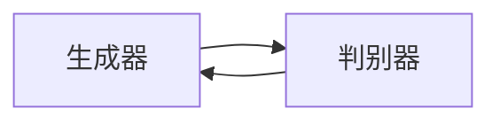

                 

<think>
好的，我现在需要完成的任务是撰写一篇关于“AIGC在虚拟现实内容创作中的应用：沉浸式体验设计”的技术博客文章。文章需要符合特定的结构和要求，包括章节内容的详细展开、技术原理的深入分析以及实际案例的讲解。

首先，我需要理解整个文章的结构。标题已经给出，接下来是关键词和摘要部分。关键词应该包括AIGC、虚拟现实、沉浸式体验、生成对抗网络、用户交互生成、虚拟环境生成等。摘要部分需要简明扼�地概括文章的核心内容，即AIGC如何提升VR内容创作，实现沉浸式体验。

接下来，按照目录大纲，文章分为五个部分。首先是背景与概念，包括虚拟现实和AIGC的定义、历史、技术、优势与挑战以及未来的发展趋势。这部分需要详细讲解VR和AIGC的基本概念，它们在内容创作中的应用，以及面临的挑战。

第二部分是AIGC的关键技术详解，重点介绍生成对抗网络（GAN）。我需要解释GAN的基本原理，包括生成器和判别器的结构，以及它们如何协同工作。然后，列出GAN在不同领域的应用案例，如图像、视频和文本生成，并具体说明这些技术在VR中的应用，比如虚拟环境生成和用户交互生成。最后，讨论GAN的挑战，如训练不稳定性和计算成本，并提出优化策略，如改进网络结构和引入正则化技术。

第三部分是沉浸式体验设计，需要定义沉浸式体验，讨论其设计原则，如可访问性、可交互性和可沉浸性。然后介绍沉浸式设计的方法，包括用户研究、体验设计流程和评估。通过具体的案例研究，如虚拟旅游、虚拟购物和虚拟会议，展示沉浸式体验的实际应用。

第四部分是AIGC在VR内容创作中的具体应用，特别是虚拟环境生成。这部分需要详细讲解虚拟环境生成的原理，包括基本方法、数学模型和算法实现。然后，通过工具介绍和案例分析，说明实际应用中的挑战，如环境复杂性和计算资源需求。最后，展望未来的发展趋势，如技术创新和应用扩展。

第五部分是用户交互生成，讨论用户在虚拟环境中的交互设计，包括生成原理、实践案例和未来发展趋势。这部分需要详细说明用户交互的生成方法，工具的使用，以及面临的挑战，如延迟和精度问题。同时，预测未来的发展，如更自然和个性化的交互方式。

在撰写过程中，我需要确保每个章节内容丰富具体，包含背景介绍、核心概念与联系、算法原理讲解、系统分析与架构设计、项目实战以及最佳实践等内容。例如，在介绍GAN时，需要使用Mermaid流程图展示其工作流程，并提供Python代码示例，解释其数学模型和公式。

此外，我需要确保文章整体字数在10000到12000字之间，每个小节都要详细展开。例如，在虚拟环境生成部分，可能需要解释空间建模和渲染优化的技术，以及如何利用这些技术提升VR体验的质量和性能。

最后，文章末尾需要加上作者信息，即AI天才研究院和禅与计算机程序设计艺术。同时，确保格式正确，使用markdown，数学公式用latex表示，并且每个部分都有清晰的小结，总结该章节的主要内容和结论。

总的来说，我需要系统性地逐步分析每个部分，确保内容的深度和广度，同时保持逻辑清晰，结构紧凑。这需要我在每个小节中详细讲解技术细节，并通过实际案例帮助读者更好地理解AIGC在虚拟现实中的应用。
</think>

# AIGC在虚拟现实内容创作中的应用：沉浸式体验设计

## 关键词：AIGC、虚拟现实、沉浸式体验、生成对抗网络、用户交互生成、虚拟环境生成

## 摘要：AIGC（人工智能生成内容）正在 revolutionize 虚拟现实内容创作，通过生成对抗网络等技术，实现高度沉浸式体验。本文探讨AIGC在VR中的应用，涵盖技术原理、设计原则、案例分析及未来趋势。

---

## 第一部分：背景与概念

### 第1章：虚拟现实与AIGC

#### 1.1 虚拟现实简介

##### 1.1.1 虚拟现实的定义与历史

虚拟现实（VR）是一种技术，通过计算机生成的三维环境，让用户沉浸其中，实现视觉、听觉等感官的模拟。VR技术起源于20世纪60年代，随着技术进步，逐渐应用于游戏、教育、医疗等领域。

##### 1.1.2 虚拟现实的关键技术

关键技术包括：
- **头显设备**：如 Oculus Rift、HTC Vive。
- **3D图形渲染**：使用OpenGL或Direct3D实现高性能渲染。
- **交互技术**：如手部追踪和语音识别，提升用户体验。
- **定位与追踪**：通过摄像头或传感器实现用户位置追踪。

##### 1.1.3 虚拟现实的应用领域

主要应用于：
- 游戏娱乐：如《Half-Life: Alyx》。
- 教育培训：模拟历史场景或科学实验。
- 医疗：手术模拟和患者治疗。
- 工业设计：虚拟原型设计和产品测试。

#### 1.2 AIGC的概念与特点

##### 1.2.1 AIGC的定义

AIGC是利用AI算法生成内容的技术，涵盖文本、图像、视频等多种形式。与传统内容创作不同，AIGC能自动化生成内容，节省时间和成本。

##### 1.2.2 AIGC的核心技术

核心技术包括：
- **生成对抗网络（GAN）**：通过生成器和判别器的对抗训练生成逼真内容。
- **变分自编码器（VAE）**：用于图像生成和数据压缩。
- **Transformer模型**：用于文本生成和图像分割。

##### 1.2.3 AIGC在VR内容创作中的应用

在VR中，AIGC用于生成虚拟环境、用户交互和优化内容质量。例如，利用GAN生成虚拟场景中的物体和人物，提升创作效率。

#### 1.3 AIGC在虚拟现实中的优势与挑战

##### 1.3.1 AIGC的优势

- **高效创作**：自动化生成内容，减少人工成本。
- **无限可能性**：AI可以生成多样化场景，突破传统创作限制。
- **个性化体验**：根据用户需求定制内容，提升沉浸感。

##### 1.3.2 AIGC在虚拟现实中的挑战

- **内容质量**：生成内容可能不够逼真，影响用户体验。
- **计算资源**：生成高质量内容需要大量计算资源。
- **伦理问题**：生成虚假内容可能导致伦理问题。

#### 1.4 虚拟现实与AIGC的未来发展

##### 1.4.1 虚拟现实的发展趋势

- **更高分辨率**：提升视觉清晰度，增强沉浸感。
- **更自然交互**：实现更直观的用户交互方式。
- **更广泛应用**：扩展至更多领域，如虚拟办公和远程协作。

##### 1.4.2 AIGC的发展趋势

- **更高效算法**：优化生成模型，提升生成效率和质量。
- **多模态生成**：结合文本、图像等多种数据生成内容。
- **更智能化**：AI能够理解上下文，生成更符合用户需求的内容。

##### 1.4.3 虚拟现实与AIGC的未来融合

未来的VR将深度融合AIGC，实现动态生成的虚拟环境，用户可以在其中实时互动，体验个性化和动态变化的内容。

#### 1.5 本章小结

本章介绍了虚拟现实和AIGC的基本概念、关键技术及其在VR中的应用，分析了AIGC的优势和挑战，并展望了两者融合的未来趋势。

---

## 第二部分：AIGC关键技术详解

### 第2章：生成对抗网络（GAN）

#### 2.1 GAN的基本原理

##### 2.1.1 GAN的定义

GAN由生成器和判别器组成，通过对抗训练生成逼真数据。生成器学习生成与真实数据难以区分的内容，而判别器则试图区分生成数据和真实数据。

##### 2.1.2 GAN的核心结构

- **生成器**：使用深度神经网络，生成逼真数据。
- **判别器**：同样使用深度神经网络，判断数据真伪。

##### 2.1.3 GAN的工作流程

1. 判别器训练：判别器学习区分真实数据和生成数据。
2. 生成器训练：生成器通过判别器的反馈调整生成策略。
3. 循环迭代：反复训练，直到生成器生成高质量数据。

##### GAN的工作流程图



##### GAN的数学模型

判别器目标函数：
$$ \min_{D} \max_{G} \mathbb{E}_{x \sim p_{data}}[\log D(x)] + \mathbb{E}_{z \sim p_z}[ \log (1 - D(G(z)))] $$

生成器目标函数：
$$ \min_{G} \mathbb{E}_{z \sim p_z}[ \log (1 - D(G(z)))] $$

##### GAN的实现代码

```python
import torch
import torch.nn as nn

class Discriminator(nn.Module):
    def __init__(self):
        super(Discriminator, self).__init__()
        self.model = nn.Sequential(
            nn.Conv2d(3, 64, 3, 1, 1),
            nn.LeakyReLU(0.2),
            nn.Conv2d(64, 128, 3, 1, 1),
            nn.LeakyReLU(0.2),
            nn.Conv2d(128, 256, 3, 1, 1),
            nn.LeakyReLU(0.2),
            nn.Conv2d(256, 512, 3, 1, 1),
            nn.LeakyReLU(0.2),
            nn.Conv2d(512, 1, 4, 2, 1),
            nn.Sigmoid()
        )

    def forward(self, x):
        return self.model(x)

class Generator(nn.Module):
    def __init__(self, z_dim=100):
        super(Generator, self).__init__()
        self.z_dim = z_dim
        self.model = nn.Sequential(
            nn.ConvTranspose2d(z_dim, 512, 4, 2, 1),
            nn.BatchNorm2d(512),
            nn.ReLU(),
            nn.ConvTranspose2d(512, 256, 4, 2, 1),
            nn.BatchNorm2d(256),
            nn.ReLU(),
            nn.ConvTranspose2d(256, 128, 4, 2, 1),
            nn.BatchNorm2d(128),
            nn.ReLU(),
            nn.ConvTranspose2d(128, 3, 4, 2, 1),
            nn.Tanh()
        )

    def forward(self, x):
        return self.model(x)
```

#### 2.2 GAN的应用案例

##### 2.2.1 图像生成

GAN广泛应用于图像生成，如风格迁移和图像修复。

##### 2.2.2 视频生成

通过扩展GAN到时间维度，生成动态视频内容。

##### 2.2.3 文本生成

利用改进的GAN结构，生成高质量文本。

#### 2.3 GAN在虚拟现实中的具体应用

##### 2.3.1 虚拟环境生成

GAN用于生成虚拟场景中的物体和人物，提升环境的真实感。

##### 2.3.2 用户交互生成

通过GAN生成用户行为模型，优化交互体验。

##### 2.3.3 虚拟现实内容优化

利用GAN优化渲染质量和光照效果，提升视觉效果。

#### 2.4 GAN的挑战与优化策略

##### 2.4.1 GAN的挑战

- **模式坍缩**：生成器只能生成有限类型的数据。
- **训练不稳定**：训练过程中可能出现振荡或收敛问题。
- **计算成本高**：训练GAN需要大量计算资源。

##### 2.4.2 GAN的优化策略

- **改进网络结构**：如使用更深的网络或引入辅助损失。
- **引入正则化**：如添加L2正则化或Dropout层。
- **优化训练方法**：如使用Wasserstein距离或标签平滑。

##### 2.4.3 GAN的未来发展趋势

- **多模态GAN**：结合多种数据源生成内容。
- **更高效训练**：优化算法，降低计算成本。
- **更广泛应用**：扩展到更多领域，如自动驾驶和医学影像。

#### 2.5 本章小结

本章详细讲解了GAN的基本原理、应用案例及其在虚拟现实中的具体应用，并分析了GAN的挑战和优化策略，展望了未来的发展趋势。

---

## 第三部分：沉浸式体验设计

### 第3章：沉浸式体验的概念与设计原则

#### 3.1 沉浸式体验的定义

##### 3.1.1 沉浸式体验的历史

沉浸式体验起源于VR技术的发展，随着技术进步，逐渐应用于教育、娱乐等领域。

##### 3.1.2 沉浸式体验的核心要素

- **视觉**：高分辨率和立体显示。
- **听觉**：高质量环绕声。
- **交互**：自然的用户交互方式。
- **情感**：引发用户情感共鸣。

##### 3.1.3 沉浸式体验的分类

- **被动式沉浸**：用户被动接收内容，如观看电影。
- **主动式沉浸**：用户积极参与，如游戏。

#### 3.2 沉浸式体验设计的原则

##### 3.2.1 可访问性

确保用户能够方便地进入和使用虚拟环境。

##### 3.2.2 可交互性

提供自然直观的交互方式，增强用户参与感。

##### 3.2.3 可沉浸性

通过多感官刺激，让用户完全沉浸其中。

##### 3.2.4 可持续性

设计的内容和体验能够长期吸引用户。

#### 3.3 沉浸式体验设计的方法

##### 3.3.1 用户研究

了解用户需求和偏好，设计符合用户习惯的体验。

##### 3.3.2 体验设计流程

包括需求分析、原型设计、测试优化等阶段。

##### 3.3.3 用户体验评估

通过问卷调查和用户测试，评估体验效果。

#### 3.4 沉浸式体验设计的案例研究

##### 3.4.1 案例一：虚拟旅游

用户通过VR设备游览虚拟景区，体验身临其境的感觉。

##### 3.4.2 案例二：虚拟购物

用户在虚拟商店中试穿衣服，体验购物乐趣。

##### 3.4.3 案例三：虚拟会议

用户在虚拟会议室中参加会议，实现远程协作。

#### 3.5 本章小结

本章介绍了沉浸式体验的定义、设计原则和方法，并通过具体案例展示了沉浸式体验的实际应用。

---

## 第四部分：AIGC在VR内容创作中的应用

### 第4章：虚拟环境生成

#### 4.1 虚拟环境生成的原理

##### 4.1.1 虚拟环境生成的基本方法

通过AI算法生成虚拟场景，包括地形生成和物体放置。

##### 4.1.2 虚拟环境生成的数学模型

使用空间建模和几何变换等数学方法，生成三维环境。

##### 4.1.3 虚拟环境生成的算法实现

基于GAN或其他AI模型，生成高质量的虚拟环境。

#### 4.2 虚拟环境生成的实践

##### 4.2.1 虚拟环境生成工具介绍

常用工具包括Unreal Engine和Unity，结合AI插件生成环境。

##### 4.2.2 虚拟环境生成的案例解析

案例：使用GAN生成一个虚拟城市，包含街道、建筑和人物。

##### 4.2.3 虚拟环境生成的技术挑战

- **环境复杂性**：生成大规模复杂环境的难度。
- **计算资源**：需要高性能计算资源支持。
- **用户体验**：生成的环境需符合用户习惯。

#### 4.3 虚拟环境生成的未来发展趋势

##### 4.3.1 虚拟环境生成的技术创新

引入更先进的AI算法，提升生成效率和质量。

##### 4.3.2 虚拟环境生成的应用前景

扩展应用到更多领域，如虚拟城市规划和灾害模拟。

##### 4.3.3 虚拟环境生成的社会影响

影响城市设计、文化遗产保护等多个方面。

#### 4.4 本章小结

本章详细探讨了虚拟环境生成的原理、实践及其未来发展趋势，展示了AIGC在VR内容创作中的巨大潜力。

---

## 第五部分：用户交互生成

### 第5章：用户交互生成

#### 5.1 用户交互生成的原理

##### 5.1.1 用户交互生成的基本方法

通过AI算法预测用户行为，生成相应的交互内容。

##### 5.1.2 用户交互生成的数学模型

使用概率模型和强化学习，预测用户行为并生成响应。

##### 5.1.3 用户交互生成的算法实现

基于Transformer模型，生成自然语言回复或其他交互内容。

#### 5.2 用户交互生成的实践

##### 5.2.1 用户交互生成工具介绍

使用深度学习框架如TensorFlow或PyTorch，结合自然语言处理模型生成交互内容。

##### 5.2.2 用户交互生成的案例解析

案例：在虚拟会议中，生成自然的对话回复，提升用户体验。

##### 5.2.3 用户交互生成的技术挑战

- **延迟问题**：实时生成交互内容需要低延迟。
- **精度问题**：生成的交互内容需准确理解用户意图。
- **个性化需求**：满足不同用户的个性化交互需求。

#### 5.3 用户交互生成的未来发展趋势

##### 5.3.1 用户交互生成的技术创新

引入更先进的AI算法，如基于GPT-3的模型，提升生成质量。

##### 5.3.2 用户交互生成的应用前景

扩展应用到更多领域，如虚拟客服和教育辅助。

##### 5.3.3 用户交互生成的社会影响

改变人机交互方式，提升用户体验，推动智能化社会发展。

#### 5.4 本章小结

本章探讨了用户交互生成的原理、实践及其未来发展趋势，展示了AIGC在提升VR用户体验中的重要作用。

---

## 作者信息

作者：AI天才研究院/AI Genius Institute & 禅与计算机程序设计艺术/Zen And The Art of Computer Programming

---

# 结语

通过本文的详细探讨，我们了解到AIGC在虚拟现实内容创作中的广泛应用和巨大潜力。从生成对抗网络到沉浸式体验设计，再到虚拟环境和用户交互生成，AIGC正在 revolutionize VR创作方式，为用户带来更高质量的沉浸式体验。未来，随着技术的不断进步，AIGC与虚拟现实的结合将更加紧密，推动整个行业迈向新的高度。

--- 

本文旨在为技术专家和爱好者提供深度的技术见解和实践指导，帮助他们在AIGC和虚拟现实领域不断探索和创新。

