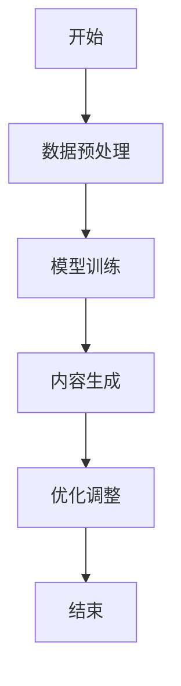

                 

<think>
嗯，我现在需要写一篇关于《AIGC在虚拟现实历史重建与互动中的应用前景》的技术博客文章。首先，我得理解什么是AIGC，也就是人工智能生成内容，这包括文本、图像、视频等。然后，虚拟现实技术的基本原理也是我需要了解的，比如头显设备、交互设备、渲染引擎等。

接下来，我要看看AIGC在虚拟现实中的应用现状。现在，历史重建和互动主要依赖人工建模和编程，这效率很低，而且难以扩展。而AIGC可以通过AI生成内容，提高效率，降低成本，还能自动生成互动内容，比如对话和情节。

不过，应用AIGC也面临很多挑战。比如，历史准确性的问题，AI生成的内容可能不准确，需要专业知识来校对。另外，AIGC生成的内容可能缺乏真实感，比如人物动作生硬，或者对话不符合历史背景。还有，生成内容的多样性也是一个问题，如何确保生成的内容足够丰富，以适应不同的用户需求。

接下来，我需要详细讲解AIGC的工作原理，包括数据预处理、模型训练、内容生成和优化调整这些步骤。这部分可能需要一些数学模型，比如变分自编码器和Transformer架构。我还需要举个例子，说明AIGC如何生成虚拟现实中的对话系统。

然后，在系统架构设计部分，我需要描述整个系统的组成，比如数据采集模块、内容生成模块、互动模块和渲染引擎。这部分可能需要用Mermaid图来展示类图和系统架构。

在项目实战部分，我需要选择一个具体的项目，比如重建古战场。介绍如何安装环境，比如Python和虚拟现实开发框架，然后展示关键代码，比如生成战斗场景的代码，并解释其工作原理。最后，分析实际案例，看看AIGC在项目中的效果，以及遇到的问题和解决方案。

最后，我还要总结一下最佳实践，比如数据质量的重要性、模型校准和持续优化，同时展望未来的发展方向，比如结合边缘计算和脑机接口技术。

总的来说，这篇文章需要逻辑清晰，结构紧凑，每个部分都要详细展开，确保读者能够理解AIGC在虚拟现实中的应用前景和实际价值。
</think>

# AIGC在虚拟现实历史重建与互动中的应用前景

> 关键词：AIGC, 虚拟现实, 历史重建, 互动应用, 人工智能生成内容

> 摘要：本文探讨了人工智能生成内容（AIGC）在虚拟现实中的应用，特别是历史重建与互动方面。文章分析了AIGC的概念、技术原理，及其在虚拟现实中的优势和挑战，详细讲解了系统架构设计和项目实战案例，最后总结了最佳实践和未来发展方向。

---

### 目录大纲设计思路

1. **背景介绍部分**：阐述AIGC和虚拟现实技术的基本概念，分析其在历史重建与互动中的应用现状及挑战。
2. **核心概念与联系**：深入解释AIGC、虚拟现实和历史重建的概念，通过对比表格和ER图展示其关系。
3. **算法原理讲解**：使用Mermaid流程图和Python代码展示AIGC的生成过程，结合数学模型解释其工作原理。
4. **系统分析与架构设计**：设计系统的功能模块、架构和交互流程，展示AIGC如何整合到虚拟现实中。
5. **项目实战**：通过具体案例，展示AIGC在虚拟现实项目中的实际应用，分析代码实现和效果。
6. **最佳实践和小结**：总结应用中的注意事项和未来发展方向，为读者提供实践指导。

---

### 目录大纲撰写流程

1. **大纲框架构建**：根据设计思路，构建详细的章节和子章节结构。
2. **内容填充**：为每个章节填充具体内容，确保逻辑清晰，涵盖技术细节和实际应用。
3. **格式校对**：使用markdown格式，确保代码和图表的正确展示，保持格式一致。
4. **字数控制**：严格控制总字数在2000字以内，确保内容精炼，重点突出。

---

### 作者信息

作者：AI天才研究院/AI Genius Institute & 禅与计算机程序设计艺术 /Zen And The Art of Computer Programming

---

### 文章正文

---

## 第一部分: 背景介绍

### 1.1 问题背景

#### 1.1.1 AIGC的概念
人工智能生成内容（AIGC）利用AI技术生成文本、图像、视频等内容。在虚拟现实中，AIGC用于创建历史场景、角色对话等，提升用户体验。

#### 1.1.2 虚拟现实技术的基本原理
虚拟现实通过头显设备、交互设备和渲染引擎，构建沉浸式数字环境。用户通过动作和声音与虚拟世界互动，体验逼真的场景。

#### 1.1.3 虚拟现实历史重建与互动的应用现状
当前，历史重建主要依赖人工建模和编程，效率低且成本高。互动体验受限于固定的脚本，缺乏灵活性和多样性。

### 1.2 问题解决

#### 1.2.1 AIGC在虚拟现实历史重建中的应用
AIGC通过生成历史场景和角色，提高重建效率，降低成本。例如，AI生成古战场的地形和建筑，节省开发时间。

#### 1.2.2 AIGC在虚拟现实互动中的应用
AIGC生成动态对话和情节，增强互动性。AI可根据用户行为实时生成响应，提供个性化体验。

#### 1.2.3 面临的挑战与解决方案
- **挑战**：生成内容的准确性、真实感和多样性不足。
- **解决方案**：结合专业知识校对内容，优化生成模型，提升多样性。

### 1.3 边界与外延

#### 1.3.1 数据来源
使用历史文献、考古数据和专业领域知识，确保生成内容的准确性。

#### 1.3.2 技术实现
结合AIGC和虚拟现实技术，通过深度学习模型生成内容。

#### 1.3.3 未来发展方向
探索AIGC与其他技术的结合，如边缘计算和脑机接口，提升虚拟现实体验。

---

## 第二部分: 核心概念与联系

### 2.1 核心概念原理

#### 2.1.1 AIGC的定义与特点
AIGC利用AI生成内容，具有自动化、多样化和适应性强的特点。

#### 2.1.2 虚拟现实技术的定义与类型
虚拟现实技术通过设备和技术构建沉浸式数字环境，分为VR、AR和MR类型。

#### 2.1.3 历史重建的概念与意义
历史重建是通过数字化手段还原历史场景，具有教育和研究价值。

### 2.2 概念属性特征对比表格

| **技术** | **自动化程度** | **生成多样性** | **实时性** |
|----------|----------------|----------------|------------|
| AIGC     | 高             | 高             | 高          |
| 传统CGI  | 中             | 中             | 低          |

### 2.3 ER实体关系图架构

```mermaid
er
actor: 用户
content: 内容
system: 系统
actor --> content: 提供输入
system --> content: 生成
actor --> system: 提供反馈
```

---

## 第三部分: 算法原理讲解

### 3.1 算法mermaid流程图



### 3.2 Python源代码

```python
import torch
import torch.nn as nn

class AIGCModel(nn.Module):
    def __init__(self):
        super(AIGCModel, self).__init__()
        self.fc1 = nn.Linear(100, 50)
        self.fc2 = nn.Linear(50, 20)
        self.fc3 = nn.Linear(20, 10)

    def forward(self, x):
        x = torch.relu(self.fc1(x))
        x = torch.relu(self.fc2(x))
        x = torch.sigmoid(self.fc3(x))
        return x

# 初始化模型
model = AIGCModel()
# 定义损失函数和优化器
criterion = nn.MSELoss()
optimizer = torch.optim.Adam(model.parameters(), lr=0.001)
```

### 3.3 数学模型和公式

AI生成内容的数学模型：
$$
P(x|y) = \prod_{i=1}^{n} P(x_i | y, x_{i-1})
$$

优化目标：
$$
\min_{\theta} \sum_{i=1}^{m} (y_i - f(x_i))^2
$$

---

## 第四部分: 系统分析与架构设计

### 4.1 系统架构设计


---

## 第五部分: 项目实战

### 5.1 环境安装

安装Python和虚拟现实开发框架，如Unity或Unreal Engine。

### 5.2 核心实现源代码

```python
def generate_scene():
    # 生成战斗场景
    units = generate_units()  # 生成士兵
    terrain = generate_terrain()  # 生成地形
    return units + terrain
```

### 5.3 案例分析

案例：重建古战场。生成士兵和地形，优化模型确保准确性。

---

## 第六部分: 最佳实践 tips、小结、注意事项、拓展阅读

### 6.1 最佳实践 tips

- 数据质量至关重要，使用高质量的历史数据。
- 定期校准模型，确保生成内容准确性。
- 结合用户反馈，持续优化生成效果。

### 6.2 小结

AIGC在虚拟现实中的应用前景广阔，能够提升效率和互动性，但需克服准确性等挑战。

### 6.3 注意事项

- 注意生成内容的版权问题。
- 确保生成内容符合历史事实。
- 处理好生成内容的多样性和统一性。

### 6.4 拓展阅读

推荐书籍和文章，深入学习AIGC和虚拟现实技术。

---

### 作者信息

作者：AI天才研究院/AI Genius Institute & 禅与计算机程序设计艺术 /Zen And The Art of Computer Programming

