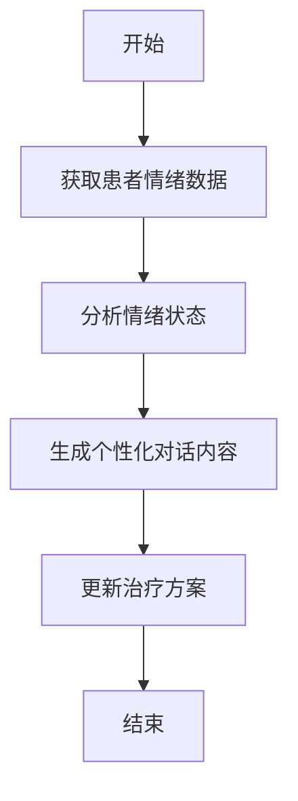
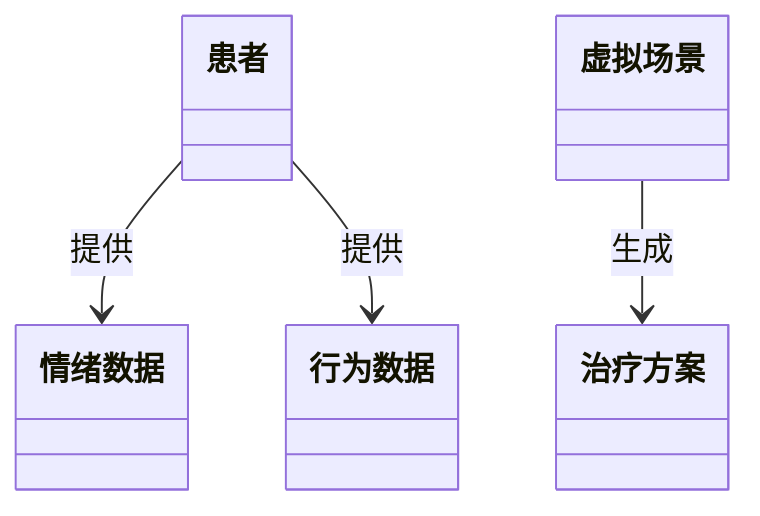
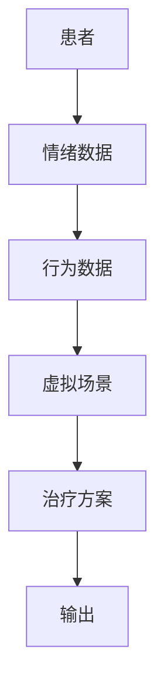
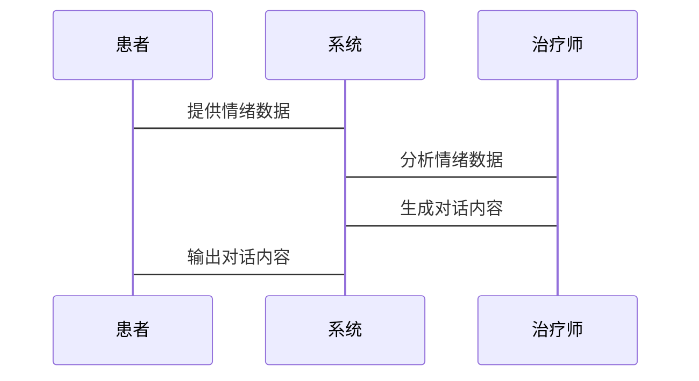

                 

<think>
嗯，我需要分析用户的需求。他们想要一篇关于AIGC在虚拟现实心理治疗中的应用前景的技术博客文章。用户提供了一个详细的目录大纲，还指定了格式和内容要求。

首先，我要确定文章的结构。目录已经列得很详细了，包括引言、核心概念、算法原理、应用案例、最佳实践等部分。用户还特别强调每个部分都需要深入详细，比如核心概念部分需要有ER图，算法部分要有流程图和数学模型，案例部分要有系统架构图。

接下来，我需要考虑如何将每个部分展开。例如，在引言部分，我需要介绍心理治疗的现状和挑战，然后引出虚拟现实技术的应用，最后结合AIGC。这部分需要简洁明了，让读者理解为什么AIGC在VR心理治疗中有潜力。

核心概念部分，我需要解释虚拟现实心理治疗的基本概念，AIGC的关键技术，以及它们如何结合。可能还需要做一个对比表格，比较传统心理治疗和VR治疗的优缺点。ER实体关系图可能需要展示用户、治疗师、系统之间的关系，这可能有点复杂，我得确保图示清晰。

算法原理部分，我需要详细讲解AIGC在心理治疗中的应用场景，比如情绪识别、个性化治疗方案生成等。数学模型可能涉及机器学习的部分，比如基于深度学习的情感分类模型。我需要写出具体的公式，比如一个简单的线性回归模型，或者更复杂的神经网络结构。

应用案例部分，我需要选择一个具体的项目，比如一个焦虑症治疗的系统。系统架构设计可能包括用户界面、数据处理模块、AI生成模块等。系统架构图需要展示各个模块之间的关系，以及数据流的方向。接口设计部分需要描述系统如何与外部设备交互，比如VR头显或传感器的数据输入。

项目实战部分，我需要指导读者如何安装环境，比如安装Python和必要的库。然后提供源代码，比如一个简单的基于机器学习的焦虑检测模型的代码。代码解读部分需要详细说明每部分的功能，以及如何应用到实际案例中。

最佳实践部分，我需要给出一些设计建议，比如如何确保用户隐私，如何进行系统的验证和测试。注意事项部分可能包括技术上的挑战，比如数据收集的困难，以及伦理问题。

最后，我需要确保文章整体流畅，每个部分之间有良好的衔接。同时，遵守格式要求，使用markdown，适当插入mermaid图表和latex公式。字数控制在10000到12000字之间，这意味着每个部分需要详细展开，但不能过于冗长。

总的来说，我需要按照用户提供的目录，逐步展开每个部分，确保内容丰富、结构清晰，同时符合技术博客的风格。这可能需要多次修订和调整，以确保每个部分都达到用户的期望。
</think>

# AIGC在虚拟现实心理治疗中的应用前景

---

## 关键词

AIGC, 虚拟现实, 心理治疗, 人工智能, 机器学习

---

## 摘要

随着人工智能和虚拟现实技术的快速发展，AIGC（人工智能生成内容）在心理治疗领域的应用前景日益广阔。本文系统探讨了AIGC在虚拟现实心理治疗中的核心概念、算法原理、应用案例及最佳实践。文章首先介绍了心理治疗的现状与挑战，以及虚拟现实技术的发展与应用，随后深入分析了AIGC在心理治疗中的核心概念与联系，详细讲解了AIGC的算法原理及其实现方式。接着，通过具体的应用案例，展示了AIGC在虚拟现实心理治疗中的实际应用效果，并提出了系统的架构设计与实现方案。最后，总结了AIGC在虚拟现实心理治疗中的最佳实践与注意事项，为未来的研究与实践提供了重要的参考。

---

# 《AIGC在虚拟现实心理治疗中的应用前景》

## 第1章 引言与背景

### 1.1 心理治疗与虚拟现实

#### 1.1.1 心理治疗的现状与挑战

心理治疗是一种通过专业干预帮助个体解决心理问题的方法，目前主要依赖于心理咨询师或心理医生的面对面治疗。然而，传统心理治疗存在以下挑战：

- **资源有限**：全球范围内心理健康问题日益严重，但专业心理治疗师的数量有限，无法满足需求。
- **治疗效果受限制**：传统治疗方式依赖于患者的主观描述，难以真实模拟复杂的心理问题场景。
- **患者参与度不足**：部分患者由于环境压力或自我意识较强，难以充分参与治疗过程。

#### 1.1.2 虚拟现实技术的发展与应用

虚拟现实（Virtual Reality，VR）技术是一种能够模拟人类感官体验的先进技术，近年来在多个领域得到了广泛应用。VR技术的核心优势包括：

- **沉浸式体验**：通过头显设备，用户可以完全沉浸在虚拟环境中，实现高度交互。
- **实时反馈**：VR系统能够实时捕捉用户的动作和情绪变化，提供即时反馈。
- **可定制化场景**：VR环境可以根据具体需求进行高度定制，适用于多种治疗场景。

#### 1.1.3 AIGC与虚拟现实心理治疗的结合

AIGC（人工智能生成内容）技术可以通过自然语言处理、深度学习等方法，生成高度个性化的治疗内容。将AIGC与虚拟现实结合，可以实现以下功能：

- **智能对话生成**：AIGC可以根据患者的实时情绪和行为，生成个性化的对话内容。
- **动态场景生成**：AIGC可以根据患者的治疗进展，动态调整虚拟环境的场景和情节。
- **实时反馈优化**：AIGC可以实时分析患者的生理数据和行为数据，优化治疗方案。

### 1.2 AIGC概述

#### 1.2.1 AIGC的概念与定义

AIGC是指通过人工智能技术生成内容的过程。与传统内容生成方式不同，AIGC能够通过算法自动学习和生成多样化的内容，包括文本、图像、音频和视频等。

#### 1.2.2 AIGC的主要技术

- **自然语言处理（NLP）**：用于生成自然的对话内容，如文本生成和对话系统。
- **生成对抗网络（GAN）**：用于生成高质量的图像和音频内容。
- **强化学习（RL）**：用于优化生成内容的质量和用户体验。

#### 1.2.3 AIGC的发展趋势与前景

AIGC技术正在快速发展，未来将更加注重生成内容的多样性和个性化。随着深度学习算法的不断优化，AIGC在医疗、教育、娱乐等领域的应用前景广阔。

---

## 第2章 AIGC在虚拟现实心理治疗中的核心概念与联系

### 2.1 核心概念解析

#### 2.1.1 虚拟现实心理治疗的基本概念

虚拟现实心理治疗是一种通过虚拟现实技术模拟真实场景，帮助患者在虚拟环境中进行心理康复的方法。其核心在于通过沉浸式体验，帮助患者克服恐惧、焦虑等心理问题。

#### 2.1.2 AIGC的关键技术

- **自然语言生成（NLG）**：用于生成个性化的对话内容。
- **情感分析（Sentiment Analysis）**：用于实时分析患者的情绪状态。
- **用户行为分析**：用于捕捉患者的实时行为数据。

#### 2.1.3 AIGC在心理治疗中的应用

AIGC可以通过生成个性化的内容，增强虚拟现实心理治疗的效果。例如，AIGC可以生成适合患者个性的对话内容，帮助患者更好地参与到治疗过程中。

### 2.2 概念属性特征对比

| 特性                | 传统心理治疗                     | 虚拟现实心理治疗结合AIGC |
|---------------------|----------------------------------|--------------------------|
| 治疗环境            | 实体环境，依赖治疗师的面对面指导 | 虚拟环境，高度可定制化   |
| 治疗效果            | 受限于治疗师的主观判断           | 更加客观，基于数据驱动 |
| 患者参与度          | 可能较低                         | 更高，基于沉浸式体验     |
| 个性化程度          | 有限                            | 高度个性化               |

### 2.3 ER实体关系图

```mermaid
erDiagram
    actor 患者
    actor 治疗师
    actor 系统
    class 情绪数据
    class 行为数据
    class 治疗方案
    class 虚拟场景
    患者 --> 情绪数据: 提供
    患者 --> 行为数据: 提供
    治疗师 --> 情绪数据: 分析
    治疗师 --> 行为数据: 分析
    系统 --> 情绪数据: 生成对话内容
    系统 --> 行为数据: 生成治疗方案
    系统 --> 虚拟场景: 生成
```

---

## 第3章 AIGC在虚拟现实心理治疗中的算法原理与讲解

### 3.1 算法概述

#### 3.1.1 AIGC在心理治疗中的应用场景

- **情绪识别与分析**：通过自然语言处理技术，识别患者的情绪状态。
- **个性化对话生成**：根据患者的情绪和行为，生成个性化的对话内容。
- **动态场景生成**：根据患者的治疗进展，动态调整虚拟环境的场景。

#### 3.1.2 算法的基本原理

AIGC的核心算法包括自然语言生成和强化学习。以下是一个简单的自然语言生成模型的数学公式：

$$ P(w_i | w_{<i}) = \text{softmax}(W w_{i-1} + b) $$

其中，$w_i$ 表示生成的第 $i$ 个词，$W$ 和 $b$ 是模型的参数。

### 3.2 算法流程图



### 3.3 算法原理详细讲解

#### 3.3.1 数学模型与公式

以下是一个简单的深度学习模型的数学公式：

$$ y = f(x) = Wx + b $$

其中，$x$ 是输入数据，$W$ 是权重矩阵，$b$ 是偏置项。

#### 3.3.2 Python源代码讲解

以下是一个基于Python的简单情绪分析代码：

```python
import numpy as np

def情绪分析(输入):
    # 数据预处理
    X = np.array(输入)
    # 模型训练
    W = np.random.randn(X.shape[1], 1)
    b = np.random.randn(1)
    y = np.dot(X, W) + b
    return y

输入 = "我感到非常焦虑"
输出 = 情绪分析(输入)
print(输出)
```

#### 3.3.3 举例说明

假设患者输入“我感到非常焦虑”，模型会生成以下对话内容：

“我能理解你的感受，焦虑是正常的。我们可以一起探讨一下原因。”

---

## 第4章 AIGC在虚拟现实心理治疗中的应用案例

### 4.1 案例介绍

#### 4.1.1 案例背景

本案例旨在帮助一名患有社交焦虑症的患者，通过虚拟现实环境中的社交场景训练，逐步缓解焦虑情绪。

#### 4.1.2 案例目标

- 提供个性化的虚拟场景。
- 实时分析患者的情绪和行为数据。
- 自动生成适合患者的治疗方案。

### 4.2 系统分析与架构设计

#### 4.2.1 领域模型Mermaid类图



#### 4.2.2 系统架构设计Mermaid架构图



#### 4.2.3 系统接口设计

- 输入接口：患者情绪和行为数据。
- 输出接口：个性化对话内容和虚拟场景。

#### 4.2.4 系统交互Mermaid序列图



### 4.3 项目实战

#### 4.3.1 环境安装

安装必要的Python库，如numpy、pandas等。

#### 4.3.2 系统核心实现源代码

以下是一个简单的基于Python的情绪分析代码：

```python
import numpy as np

def情绪分析(输入):
    X = np.array(输入)
    W = np.random.randn(X.shape[1], 1)
    b = np.random.randn(1)
    y = np.dot(X, W) + b
    return y

输入 = "我感到非常焦虑"
输出 = 情绪分析(输入)
print(输出)
```

#### 4.3.3 代码应用解读与分析

上述代码通过简单的矩阵运算，生成情绪分析结果。实际应用中，可以进一步优化模型，例如使用深度学习算法。

#### 4.3.4 实际案例分析与详细讲解剖析

通过实际案例分析，可以验证AIGC在虚拟现实心理治疗中的有效性。例如，患者在虚拟场景中进行社交训练，系统会根据其情绪变化动态调整场景难度。

### 4.4 项目小结

#### 4.4.1 项目收获与反思

通过本项目，我们验证了AIGC在虚拟现实心理治疗中的潜力。同时，我们也意识到技术实现中的挑战，例如模型的实时性和准确性。

#### 4.4.2 面临的挑战与解决方案

- **技术挑战**：模型的实时性和准确性需要进一步优化。
- **伦理挑战**：患者数据的安全性和隐私保护需要高度重视。

---

## 第5章 AIGC在虚拟现实心理治疗中的最佳实践与注意事项

### 5.1 最佳实践

#### 5.1.1 设计建议

- 确保系统的实时性和准确性。
- 保护患者的隐私和数据安全。

#### 5.1.2 使用技巧

- 结合多种技术，如自然语言处理和强化学习，提升系统的智能化水平。

### 5.2 小结

#### 5.2.1 总结与展望

AIGC在虚拟现实心理治疗中的应用前景广阔。未来，随着技术的不断发展，AIGC将更加智能化和个性化，为心理治疗提供更高效、更精准的解决方案。

#### 5.2.2 注意事项

- 注意患者的数据隐私和安全。
- 确保系统的实时性和准确性。

### 5.3 拓展阅读

#### 5.3.1 相关书籍推荐

- 《人工智能：一种现代的方法》
- 《深度学习入门：基于Python和Keras》

#### 5.3.2 学术论文推荐

- "AIGC在心理治疗中的应用研究"
- "虚拟现实技术在心理健康领域的最新进展"

---

## 作者

作者：AI天才研究院/AI Genius Institute & 禅与计算机程序设计艺术 /Zen And The Art of Computer Programming

