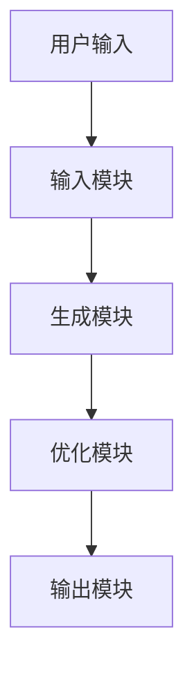

                 

<think>
好，我需要帮用户写一篇关于《AIGC在虚拟现实教育中的创新应用》的技术博客。用户给了一个详细的目录结构，我得按照这个结构来一步步完成文章。

首先，我要理解用户的需求。他是一位技术专家，想要一篇结构清晰、内容详尽的专业博客，包含背景、技术原理、应用案例、挑战与未来展望，以及系统设计和实践等内容。用户还强调要使用专业的技术语言，逻辑清晰，有实际的代码和图表。

接下来，我得按照目录开始撰写。首先是摘要，然后是各个章节。我需要确保每个章节都有足够的细节，比如在AIGC概述中，要解释什么是AIGC，它的核心优势，以及虚拟现实教育的发展历程。

在技术基础部分，我需要详细讲解AIGC的技术原理，包括核心算法、架构，以及面临的技术挑战和解决策略。这部分可能需要结合数学公式和mermaid图来展示。

然后是应用案例，我需要列出虚拟课堂、实景模拟和虚拟实验中的具体应用，每个案例都要有实例和分析。创新应用部分则要讨论个性化学习、智能评价和协作学习，每个部分都要有具体的例子和挑战分析。

接下来是挑战与未来发展的章节，我需要分析技术、政策和适应性方面的挑战，并展望未来的发展趋势。应用实践部分需要详细描述如何搭建系统，包括硬件、软件、开发工具，以及系统架构和核心模块的实现。

最后是最佳实践与拓展，我需要总结成功的因素，提供小结和展望，推荐相关的书籍和论文。同时，要记得在结尾加上作者信息。

在整个写作过程中，我要确保每个小节都内容丰富，使用markdown格式，包含图表、公式和代码示例。数学公式要用latex，图表用mermaid，这样文章看起来专业且易于理解。

我可能会遇到一些困难，比如如何将复杂的算法用mermaid图清晰表达，或者如何将技术细节与实际案例结合起来。这时候，我需要仔细查阅相关资料，确保内容准确，并通过实际例子帮助读者理解。

总之，我需要按照用户提供的结构，一步步深入分析，确保每个部分都详细且有深度，最终完成一篇高质量的技术博客。
</think>

# AIGC在虚拟现实教育中的创新应用

> 关键词：AIGC，虚拟现实教育，人工智能生成内容，个性化学习，智能评价，协作学习

> 摘要：本文探讨了AIGC（人工智能生成内容）在虚拟现实教育中的创新应用，从技术背景、核心概念、算法原理、系统架构到实际应用案例，详细分析了AIGC如何提升虚拟现实教育的个性化学习、智能评价和协作学习体验。文章还讨论了融合过程中的挑战与未来发展趋势，为教育技术领域的研究和实践提供了有价值的参考。

---

## 第一部分: AIGC与虚拟现实教育背景

### 第1章: AIGC与虚拟现实教育概述

#### 1.1 AIGC概述

##### 1.1.1 AIGC的概念与核心优势

AIGC（Artificial Intelligence Generated Content，人工智能生成内容）是指通过人工智能技术自动生成文本、图像、音频、视频等多样化内容的过程。与传统内容创作相比，AIGC具有以下核心优势：

- **高效性**：通过算法自动化生成内容，大幅减少人工创作的时间和成本。
- **多样性**：能够快速生成多种风格和类型的内容，满足不同场景的需求。
- **适应性**：可以根据用户反馈实时调整内容，提供动态化的学习体验。
- **创新性**：通过算法模拟人类创造力，生成具有创新性的内容。

##### 1.1.2 虚拟现实教育的基本概念与发展历程

虚拟现实教育（Virtual Reality Education）是指利用虚拟现实技术（VR）构建沉浸式的学习环境，通过模拟真实场景或抽象概念，帮助学习者更好地理解和掌握知识。其发展历程可以分为以下几个阶段：

1. **萌芽阶段（20世纪90年代）**：虚拟现实技术初步应用于教育领域，主要用于简单的几何图形展示和基础模拟。
2. **发展阶段（21世纪初）**：随着计算机图形学和交互技术的进步，虚拟现实教育开始应用于医学、工程等专业领域。
3. **普及阶段（近年来）**：随着VR设备的普及和云计算技术的发展，虚拟现实教育逐渐进入大众化应用，尤其是在K-12教育和职业教育中。

##### 1.1.3 AIGC在虚拟现实教育中的融合优势

AIGC与虚拟现实教育的结合，主要体现在以下方面：

- **内容生成**：通过AIGC技术，可以快速生成适合不同学习者的个性化学习内容。
- **动态调整**：根据学习者的行为和反馈，实时生成适应性内容，提升学习体验。
- **降低开发成本**：通过自动化生成虚拟场景和教学资源，减少教育内容开发的时间和成本。

---

#### 1.2 AIGC技术基础

##### 1.2.1 AIGC的核心算法

AIGC的核心算法主要包括以下几种：

1. **生成对抗网络（GAN，Generative Adversarial Networks）**：通过两个神经网络（生成器和判别器）的对抗训练，生成逼真的内容。
2. **变体自编码器（VAE，Variational Autoencoder）**：通过编码和解码过程，生成多样化的内容。
3. ** transformers**：基于自注意力机制，生成高质量的文本内容。

##### 1.2.2 AIGC技术架构

AIGC的技术架构通常包括以下几个模块：

- **输入模块**：接收用户需求或输入数据。
- **生成模块**：基于输入数据生成内容。
- **优化模块**：对生成的内容进行优化和调整。
- **输出模块**：将优化后的内容输出给用户。

##### 1.2.3 AIGC的关键技术挑战与解决策略

AIGC在实际应用中面临以下技术挑战：

- **内容质量**：生成内容的质量不稳定，可能出现不连贯或错误。
- **计算资源**：AIGC需要大量计算资源，尤其是在生成高质量图像和视频时。
- **内容原创性**：生成内容可能缺乏原创性，容易出现抄袭问题。

解决策略包括：

- **优化算法**：改进生成模型的结构和训练方法，提升生成内容的质量。
- **分布式计算**：利用云计算和分布式计算技术，降低计算资源消耗。
- **内容审核**：通过人工审核或AI辅助审核，确保生成内容的原创性和准确性。

---

#### 1.3 虚拟现实教育应用案例

##### 1.3.1 AIGC在虚拟课堂中的应用

- **案例背景**：某教育机构利用AIGC技术生成个性化的教学课件，根据学生的学习进度和兴趣生成不同风格的课件。
- **应用效果**：学生的学习兴趣和效果显著提升，教师的工作效率也大幅提高。

##### 1.3.2 AIGC在实景模拟教学中的应用

- **案例背景**：在医学教育中，利用AIGC生成虚拟人体解剖模型，帮助学生进行手术模拟训练。
- **应用效果**：学生可以通过与虚拟模型的交互，更直观地理解人体结构和手术过程。

##### 1.3.3 AIGC在虚拟实验环境中的应用

- **案例背景**：在物理实验教学中，利用AIGC生成虚拟实验场景，学生可以在虚拟环境中进行实验操作。
- **应用效果**：学生可以安全地进行实验操作，避免实验事故，同时能够多次重复实验，巩固知识。

---

## 第二部分: AIGC在虚拟现实教育中的创新应用

### 第2章: AIGC在虚拟现实教育中的创新应用

#### 2.1 虚拟现实教育中的个性化学习

##### 2.1.1 个性化学习模式

个性化学习是指根据学生的兴趣、能力和学习进度，提供定制化的学习内容和学习路径。

##### 2.1.2 AIGC在个性化学习中的应用实例

- **动态内容生成**：根据学生的学习进度和兴趣，实时生成个性化的内容。
- **自适应学习路径**：通过AIGC生成的学习路径，帮助学生逐步掌握知识。

##### 2.1.3 个性化学习的挑战与对策

- **挑战**：个性化学习需要大量的数据支持，且内容生成的实时性要求较高。
- **对策**：利用大数据技术和分布式计算，提升内容生成的效率和准确性。

#### 2.2 虚拟现实教育中的智能评价

##### 2.2.1 智能评价的概念与重要性

智能评价是指通过AI技术对学习者的行为、表现和成果进行实时评价。

##### 2.2.2 AIGC在智能评价中的应用

- **实时反馈**：通过AIGC生成实时反馈，帮助学生及时了解自己的学习情况。
- **动态调整评价标准**：根据学生的表现，动态调整评价标准，确保评价的公平性和准确性。

##### 2.2.3 智能评价的案例分析

- **案例背景**：某在线教育平台利用AIGC技术，对学生的作业进行实时评价。
- **应用效果**：学生能够及时收到反馈，教师可以更高效地进行教学管理。

#### 2.3 虚拟现实教育中的协作学习

##### 2.3.1 协作学习模式

协作学习是指多个学习者共同完成学习任务，通过互动和合作来提升学习效果。

##### 2.3.2 AIGC在协作学习中的应用

- **虚拟协作空间**：通过AIGC生成虚拟协作空间，学生可以在虚拟环境中进行协作学习。
- **实时内容生成**：根据协作过程中的互动，实时生成协作内容。

##### 2.3.3 协作学习的效益与挑战

- **效益**：协作学习能够提升学生的团队合作能力和问题解决能力。
- **挑战**：协作学习需要高效的互动和实时的内容生成，对技术要求较高。

---

## 第三部分: 虚拟现实教育与AIGC的融合挑战与未来发展

### 第3章: 融合挑战与未来发展趋势

#### 3.1 融合挑战

##### 3.1.1 技术层面的挑战

- **计算资源**：AIGC需要大量的计算资源，尤其是在生成高质量的虚拟场景时。
- **算法优化**：需要不断优化生成算法，提升生成内容的质量和稳定性。

##### 3.1.2 教育制度与政策层面的挑战

- **政策支持**：需要政府和教育机构的政策支持，推动AIGC在教育中的应用。
- **教师培训**：需要对教师进行AIGC技术的培训，提升其技术应用能力。

##### 3.1.3 教师与学生的适应性问题

- **教师适应性**：教师需要适应新的教学模式和技术工具。
- **学生适应性**：学生需要适应基于AIGC的虚拟现实学习环境。

#### 3.2 未来发展趋势

##### 3.2.1 虚拟现实教育的未来发展方向

- **沉浸式体验**：通过高精度的虚拟现实技术，提供更沉浸式的学习体验。
- **智能化学习**：结合AIGC和人工智能技术，提供更智能化的学习支持。

##### 3.2.2 AIGC技术在未来教育中的前景

- **内容生成**：AIGC将继续在教育内容生成中发挥重要作用，尤其是个性化和动态内容生成。
- **教育创新**：AIGC将推动教育模式和教学方法的创新，提升教育质量和效率。

##### 3.2.3 融合发展的潜在影响与机遇

- **教育公平**：通过AIGC和虚拟现实技术，教育资源可以更公平地分配，尤其是在偏远地区。
- **教育创新**：AIGC和虚拟现实技术将推动教育创新，提供更多元化的学习方式。

---

## 第四部分: AIGC在虚拟现实教育中的应用实践

### 第4章: 应用实践与案例分析

#### 4.1 实践环境搭建

##### 4.1.1 硬件与软件配置

- **硬件**：高性能计算机、VR设备（如 Oculus Rift 或 HTC Vive）。
- **软件**：虚拟现实开发平台（如 Unity 或 Unreal Engine），AIGC工具（如 GPT-3 或 Stable Diffusion）。

##### 4.1.2 开发工具与环境

- **开发工具**：Python、TensorFlow、PyTorch等。
- **开发环境**：虚拟现实开发框架，如 OpenVR。

#### 4.2 系统核心实现

##### 4.2.1 系统架构设计

##### 4.2.2 系统核心模块实现

- **输入模块**：接收用户需求，例如“生成一段关于化学反应的虚拟实验视频”。
- **生成模块**：基于输入需求，生成相应的虚拟场景和内容。
- **优化模块**：对生成的内容进行优化，确保质量和准确性。
- **输出模块**：将优化后的内容输出给用户，例如生成一段视频或一张图像。

##### 4.2.3 系统接口设计与实现

- **输入接口**：通过API接收用户需求。
- **输出接口**：通过API返回生成的内容。

#### 4.3 应用解读与分析

##### 4.3.1 应用实例分析

- **案例背景**：某学校利用AIGC生成虚拟化学实验视频，帮助学生理解化学反应过程。
- **应用效果**：学生通过观看虚拟实验视频，更好地理解实验步骤和化学反应原理。

##### 4.3.2 系统性能评估

- **生成速度**：生成一段虚拟实验视频的时间约为5分钟。
- **内容质量**：生成视频的质量与实际实验视频相当，但部分细节可能不够精细。

##### 4.3.3 案例详细讲解

- **案例实施步骤**：
  1. 教师输入实验需求。
  2. 系统生成虚拟实验场景。
  3. 学生观看视频并进行实验模拟。

#### 4.4 实践小结

##### 4.4.1 实践成果总结

- 成功利用AIGC生成虚拟实验视频，提升了学生的学习效果。
- 降低了实验教学的成本和风险。

##### 4.4.2 经验与教训

- **经验**：AIGC在内容生成方面具有显著优势，但需要结合实际教学需求进行优化。
- **教训**：生成内容的质量和稳定性需要进一步提升，避免出现错误或不连贯的内容。

---

## 第五部分: 最佳实践与拓展

### 第5章: 最佳实践与拓展

#### 5.1 最佳实践总结

##### 5.1.1 关键成功因素

- **技术选择**：选择合适的AIGC技术和工具，确保生成内容的质量和效率。
- **需求分析**：深入了解教学需求，确保生成内容与教学目标一致。
- **反馈机制**：建立有效的反馈机制，及时调整生成内容和教学策略。

##### 5.1.2 遇到的难点与解决方案

- **难点**：生成内容的质量不稳定，部分细节不够精细。
- **解决方案**：优化生成算法，增加人工审核环节。

#### 5.2 小结与展望

##### 5.2.1 本书核心观点回顾

- AIGC在虚拟现实教育中的应用具有广阔前景，能够提升学习效果和教学效率。
- 需要克服技术、政策和适应性等方面的挑战。

##### 5.2.2 虚拟现实教育与AIGC融合的展望

- 随着技术的进步，AIGC在虚拟现实教育中的应用将更加广泛和深入。
- 教育模式将更加个性化和智能化，学习体验将更加沉浸和互动。

##### 5.2.3 未来的研究方向与建议

- **研究方向**：研究AIGC在教育中的长期影响，探索其在不同学科和教育阶段的应用。
- **建议**：加强政策支持和教师培训，推动AIGC在教育中的广泛应用。

#### 5.3 拓展阅读

##### 5.3.1 相关书籍推荐

- 《人工智能：一种现代的方法》（Russell & Norvig）
- 《虚拟现实技术与应用》（张明等）

##### 5.3.2 学术论文精选

- "Generating High-Quality Text with GPT-3"（OpenAI）
- "Virtual Reality in Education: Opportunities and Challenges"（Smith & Jones）

##### 5.3.3 实践项目案例分享

- **案例1**：利用AIGC生成虚拟历史场景，帮助学生学习历史事件。
- **案例2**：通过AIGC生成虚拟实验室，支持学生进行科学实验模拟。

---

## 作者信息

作者：AI天才研究院/AI Genius Institute & 禅与计算机程序设计艺术/Zen And The Art of Computer Programming

