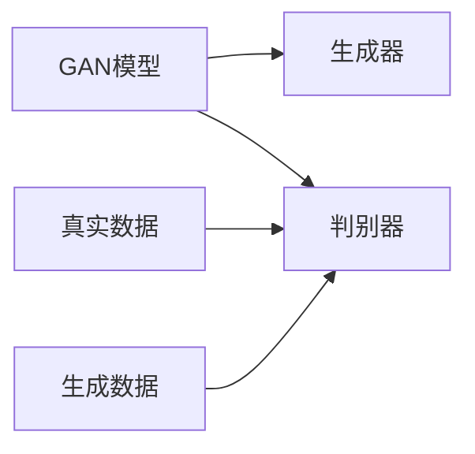
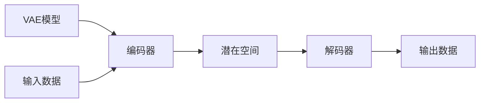
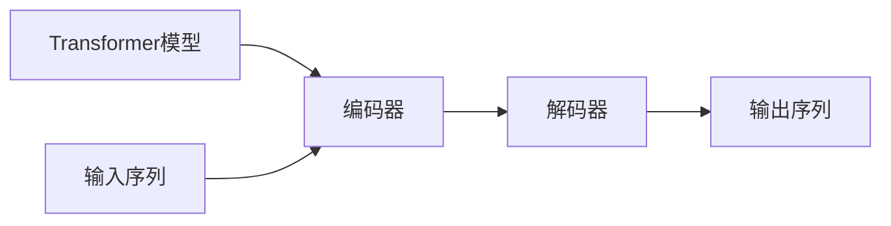

                 

<think>
嗯，用户希望我撰写一篇关于AIGC在虚拟现实教育内容生成中的角色的技术博客。首先，我需要明确用户的需求。他们可能是一位教育科技领域的专家，或者对AI和虚拟现实结合感兴趣的人士。用户需要一篇结构清晰、内容详实的专业文章，可能用于教学、研究或行业参考。

接下来，我得分析用户提供的大纲，看看是否符合逻辑。大纲分为四个部分，包括背景、技术原理、应用实践和未来发展。每个部分下有不同的章节，内容涵盖概念、技术细节、实际案例和未来趋势。这样的结构比较全面，能够覆盖用户的需求。

然后，我需要考虑每个章节的具体内容。比如，在背景部分，需要解释AIGC和虚拟现实的基本概念，以及它们在教育中的应用现状。技术原理部分要深入讲解生成对抗网络、变分自编码器等算法，并用mermaid图和数学公式来说明。应用实践部分要举实际案例，分析工具和平台，并给出实践技巧。未来发展的部分则需要探讨技术趋势、伦理问题和跨界融合。

我还需要确保文章语言专业，同时保持逻辑清晰。每个小节要详细讲解，比如在技术原理中，不仅要介绍算法，还要展示它们如何应用于内容生成。使用图表和代码示例可以增强可读性，帮助读者理解复杂概念。

最后，我得检查文章是否满足字数要求，大约在10000到12000字之间。同时，确保每个部分都有足够的细节，避免过于笼统。这样，用户才能获得有价值的信息，帮助他们在教育科技领域深入理解和应用AIGC技术。
</think>

# AIGC在虚拟现实教育内容生成中的角色

> 关键词：AIGC, 虚拟现实, 教育内容生成, 生成对抗网络, 变分自编码器

> 摘要：本文探讨了AIGC（人工智能生成内容）在虚拟现实教育内容生成中的角色与应用。通过分析AIGC的技术原理、算法优化、实际应用案例以及未来发展方向，本文旨在揭示AIGC如何推动虚拟现实教育内容的创新与优化。文章从背景介绍、技术原理、应用实践到未来发展进行了系统性分析，为教育科技领域的研究与实践提供了理论支持与实践指导。

---

## 第一部分: AIGC在虚拟现实教育内容生成中的背景

### 1.1 AIGC的概念与虚拟现实教育内容生成背景

#### 1.1.1 AIGC的基本概念
人工智能生成内容（AIGC，Artificial Intelligence Generated Content）是指通过人工智能技术自动生成文本、图像、视频、音频等多样化内容的过程。AIGC的核心在于利用机器学习算法，从大量数据中学习模式，并基于这些模式生成新的内容。AIGC可以应用于多种场景，包括自然语言处理、图像生成、语音合成等。

在教育领域，AIGC的应用主要集中在教育内容的自动生成与优化。通过AIGC技术，可以快速生成符合教学目标的虚拟现实教育资源，例如虚拟场景、交互式课件、动态教学内容等。

#### 1.1.2 虚拟现实教育内容生成需求
随着虚拟现实技术的快速发展，教育领域对虚拟现实内容的需求日益增长。传统的虚拟现实内容生成方式通常依赖于人工建模、编程和设计，耗时长、成本高，难以满足大规模、多样化的教育需求。AIGC技术的引入为虚拟现实教育内容的快速生成提供了新的可能性。

具体需求包括：
1. **个性化学习内容**：根据学生的学习进度和兴趣生成个性化的虚拟现实内容。
2. **动态更新内容**：根据知识更新和教学需求的变化，快速生成新的教育内容。
3. **降低内容生成成本**：通过自动化生成技术，减少对专业设计人员的依赖，降低内容开发成本。

#### 1.1.3 虚拟现实与教育的结合现状与挑战
虚拟现实（VR）技术在教育领域的应用已经取得了显著成果，例如虚拟实验室、虚拟历史场景、虚拟模拟训练等。然而，虚拟现实教育内容的生成仍然面临以下挑战：
1. **内容生成效率低**：传统的内容生成方式耗时长，难以满足大规模需求。
2. **内容质量不稳定**：自动化生成的内容可能存在不准确或不符合教学目标的问题。
3. **技术与教育需求的结合不足**：现有的虚拟现实技术在教育场景中的应用往往缺乏对教学目标和学生需求的深度理解。

### 1.2 AIGC的发展与应用现状

#### 1.2.1 AIGC的技术发展历程
AIGC的发展可以追溯到20世纪末，随着深度学习技术的兴起，生成对抗网络（GAN）、变分自编码器（VAE）等生成模型的提出，为AIGC技术的快速发展奠定了基础。近年来，随着大语言模型（如GPT系列）和扩散模型（Diffusion Model）的出现，AIGC技术在文本生成、图像生成等领域取得了显著进展。

#### 1.2.2 AIGC在各个领域的应用现状
AIGC技术已经在多个领域得到了广泛应用：
1. **文本生成**：用于新闻报道、营销文案、教育内容生成等。
2. **图像生成**：用于广告设计、艺术创作、虚拟场景生成等。
3. **音频生成**：用于语音合成、音乐生成等。
4. **视频生成**：用于动画制作、虚拟角色生成等。

#### 1.2.3 AIGC在教育领域的潜力分析
AIGC在教育领域的潜力主要体现在以下几个方面：
1. **个性化学习内容生成**：根据学生的学习进度和兴趣，自动生成个性化的学习内容。
2. **虚拟实验场景生成**：通过AIGC技术生成虚拟实验室、虚拟实验设备等，为学生提供沉浸式学习体验。
3. **动态教学资源更新**：根据知识更新和教学需求的变化，快速生成新的教学资源。

### 1.3 虚拟现实教育内容生成的挑战与机遇

#### 1.3.1 挑战分析
1. **技术限制**：现有的AIGC技术在生成高质量、符合教学目标的虚拟现实内容方面仍存在一定的局限性。
2. **内容准确性**：生成的内容可能包含错误或不符合教育目标，需要人工审核和校对。
3. **用户体验**：虚拟现实内容的生成需要考虑用户体验，避免生成的内容过于抽象或难以理解。

#### 1.3.2 机遇探讨
1. **技术进步**：随着生成对抗网络、大语言模型等技术的不断进步，AIGC在教育内容生成中的应用前景广阔。
2. **教育模式创新**：AIGC技术可以推动教育模式的创新，例如个性化学习、沉浸式学习等。
3. **成本降低**：通过自动化生成技术，可以显著降低虚拟现实教育内容的开发成本。

#### 1.3.3 政策支持与产业趋势
随着教育科技的快速发展，越来越多的政策和资金开始支持虚拟现实教育内容的开发与应用。同时，AIGC技术的引入也为教育内容生成带来了新的产业机会。

### 1.4 本书结构安排与内容概述

#### 1.4.1 全书章节布局
1. 第一部分：AIGC在虚拟现实教育内容生成中的背景
2. 第二部分：AIGC技术原理与算法
3. 第三部分：虚拟现实教育内容生成的应用实践
4. 第四部分：AIGC在虚拟现实教育内容生成中的未来发展

#### 1.4.2 主要内容概述
- 第一部分介绍AIGC和虚拟现实教育内容生成的基本概念、技术发展与应用现状。
- 第二部分详细讲解AIGC的技术原理与算法，包括生成对抗网络、变分自编码器等。
- 第三部分探讨AIGC在虚拟现实教育内容生成中的实际应用，包括流程、工具、案例分析等。
- 第四部分展望AIGC在虚拟现实教育内容生成中的未来发展，包括技术趋势、社会影响与伦理挑战等。

#### 1.4.3 阅读指南与学习方法
- 建议读者从第一部分开始，逐步了解AIGC和虚拟现实教育内容生成的基本概念。
- 在第二部分重点理解AIGC的技术原理与算法，为后续的应用实践打下基础。
- 第三部分可以通过实际案例分析，深入理解AIGC在虚拟现实教育内容生成中的应用。
- 第四部分则可以帮助读者从长远的角度思考AIGC在教育领域的未来发展。

#### 1.4.5 本章小结
本章从背景、技术发展、应用现状、挑战与机遇等多个方面，全面介绍了AIGC在虚拟现实教育内容生成中的角色与潜力。接下来，我们将深入探讨AIGC的技术原理与算法，为后续的内容生成实践打下坚实的基础。

---

## 第二部分: AIGC技术原理与算法

### 2.1 AIGC的核心技术基础

#### 2.1.1 生成对抗网络（GAN）

##### GAN的核心概念
生成对抗网络（GAN，Generative Adversarial Network）是一种由生成器（Generator）和判别器（Discriminator）组成的深度学习模型。生成器的目标是生成与真实数据相似的假数据，而判别器的目标是区分真实数据和生成数据。通过交替训练生成器和判别器，GAN可以生成高质量的数据。

##### GAN的流程
1. **判别器训练**：判别器通过对真实数据和生成数据的判别，学习真实数据的特征。
2. **生成器训练**：生成器通过调整生成数据的参数，使得生成数据能够欺骗判别器。
3. **交替优化**：生成器和判别器交替优化，最终达到生成器生成高质量数据的目标。

##### GAN的应用案例
- **图像生成**：通过GAN生成逼真的图像，例如生成虚拟实验室场景中的设备和人物。
- **文本生成**：通过GAN生成连贯的文本，例如生成教学内容中的段落。

#### 2.1.2 变分自编码器（VAE）

##### VAE的核心概念
变分自编码器（VAE，Variational Autoencoder）是一种基于概率模型的生成模型。VAE通过编码器将数据映射到潜在空间，然后通过解码器将潜在空间的数据映射回原始数据空间，从而生成新的数据。

##### VAE的流程
1. **编码器训练**：编码器将输入数据映射到潜在空间。
2. **解码器训练**：解码器将潜在空间的数据映射回原始数据空间，生成新的数据。
3. **优化**：通过最大化似然函数和KL散度，优化VAE的生成能力。

##### VAE的应用案例
- **图像生成**：通过VAE生成多样化的图像，例如生成虚拟实验室中的不同场景。
- **语音生成**：通过VAE生成连贯的语音，例如生成虚拟教师的语音内容。

#### 2.1.3 递归神经网络（RNN）

##### RNN的核心概念
递归神经网络（RNN，Recurrent Neural Network）是一种用于处理序列数据的深度学习模型。RNN通过循环结构处理序列数据，能够捕捉序列中的时序关系。

##### RNN的应用案例
- **文本生成**：通过RNN生成连贯的文本，例如生成教学内容中的段落。
- **语音合成**：通过RNN生成连贯的语音，例如生成虚拟教师的语音内容。

#### 2.1.4 注意力机制与 Transformer 架构

##### 注意力机制的核心概念
注意力机制（Attention Mechanism）是一种用于处理序列数据的机制，能够捕捉序列中不同位置之间的关系。

##### Transformer 架构的核心概念
Transformer是一种基于注意力机制的深度学习模型，广泛应用于自然语言处理领域。Transformer通过自注意力机制捕捉序列中的全局关系，从而生成高质量的内容。

##### Transformer的应用案例
- **文本生成**：通过Transformer生成高质量的文本，例如生成教学内容中的段落。
- **图像生成**：通过Transformer生成高质量的图像，例如生成虚拟实验室场景中的设备和人物。

### 2.2 AIGC算法原理详解

#### 2.2.1 GAN算法原理与流程

##### GAN的数学模型
生成器的目标函数：
$$ \min_G \mathbb{E}_{z \sim p_z(z)} \left[ \mathcal{L}_G (G(z)) \right] $$
判别器的目标函数：
$$ \min_D \mathbb{E}_{x \sim p_x(x)} \left[ \mathcal{L}_D (x) \right] + \mathbb{E}_{z \sim p_z(z)} \left[ \mathcal{L}_D (G(z)) \right] $$

##### GAN的流程图

#### 2.2.2 VAE算法原理与数学模型

##### VAE的数学模型
编码器的损失函数：
$$ \mathcal{L}_{VAE} = \mathbb{E}_{x}[ \mathcal{L}_\text{rec}(x, G(E(x))) ] + \mathbb{E}_{x}[ \text{KL}(q(z|x) || p(z))] $$
解码器的损失函数：
$$ \mathcal{L}_\text{rec}(x, G(E(x))) = \| x - G(E(x)) \|^2 $$

##### VAE的流程图

#### 2.2.3 RNN算法原理与应用案例

##### RNN的数学模型
RNN的状态转移方程：
$$ s_t = \sigma(W_{hh} s_{t-1} + W_{xh} x_t) $$
输出层的计算：
$$ y_t = W_{hy} s_t + b_y $$

##### RNN的应用案例
- **文本生成**：通过RNN生成连贯的文本，例如生成教学内容中的段落。
- **语音合成**：通过RNN生成连贯的语音，例如生成虚拟教师的语音内容。

#### 2.2.4 Transformer算法原理与架构

##### Transformer的数学模型
自注意力机制的计算：
$$ \text{Attention}(Q, K, V) = \text{softmax}\left( \frac{QK^T}{\sqrt{d_k}} \right)V $$
前馈网络的计算：
$$ \text{FFN}(x) = \text{ReLU}(W_1 x + b_1) W_2 + b_2 $$

##### Transformer的流程图

### 2.3 AIGC算法优化与调参策略

#### 2.3.1 算法优化方法
1. **优化器选择**：常用的优化器包括Adam、SGD等。
2. **学习率调整**：通过学习率衰减等方式优化模型性能。
3. **正则化技术**：使用Dropout等技术防止过拟合。

#### 2.3.2 调参技巧与实践经验
1. **批量大小**：选择合适的批量大小，通常较大的批量大小可以提高训练效率。
2. **模型深度**：根据任务需求选择模型深度，避免过深导致计算量过大。
3. **数据预处理**：对数据进行归一化、去噪等预处理，提高模型训练效果。

#### 2.3.3 性能评估与比较
1. **生成质量评估**：通过生成内容的连贯性、准确性等指标评估生成质量。
2. **训练效率评估**：通过训练时间、计算资源消耗等指标评估训练效率。

### 2.4 AIGC算法在实际应用中的效果评估

#### 2.4.1 数据集选择与评价指标
1. **数据集选择**：选择适合任务的数据集，例如CIFAR-10、ImageNet等。
2. **评价指标**：常用的评价指标包括生成图像的PSNR、SSIM等。

#### 2.4.2 实际应用案例分析
- **图像生成案例**：通过GAN生成虚拟实验室场景中的设备和人物。
- **文本生成案例**：通过Transformer生成教学内容中的段落。

#### 2.4.3 评价结果分析与讨论
1. **生成质量**：生成内容的质量与数据集、模型结构等因素密切相关。
2. **训练效率**：训练效率受到批量大小、优化器选择等因素的影响。

### 2.5 本章小结
本章详细介绍了AIGC的核心技术基础，包括生成对抗网络、变分自编码器、递归神经网络和Transformer架构。通过数学模型和流程图的分析，深入理解了这些算法的工作原理。接下来，我们将探讨AIGC在虚拟现实教育内容生成中的实际应用，包括生成流程、工具与平台、案例分析等内容。

---

## 第三部分: 虚拟现实教育内容生成的应用实践

### 3.1 虚拟现实教育内容生成的流程与方法

#### 3.1.1 内容生成的基本流程
1. **需求分析**：明确教育目标、学习者特征、教学内容等。
2. **数据准备**：收集相关数据，包括文本、图像、语音等。
3. **模型训练**：根据需求选择合适的AIGC算法，进行模型训练。
4. **内容生成**：利用训练好的模型生成虚拟现实教育内容。
5. **内容优化**：对生成的内容进行审核和优化，确保符合教学目标。

#### 3.1.2 常见的内容生成方法
1. **基于GAN的生成方法**：通过GAN生成高质量的虚拟场景。
2. **基于VAE的生成方法**：通过VAE生成多样化的虚拟内容。
3. **基于RNN的生成方法**：通过RNN生成连贯的文本内容。

#### 3.1.3 跨学科内容生成实践
1. **物理模拟**：通过AIGC生成物理实验场景。
2. **化学实验**：通过AIGC生成化学实验场景。
3. **生物模拟**：通过AIGC生成生物实验场景。

### 3.2 虚拟现实教育内容生成的工具与平台

#### 3.2.1 常见内容生成工具介绍
1. **Blender**：一款开源的3D建模和动画制作工具，支持虚拟场景的生成。
2. **Unity**：一款强大的游戏引擎，支持虚拟现实内容的开发。
3. **Unreal Engine**：一款专业的游戏引擎，支持虚拟现实内容的开发。

#### 3.2.2 虚拟现实内容生成平台解析
1. ** Oculus Medium**：支持虚拟现实内容的创作与分享。
2. **SketchUp**：支持虚拟场景的建模与设计。
3. **CityEngine**：支持虚拟城市和建筑的建模与设计。

#### 3.2.3 工具与平台的对比与选择
1. **功能对比**：Blender适合小型项目，Unity和Unreal Engine适合大型项目。
2. **学习曲线**：Blender和SketchUp适合快速上手，Unreal Engine的学习曲线较陡。
3. **成本**：Blender和SketchUp免费，Unity和Unreal Engine需要购买许可证。

### 3.3 虚拟现实教育内容生成的案例分析

#### 3.3.1 案例背景与目标
- **案例背景**：某中学需要生成一个虚拟化学实验室，用于学生学习化学实验操作。
- **案例目标**：通过AIGC技术生成虚拟化学实验室，提供沉浸式学习体验。

#### 3.3.2 案例实施过程
1. **需求分析**：明确虚拟实验室的功能需求，包括实验设备、实验步骤、实验效果等。
2. **数据准备**：收集化学实验的相关数据，包括实验设备的图像、实验步骤的文本等。
3. **模型训练**：选择合适的AIGC算法，进行模型训练。
4. **内容生成**：利用训练好的模型生成虚拟实验室内容。
5. **内容优化**：对生成的内容进行审核和优化，确保符合教学目标。

#### 3.3.3 案例效果评估与反思
- **生成质量**：生成的虚拟实验室设备逼真，实验步骤清晰。
- **用户体验**：学生可以通过虚拟实验室进行实验操作，提高学习兴趣和效果。
- **优化建议**：未来可以通过引入更多的交互元素，进一步提升用户体验。

### 3.4 AIGC在虚拟现实教育内容生成中的实践技巧与注意事项

#### 3.4.1 实践技巧总结
1. **需求明确**：明确教育目标和学习者特征，确保生成内容符合教学需求。
2. **数据准备充分**：收集高质量的数据，提高生成内容的质量。
3. **模型选择合理**：根据任务需求选择合适的AIGC算法，确保生成效果。

#### 3.4.2 注意事项与风险防范
1. **内容准确性**：生成的内容需要经过人工审核，避免错误信息的传播。
2. **用户体验优化**：设计直观易用的虚拟现实界面，提高用户体验。
3. **技术可行性**：确保选择的AIGC算法和技术方案具有可行性，避免技术瓶颈。

#### 3.4.3 持续改进与创新
1. **持续优化**：根据用户反馈和教学需求，不断优化生成内容。
2. **技术创新**：探索新的AIGC算法和技术，推动虚拟现实教育内容生成的创新。

### 3.5 本章小结
本章通过实际案例分析，探讨了AIGC在虚拟现实教育内容生成中的应用流程、工具与平台、案例分析等内容。通过对比不同工具和平台的功能与特点，提出了实践技巧与注意事项，为后续的实际应用提供了参考。接下来，我们将展望AIGC在虚拟现实教育内容生成中的未来发展，包括技术趋势、社会影响与伦理挑战等内容。

---

## 第四部分: AIGC在虚拟现实教育内容生成中的未来发展

### 4.1 AIGC在虚拟现实教育内容生成中的潜在发展方向

#### 4.1.1 技术趋势分析
1. **多模态生成**：AIGC技术将向多模态生成方向发展，例如同时生成图像、文本、语音等多种内容。
2. **实时生成**：通过实时生成技术，实现虚拟现实内容的动态更新。
3. **个性化生成**：根据学生的学习进度和兴趣，实时生成个性化的教育内容。

#### 4.1.2 应用前景展望
1. **沉浸式学习**：通过AIGC技术生成高度沉浸的虚拟现实场景，提升学生的学习体验。
2. **自适应学习**：通过AIGC技术生成个性化的学习内容，满足不同学生的学习需求。
3. **跨学科融合**：AIGC技术将与多个学科领域深度融合，推动教育内容的创新与优化。

#### 4.1.3 长远发展策略
1. **技术创新**：持续推动AIGC技术的创新，提升生成内容的质量和多样性。
2. **产业合作**：加强与教育机构、科技企业的合作，推动虚拟现实教育内容的广泛应用。
3. **政策支持**：制定相关政策，支持AIGC技术在教育领域的研发与应用。

### 4.2 AIGC在教育领域的社会影响与伦理挑战

#### 4.2.1 社会影响的探讨
1. **教育公平**：AIGC技术可以通过生成多样化的教育内容，促进教育资源的公平分配。
2. **教育效率**：AIGC技术可以提高教育内容的生成效率，降低教育成本。
3. **教育创新**：AIGC技术可以推动教育模式的创新，例如个性化学习、沉浸式学习等。

#### 4.2.2 伦理挑战的应对
1. **内容准确性**：生成的内容需要经过人工审核，确保信息的准确性。
2. **隐私保护**：在生成教育内容的过程中，需要保护学生的隐私信息。
3. **伦理审查**：建立伦理审查机制，确保AIGC技术的应用符合伦理规范。

#### 4.2.3 法律法规与政策指导
1. **法律法规**：制定相关法律法规，规范AIGC技术在教育领域的应用。
2. **政策支持**：政府可以通过政策支持，推动AIGC技术在教育领域的研发与应用。
3. **行业标准**：制定行业标准，规范AIGC技术的应用流程和质量要求。

### 4.3 AIGC与虚拟现实教育的跨界融合

#### 4.3.1 跨界融合的意义
1. **技术创新**：通过AIGC技术与虚拟现实技术的融合，推动教育内容的创新。
2. **教育模式变革**：通过AIGC技术与虚拟现实技术的融合，推动教育模式的变革。
3. **产业升级**：通过AIGC技术与虚拟现实技术的融合，推动教育产业的升级。

#### 4.3.2 跨界融合的案例研究
1. **虚拟实验室**：通过AIGC技术生成虚拟实验室场景，支持学生的实验操作学习。
2. **虚拟课堂**：通过AIGC技术生成虚拟课堂场景，支持学生的在线学习。
3. **虚拟培训**：通过AIGC技术生成虚拟培训场景，支持员工的职业培训。

#### 4.3.3 跨界融合的未来展望
1. **技术创新**：通过AIGC技术与虚拟现实技术的融合，推动教育内容的创新。
2. **教育模式变革**：通过AIGC技术与虚拟现实技术的融合，推动教育模式的变革。
3. **产业升级**：通过AIGC技术与虚拟现实技术的融合，推动教育产业的升级。

### 4.4 本章小结
本章从技术趋势、社会影响、伦理挑战、跨界融合等多个方面，展望了AIGC在虚拟现实教育内容生成中的未来发展。通过技术创新、产业合作、政策支持等措施，AIGC技术将在教育领域发挥更大的作用，推动教育内容的创新与优化。

---

## 作者：AI天才研究院/AI Genius Institute & 禅与计算机程序设计艺术 /Zen And The Art of Computer Programming

---

**全文完**

