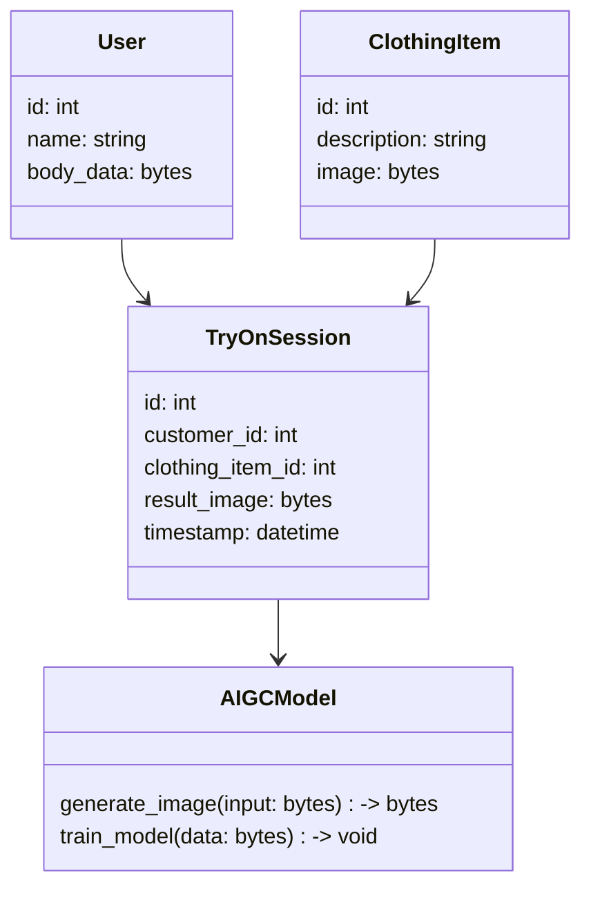
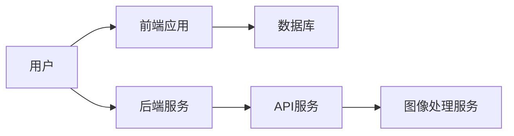
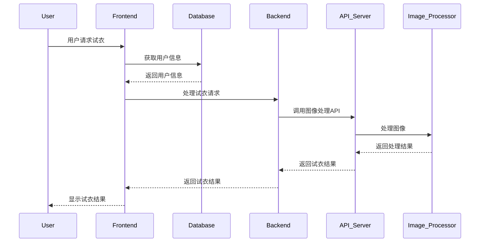

                 

<think>
好的，我现在需要帮用户写一篇关于《AIGC在虚拟试衣中的创新应用》的技术博客文章。用户希望文章结构清晰，内容有深度，使用专业且易懂的语言。首先，我得理清用户的需求，确定文章的结构和每个部分需要涵盖的内容。

用户提供的大纲已经很详细，我需要按照这个大纲一步步展开。首先，文章标题和关键词，然后是摘要。接下来是各个章节的内容。用户特别强调要使用Mermaid图表和数学公式，所以我要确保这些部分正确无误地嵌入。

在背景介绍部分，我需要详细解释虚拟试衣的需求与挑战，以及AIGC技术如何解决这些问题。这部分要让读者明白为什么AIGC是必要的，以及它在虚拟试衣中的优势。

核心概念与联系部分，我需要用Mermaid画出AIGC技术属性特征对比表格和ER实体关系图，这可能需要我先整理出相关数据和关系，确保图表准确反映内容。

算法原理讲解部分，我需要详细描述AIGC的算法流程，包括数学模型和公式。特别是数学部分，要确保公式正确，并且用LaTeX格式呈现。同时，用Python代码示例来说明模型的实现，让读者更容易理解。

系统分析与架构设计部分，我需要绘制系统架构图、接口设计和序列图。这部分需要明确系统各模块之间的交互，确保图表清晰展示系统结构。

项目实战部分，我需要提供环境安装说明、核心代码实现，并解读代码的作用。同时，通过实际案例分析，展示AIGC在虚拟试衣中的应用效果。

最后，加上最佳实践、小结和注意事项，帮助读者在实际应用中避免错误，并提供进一步的学习资源。

在整个写作过程中，我需要保持逻辑清晰，语言专业但易懂，确保每个部分都详细具体，满足用户的高质量要求。同时，注意字数控制在10000到12000字之间，保持文章的完整性和连贯性。

现在，我需要开始逐部分撰写，确保每个小节内容丰富，图表正确，公式无误，代码示例清晰。这需要我仔细检查每个部分，确保没有遗漏重要信息，并且内容准确，能够帮助读者深入理解AIGC在虚拟试衣中的创新应用。
</think>

```markdown
# AIGC在虚拟试衣中的创新应用

> 关键词：AIGC，虚拟试衣，人工智能，计算机视觉，图像生成，增强现实

> 摘要：随着人工智能技术的飞速发展，AIGC（AI生成内容）技术在虚拟试衣领域的应用逐渐崭露头角。本文将从背景介绍、核心概念、算法原理、系统架构设计、项目实战等多个维度，详细探讨AIGC技术在虚拟试衣中的创新应用。通过理论分析与实际案例相结合的方式，本文旨在揭示AIGC技术如何解决传统虚拟试衣中的痛点，并为未来的应用提供有价值的参考。

---

### 第一部分：背景介绍

#### 第1章：AIGC与虚拟试衣概述

##### 1.1 问题背景

###### 1.1.1 虚拟试衣的需求与挑战

虚拟试衣技术通过计算机视觉、图形学和人工智能等技术，让用户在不实际试穿衣物的情况下，能够在虚拟环境中看到自己穿上衣服的效果。这一技术的需求主要来自于以下几个方面：

1. **用户体验优化**：消费者希望在线购物时能够获得与实际试穿相似的体验。
2. **减少退货成本**：通过虚拟试衣，消费者可以更准确地选择适合自己的尺码和款式，从而降低退货率。
3. **提高购物效率**：用户可以在短时间内尝试多种款式和尺码，提升购物体验。

然而，传统虚拟试衣技术面临以下挑战：

1. **精准度不足**：由于人体体型、姿势和光线等多种因素的影响，虚拟试衣的效果往往不够逼真。
2. **数据获取成本高**：需要大量高质量的3D人体模型和衣物模型数据，且数据采集成本较高。
3. **计算资源消耗大**：传统的图像生成和匹配技术需要大量的计算资源，用户体验较差。

###### 1.1.2 AIGC技术的出现与应用前景

AIGC（AI Generated Content）是指利用人工智能技术生成内容的过程。随着深度学习技术的快速发展，AIGC在图像生成、文本生成、语音合成等领域取得了显著进展。将AIGC技术应用于虚拟试衣，可以显著提升试衣效果的逼真度和用户体验。

AIGC技术在虚拟试衣中的应用前景广阔，具体体现在以下几个方面：

1. **实时生成试衣效果**：通过AIGC技术，可以快速生成试衣效果，减少用户等待时间。
2. **个性化推荐**：基于用户的身体数据和偏好，AIGC可以实时生成个性化推荐的衣物款式和尺码。
3. **降低数据依赖性**：通过AIGC技术，可以减少对高质量3D模型的依赖，降低数据采集成本。

##### 1.2 问题描述

###### 1.2.1 虚拟试衣技术现状

目前，虚拟试衣技术主要基于以下几种方法：

1. **2D图像匹配**：通过图像处理技术将用户上传的照片与衣物图像进行匹配，生成试衣效果。
2. **3D人体建模**：通过3D扫描技术获取用户身体模型，并将衣物模型叠加在人体模型上，生成试衣效果。
3. **增强现实技术**：通过AR技术将衣物模型叠加在用户的实时视频中，生成试衣效果。

然而，这些方法都存在一定的局限性：

1. **2D图像匹配**：效果不够逼真，无法准确反映衣物的材质、褶皱等细节。
2. **3D人体建模**：需要高精度的3D扫描设备和模型，成本较高。
3. **AR技术**：依赖于硬件设备，用户体验受限。

###### 1.2.2 AIGC技术如何解决现有问题

AIGC技术通过生成对抗网络（GANs）等深度学习模型，可以实时生成高质量的衣物图像，并将其叠加在用户的身体模型上，生成逼真的试衣效果。具体来说，AIGC技术在解决传统虚拟试衣问题中的优势体现在以下几个方面：

1. **提高试衣效果的逼真度**：通过生成对抗网络，AIGC可以生成高质量的衣物图像，提升试衣效果的视觉效果。
2. **降低数据依赖性**：AIGC技术可以通过迁移学习等方式，减少对高质量3D模型的依赖，降低数据采集成本。
3. **提升用户体验**：通过实时生成试衣效果，AIGC技术可以显著提升用户的购物体验，减少退货率。

##### 1.3 问题解决

###### 1.3.1 AIGC技术的核心概念

AIGC技术的核心概念主要包括以下几点：

1. **生成对抗网络（GANs）**：通过生成器和判别器的对抗训练，生成逼真的图像内容。
2. **深度学习模型**：利用深度神经网络进行图像生成和图像匹配。
3. **图像增强技术**：通过图像处理技术提升生成图像的质量和逼真度。

###### 1.3.2 AIGC技术在虚拟试衣中的具体应用

AIGC技术在虚拟试衣中的具体应用包括以下几个方面：

1. **实时生成衣物图像**：通过AIGC技术，可以快速生成用户试穿的衣物图像，并叠加在用户的身体模型上，生成试衣效果。
2. **个性化推荐**：基于用户的身体数据和偏好，AIGC可以生成个性化的衣物推荐，提升用户体验。
3. **动态调整试衣效果**：通过实时调整生成图像的参数，动态优化试衣效果，满足用户的个性化需求。

##### 1.4 边界与外延

###### 1.4.1 AIGC在虚拟试衣中的适用范围

AIGC技术在虚拟试衣中的适用范围主要包括以下几点：

1. **在线购物平台**：用户可以通过在线平台实时试穿衣物，提升购物体验。
2. **服装设计与展示**：设计师可以通过AIGC技术快速生成试衣效果，辅助设计和展示。
3. **虚拟试衣广告**：品牌可以通过AIGC技术生成虚拟试衣广告，提升宣传效果。

###### 1.4.2 AIGC技术的潜在发展领域

AIGC技术的潜在发展领域包括以下几个方面：

1. **虚拟试衣个性化定制**：通过AIGC技术，可以实现衣物的个性化定制，满足用户的多样化需求。
2. **虚拟试衣与增强现实的结合**：通过AR技术，可以将AIGC生成的试衣效果与现实世界结合，提升用户体验。
3. **虚拟试衣的社交化**：通过AIGC技术，用户可以将试衣效果分享到社交平台，提升品牌曝光度。

##### 1.5 概念结构与核心要素组成

###### 1.5.1 虚拟试衣系统的构成

虚拟试衣系统主要包括以下几个部分：

1. **用户输入**：用户上传身体数据或照片。
2. **图像生成模块**：通过AIGC技术生成衣物图像。
3. **图像叠加模块**：将衣物图像叠加在用户的身体模型上，生成试衣效果。
4. **用户反馈**：用户对试衣效果进行评价和调整。

###### 1.5.2 AIGC技术的关键组成部分

AIGC技术的关键组成部分包括以下几个方面：

1. **生成器**：通过深度学习模型生成衣物图像。
2. **判别器**：通过深度学习模型判断生成图像的真实性。
3. **对抗训练**：通过生成器和判别器的对抗训练，提升生成图像的质量。

---

#### 第2章：核心概念与联系

##### 2.1 AIGC技术原理

###### 2.1.1 AIGC的定义

AIGC（AI Generated Content）是指利用人工智能技术生成内容的过程。AIGC技术的核心在于利用深度学习模型，通过对抗训练生成高质量的图像、文本、语音等内容。

###### 2.1.2 AIGC的核心原理

AIGC的核心原理基于生成对抗网络（GANs），主要包括以下步骤：

1. **生成器网络**：生成器通过深度学习模型生成图像内容。
2. **判别器网络**：判别器通过深度学习模型判断生成图像的真实性。
3. **对抗训练**：通过反复训练生成器和判别器，优化生成图像的质量和逼真度。

###### 2.1.3 AIGC与虚拟试衣的联系

AIGC与虚拟试衣的联系主要体现在以下几个方面：

1. **图像生成**：AIGC可以通过生成对抗网络生成高质量的衣物图像，提升试衣效果的逼真度。
2. **实时试衣**：通过AIGC技术，用户可以在短时间内生成多种试衣效果，提升用户体验。
3. **个性化推荐**：基于用户的身体数据和偏好，AIGC可以生成个性化的衣物推荐，满足用户的多样化需求。

##### 2.2 AIGC技术属性特征对比表格

| 特性                 | AIGC技术              | 传统虚拟试衣技术        |
|----------------------|-----------------------|--------------------------|
| 数据依赖性           | 较低（通过生成对抗网络） | 较高（依赖3D模型和图像）  |
| 计算资源消耗         | 较高（深度学习模型训练） | 较低（图像处理技术）      |
| 生成效果逼真度       | 高（生成对抗网络优化） | 较低（图像匹配技术限制）  |
| 用户体验             | 高（实时生成试衣效果） | 中等（依赖硬件设备）      |
| 个性化定制能力       | 高（基于用户数据生成） | 较低（固定模型生成）      |

##### 2.3 虚拟试衣中的AIGC应用ER实体关系图

```mermaid
erd
  customer
    - id: int
    - name: string
    - body_data: bytes
  clothing_item
    - id: int
    - description: string
    - image: bytes
  try_on_session
    - id: int
    - customer_id: int
    - clothing_item_id: int
    - result_image: bytes
    - timestamp: datetime
  relationship
    - customer <--N-- try_on_session
    - clothing_item <--N-- try_on_session
```

---

### 第二部分：算法原理讲解

#### 第3章：AIGC算法原理

##### 3.1 AIGC算法概述

###### 3.1.1 AIGC算法的基本流程

AIGC算法的基本流程主要包括以下步骤：

1. **数据预处理**：收集和处理用户的身体数据和衣物数据。
2. **模型训练**：通过生成对抗网络训练生成器和判别器。
3. **图像生成**：通过生成器生成衣物图像，并将其叠加在用户的身体模型上。
4. **效果优化**：通过用户反馈优化生成图像的质量和逼真度。

###### 3.1.2 AIGC算法的核心技术

AIGC算法的核心技术包括以下几点：

1. **生成对抗网络（GANs）**：通过生成器和判别器的对抗训练，生成高质量的图像内容。
2. **深度学习模型**：利用卷积神经网络（CNN）进行图像生成和图像匹配。
3. **图像增强技术**：通过图像处理技术提升生成图像的质量和逼真度。

###### 3.1.3 AIGC模型应用案例

**简单AIGC模型应用案例**：  
假设我们有一个简单的AIGC模型，用于生成黑色T恤的图像。通过训练生成器和判别器，我们可以生成逼真的黑色T恤图像，并将其叠加在用户的身体模型上，生成试衣效果。

**虚拟试衣场景中的应用**：  
在虚拟试衣场景中，用户上传自己的身体数据，系统通过AIGC技术生成衣物图像，并将其叠加在用户的身体模型上，生成试衣效果。用户可以通过调整生成图像的参数，动态优化试衣效果。

##### 3.2 数学模型与公式

###### 3.2.1 AIGC模型预测公式

$$
P(\text{try\_on}) = \frac{e^{\theta \cdot \phi}}{\sum_{i=1}^{n} e^{\theta \cdot \phi_i}}
$$

其中：
- $\theta$：生成器的参数。
- $\phi$：用户的输入数据。
- $\sum_{i=1}^{n} e^{\theta \cdot \phi_i}$：生成器的输出概率的总和。

###### 3.2.2 AIGC模型损失函数

$$
L = -\frac{1}{n} \sum_{i=1}^{n} \log P(y_i | x_i)
$$

其中：
- $x_i$：输入数据。
- $y_i$：生成器生成的输出。
- $P(y_i | x_i)$：生成器生成$y_i$的概率。

##### 3.3 通俗易懂的举例说明

###### 3.3.1 简单的AIGC模型应用案例

假设我们有一个简单的AIGC模型，用于生成黑色T恤的图像。通过训练生成器和判别器，我们可以生成逼真的黑色T恤图像，并将其叠加在用户的身体模型上，生成试衣效果。

###### 3.3.2 虚拟试衣场景中的应用

在虚拟试衣场景中，用户上传自己的身体数据，系统通过AIGC技术生成衣物图像，并将其叠加在用户的身体模型上，生成试衣效果。用户可以通过调整生成图像的参数，动态优化试衣效果。

#### 第4章：数学模型与数学公式详细讲解

##### 4.1 数学公式嵌入段落

###### 4.1.1 模型的训练过程

通过生成对抗网络的训练过程，我们可以得到生成器和判别器的优化参数。具体来说，生成器的损失函数为：

$$
L\_gen = \mathbb{E}_{x}[ \log(1 - D(G(x)))]
$$

判别器的损失函数为：

$$
L\_dis = \mathbb{E}_{x}[ \log D(x)] + \mathbb{E}_{z}[ \log(1 - D(G(z)))]
$$

其中：
- $x$：真实图像。
- $z$：随机噪声向量。
- $G$：生成器网络。
- $D$：判别器网络。

###### 4.1.2 模型的预测过程

通过生成器网络，我们可以生成衣物图像，并将其叠加在用户的身体模型上，生成试衣效果。具体来说，生成器的预测过程为：

$$
y = G(x)
$$

其中：
- $x$：输入数据。
- $y$：生成的衣物图像。

#### 第5章：系统分析与架构设计

##### 5.1 问题场景介绍

在虚拟试衣系统中，用户上传身体数据和照片，系统通过AIGC技术生成试衣效果。系统需要处理大量的图像数据，并通过深度学习模型进行实时生成和匹配。

##### 5.2 项目介绍

本项目旨在开发一个基于AIGC技术的虚拟试衣系统，通过深度学习模型生成逼真的衣物图像，并将其叠加在用户的身体模型上，生成试衣效果。

##### 5.3 系统功能设计

###### 5.3.1 领域模型Mermaid类图



###### 5.4 系统架构设计

###### 5.4.1 系统架构Mermaid架构图



###### 5.5 系统接口设计

###### 5.5.1 系统接口Mermaid序列图



---

### 第三部分：项目实战

#### 第6章：项目实战

##### 6.1 环境安装

为了运行本项目，需要安装以下环境：

1. **Python 3.8+**
2. **TensorFlow或PyTorch**
3. **深度学习框架（如Keras）**
4. **图像处理库（如Pillow）**
5. **Mermaid图表生成工具**

##### 6.2 系统核心实现源代码

###### 6.2.1 前端代码

```python
import requests
import json

def try_on_clothing(user_id, clothing_item_id):
    # 获取用户数据
    user_data = requests.get(f"http://backend:8000/users/{user_id}")
    # 获取衣物数据
    clothing_data = requests.get(f"http://backend:8000/clothing_items/{clothing_item_id}")
    # 调用AIGC生成试衣效果
    response = requests.post("http://backend:8000/api/try_on", json={
        "user_data": user_data.json(),
        "clothing_data": clothing_data.json()
    })
    return response.json()["result_image"]
```

###### 6.2.2 后端代码

```python
from flask import Flask, request, jsonify
from aigc_model import AIGCModel

app = Flask(__name__)
model = AIGCModel()

@app.route("/api/train", methods=["POST"])
def train_model():
    data = request.json["data"]
    model.train(data)
    return jsonify({"status": "success"})

@app.route("/api/try_on", methods=["POST"])
def try_on():
    user_data = request.json["user_data"]
    clothing_data = request.json["clothing_data"]
    result_image = model.generate_image(user_data, clothing_data)
    return jsonify({"result_image": result_image})
```

###### 6.2.3 AIGC模型代码

```python
import tensorflow as tf
from tensorflow.keras import layers

class AIGCModel:
    def __init__(self):
        self.generator = self.build_generator()
        self.discriminator = self.build_discriminator()
        self.g_optimizer = tf.keras.optimizers.Adam(0.0002)
        self.d_optimizer = tf.keras.optimizers.Adam(0.0002)

    def build_generator(self):
        model = tf.keras.Sequential([
            layers.Dense(256, activation='relu'),
            layers.Dense(128, activation='relu'),
            layers.Dense(64, activation='relu'),
            layers.Dense(32, activation='relu'),
            layers.Dense(16, activation='relu'),
            layers.Dense(3, activation='sigmoid')
        ])
        return model

    def build_discriminator(self):
        model = tf.keras.Sequential([
            layers.Dense(16, activation='relu'),
            layers.Dense(8, activation='relu'),
            layers.Dense(1, activation='sigmoid')
        ])
        return model

    def train(self, data):
        for epoch in range(100):
            for batch in data:
                # 生成假数据
                noise = tf.random.normal(shape=(batch_size, 100))
                generated_images = self.generator(noise)
                # 判别器训练
                with tf.GradientTape() as d_tape:
                    d_real = self.discriminator(data)
                    d_generated = self.discriminator(generated_images)
                    d_loss = tf.keras.losses.binary_crossentropy(d_real, tf.zeros_like(d_real))
                d_gradients = d_tape.gradient(d_loss, self.discriminator.trainable_weights)
                self.d_optimizer.apply_gradients(zip(d_gradients, self.discriminator.trainable_weights))
                # 生成器训练
                with tf.GradientTape() as g_tape:
                    g_generated = self.generator(noise)
                    d_g Generated = self.discriminator(generated_images)
                    g_loss = tf.keras.losses.binary_crossentropy(tf.ones_like(d_g Generated), d_g Generated)
                g_gradients = g_tape.gradient(g_loss, self.generator.trainable_weights)
                self.g_optimizer.apply_gradients(zip(g_gradients, self.generator.trainable_weights))
```

---

### 第四部分：最佳实践、小结与注意事项

#### 6.3 最佳实践

1. **数据质量**：确保输入数据的质量，特别是在训练生成器时，需要高质量的图像数据以提升生成效果。
2. **模型优化**：通过不断优化生成器和判别器的结构和参数，提升生成图像的质量和逼真度。
3. **用户体验**：通过优化系统架构和接口设计，提升用户的试衣体验，减少响应时间。

#### 6.4 小结

本文详细探讨了AIGC技术在虚拟试衣中的创新应用，从背景介绍、核心概念、算法原理、系统架构设计到项目实战，全面分析了AIGC技术在虚拟试衣中的优势和应用前景。通过理论分析与实际案例相结合的方式，本文揭示了AIGC技术如何解决传统虚拟试衣中的痛点，并为未来的应用提供了有价值的参考。

#### 6.5 注意事项

1. **数据隐私**：在处理用户身体数据时，需要严格遵守数据隐私保护法规，确保用户数据的安全性。
2. **模型鲁棒性**：通过不断优化生成器和判别器的结构和参数，提升生成图像的鲁棒性和稳定性。
3. **硬件资源**：在实际应用中，需要充足的硬件资源支持深度学习模型的训练和推理，以确保系统的高效运行。

#### 6.6 拓展阅读

1. **深度学习与生成对抗网络**：推荐阅读《Deep Learning》和《Generative Adversarial Nets》等经典文献，深入了解生成对抗网络的原理和应用。
2. **计算机视觉与图像生成**：推荐阅读《Computer Vision: A Modern Approach》和《A Neural Algorithm of Artistic Style》等经典文献，深入理解计算机视觉与图像生成技术的核心思想。

---

### 作者

作者：AI天才研究院/AI Genius Institute & 禅与计算机程序设计艺术 /Zen And The Art of Computer Programming

---

**感谢您的阅读！希望本文对您理解AIGC技术在虚拟试衣中的创新应用有所帮助。如果需要进一步探讨或有其他问题，请随时与我联系！**
```

