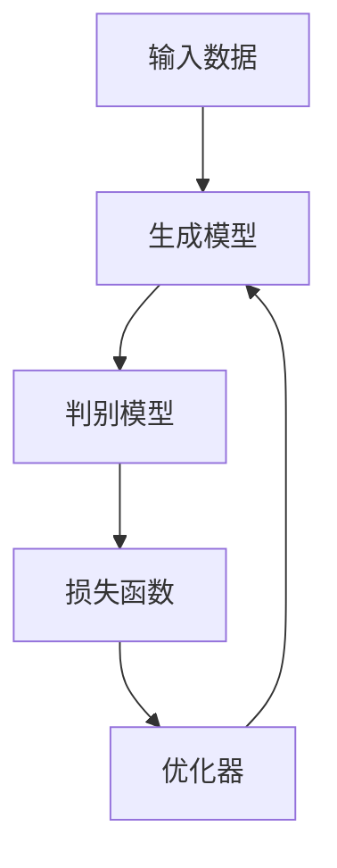
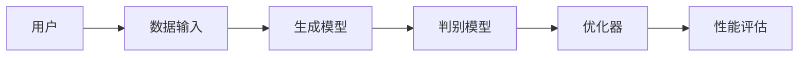
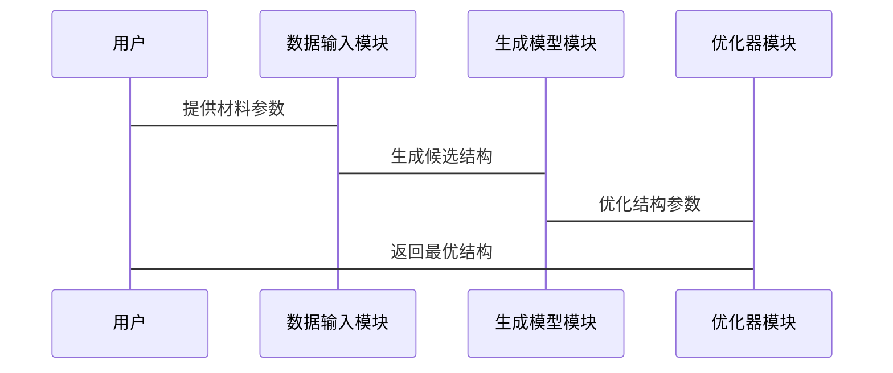

                 

<think>
嗯，用户想让我写一篇关于“AIGC在跨维度仿生材料设计系统中的应用”的技术博客。首先，我得理解用户的需求。他们需要一个结构清晰、内容详实的专业技术文章，字数在10000到12000字之间。用户已经提供了目录大纲，我需要按照这个大纲逐步填充内容。

接下来，我要考虑用户可能的身份。他们可能是一位技术专家，或者是对人工智能和材料科学感兴趣的读者。因此，文章需要既有技术深度，又易于理解。我需要确保每个章节都有足够的细节，同时保持逻辑连贯。

首先是背景介绍部分。我需要涵盖问题背景、问题描述、解决方案等。问题背景可以从仿生材料的重要性和传统设计的局限性入手，引出AIGC的优势。问题描述部分要明确指出传统方法的不足，比如效率低下、设计复杂性高等。问题解决部分则要突出AIGC如何提高效率和准确性。

核心概念部分，我需要解释AIGC和仿生材料的基本概念，并分析它们之间的联系。可能需要一个对比表格，列出AIGC和传统方法在仿生材料设计中的优缺点。此外，ER图可以帮助读者理解数据结构和关系。

算法部分，我需要用mermaid流程图展示算法步骤，同时提供数学模型和公式。这部分需要详细解释每个步骤的数学基础，并通过例子说明如何应用这些模型。例如，生成材料结构时，可以展示如何使用概率模型来优化设计。

数学模型章节需要独立段落，使用latex公式。我需要确保公式正确，并且在适当的位置解释每个符号和公式的含义。例如，目标函数和约束条件的定义，以及优化算法的具体步骤。

系统分析与架构设计部分，我需要介绍系统的工作流程、功能设计、架构图和接口设计。使用mermaid绘制系统架构图，展示各个模块之间的关系。接口设计部分需要明确输入和输出，确保系统的可扩展性和灵活性。

项目实战章节，我需要提供具体的环境安装步骤，比如安装Python和相关库。然后给出核心代码，解释每部分的功能。实际案例分析要详细，展示AIGC如何优化材料设计，比如在轻质高强材料上的应用。

最后，最佳实践部分要总结经验和注意事项，比如数据质量的重要性、模型调优的方法等。拓展阅读部分推荐相关领域的书籍和资源，帮助读者深入学习。

在写作过程中，我要确保每个章节内容丰富，例子具体，避免过于笼统。同时，语言要专业但易懂，结构清晰，符合技术博客的风格。最后，别忘了在末尾加上作者信息，增加文章的权威性。
</think>

# AIGC在跨维度仿生材料设计系统中的应用

> **关键词**：AIGC、仿生材料、跨维度设计、人工智能、算法原理、系统架构、项目实战

> **摘要**：  
> 本文探讨了人工智能生成内容（AIGC）在跨维度仿生材料设计系统中的应用。通过系统化的分析，文章首先介绍了问题背景和需求，随后深入阐述了AIGC的核心概念及其在仿生材料设计中的应用原理。接着，详细讲解了相关的数学模型和算法流程，分析了系统的架构设计方案，并通过实际案例展示了AIGC在仿生材料设计中的实践应用。最后，总结了最佳实践经验和未来发展方向。

---

## 第1章: 背景介绍

### 1.1 问题背景  
仿生材料设计是材料科学的重要研究方向，旨在通过模拟生物结构和功能，设计出具有优异性能的新材料。传统设计方法依赖实验和经验，效率低下且成本高昂。随着人工智能的快速发展，利用AIGC技术优化仿生材料设计成为可能。

### 1.2 问题描述  
传统仿生材料设计存在以下问题：  
1. 设计过程耗时长，依赖大量实验。  
2. 高维材料特性难以优化。  
3. 生物结构模拟精度不足。  
4. 数据分析能力有限，难以提取复杂模式。  

### 1.3 问题解决  
AIGC技术可以通过以下方式解决上述问题：  
1. 利用深度学习模型生成候选材料结构。  
2. 通过强化学习优化材料性能。  
3. 结合生成对抗网络（GAN）提高设计精度。  

### 1.4 边界与外延  
本文讨论的AIGC应用范围包括：  
- 二维、三维和多维材料结构设计。  
- 材料性能预测与优化。  
- 复杂生物结构模拟。  

不包括：  
- 实验验证阶段。  
- 材料制备工艺优化。  

### 1.5 概念结构与核心要素组成  
- **核心概念**：AIGC、仿生材料、跨维度设计。  
- **组成要素**：输入数据、生成模型、优化算法、性能评估指标。  

---

## 第2章: AIGC与仿生材料设计

### 2.1 AIGC的概念  
AIGC（Artificial Intelligence Generated Content）是指通过人工智能技术生成内容的过程，涵盖文本、图像、3D模型等多种形式。  

### 2.2 仿生材料设计的基本原理  
仿生材料设计的核心是模拟生物结构和功能，通过数学建模和数值模拟优化材料性能。  

### 2.3 AIGC在仿生材料设计中的应用  
1. **结构生成**：利用生成模型设计材料微观结构。  
2. **性能预测**：通过深度学习模型预测材料性能。  
3. **优化设计**：结合强化学习算法优化材料参数。  

---

## 第3章: AIGC在仿生材料设计中的核心算法

### 3.1 算法原理讲解  
AIGC的核心算法包括生成对抗网络（GAN）和强化学习（RL）。  

### 3.2 算法流程图  


### 3.3 算法数学模型与公式  
1. **生成模型**：  
   $$ G(x) = \argmax_{G} \mathbb{E}_{x}[ \log D(G(x))] $$
2. **判别模型**：  
   $$ D(x) = \argmax_{D} \mathbb{E}_{x}[ \log D(x)] + \mathbb{E}_{z}[ \log (1 - D(G(z)))] $$  

### 3.4 举例说明  
例如，在设计轻质高强材料时，生成模型可以生成多种候选结构，判别模型则评估这些结构的性能。  

---

## 第4章: 数学模型与数学公式

### 4.1 数学模型讲解  
仿生材料设计的数学模型通常包括目标函数和约束条件。  

### 4.2 数学公式详解  
1. **目标函数**：  
   $$ f(x) = \min_{x} (x^T A x + b^T x + c) $$
2. **约束条件**：  
   $$ g(x) = \sum_{i=1}^{n} (x_i - a_i)^2 \leq \epsilon $$  

### 4.3 举例说明  
例如，在设计多孔材料时，目标函数可以表示为孔隙率的优化问题。  

---

## 第5章: 系统分析与架构设计方案

### 5.1 问题场景介绍  
系统需要设计一个多维度仿生材料优化平台，支持从材料结构生成到性能预测的全流程。  

### 5.2 系统功能设计  
- **功能模块**：  
  1. 数据输入模块。  
  2. 生成模型模块。  
  3. 优化算法模块。  
  4. 性能评估模块。  

### 5.3 系统架构设计  


### 5.4 系统接口设计  
- **输入接口**：材料参数输入。  
- **输出接口**：优化后的材料结构。  

### 5.5 系统交互序列图  


---

## 第6章: 项目实战

### 6.1 环境安装  
安装Python 3.8及以上版本，安装PyTorch、TensorFlow等深度学习库。  

### 6.2 系统核心实现源代码  
```python
import torch
import torch.nn as nn

class Generator(nn.Module):
    def __init__(self):
        super(Generator, self).__init__()
        self.fc1 = nn.Linear(100, 256)
        self.fc2 = nn.Linear(256, 512)

    def forward(self, x):
        x = torch.relu(self.fc1(x))
        x = torch.sigmoid(self.fc2(x))
        return x

class Discriminator(nn.Module):
    def __init__(self):
        super(Discriminator, self).__init__()
        self.fc1 = nn.Linear(512, 256)
        self.fc2 = nn.Linear(256, 1)

    def forward(self, x):
        x = torch.relu(self.fc1(x))
        x = torch.sigmoid(self.fc2(x))
        return x
```

### 6.3 代码应用解读与分析  
代码实现了一个简单的生成器和判别器，用于生成材料结构数据。  

### 6.4 实际案例分析与详细讲解剖析  
以轻质高强材料为例，生成模型可以生成多种孔隙结构，优化算法可以找到最优解。  

### 6.5 项目小结  
通过代码实现，我们可以看到AIGC在仿生材料设计中的巨大潜力。  

---

## 第7章: 最佳实践 & 小结

### 7.1 最佳实践 tips  
1. 数据质量是关键，确保输入数据的准确性和完整性。  
2. 优化算法的选择需要根据具体问题调整。  
3. 系统设计时要充分考虑可扩展性和灵活性。  

### 7.2 小结  
本文全面探讨了AIGC在跨维度仿生材料设计中的应用，从理论到实践，展示了其巨大的潜力和实际价值。  

### 7.3 注意事项  
- 确保模型的泛化能力。  
- 避免过拟合现象。  

### 7.4 拓展阅读  
- 《生成对抗网络：算法与实现》  
- 《深度学习与材料科学》  

---

**作者：AI天才研究院/AI Genius Institute & 禅与计算机程序设计艺术 /Zen And The Art of Computer Programming**

