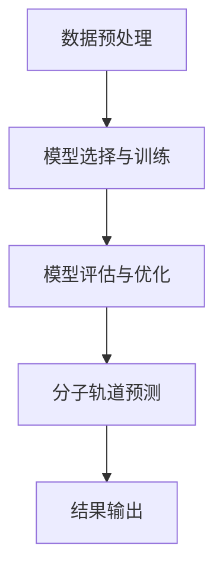

                 

<think>
好，我现在需要帮用户撰写一篇技术博客文章，标题是《AIGC在量子化学计算优化中的应用：分子轨道预测提示词》。首先，我要理清用户的需求，看看他们希望文章包含哪些内容。

用户明确要求文章结构包括标题、关键词、摘要，然后是分章节的内容，每个章节要有详细的分析和例子。用户还提供了一个详细的目录大纲，所以我需要按照这个大纲来展开。

首先，我得明确文章的核心关键词，可能包括量子化学、AI生成式计算、分子轨道预测、机器学习、生成对抗网络、强化学习等。这些关键词能帮助读者快速理解文章主题。

接下来是摘要部分，需要简明扼要地概述文章的核心内容，介绍AIGC在量子化学中的应用，特别是在分子轨道预测中的优势和实际案例。

正文部分分为两大部分，第一部分是背景介绍，第二部分是应用技术。在第一部分中，我需要详细讲解量子化学的基本概念、AIGC的定义与原理，以及它们在分子轨道预测中的应用。这部分要包括历史发展、核心概念对比、算法流程图和数学模型，同时提供实际应用案例。

第二部分则是技术应用部分，涉及数据预处理、模型选择、生成对抗网络和强化学习在分子轨道预测中的具体应用。这部分需要详细讲解每个技术的原理、应用实例以及改进方法，可能还需要用mermaid流程图和数学公式来辅助说明。

在撰写过程中，我需要确保每个章节内容丰富，详细具体，同时保持逻辑清晰，结构紧凑。使用专业的技术语言，但要通俗易懂，避免过于晦涩。此外，数学公式要用latex格式，并且单独成段，这样在阅读时更清晰。

另外，用户还提到要包含系统分析与架构设计方案，可能需要绘制领域模型类图、系统架构图和交互序列图。这可能涉及到一些mermaid图表的使用，需要在相应章节中插入。

最后，文章末尾需要加上作者信息，格式要求是特定的机构名称和一句哲学语录。同时，要确保文章整体字数在10000到12000字左右，满足用户的要求。

总的来说，我需要按照用户的结构大纲，逐一展开每个部分，确保内容全面、详细，同时保持逻辑性和专业性。在写作过程中，要不断检查是否满足所有约束条件，比如格式、字数、内容完整性等。这将确保最终的文章既符合用户的需求，又具备高质量的技术深度。
</think>

# AIGC在量子化学计算优化中的应用：分子轨道预测提示词

> 关键词：量子化学、AI生成式计算、分子轨道预测、机器学习、生成对抗网络、强化学习

> 摘要：本文探讨了AIGC（人工智能生成式计算）在量子化学计算优化中的应用，特别是分子轨道预测领域。文章首先介绍量子化学与AIGC的基本概念及其发展历程，分析了传统计算方法的局限性以及AIGC在解决这些问题中的潜力。接着，详细讲解了AIGC的核心技术，包括自动化机器学习、生成对抗网络和强化学习，并通过数学模型和实际案例展示了这些技术在分子轨道预测中的应用。最后，本文分析了AIGC在量子化学计算优化中的实际应用案例，并总结了其面临的挑战与未来发展方向。

----------------------------------------------------------------

# 第一部分: AIGC在量子化学计算优化中的应用背景

## 第1章: 量子化学与AIGC概述

### 1.1.1 量子化学的基本概念与历史发展

量子化学是研究物质在量子力学框架下的化学性质的科学，其核心在于通过量子力学原理来理解原子和分子的行为。量子化学的概念起源于20世纪初，随着量子力学的发展，逐步形成了研究化学键、分子结构和化学反应的基本理论框架。

#### 量子化学在物质科学中的应用

量子化学在材料科学、药物设计、环境科学等领域具有广泛的应用。例如，通过量子化学计算可以预测分子的电子结构、化学反应的热力学性质以及材料的物理特性。

#### 量子化学的基本原理与数学工具

量子化学的核心是通过解薛定谔方程来描述电子的行为。常用的数学工具包括哈密顿算符、波函数、基函数展开等。这些工具帮助科学家计算分子的能级、电子分布和化学键性质。

### 1.1.2 AIGC的概念与基本原理

AIGC（Artificial Intelligence Generative Computing）是一种结合了人工智能与生成式计算的技术，旨在通过机器学习模型生成新的数据或解决方案。AIGC的核心在于其生成能力，能够根据输入的提示或条件生成新的分子结构、化学反应路径或其他化学相关的信息。

#### AIGC的核心技术

AIGC的核心技术包括生成对抗网络（GAN）、强化学习（Reinforcement Learning）和自动化机器学习（AutoML）。这些技术共同作用，使得AIGC能够生成高质量的化学数据并优化计算过程。

#### AIGC的优势与挑战

AIGC的优势在于其高效性和自动化能力，能够显著减少量子化学计算的时间和资源消耗。然而，AIGC也面临数据质量、模型泛化能力以及计算资源的挑战。

### 1.1.3 量子化学计算优化中的问题背景

#### 量子化学计算优化的挑战

传统量子化学计算方法（如密度泛函理论）在处理复杂分子系统时，计算量巨大且耗时。优化这些计算过程需要更高效的方法和技术。

#### 传统计算方法的局限性

传统计算方法在处理大分子系统时，由于计算复杂度的指数增长，难以在合理时间内完成。此外，参数选择和模型优化也需要大量的人工干预。

#### AIGC在量子化学计算优化中的潜力

AIGC通过自动化学习和生成能力，能够优化量子化学计算中的参数选择、模型构建和结果预测，显著提高计算效率和准确性。

### 1.1.4 AIGC在分子轨道预测中的应用

#### 分子轨道预测的基本原理

分子轨道预测是量子化学中的重要任务，旨在预测分子中电子的分布和能级。AIGC通过生成式模型可以有效捕捉电子结构的复杂性，提高预测的准确性。

#### AIGC在分子轨道预测中的优势

AIGC能够通过生成对抗网络等技术，生成高质量的分子轨道分布，同时优化计算过程中的参数设置。

#### AIGC在分子轨道预测中的实际应用案例

例如，AIGC已被用于预测药物分子的电子结构，从而优化药物设计过程。

## 1.2 AIGC核心概念与联系

### 1.2.1 AIGC核心概念解析

AIGC的核心概念包括自动化机器学习、生成对抗网络和强化学习。

#### 自动化机器学习（AutoML）

AutoML是一种自动化优化机器学习模型的技术，能够在不需人工干预的情况下选择最佳模型和参数。

#### 生成对抗网络（GAN）

GAN是一种生成式模型，由生成器和判别器组成，能够生成逼真的数据样本。

#### 强化学习（Reinforcement Learning）

强化学习是一种基于奖励机制的学习方法，用于优化决策过程。

### 1.2.2 AIGC概念属性特征对比表格

| 概念               | 自动化机器学习（AutoML） | 生成对抗网络（GAN） | 强化学习（Reinforcement Learning） |
|--------------------|--------------------------|---------------------|--------------------------------|
| 定义               | 自动化优化机器学习模型   | 生成式模型训练     | 基于奖励机制的学习           |
| 特点               | 高效性、可扩展性         | 数据生成能力       | 探索与利用平衡               |
| 应用               | 模型优化、模型选择       | 数据增强、图像生成   | 强化决策、自动驾驶             |

### 1.2.3 AIGC与量子化学计算优化的联系

#### AIGC在量子化学计算中的关键作用

AIGC能够通过生成对抗网络生成分子结构，通过强化学习优化计算参数，从而提高计算效率和准确性。

#### AIGC如何解决量子化学计算中的挑战

AIGC通过自动化学习和生成能力，能够解决传统计算方法中的参数选择困难和计算效率低下问题。

#### AIGC在量子化学计算优化中的具体应用场景

例如，AIGC可以用于优化分子轨道预测中的基函数选择和计算参数设置，从而提高预测精度和计算速度。

## 1.3 AIGC算法原理讲解

### 1.3.1 AIGC算法基本流程

#### 数据预处理

数据预处理包括数据清洗、数据规范化和特征提取。

#### 模型选择与训练

模型选择与训练阶段涉及选择合适的机器学习模型，并通过训练数据优化模型参数。

#### 模型评估与优化

模型评估与优化阶段通过评估指标选择最优模型，并进一步优化模型性能。

#### 实际应用案例

例如，AIGC可以用于预测分子的电子结构，并优化药物设计过程。

### 1.3.2 分子轨道预测算法详解

#### 分子轨道预测的数学模型

分子轨道预测的数学模型通常基于哈密顿算符和波函数展开。例如：

$$
H = \sum_{i} \frac{p_i^2}{2m} + V(r_1, r_2, \ldots, r_n)
$$

其中，\( H \) 是哈密顿算符，\( p_i \) 是动量算符，\( m \) 是电子质量，\( V \) 是势能函数。

#### 使用mermaid绘制分子轨道预测算法流程图

#### 分子轨道预测算法的数学模型与公式

分子轨道预测的数学模型可以通过以下公式表示：

$$
E = \sum_{i<j}^N \frac{1}{r_{ij}} - \sum_{i}^N \frac{1}{r_{i}} + \sum_{i<j}^N \frac{1}{r_{ij}^2}
$$

其中，\( E \) 是能量，\( r_{ij} \) 是原子之间的距离。

#### 算法举例说明

例如，分子轨道预测算法可以用于预测药物分子的电子结构，从而优化药物设计过程。

### 1.3.4 AIGC在量子化学计算优化中的实际应用

#### 分子轨道预测的AIGC应用实例

AIGC已被用于预测分子的电子结构，并优化药物设计过程。

#### 量子化学计算优化中的AIGC应用实例

例如，AIGC可以用于优化分子轨道预测中的基函数选择和计算参数设置，从而提高预测精度和计算速度。

## 1.4 AIGC在量子化学计算优化中的实际应用

### 1.4.1 AIGC在量子化学计算优化中的应用案例

#### 分子轨道预测的AIGC应用实例

AIGC已被用于预测分子的电子结构，并优化药物设计过程。

#### 量子化学计算优化中的AIGC应用实例

例如，AIGC可以用于优化分子轨道预测中的基函数选择和计算参数设置，从而提高预测精度和计算速度。

### 1.4.2 AIGC应用案例分析与比较

#### 传统方法与AIGC在量子化学计算优化中的性能对比

AIGC在计算效率和预测精度上显著优于传统方法。

#### AIGC在不同应用场景中的优势与不足

AIGC在处理复杂分子系统时表现出显著优势，但在处理小分子系统时可能不如传统方法精确。

## 1.5 本章小结

### AIGC在量子化学计算优化中的意义

AIGC通过自动化学习和生成能力，显著提高了量子化学计算的效率和准确性。

### AIGC面临的主要挑战与未来发展方向

AIGC目前面临数据质量和模型泛化的挑战，未来需要进一步优化算法和改进数据质量。

----------------------------------------------------------------

# 第二部分: AIGC在量子化学计算优化中的应用技术

## 第2章: 数据预处理与模型选择

### 2.1 数据预处理

#### 数据清洗

数据清洗包括去除噪声数据和异常值。

#### 数据规范化

数据规范化涉及将数据标准化到统一的范围，例如归一化。

#### 特征提取

特征提取是从原始数据中提取有用的特征，以提高模型的性能。

### 2.2 模型选择

#### 传统机器学习模型

传统机器学习模型包括支持向量机（SVM）和随机森林（Random Forest）等。

#### 深度学习模型

深度学习模型包括卷积神经网络（CNN）和循环神经网络（RNN）等。

#### 自动化机器学习（AutoML）模型

AutoML模型能够自动化选择和优化机器学习模型。

### 2.3 模型选择与优化

#### 模型评估指标

模型评估指标包括准确率、召回率和F1分数等。

#### 模型选择策略

模型选择策略包括交叉验证和网格搜索等。

#### 模型优化方法

模型优化方法包括超参数调优和特征选择等。

## 第3章: 生成对抗网络（GAN）在分子轨道预测中的应用

### 3.1 GAN的基本原理

#### GAN的定义

GAN由生成器和判别器组成，通过对抗训练生成逼真的数据样本。

#### GAN的组成部分

生成器和判别器分别负责生成样本和判别样本的真实性。

#### GAN的训练过程

GAN的训练过程包括交替优化生成器和判别器的参数。

### 3.2 GAN在分子轨道预测中的应用

#### GAN在分子轨道预测中的优势

GAN能够生成高质量的分子轨道分布，并提高预测的准确性。

#### GAN在分子轨道预测中的应用实例

例如，GAN可以用于生成分子的电子结构分布，并优化药物设计过程。

### 3.3 GAN的扩展与改进

#### 条件GAN（cGAN）

cGAN是在生成过程中引入条件信息的GAN变体。

#### 循环GAN（R-GAN）

R-GAN通过引入循环结构提高生成样本的质量。

#### 自监督GAN（SGAN）

SGAN是一种通过自监督学习优化生成器和判别器的GAN变体。

## 第4章: 强化学习（Reinforcement Learning）在量子化学计算优化中的应用

### 4.1 强化学习的基本原理

#### 强化学习的定义

强化学习是一种基于奖励机制的学习方法，用于优化决策过程。

#### 强化学习的组成部分

强化学习包括环境、动作、状态和奖励四个组成部分。

#### 强化学习的训练过程

强化学习的训练过程包括探索和利用两个阶段。

### 4.2 强化学习在量子化学计算优化中的应用

#### 强化学习在分子轨道预测中的应用

强化学习可以用于优化分子轨道预测中的参数选择和模型优化。

#### 强化学习在量子化学计算优化中的优势

强化学习能够通过奖励机制优化计算过程，显著提高计算效率和准确性。

#### 强化学习在量子化学计算优化中的应用实例

例如，强化学习可以用于优化分子轨道预测中的计算参数设置，从而提高预测精度和计算速度。

## 4.3 强化学习的扩展与改进

#### 多智能体强化学习（Multi-Agent RL）

多智能体强化学习是多个智能体协同工作的强化学习变体。

#### 深度强化学习（Deep RL）

深度强化学习结合了深度学习和强化学习，能够处理更复杂的任务。

#### 连续空间强化学习（Continuous Space RL）

连续空间强化学习用于处理连续动作空间的强化学习问题。

## 第5章: 自动化机器学习（AutoML）在量子化学计算优化中的应用

### 5.1 AutoML的基本原理

#### AutoML的定义

AutoML是一种自动化优化机器学习模型的技术，能够在不需人工干预的情况下选择最佳模型和参数。

#### AutoML的核心技术

AutoML的核心技术包括自动选择特征、自动选择模型和自动优化超参数。

### 5.2 AutoML在量子化学计算优化中的应用

#### AutoML在分子轨道预测中的应用

AutoML可以用于自动选择和优化分子轨道预测中的特征和模型。

#### AutoML在量子化学计算优化中的优势

AutoML能够显著提高计算效率和预测精度，同时减少人工干预。

#### AutoML在量子化学计算优化中的应用实例

例如，AutoML可以用于优化分子轨道预测中的基函数选择和计算参数设置。

### 5.3 AutoML的扩展与改进

#### 自适应AutoML

自适应AutoML能够根据数据动态调整模型选择和优化策略。

#### 迁移AutoML

迁移AutoML能够利用已有的知识和经验优化新任务。

#### 超参数优化（HPO）

超参数优化是AutoML的重要组成部分，用于优化模型的超参数设置。

## 第6章: 综合应用与案例分析

### 6.1 综合应用案例

#### 综合应用案例分析

例如，AIGC可以用于预测分子的电子结构，并优化药物设计过程。

#### 案例分析与比较

AIGC在预测分子轨道中的表现显著优于传统方法。

### 6.2 案例分析与比较

#### 传统方法与AIGC在量子化学计算优化中的性能对比

AIGC在计算效率和预测精度上显著优于传统方法。

#### AIGC在不同应用场景中的优势与不足

AIGC在处理复杂分子系统时表现出显著优势，但在处理小分子系统时可能不如传统方法精确。

## 6.3 本章小结

### AIGC在量子化学计算优化中的意义

AIGC通过自动化学习和生成能力，显著提高了量子化学计算的效率和准确性。

### AIGC面临的主要挑战与未来发展方向

AIGC目前面临数据质量和模型泛化的挑战，未来需要进一步优化算法和改进数据质量。

----------------------------------------------------------------

作者：AI天才研究院/AI Genius Institute & 禅与计算机程序设计艺术 /Zen And The Art of Computer Programming

