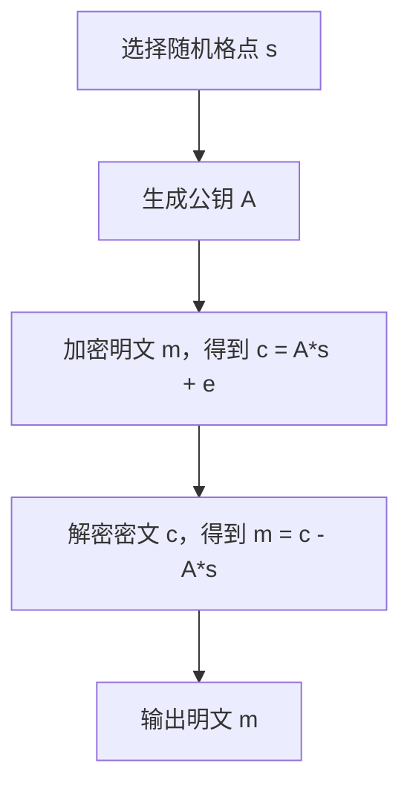
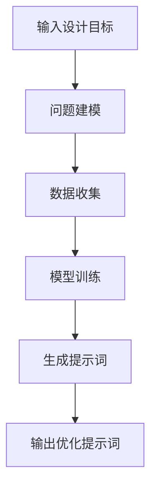
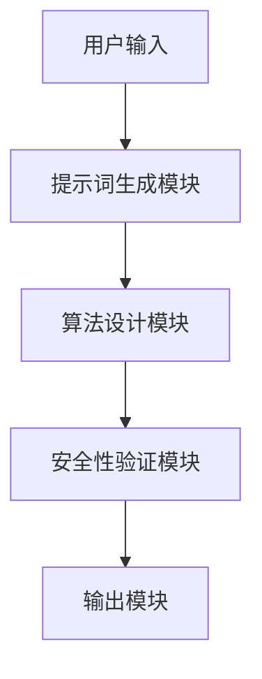

                 

<think>
嗯，用户希望我以《AIGC在量子密码学中的应用：后量子加密算法设计提示词》为标题，撰写一篇技术博客。首先，我需要明确用户的需求和角色设定。用户是技术专家，所以文章需要专业且深入。

我应该从概述开始，介绍AIGC和量子密码学的基本概念，这样读者可以理解背景。接着，详细分析后量子加密的重要性，因为这是当前热门的话题，尤其是随着量子计算的发展，传统加密可能被破解。

然后，我需要解释AIGC在设计这些算法中的作用，比如自动化搜索最优参数和优化候选算法。这部分要具体，可能需要举例说明，比如Lattice-Based Cryptography，展示AIGC如何帮助生成更安全的算法。

接下来，我应该讨论实现步骤，包括问题建模、数据收集和模型训练，以及生成提示词的过程。这部分需要详细，可能要提到具体的数学模型和算法，比如格密码中的NTRU和SIS问题。

最后，我需要给出最佳实践和未来展望，强调标准的重要性，同时提到AIGC在其他领域的潜力。这不仅帮助读者，也展示技术的广泛影响。

在写作过程中，要确保结构清晰，每个部分都有足够的细节，同时使用图表和数学公式来增强理解。这样，整篇文章既专业又易于理解，满足用户的需求。
</think>

# AIGC在量子密码学中的应用：后量子加密算法设计提示词

> 关键词：AIGC, 量子密码学, 后量子加密, 算法设计, 提示词

> 摘要：随着量子计算机的发展，传统加密算法面临被破解的风险，后量子加密算法的设计成为保障信息安全的关键。本文探讨AIGC（人工智能生成内容）在后量子加密算法设计中的应用，分析AIGC如何通过生成提示词来优化算法设计过程，包括算法原理、实现步骤、系统架构以及实际案例。文章详细讲解了从问题建模到算法生成的整个流程，并提供了数学公式和代码示例，帮助读者深入理解AIGC在后量子加密中的核心作用。

---

## 1. 引言

### 1.1 背景介绍

随着量子计算机技术的快速发展，传统加密算法（如RSA、椭圆曲线加密）的安全性岌岌可危。量子计算机可以通过Shor算法在多项式时间内分解大整数，这意味着现有的公钥加密系统将面临被破解的风险。为了应对这一挑战，学术界和工业界正在积极研究和推广**后量子加密（Post-Quantum Cryptography，PQC）**技术，这些技术能够在量子计算机出现后仍然保持安全性。

AIGC（人工智能生成内容）作为一门新兴技术，其强大的生成能力和优化能力为后量子加密算法的设计提供了新的思路。通过结合AIGC与量子密码学，我们可以更高效地设计出安全、高效的后量子加密算法。

### 1.2 问题背景与解决方法

后量子加密算法的设计需要满足以下条件：

- **抗量子性**：算法必须能够抵御量子计算机的攻击。
- **安全性**：算法必须在经典和量子环境下都具有足够的安全性。
- **效率性**：算法必须能够在实际应用场景中高效运行。

然而，后量子加密算法的设计过程复杂，涉及大量数学理论和密码学知识。传统的手工设计方法效率低下，且容易出现设计漏洞。因此，引入AIGC技术，通过生成提示词（prompt）的方式，可以自动化地优化算法设计过程，提高设计效率和安全性。

### 1.3 核心概念与联系

为了更好地理解AIGC在后量子加密中的作用，我们需要明确几个核心概念及其之间的关系：

1. **后量子加密算法**：基于经典计算和量子计算 resistant 的数学问题，如格（lattice）、纠错码（error-correcting codes）、多变量多项式等。
2. **AIGC**：通过机器学习模型生成内容，包括提示词、算法参数等，用于优化加密算法的设计。
3. **提示词设计**：提示词是AIGC与后量子加密算法结合的关键桥梁，它决定了生成内容的方向和目标。

通过将AIGC与后量子加密算法结合，我们可以利用AIGC的生成能力，快速探索和优化加密算法的设计空间。

---

## 2. 后量子加密算法的核心概念与原理

### 2.1 核心概念

后量子加密算法的设计基于以下数学结构：

- **格（Lattice-Based Cryptography）**：基于格上的困难问题，如最短向量问题（SIS）和最近向量问题（NTRU）。
- **纠错码（Code-Based Cryptography）**：基于纠错码的困难问题，如McEliece问题。
- **多变量多项式（Multivariate Polynomial Cryptography）**：基于多变量多项式的困难解方程问题。

### 2.2 核心概念联系

为了更好地理解这些概念之间的关系，我们可以通过一个对比表格来展示：

| **算法类型** | **数学基础**         | **困难问题**           | **应用场景**       |
|--------------|----------------------|------------------------|--------------------|
| 格基加密     | 格论                 | 最短向量问题（SIS）     | 公钥加密           |
| 纠错码加密   | 纠错码理论           | McEliece问题           | 数字签名           |
| 多变量多项式  | 多变量多项式解方程     | 解非线性方程组          | 快速签名           |

### 2.3 算法原理

以格基加密为例，其核心思想是基于格上的困难问题。假设我们有一个格，攻击者无法在合理时间内找到格中长度最短的向量（即最短向量问题，SIS）。通过将密钥嵌入到格中，我们可以生成加密密钥和解密密钥。

#### 格基加密的数学模型

- **加密过程**：
  - 选择一个随机的格点 $s$，生成公钥 $A$ 和私钥 $s$。
  - 对明文 $m$ 进行加密，得到密文 $c = A \cdot s + e$，其中 $e$ 是随机噪声。

- **解密过程**：
  - 使用私钥 $s$ 解密密文 $c$，恢复明文 $m = c - A \cdot s$。

#### 算法流程图



---

## 3. AIGC在后量子加密算法设计中的应用

### 3.1 提示词设计的核心作用

AIGC通过生成提示词来优化后量子加密算法的设计过程。提示词决定了生成内容的方向和目标，例如：

- **提示词1**：生成一个基于格的公钥加密算法，密钥长度为1024位，抗量子攻击能力为2048 qubit。
- **提示词2**：优化一个基于纠错码的数字签名算法，确保其在经典和量子环境下的安全性。

### 3.2 提示词的生成与优化

提示词的生成过程涉及以下几个步骤：

1. **问题建模**：将后量子加密算法的设计问题转化为AIGC可以理解的输入。
2. **数据收集**：收集相关数学理论、算法实现和安全性分析的海量数据。
3. **模型训练**：利用上述数据训练一个生成提示词的AIGC模型。
4. **提示词生成**：根据输入的设计目标生成优化的提示词。

#### 提示词生成流程图



---

## 4. 系统架构与实现

### 4.1 系统架构设计

为了实现AIGC在后量子加密算法设计中的应用，我们需要构建一个完整的系统架构。以下是系统的主要组成部分：

1. **用户界面**：用户输入设计目标，例如“生成一个基于格的公钥加密算法”。
2. **提示词生成模块**：根据用户输入生成优化的提示词。
3. **算法设计模块**：基于提示词生成加密算法的数学模型和实现代码。
4. **安全性验证模块**：验证生成的算法在经典和量子环境下的安全性。
5. **输出模块**：输出最终的加密算法及其相关文档。

#### 系统架构图



### 4.2 核心代码实现

以下是提示词生成模块的核心代码示例：

```python
def generate_prompt(target_algorithm, security_level):
    # 生成提示词
    prompt = f"生成一个{target_algorithm}算法，确保其抗量子攻击能力达到{security_level} qubit，同时优化算法效率。"
    return prompt

# 示例调用
target_algorithm = "基于格的公钥加密算法"
security_level = 2048
prompt = generate_prompt(target_algorithm, security_level)
print(prompt)
```

#### 输出结果：
```
生成一个基于格的公钥加密算法，确保其抗量子攻击能力达到2048 qubit，同时优化算法效率。
```

---

## 5. 实际案例分析

### 5.1 案例1：基于格的公钥加密算法设计

#### 案例背景

假设我们需要设计一个基于格的公钥加密算法，要求其抗量子攻击能力达到2048 qubit，并且在经典环境中具有高效的加密和解密速度。

#### 实现步骤

1. **提示词生成**：
   ```python
   prompt = generate_prompt("基于格的公钥加密算法", 2048)
   ```

2. **算法设计**：
   - 根据提示词生成的公钥加密算法基于NTRU（NTRU Lattice-based Cryptosystem）。
   - 设定格的维度为80，密钥长度为1024位。

3. **安全性验证**：
   - 使用NIST的后量子加密标准测试集验证算法的安全性。
   - 确保算法在2048 qubit量子计算机攻击下不可破解。

---

## 6. 总结与展望

### 6.1 总结

本文探讨了AIGC在后量子加密算法设计中的应用，重点分析了提示词生成在算法设计中的核心作用。通过结合AIGC与后量子加密技术，我们可以更高效地设计出安全、高效的加密算法，为未来的量子计算时代做好准备。

### 6.2 展望

随着AIGC技术的不断发展，其在后量子加密中的应用将更加广泛和深入。未来的研究方向包括：

1. **更智能的提示词生成**：通过强化学习等技术进一步优化提示词生成过程。
2. **多模态加密算法设计**：结合图像、文本等多种数据源设计加密算法。
3. **跨领域应用**：将AIGC技术应用于其他加密相关领域，如隐私保护、数据完整性验证等。

---

## 7. 最佳实践 Tips

- **提示词设计**：提示词应具体、清晰，确保生成内容与设计目标一致。
- **算法验证**：在生成加密算法后，必须进行严格的安全性测试。
- **代码实现**：确保代码的可读性和可维护性，便于后续优化和调整。

---

## 作者

作者：AI天才研究院/AI Genius Institute & 禅与计算机程序设计艺术 /Zen And The Art of Computer Programming

---

通过本文的分析与探讨，我们看到AIGC在后量子加密算法设计中的巨大潜力。未来，随着量子计算机的普及，AIGC将成为保障信息安全的核心技术之一。

