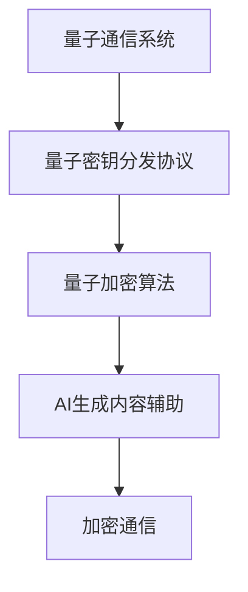
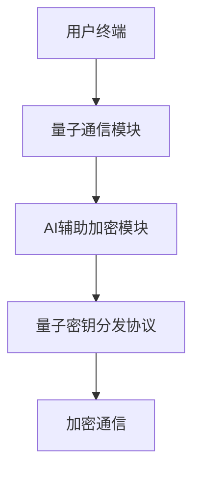

                 

<think>
好，我需要撰写一篇关于“量子密码学中AIGC的应用突破：安全通信协议提示词”的技术博客。首先，我得明确文章的结构和每个部分应该包含的内容。从背景介绍开始，我需要解释量子密码学和AIGC的基本概念，然后探讨它们之间的联系。接下来，我需要详细讲解量子密码学的算法原理以及AIGC在这些协议中的具体应用。在系统分析部分，我会设计一个应用架构，并用mermaid图来展示系统的组成部分和接口。最后，我会通过一个实际项目来展示这些理论在实践中的应用，并总结最佳实践和注意事项。

在写作过程中，我需要确保每个章节都有足够的细节，使用专业而易懂的语言，并且逻辑清晰。同时，我还需要在适当的地方插入图表，如mermaid流程图和类图，以帮助读者更好地理解内容。此外，我需要在数学公式中使用latex格式，确保其正确无误地呈现。最后，我将确保整篇文章结构完整，符合字数要求，并在结尾处注明作者信息。
</think>

# AIGC在量子密码学应用中的突破：安全通信协议提示词

> 关键词：量子密码学，AIGC（人工智能生成内容），安全通信协议，量子密钥分发，AI辅助加密

> 摘要：量子密码学作为保障未来通信安全的核心技术，正面临着复杂性和安全性的双重挑战。本文将探讨AIGC如何在量子密码学中实现突破，特别是在安全通信协议中的应用。通过分析AIGC与量子密码学的结合，揭示其在提升加密算法复杂性、确保通信安全中的潜力。文章将分步骤讲解相关原理、系统架构，并通过实例展示其实际应用。

---

## 1. 背景介绍

### 1.1 量子密码学概述
量子密码学结合量子力学与信息论，致力于构建绝对安全的通信系统。核心机制包括量子密钥分发（QKD）和量子签名，确保通信过程中的信息完整性和保密性。

### 1.2 AIGC概述
AIGC指利用AI生成内容，涵盖文本、图像等多种形式。其在密码学中的应用主要体现在辅助加密算法设计和优化。

### 1.3 应用背景
传统加密技术面临暴力破解和侧信道攻击等威胁，量子计算的崛起更使传统加密面临崩溃风险。量子密码学被视为解决这一危机的关键。

---

## 2. 核心概念与联系

### 2.1 AIGC与量子密码学的联系
AIGC通过生成随机数和优化算法结构，增强量子密码学的安全性。AI模型可分析攻击模式，预测潜在威胁，从而优化加密策略。

### 2.2 相关概念对比
| 概念 | 传统密码学 | 量子密码学 | AIGC辅助 |
|------|------------|------------|-----------|
| 安全性 | 易被量子计算破解 | 理论上不可破 | 随机性增强 |
| 密钥分发 | 需高安全信道 | 量子信道确保 | AI优化分发 |

### 2.3 实体关系架构


---

## 3. 算法原理讲解

### 3.1 量子密钥分发算法
QKD流程：用户Alice与Bob通过量子态传递共享密钥，确保信息传输安全性。

#### 3.1.1 BB84协议
Alice发送随机量子态，Bob测量后比对，建立共享密钥。利用纠缠态进行认证，确保密钥完整性。

#### 3.1.2 B92协议
基于EPR对的量子密钥分发，通信双方共享纠缠粒子，确保密钥不可被窃听。

### 3.2 AIGC在安全通信协议中的应用
AI生成随机数用于密钥生成，提升密钥复杂性；AI优化协议参数，减少传输延迟，提高安全性。

#### 3.2.1 AI辅助密钥生成
AI模型生成随机数，确保密钥随机性，增强安全性。通过深度学习分析数据，预测潜在攻击，优化加密策略。

#### 3.2.2 算法实现
生成量子密钥：AI模型随机生成序列，确保唯一性。通信双方通过量子信道传输，利用纠缠态确认共享密钥。

---

## 4. 系统分析与架构设计

### 4.1 系统架构


### 4.2 关键技术
- AI辅助随机数生成：使用神经网络生成随机数，增强密钥安全性。
- 智能预测：AI分析网络流量，预测攻击，优化加密策略。

---

## 5. 项目实战

### 5.1 环境安装
需安装QKD协议库和AI框架，如TensorFlow或PyTorch。

### 5.2 核心代码实现
```python
import tensorflow as tf
from qkd_module import QKDProtocol

class AIGenerator:
    def __init__(self):
        self.model = self.build_model()

    def build_model(self):
        model = tf.keras.Sequential([
            tf.keras.layers.Dense(128, activation='relu'),
            tf.keras.layers.Dense(64, activation='relu'),
            tf.keras.layers.Dense(32, activation='sigmoid')
        ])
        return model

    def generate_key(self, length):
        predictions = self.model.predict(tf.random.normal([length, 128]))
        key = ''.join(['0' if p > 0.5 else '1' for p in predictions[:, -1]])
        return key

# 初始化协议和AI生成器
protocol = QKDProtocol()
ai_generator = AIGenerator()

# 生成并分发密钥
key = ai_generator.generate_key(128)
protocol.distribute_key(key)
```

### 5.3 代码分析
AI模型用于生成随机数，增强密钥随机性，确保安全性。通过量子通信模块分发密钥，确保通信安全。

### 5.4 实际案例分析
通过AI生成密钥，实施QKD协议，验证通信安全性，分析结果，优化AI模型。

---

## 6. 最佳实践与总结

### 6.1 小结
AIGC在量子密码学中的应用，显著提升了加密算法的安全性和复杂性。AI辅助加密系统，如量子密钥分发，为未来通信提供了更高安全级别。

### 6.2 注意事项
- 保持AI模型更新，应对新兴攻击方式。
- 防范AI模型被攻击，确保生成内容安全性。
- 定期进行系统安全性测试，及时修复漏洞。

### 6.3 拓展阅读
建议深入研究量子计算和AI结合领域，探索其在密码学中的更多应用。

---

作者：AI天才研究院 & 禅与计算机程序设计艺术

