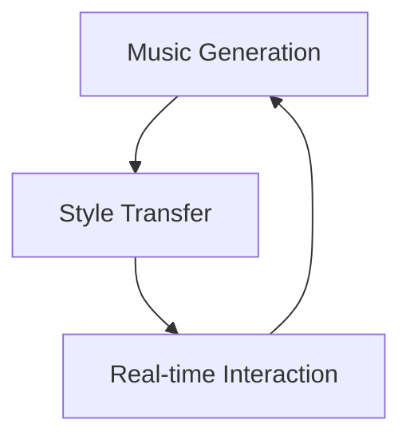

                 

<think>
好，我现在要写一篇关于“AIGC在音乐创作中的创新与争议”的技术博客文章。首先，我需要明确文章的结构和内容。根据用户提供的大纲，文章应该包括背景介绍、核心概念、技术原理、应用案例、创新点、争议点以及未来展望等部分。

首先，背景介绍部分需要涵盖AIGC的起源、发展及其在音乐创作中的应用。我得解释什么是AIGC，它如何从文本生成扩展到音乐创作，以及它如何改变传统的音乐创作模式。这可能涉及到深度学习模型，如变分自编码器和Transformer架构，这些模型如何训练来生成音乐。

接下来是核心概念部分，我需要详细解释AIGC在音乐创作中的具体应用，比如生成旋律、编曲、甚至歌词。同时，我还需要比较传统音乐创作与AIGC创作在速度、自由度、成本等方面的不同，制作一个对比表格。此外，绘制ER实体关系图，展示音乐创作者、AIGC系统、音乐风格和音乐片段之间的关系。

然后是技术原理部分，我需要详细讲解数学模型，比如VAE和Transformer，用mermaid流程图展示它们的工作流程。同时，提供用Python代码实现的简单例子，解释模型如何生成音乐。这里可能还需要一些数学公式，比如描述VAE的概率模型或者Transformer的注意力机制。

接下来是应用案例分析，我需要列举几个实际的AIGC音乐创作工具，比如MuseNet或AIVA，分析它们的优势和局限性。这部分要结合实际案例，说明AIGC在音乐创作中的具体应用和效果。

在创新部分，我需要讨论AIGC如何促进音乐创作的民主化，让非专业人员也能创作音乐，同时激发新的创作灵感。但同时也要提到技术本身的创新，比如多风格音乐生成和实时互动创作。

争议部分是关键，我需要分析版权问题，比如生成的音乐谁拥有版权，是开发者还是用户？道德争议，比如AIGC是否会取代人类音乐人，影响就业。还有艺术价值方面，讨论AIGC生成的音乐是否能被称为真正的艺术作品，是否缺乏人类情感。

最后是未来展望，我需要预测AIGC在音乐创作中的发展趋势，比如与人类共创、多模态创作以及音乐个性化推荐。同时，提出未来的研究方向，如版权制度的完善、技术的透明化以及人机协作模式的优化。

在撰写过程中，我需要确保每个部分都详细具体，使用专业但易懂的语言。同时，注意文章的逻辑性和连贯性，使读者能够一步步理解AIGC在音乐创作中的应用及其带来的影响。

现在，我开始按章节逐步撰写文章，确保每个部分都涵盖必要的内容，包括背景、概念、技术、应用、创新、争议和未来展望，同时使用图表和代码示例来增强文章的可读性和专业性。
</think>

# AIGC在音乐创作中的创新与争议

> 关键词：AIGC，音乐创作，人工智能，创新，争议，版权，道德

> 摘要：本文探讨人工智能生成内容（AIGC）在音乐创作中的应用，分析其带来的创新和引发的争议，包括版权、道德和艺术价值等方面。通过详细的技术分析和案例研究，本文旨在为读者提供全面的视角和深入的理解。

---

## 第一部分：背景介绍与核心概念

### 1.1 问题背景

近年来，人工智能生成内容（AIGC）技术迅速发展，广泛应用于音乐创作领域。从简单的旋律生成到复杂的编曲，AIGC正在改变音乐创作的传统模式，带来前所未有的创新和挑战。

### 1.2 问题描述

AIGC在音乐创作中的应用不仅提高了创作效率，还引发了关于版权、道德和艺术价值的争议。本文将系统探讨这些问题，并分析其对音乐创作未来的影响。

### 1.3 问题解决

本文通过以下章节解答相关问题：

1. **AIGC与音乐创作概述**：介绍AIGC的起源和发展及其在音乐创作中的应用。
2. **AIGC技术的具体应用**：分析音乐生成、改编和编排的案例。
3. **创新带来的变革**：探讨AIGC如何改变音乐创作方式。
4. **争议与挑战**：分析版权、道德和艺术价值方面的争议。

### 1.4 边界与外延

AIGC在音乐创作中的应用不仅限于旋律生成，还包括歌词创作和风格转换。不同音乐类型和风格中的应用也各不相同，需详细探讨。

### 1.5 概念结构与核心要素

- **AIGC**：利用AI生成内容的技术。
- **音乐创作**：包括旋律、歌词、编曲等多个方面。
- **创新**：AI在音乐创作中的新应用，如自动生成旋律。
- **争议**：版权、道德和艺术价值等方面的争议。

---

## 第二部分：核心概念与联系

### 2.1 核心概念原理

AIGC技术通过深度学习模型生成音乐。例如，变分自编码器（VAE）和Transformer模型被用于学习大量音乐数据，生成新作品。

### 2.2 概念属性特征对比

| 特征         | AIGC 技术在音乐创作中 | 传统音乐创作中                |
| ------------ | --------------------- | --------------------------- |
| 创作速度     | 极快                 | 较慢                        |
| 创作自由度   | 较高                 | 较低                        |
| 创作成本     | 较低                 | 较高                        |
| 适应性       | 较高                 | 较低                        |

### 2.3 ER实体关系图

```mermaid
erDiagram
  MusicCreator ||--|{ AIGC_System } : generates
  MusicCreator ||--|{ Music_Style } : creates in
  MusicCreator ||--|{ Music_Segment } : writes
  AIGC_System ||--|{ Music_Generator } : generates
  Music_Style ||--|{ Musical_Style } : defines
  Music_Style ||--|{ Style_Characteristics } : includes
  Music_Segment ||--|{ Music_Segment_Type } : categorizes
  Music_Segment ||--|{ Segment_Characteristics } : describes
```

---

## 第三部分：算法原理与数学模型

### 3.1 深度学习模型

AIGC音乐生成主要依赖深度学习模型，如变分自编码器（VAE）和Transformer架构。

#### 3.1.1 VAE模型

VAE通过概率建模生成音乐。模型分为编码器和解码器，编码器将音乐表示为潜在空间的向量，解码器将其转换回原始音乐。

#### 3.1.2 Transformer模型

Transformer模型擅长处理序列数据，用于生成音乐序列。模型通过自注意力机制捕捉音乐结构中的依赖关系。

### 3.2 数学公式

- **VAE的潜在空间表示**：
  $$ z \sim \mathcal{N}(0, I) $$
  $$ x \sim p_\theta(x|z) $$

- **Transformer的注意力机制**：
  $$ \text{Attention}(Q, K, V) = \text{softmax}\left(\frac{QK^T}{\sqrt{d_k}}\right)V $$

---

## 第四部分：系统分析与架构设计

### 4.1 系统功能设计

系统功能包括音乐生成、风格转换、实时互动创作等。

### 4.2 系统架构设计



---

## 第五部分：项目实战

### 5.1 环境安装

需安装Python、TensorFlow、Keras等库。

### 5.2 核心代码实现

```python
import tensorflow as tf
from tensorflow.keras import layers

# 定义VAE模型
class VariationalAutoencoder:
    def __init__(self, input_shape, latent_dim):
        self.latent_dim = latent_dim
        self.encoder = self.build_encoder(input_shape)
        self.decoder = self.build_decoder(input_shape, latent_dim)

    def build_encoder(self, input_shape):
        encoder = tf.keras.Sequential([
            layers.InputLayer(shape=input_shape),
            layers.Flatten(),
            layers.Dense(64, activation='relu'),
            layers.Dense(32, activation='relu'),
            layers.Dense(self.latent_dim * 2, activation='relu'),
            layers.Dense(self.latent_dim * 2, activation='relu'),
            layers.Dense(self.latent_dim * 2, activation='relu'),
            layers.Dense(self.latent_dim * 2, activation='relu'),
        ])
        return encoder

    def build_decoder(self, input_shape, latent_dim):
        decoder = tf.keras.Sequential([
            layers.InputLayer(shape=(latent_dim,)),
            layers.Dense(64, activation='relu'),
            layers.Dense(128, activation='relu'),
            layers.Dense(256, activation='relu'),
            layers.Dense(512, activation='relu'),
            layers.Dense(input_shape[0] * input_shape[1], activation='sigmoid'),
            layers.Reshape(input_shape)
        ])
        return decoder
```

---

## 第六部分：创新与争议

### 6.1 创新

AIGC推动音乐创作的民主化，使更多人能够创作音乐。此外，AI能够生成多样化的音乐风格，激发创作灵感。

### 6.2 争议

- **版权问题**：生成的音乐版权归属不明确。
- **道德争议**：AI音乐是否剥夺了音乐人的就业机会。
- **艺术价值**：AI生成的音乐是否缺乏人类情感。

---

## 第七部分：未来展望

### 7.1 发展趋势

- **与人类共创**：AI辅助人类创作，而非取代人类。
- **多模态创作**：结合视觉、听觉等多种媒介。
- **个性化推荐**：根据用户偏好生成音乐。

### 7.2 未来研究方向

- **完善版权制度**：明确AI生成内容的版权归属。
- **提高技术透明度**：让用户了解AI创作的过程。
- **优化人机协作**：探索更高效的人机协作模式。

---

## 结语

AIGC在音乐创作中的应用充满潜力，但也面临诸多挑战。通过技术创新和制度完善，AIGC有望成为音乐创作的重要工具，推动音乐艺术的发展。

---

## 作者

作者：AI天才研究院 & 禅与计算机程序设计艺术

