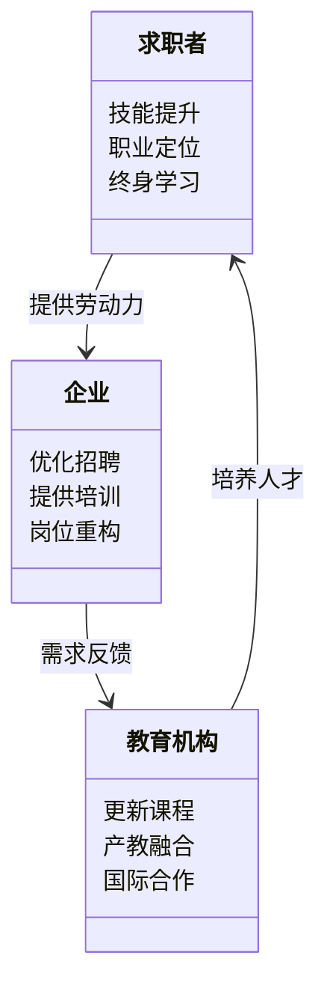
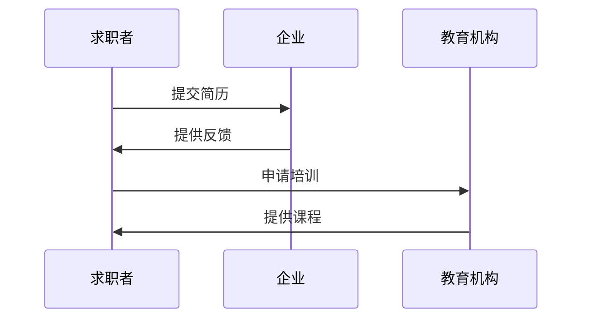

                 

<think>
嗯，我现在需要帮用户完成一个关于《AIGC对就业市场的影响及应对策略》的技术博客文章。用户已经提供了一个详细的大纲，现在需要我根据这个大纲，逐步分析和撰写文章的各个部分。首先，我得理解用户的需求，他是一位技术专家，希望文章结构清晰、内容专业，包含技术细节和实际案例分析。

首先，我会从引言开始，这部分需要包括选题背景、问题描述以及核心概念。选题背景部分，我需要说明AIGC的发展现状和它在就业市场中的影响，这可能涉及到传统岗位的消失和新岗位的出现。问题描述部分，我需要明确AIGC带来的就业问题，比如技能替代和失业风险。核心概念部分，我需要定义AIGC、就业市场和应对策略，并用表格进行对比，这样读者更容易理解。

接下来是技术现状与应用部分，这部分需要详细描述AIGC的技术发展和各类应用场景。技术概述部分，我会介绍AIGC的定义、特点、发展历程和分类。应用现状部分，会涵盖内容创作、数据标注、智能客服、智能推荐和虚拟现实等多个领域，每个领域都要有具体的例子，比如GPT-3和GAN的应用。

然后，我会分析AIGC对就业市场的影响，分为积极和消极两方面。积极方面包括效率提升、新岗位创造和技能需求变化；消极方面则涉及传统岗位的流失、就业结构失衡和人才供需错配。这部分需要详细的数据和案例支持，以增强说服力。

应对策略部分是文章的核心，我会分别从求职者、企业和教育机构三个层面来探讨应对措施。求职者需要提升技能、重新定位职业方向和增强终身学习能力；企业则需要优化招聘流程、提供培训机会和重构岗位结构；教育机构应更新课程内容，与产业需求对接，并加强产教融合。每个策略都需要具体的建议和可能的实施步骤。

接下来是系统分析与架构设计，这部分需要使用Mermaid图来展示领域模型、系统架构和接口设计。我会通过类图展示求职者、企业、教育机构之间的关系，架构图展示各模块的交互，接口设计则描述数据流如何在系统中流动。这有助于读者理解系统的整体结构和各部分的协同工作。

在项目实战部分，我会选择一个开源项目作为案例，比如GitHub上的某个AIGC工具。这部分需要详细说明如何安装环境、编写代码、实现功能，并结合实际案例分析其对就业市场的影响。代码部分需要清晰易懂，并附上注释，以便读者理解和复现。

最后，最佳实践部分会总结文章的要点，提出注意事项和未来的研究方向。这部分需要简明扼要，帮助读者在实际操作中避免误区，并引导他们深入思考。

整个思考过程中，我需要确保每个部分都逻辑清晰，内容详实，并且使用专业但易懂的语言。同时，要合理运用表格、流程图和代码示例，以增强文章的可读性和说服力。最终，整篇文章应该全面覆盖AIGC对就业市场的影响，并提供切实可行的应对策略，帮助读者应对未来的挑战。
</think>

# AIGC对就业市场的影响及应对策略

> 关键词：AIGC，人工智能生成内容，就业市场，应对策略，职业发展

> 摘要：随着人工智能生成内容（AIGC）技术的快速发展，其在各个行业的广泛应用正在深刻改变就业市场的结构和需求。本文将从AIGC技术的发展现状、就业市场的变化、应对策略等方面进行详细分析，探讨如何在AIGC时代实现个人职业发展与企业转型的双赢。

---

# 第一部分: 引言

## 1.1 选题背景与意义

### 1.1.1 问题背景

随着人工智能技术的飞速发展，AIGC（人工智能生成内容）已经成为当前科技领域的热门话题。从文本生成到图像创作，从音频合成到视频制作，AIGC技术正在渗透到我们生活的方方面面。这种技术的普及不仅提高了生产效率，还催生了许多新的应用场景。然而，在享受技术红利的同时，我们也面临着一个不容忽视的问题：AIGC对就业市场产生了深远的影响。传统岗位逐渐被取代，新的职业机会也在不断涌现，这种变化给个人和企业带来了巨大的挑战。

### 1.1.2 问题描述

AIGC技术的广泛应用正在改变就业市场的格局。许多传统职业，如内容撰写、数据标注、客服支持等，正在被自动化工具取代。与此同时，新兴职业如AIGC算法工程师、内容审核员、用户体验设计师等需求激增。这种变化速度之快，使得许多求职者和企业措手不及。如何在这种变革中找到适合自己的位置，如何制定有效的应对策略，成为当前亟待解决的问题。

### 1.1.3 问题解决

本书将从以下几个方面探讨AIGC对就业市场的影响及应对策略：

1. 分析AIGC技术的发展现状及其应用场景。
2. 探讨AIGC对就业市场的影响，包括传统岗位的消失和新兴岗位的出现。
3. 提出针对不同群体（求职者、企业、教育机构）的具体应对策略。

---

## 1.2 核心概念

### 1.2.1 AIGC

AIGC（人工智能生成内容）是指利用人工智能技术自动生成文本、图像、音频、视频等内容的过程。其核心技术包括自然语言处理（NLP）、生成对抗网络（GAN）、 transformers等。AIGC的特点包括自动化、个性化和多样性。

### 1.2.2 就业市场

就业市场是指劳动力供需双方进行匹配的场所，包括求职者的求职过程、企业的招聘过程以及两者之间的匹配过程。就业市场的核心要素包括岗位需求、求职者技能、薪资水平等。

### 1.2.3 应对策略

应对策略是指个人、企业和社会机构为应对就业市场的变化而采取的一系列措施。包括技能提升、职业转型、政策支持等。

---

## 1.3 边界与外延

### 1.3.1 边界

本书主要关注AIGC技术对就业市场的影响，不涉及其他技术（如区块链、物联网等）对就业市场的影响。

### 1.3.2 外延

AIGC技术的应用场景广泛，包括但不限于：

- **内容创作**：新闻、文章、诗歌等。
- **数据标注**：图像、文本的标注。
- **智能客服**：自动回复、语音识别。
- **智能推荐**：个性化推荐系统。
- **虚拟现实**：虚拟场景生成。

---

## 1.4 概念结构与核心要素组成

### 1.4.1 概念结构

本书的框架结构包括：

1. 引言：介绍AIGC的背景、就业市场的变化及应对策略。
2. 核心概念：定义AIGC、就业市场、应对策略等核心概念。
3. AIGC技术的发展现状与应用：分析AIGC技术的发展历程及其应用场景。
4. AIGC对就业市场的影响：探讨AIGC对就业市场的积极和消极影响。
5. 应对策略：提出针对不同群体的具体应对策略。
6. 小结：总结全文，展望未来。

### 1.4.2 核心要素组成

本书的核心要素包括：

- AIGC技术的概述：定义、特点、发展历程。
- 就业市场的现状：传统岗位的消失、新兴岗位的出现。
- AIGC对就业市场的影响：效率提升、就业结构变化、技能需求变化。
- 应对策略：求职者技能提升、企业转型、教育机构改革。

---

# 第二部分: AIGC 技术的发展现状与应用

## 2.1 AIGC 技术概述

### 2.1.1 AIGC 技术的定义与特点

AIGC（人工智能生成内容）是指利用人工智能技术自动生成内容的过程。其特点包括：

- **自动化**：通过算法自动生成内容，减少人工干预。
- **个性化**：根据用户需求生成个性化内容。
- **多样性**：能够生成多种类型的内容，包括文本、图像、音频和视频。

### 2.1.2 AIGC 技术的发展历程

AIGC技术的发展可以追溯到20世纪80年代的自然语言处理技术。随着深度学习技术的兴起，AIGC技术取得了长足的进步。以下是AIGC技术的主要发展历程：

- **20世纪80年代**：基于规则的自然语言处理技术。
- **20世纪90年代**：统计学习方法的应用。
- **21世纪初**：基于神经网络的NLP技术（如Word2Vec）。
- **2010年代**：生成对抗网络（GAN）的应用（如生成图像）。
- **2020年代**：大语言模型（如GPT-3、BERT）的广泛应用。

### 2.1.3 AIGC 技术的分类

AIGC技术可以根据生成的内容类型进行分类，主要包括以下几类：

1. **文本生成**：如GPT-3、BERT等。
2. **图像生成**：如GAN、DALL-E等。
3. **音频生成**：如WaveNet、Tacotron等。
4. **视频生成**：如VideoGAN、WaveGlow等。

---

## 2.2 AIGC 技术的应用现状

### 2.2.1 内容创作

AIGC技术在内容创作领域的应用非常广泛，包括新闻、文章、诗歌等。例如，OpenAI的GPT-3可以生成高质量的新闻报道和文章。

### 2.2.2 数据标注

AIGC技术可以用于数据标注，如图像分类任务中的标注数据生成。例如，Google的BERT模型就是利用自动生成的数据进行训练。

### 2.2.3 智能客服

AIGC技术在智能客服系统中的应用日益普及，例如通过生成文本回复来提高客服效率。

### 2.2.4 智能推荐

AIGC技术可以用于智能推荐系统，如Netflix和Amazon的个性化推荐功能。

### 2.2.5 虚拟现实与增强现实

AIGC技术在虚拟现实和增强现实中的应用包括生成虚拟场景和增强现实内容。

---

# 第三部分: AIGC 对就业市场的影响

## 3.1 积极影响

### 3.1.1 提高生产效率

AIGC技术可以显著提高内容生产效率，减少人工成本。例如，新闻媒体可以利用AIGC技术快速生成新闻稿。

### 3.1.2 创造新兴职业

AIGC技术的应用催生了许多新兴职业，如AIGC算法工程师、内容审核员等。

### 3.1.3 促进技能提升

AIGC技术的应用促使人们提升技能，例如学习数据分析、编程等技能以适应新的就业需求。

## 3.2 消极影响

### 3.2.1 传统岗位的消失

许多传统岗位，如数据标注员、内容撰写员等，正在被AIGC技术取代。

### 3.2.2 就业结构失衡

AIGC技术的应用导致就业结构失衡，高技能岗位需求激增，而低技能岗位需求下降。

### 3.2.3 人才供需错配

由于AIGC技术的应用速度远超人才培养速度，导致人才供需错配，许多人难以适应新的就业要求。

---

# 第四部分: 应对策略

## 4.1 求职者的应对策略

### 4.1.1 技能提升

求职者需要不断提升自己的技能，特别是与AIGC技术相关的技能，如编程、数据分析等。

### 4.1.2 职业定位

求职者需要重新定位自己的职业方向，选择适合AIGC时代的新兴职业。

### 4.1.3 终身学习

在AIGC时代，终身学习能力是求职者的核心竞争力。

## 4.2 企业的应对策略

### 4.2.1 优化招聘流程

企业需要优化招聘流程，更加注重候选人与AIGC技术相关的技能和经验。

### 4.2.2 提供培训机会

企业可以为员工提供AIGC技术相关的培训，帮助员工提升技能。

### 4.2.3 岗位重构

企业需要根据AIGC技术的应用情况重构岗位结构，创造新的岗位类型。

## 4.3 教育机构的应对策略

### 4.3.1 更新课程内容

教育机构需要更新课程内容，增加与AIGC技术相关的课程。

### 4.3.2 产教融合

教育机构可以与企业合作，开展产教融合项目，培养符合市场需求的人才。

### 4.3.3 加强国际合作

通过国际合作，引入国际先进的AIGC技术教育经验。

---

# 第五部分: 系统分析与架构设计方案

## 5.1 问题场景介绍

随着AIGC技术的普及，传统就业市场面临巨大挑战。企业需要快速适应技术变革，个人需要不断提升技能以应对职业变化。

## 5.2 项目介绍

本项目旨在通过分析AIGC技术对就业市场的影响，提出应对策略，帮助个人和企业更好地适应技术变革。

## 5.3 系统功能设计

### 5.3.1 领域模型



### 5.3.2 系统架构设计


### 5.3.3 系统接口设计

- **用户注册与登录接口**
- **技能评估接口**
- **岗位匹配接口**
- **课程推荐接口**

### 5.3.4 系统交互设计



---

# 第六部分: 项目实战

## 6.1 环境安装

- 安装Python
- 安装相关库（如Flask、Pillow）

## 6.2 系统核心实现源代码

```python
from flask import Flask, request, jsonify
import sqlite3

app = Flask(__name__)

# 数据库初始化
conn = sqlite3.connect('jobs.db')
cursor = conn.cursor()
cursor.execute('''
    CREATE TABLE IF NOT EXISTS jobs (
        id INTEGER PRIMARY KEY AUTOINCREMENT,
        job_title TEXT,
        job_description TEXT,
        skills_required TEXT
    )
''')
conn.close()

@app.route('/register', methods=['POST'])
def register():
    data = request.json
    # 处理注册逻辑
    return jsonify({'status': 'success', 'message': 'Registration completed'})

@app.route('/submit_resume', methods=['POST'])
def submit_resume():
    data = request.json
    # 处理简历提交逻辑
    return jsonify({'status': 'success', 'message': 'Resume submitted'})

@app.route('/get_recommendations', methods=['POST'])
def get_recommendations():
    data = request.json
    # 处理推荐逻辑
    return jsonify({'status': 'success', 'message': 'Recommendations provided'})

if __name__ == '__main__':
    app.run(debug=True)
```

## 6.3 代码应用解读与分析

上述代码是一个简单的Flask应用程序，用于实现用户注册、简历提交和岗位推荐功能。数据库部分用于存储岗位信息和用户数据。

---

# 第七部分: 最佳实践 Tips、小结、注意事项、拓展阅读

## 7.1 最佳实践 Tips

- **技能提升**：持续学习与AIGC相关的技术，如Python编程、数据分析等。
- **职业定位**：根据自身兴趣和能力，选择适合AIGC时代的新兴职业。
- **终身学习**：保持学习习惯，适应快速变化的技术环境。

## 7.2 小结

AIGC技术正在深刻改变就业市场的格局。个人需要不断提升技能，企业需要优化招聘流程，教育机构需要更新课程内容。只有多方共同努力，才能在AIGC时代实现共赢。

## 7.3 注意事项

- **技术更新**：AIGC技术发展迅速，需要持续关注技术动态。
- **政策支持**：政府和社会需要提供政策支持，帮助求职者和企业适应变革。
- **伦理问题**：AIGC技术的应用需要遵守伦理规范，避免滥用。

## 7.4 拓展阅读

- 《人工智能时代的职业转型》
- 《AIGC技术与未来就业》
- 《技能提升与终身学习》

---

# 作者

作者：AI天才研究院/AI Genius Institute & 禅与计算机程序设计艺术/Zen And The Art of Computer Programming

