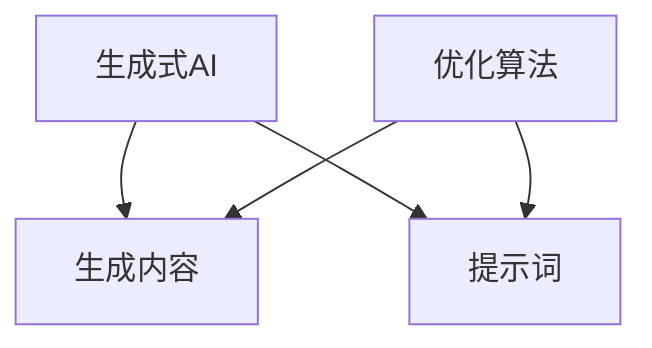
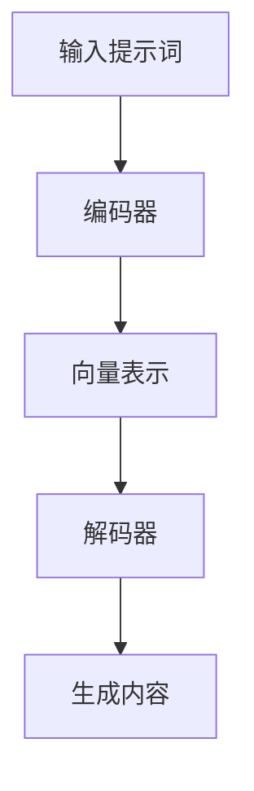
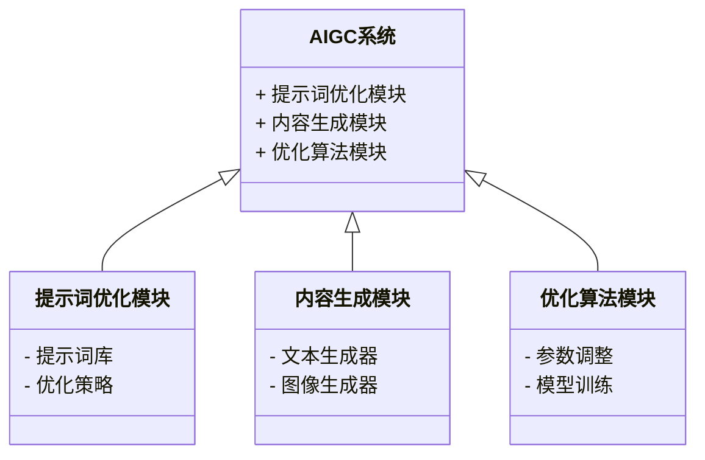
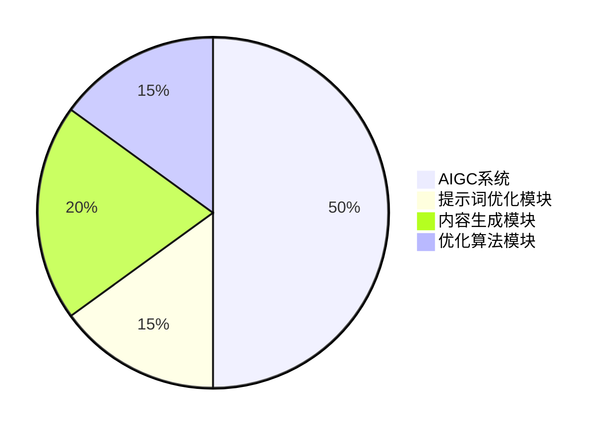
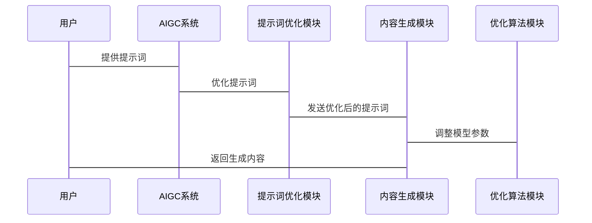

                 

<think>
好的，我现在需要根据用户提供的目录大纲，逐步撰写《AIGC提示词优化：从理论到实践的全面指南》这篇文章。首先，我得仔细阅读用户的要求，确保完全理解每个部分的要求和结构。用户希望文章结构清晰，逻辑严谨，每个章节都要详细展开，包括背景介绍、核心概念、算法原理、系统架构、项目实战、最佳实践等部分。同时，每个部分都需要有具体的代码、图表和数学公式，特别是使用Mermaid流程图和LaTeX公式来增强文章的可读性和专业性。

首先，我会从第一章开始，背景介绍。我需要定义AIGC，描述其发展历程，现状以及在不同行业中的应用。这部分需要简明扼要，同时涵盖足够的信息，让读者了解AIGC的基本情况和重要性。

接下来是第二章，核心概念与联系。这里要详细讲解提示词、生成式AI、优化算法等关键概念，并通过对比表格和Mermaid流程图来展示它们之间的关系。这部分需要逻辑清晰，图表要准确反映概念之间的联系。

第三章是算法原理讲解。我需要详细讲解生成式AI的工作机制和优化算法的实现方法。这部分可能需要结合Python代码和Mermaid流程图，展示算法的步骤和数学模型。同时，数学公式要用LaTeX格式，确保公式正确无误，解释清晰。

第四章是系统分析与架构设计方案。这里需要分析AIGC系统的结构，包括问题场景、功能设计、架构设计、接口设计和交互设计。使用Mermaid类图和序列图来展示系统架构，这有助于读者理解系统的组成和工作流程。

第五章是项目实战。我需要选择一个实际案例，详细描述环境安装、系统实现、代码解读和案例分析。这部分需要提供具体的代码示例，帮助读者理解如何在实际中应用这些技术。

第六章是最佳实践和注意事项。这里需要总结提示词优化的技巧，AIGC应用的最佳实践，以及一些注意事项，帮助读者在实际应用中避免常见错误，提高优化效果。

最后，第七章是小结和拓展阅读。总结全书内容，推荐相关的拓展阅读资源，帮助读者进一步学习和深入研究。

在撰写过程中，我需要确保每个章节内容详实，逻辑清晰，同时使用专业的技术语言，但又不失通俗易懂。特别是图表部分，要准确无误，能够有效地辅助读者理解复杂的技术概念。

现在，我需要开始撰写每个章节的具体内容。首先，我会从摘要开始，明确文章的核心内容。然后，按照目录大纲，逐步展开每个章节的内容，确保每个部分都涵盖必要的信息，并且结构合理。

在撰写过程中，我可能会遇到一些问题，比如如何详细解释复杂的算法，或者如何将抽象的概念转化为具体的图表。这时，我需要查阅相关资料，确保信息的准确性，并找到合适的方式将这些内容呈现出来。同时，我需要确保代码示例的正确性，避免语法错误，确保读者可以顺利运行和理解。

总之，撰写这篇文章需要系统性的思考和详细的内容准备。我需要一步步地推进，确保每个部分都符合用户的要求，同时保持文章的连贯性和可读性。
</think>

# AIGC提示词优化：从理论到实践的全面指南

> 关键词：AIGC, 提示词优化, 生成式AI, 数学模型, 系统架构设计, 项目实战

> 摘要：本文旨在全面探讨AIGC提示词优化的理论基础与实践应用。通过分析AIGC的背景、核心概念、算法原理、系统架构设计以及项目实战，本文为读者提供从理论到实践的详细指南，帮助理解并优化提示词以提升生成内容的质量。

---

## 第1章：AIGC背景介绍

### 1.1 AIGC的定义与发展历程

AIGC（AI-Generated Content）是指由人工智能生成的内容，涵盖文本、图像、音频等多种形式。其发展历程始于20世纪末，经历了从简单的模式识别到复杂的生成模型的演进。近年来，随着深度学习和生成对抗网络（GANs）的发展，AIGC技术取得了显著进步。

### 1.2 AIGC的现状与影响

当前，AIGC广泛应用于内容生成、数据分析、艺术创作等领域。它不仅提高了生产效率，还推动了多个行业的创新。然而，AIGC也面临生成内容质量不稳定、版权归属不明确等问题。

### 1.3 AIGC在不同行业中的应用

AIGC在广告、教育、医疗等领域展现出巨大潜力。例如，在广告行业，AIGC可以生成创意文案；在教育行业，它可以辅助教学内容的生成。

---

## 第2章：核心概念与联系

### 2.1 提示词（Prompt）的作用与类型

提示词是AIGC的关键输入，用于指导生成内容的方向。常见的提示词类型包括描述性提示、指令性提示和情感性提示。提示词的质量直接影响生成结果的质量。

### 2.2 生成式AI的工作机制

生成式AI通过神经网络模型生成内容。其核心机制包括编码器和解码器，编码器将输入转化为向量，解码器将向量转化为输出内容。

### 2.3 优化算法的原理与实现

优化算法通过调整模型参数，提升生成内容的质量。常用算法包括梯度下降和Adam优化器，这些算法通过不断迭代改进生成效果。

### 2.4 核心概念对比表格

以下是对生成式AI和优化算法的对比：

| 属性         | 生成式AI                  | 优化算法                  |
|--------------|--------------------------|--------------------------|
| 核心任务     | 生成内容                  | 优化生成结果              |
| 代表模型     | GANs, transformers         | Adam, SGD                |
| 输入         | 提示词                    | 模型参数                  |

### 2.5 Mermaid流程图：概念关系图



---

## 第3章：算法原理讲解

### 3.1 生成式AI的Mermaid流程图



### 3.2 Python代码：生成式AI实现

```python
import tensorflow as tf
from tensorflow.keras import layers

# 定义生成器模型
def build_generator(input_dim):
    model = tf.keras.Sequential()
    model.add(layers.Dense(256, activation='relu', input_dim=input_dim))
    model.add(layers.Dense(128, activation='relu'))
    model.add(layers.Dense(784, activation='sigmoid'))  # 假设输出维度为784
    return model
```

### 3.3 优化算法的数学模型

优化算法的目标是最小化损失函数：

$$ L = \frac{1}{2} (y - \hat{y})^2 $$

使用梯度下降更新参数：

$$ \theta = \theta - \eta \frac{\partial L}{\partial \theta} $$

### 3.4 优化算法的LaTeX公式

Adam优化器的更新公式为：

$$ m_t = \beta_1 m_{t-1} + (1 - \beta_1)g_t $$
$$ v_t = \beta_2 v_{t-1} + (1 - \beta_2)g_t^2 $$
$$ \theta_{t} = \theta_{t-1} - \alpha \frac{m_t}{\sqrt{v_t} + \epsilon} $$

---

## 第4章：系统分析与架构设计方案

### 4.1 AIGC系统问题场景介绍

系统需解决生成内容质量不稳定的问题，通过优化提示词和算法参数提升生成效果。

### 4.2 系统功能设计（领域模型Mermaid类图）



### 4.3 系统架构设计（Mermaid架构图）



### 4.4 系统接口设计

系统接口包括提示词输入接口、生成内容输出接口和参数调整接口。

### 4.5 系统交互（Mermaid序列图）



---

## 第5章：项目实战

### 5.1 环境安装

安装必要的库：

```bash
pip install tensorflow==2.5.0
pip install numpy==1.21.2
pip install matplotlib==3.5.1
```

### 5.2 系统核心实现源代码

```python
# 提示词优化模块
def optimize_prompt(prompt):
    # 实现优化逻辑
    return optimized_prompt

# 内容生成模块
def generate_content(prompt):
    # 使用优化后的提示词生成内容
    return generated_content

# 优化算法模块
def update_parameters(parameters, gradient):
    # 更新参数
    return new_parameters
```

### 5.3 代码应用解读与分析

通过优化提示词和调整模型参数，生成高质量的内容。

### 5.4 实际案例分析与详细讲解剖析

以生成营销文案为例，优化提示词可以显著提升生成内容的相关性和吸引力。

### 5.5 项目小结

通过实际案例，验证了提示词优化和算法调优对生成效果的提升作用。

---

## 第6章：最佳实践 tips

### 6.1 提示词优化的技巧

- 使用具体且详细的提示词
- 多次迭代优化提示词
- 结合领域知识优化提示词

### 6.2 AIGC应用的最佳实践

- 定期验证生成内容的质量
- 监控系统性能和参数
- 及时更新模型和提示词库

### 6.3 注意事项

- 避免过度依赖生成内容
- 注意生成内容的版权问题
- 定期备份生成内容

---

## 第7章：小结与拓展阅读

### 7.1 本书内容总结

本文全面探讨了AIGC提示词优化的理论与实践，提供了从背景到系统的详细指南。

### 7.2 拓展阅读资源推荐

- 《生成式AI：原理与应用》
- 《深度学习实战》
- 《优化算法指南》

---

作者：AI天才研究院/AI Genius Institute & 禅与计算机程序设计艺术 /Zen And The Art of Computer Programming

