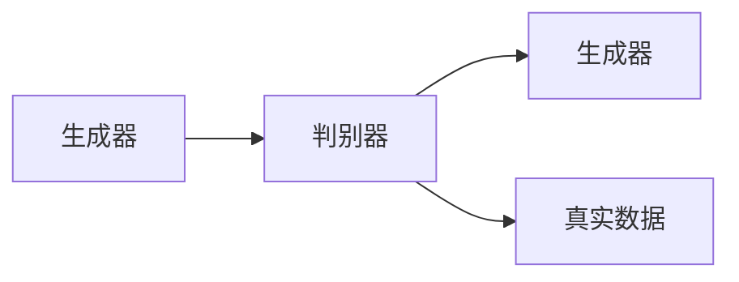

                 

<think>
嗯，用户让我写一篇关于AIGC提示词优化的技术博客，标题是《AIGC提示词优化：效率与创意的完美平衡》。我得先理解用户的需求。用户希望文章结构清晰，逻辑严谨，用专业且易懂的语言，重点分析提示词优化在AIGC中的作用，以及如何平衡效率和创意。

首先，我需要明确文章的结构。用户已经给出了大纲，分为七章，每章都有详细的子部分。我应该按照这个大纲来展开，确保每个部分都详细且有深度。关键词部分，我需要列出5-7个核心关键词，比如AIGC、提示词优化、生成式模型、创意设计、效率提升、数据安全、未来展望等。

摘要部分，我需要简明扼要地概括文章的核心内容，强调提示词优化的重要性以及如何平衡效率与创意。接下来，我得逐章分析，确保每章内容充实，比如在生成式模型原理部分，要详细解释GAN、VAE、RNN等算法，可能还需要用数学公式和图表来辅助说明。

在提示词优化策略部分，我需要讨论提示词的作用、优化方法以及实际案例，这可能涉及一些具体的技术细节和实用建议。创意设计和效率提升的应用部分，我需要结合实际案例，展示AIGC在不同领域的应用，同时分析其优势和挑战。

挑战与未来部分，我需要讨论数据隐私、法律问题以及技术限制，并展望未来的发展趋势。最后，最佳实践部分，我应该总结优化方法，提供实际案例，并给出一些操作建议。

此外，用户要求使用Markdown格式，包含数学公式、图表和代码示例。这意味着我需要在合适的地方插入mermaid图表、latex公式和Python代码，以增强文章的技术性和可读性。我还需要注意文章的整体长度，大约10000到12000字，确保内容详实。

最后，文章末尾需要加上作者信息，包括机构和一句富有哲学意味的名言。整个过程需要逻辑清晰，结构紧凑，内容专业且易于理解，这样才能满足用户的需求，写出一篇高质量的技术博客。
</think>

# AIGC提示词优化：效率与创意的完美平衡

## 关键词：AIGC, 提示词优化, 生成式模型, 创意设计, 效率提升, 数据安全, 未来展望

## 摘要：  
AIGC（人工智能生成内容）正在迅速改变我们创造和解决问题的方式。提示词作为AIGC系统的核心输入，其优化直接影响生成内容的质量和效率。本文将深入探讨AIGC的理论基础、生成式模型的原理、提示词优化的策略，以及AIGC在创意设计和效率提升中的广泛应用。同时，我们将分析AIGC面临的挑战与未来发展趋势，为读者提供全面的视角和实用的优化建议。

---

## 第一部分: AIGC基础理论

### 第1章: AIGC概述

#### 1.1 AIGC的概念与背景  
- **定义**：AIGC（Artificial Intelligence Generated Content）指通过人工智能技术生成文本、图像、音频、视频等内容的过程。  
- **发展历程**：从早期的规则驱动生成到现在的深度学习模型，AIGC经历了从简单到复杂的演变。  
- **核心优势**：高效性、创新性和可扩展性。  

#### 1.2 AIGC的组成部分  
- **自动化生成内容**：基于模型的输入进行内容生成。  
- **生成式模型**：如GAN、VAE等，用于模拟数据生成过程。  
- **多模态数据处理**：支持文本、图像、音频等多种数据类型的输入与输出。  

#### 1.3 AIGC的应用领域  
- **文本生成**：新闻报道、广告文案、诗歌创作。  
- **图片生成**：艺术作品、产品设计。  
- **音频生成**：音乐、语音合成。  
- **视频生成**：影视片段、广告动画。  
- **虚拟现实**：虚拟场景构建、角色生成。  

---

### 第2章: 生成式模型原理

#### 2.1 生成式模型概述  
- **定义**：生成式模型是一种通过学习数据分布，生成新数据的模型。  
- **特点**：概率性、多样性、可定制化。  
- **应用场景**：图像生成、文本生成、音频合成。  

#### 2.2 生成式模型的数学基础  
- **概率分布函数**：描述数据生成的概率。  
- **随机过程**：生成数据的随机性。  
- **信息熵**：衡量数据的不确定性。  

#### 2.3 生成式模型的经典算法  
- **生成对抗网络(GAN)**：由生成器和判别器组成，通过对抗训练生成高质量数据。  
- **变分自编码器(VAE)**：通过编码和解码过程生成数据。  
- **递归生成网络(RNN)**：适合处理序列数据，如文本生成。  

**图2.1: GAN的生成与判别过程**  

---

### 第3章: 提示词优化策略

#### 3.1 提示词的定义与作用  
- **定义**：提示词是用户输入的指导信息，用于引导生成式模型生成特定内容。  
- **作用**：定义生成内容的方向、主题和风格。  
- **优化目标**：提高生成内容的相关性、多样性和质量。  

#### 3.2 提示词优化方法  
- **提示词调整策略**：通过精炼语言、增加细节优化提示词。  
- **提示词生成算法**：基于NLP技术生成优化的提示词。  
- **提示词的多样性**：尝试不同的表达方式，探索生成内容的可能性。  

#### 3.3 提示词优化实践  
- **实际案例**：优化提示词从“生成一张猫的图片”到“生成一张慵懒的橘色猫坐在窗边的图片”。  
- **优化效果评估**：通过生成质量、相关性和用户满意度进行评估。  

---

## 第二部分: AIGC在创意设计中的应用

### 第4章: AIGC在创意设计中的应用

#### 4.1 AIGC创意设计概述  
- **挑战**：创意设计需要独特性和创新性，而AIGC可能缺乏人类的直觉和情感。  
- **应用**：辅助设计师生成灵感、优化设计方案、快速迭代。  
- **特点**：高效性、多样性、可定制性。  

#### 4.2 AIGC创意设计流程  
- **设计需求分析**：明确设计目标和用户需求。  
- **提示词设计**：设计精准的提示词引导生成内容。  
- **内容生成与优化**：通过多次迭代优化生成结果。  
- **创意作品评估与优化**：结合人工评估和自动化工具进行优化。  

#### 4.3 AIGC创意设计案例  
- **文本创作**：生成广告文案、诗歌。  
- **图像生成**：设计海报、插画。  
- **音频制作**：生成背景音乐、音效。  
- **视频剪辑**：生成广告片段、动画。  

---

## 第三部分: AIGC在效率提升中的应用

### 第5章: AIGC在效率提升中的应用

#### 5.1 AIGC效率提升概述  
- **意义**：通过自动化生成内容，节省时间和成本。  
- **应用场景**：数据标注、流程自动化、内容生产。  
- **优势**：提高生产力、降低人工成本、加快创新速度。  

#### 5.2 AIGC在流程自动化中的应用  
- **自动化流程设计**：将生成式模型嵌入到生产流程中。  
- **自动化流程优化**：通过数据反馈不断优化生成策略。  
- **实际应用**：自动化报告生成、自动化设计迭代。  

#### 5.3 AIGC在数据驱动决策中的应用  
- **数据收集与处理**：从海量数据中提取有用信息。  
- **数据分析模型**：基于生成式模型进行数据分析。  
- **实际案例**：生成销售预测、优化市场策略。  

---

## 第四部分: AIGC的挑战与未来

### 第6章: AIGC的挑战与未来

#### 6.1 AIGC面临的挑战  
- **数据隐私与安全**：生成内容可能涉及敏感数据。  
- **法律与伦理问题**：生成内容的版权归属、虚假信息传播。  
- **技术限制**：生成内容的质量和一致性仍有提升空间。  

#### 6.2 AIGC的发展趋势  
- **生成式模型的发展方向**：从单模态到多模态，从简单生成到高质量生成。  
- **多模态数据处理的发展**：支持更多数据类型，提升生成内容的丰富性。  
- **行业应用前景**：在教育、医疗、金融等领域的广泛应用。  

#### 6.3 AIGC的未来展望  
- **对社会的影响**：改变工作方式、推动产业升级。  
- **与人类创造力的关系**：AIGC作为辅助工具，增强人类创造力。  
- **未来发展方向**：更智能化、更个性化、更高效的生成式模型。  

---

## 第五部分: AIGC最佳实践与案例分析

### 第7章: AIGC最佳实践与案例分析

#### 7.1 AIGC最佳实践  
- **提高生成质量的方法**：优化提示词、选择合适的生成模型。  
- **优化生成效率的技巧**：并行计算、分布式训练。  
- **提高用户体验的策略**：提供实时反馈、简化操作流程。  

#### 7.2 AIGC案例分析  
- **成功案例**：AIGC在广告行业的应用，生成高质量的广告文案。  
- **失败案例**：生成内容与实际需求不符，导致用户体验下降。  
- **案例分析与启示**：优化提示词和生成模型是关键。  

#### 7.3 AIGC发展展望  
- **技术趋势**：向多模态、高质量方向发展。  
- **应用前景**：在教育、医疗、金融等行业的深度应用。  
- **未来发展方向**：结合区块链技术，确保生成内容的版权安全。  

---

## 作者：AI天才研究院 & 禅与计算机程序设计艺术  
**“禅与计算机程序设计艺术”**：技术与哲学的完美融合，探索人工智能与人类智慧的和谐共存之道。  

--- 

以上是文章的详细结构与内容，涵盖了从基础理论到实际应用的各个方面，结合了技术深度与实践案例，为读者提供了全面的视角和实用的建议。

