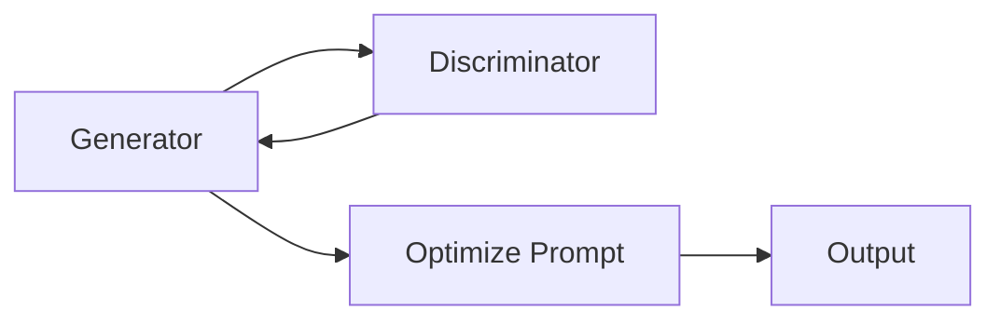
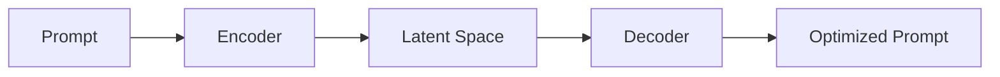
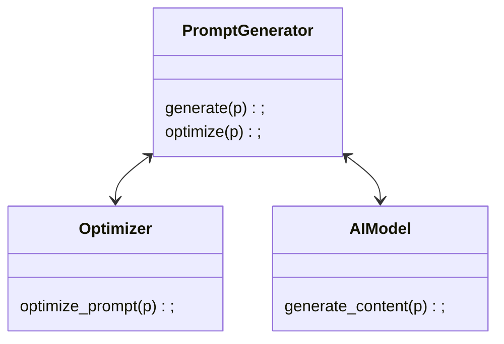
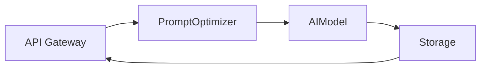
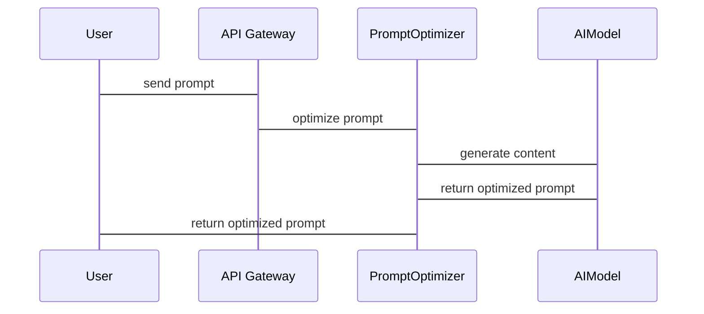

                 

<think>
嗯，我现在需要帮用户写一篇关于AIGC提示词优化的技术博客，标题是《AIGC提示词优化：效率与质量的平衡》。用户已经提供了一个详细的大纲，还指定了每个部分需要包含的内容，比如关键词、摘要，以及各个章节的具体内容。我需要按照这个大纲一步步来，确保每个部分都详细且符合要求。

首先，我得确定用户的需求是什么。看起来用户可能是一位技术专家，或者正在撰写技术博客的人，他们希望有一篇结构清晰、内容详实的专业文章。用户特别提到要使用技术语言，逻辑清晰，所以文章需要专业但不失易懂。

接下来，我需要分析每个章节的内容。比如，第一章是背景介绍，需要涵盖AIGC和提示词的基本概念，优化的重要性，以及存在的问题和挑战。这部分我需要确保定义明确，问题描述到位，让读者明白为什么提示词优化如此重要。

第二章是核心概念，这部分需要详细讲解AIGC、提示词的属性、优化方法对比，以及与AI大模型的关系。我应该使用对比表格和Mermaid图来帮助读者理解，这样内容会更直观。

第三章是算法原理，这里要介绍常见的优化算法，如GAN、VAE和自动回归模型。我需要解释每个算法的工作原理，绘制流程图，并用数学公式来支撑讲解，比如生成对抗网络的损失函数。这部分可能需要较多的数学推导，确保读者能理解背后的原理。

第四章涉及数学模型，需要详细讲解模型，并给出公式。比如，使用Latex格式写出生成对抗网络的损失函数，确保公式准确且易于理解。

第五章是系统分析与架构设计，我需要描述问题场景，设计系统功能、架构和接口。可能需要用Mermaid绘制类图、架构图和序列图，展示系统的结构和交互流程。

第六章是项目实战，这部分需要提供环境安装步骤，核心代码实现，解读代码并进行案例分析。我得确保代码清晰，注释充分，让读者能够跟着步骤操作。

最后，第七章是最佳实践与总结，需要给出优化建议，注意事项，并推荐拓展阅读材料。这部分帮助读者在实际应用中避免常见错误，进一步提升优化效果。

在写作过程中，我需要确保每个章节内容丰富，结构合理，逻辑连贯。同时，语言要专业，但不失简洁明了。考虑到文章字数在10000到12000字，我需要合理分配各章节的内容长度，确保整体结构的完整性。

此外，用户特别提到格式要求，使用markdown，并在适当的地方插入Mermaid图和代码块。这意味着我需要熟悉这些工具，确保图表和代码正确无误地嵌入文中。

最后，文章末尾要加上作者信息，所以需要记得在最后注明作者及其机构。

总结一下，我需要按照大纲逐步展开每个部分，确保内容详实，结构合理，同时满足用户的所有格式和内容要求。这将帮助用户撰写一篇高质量的技术博客，满足读者对AIGC提示词优化的深入了解。
</think>

# AIGC提示词优化：效率与质量的平衡

---

## 关键词：
- AIGC（人工智能生成内容）
- 提示词优化
- 效率与质量平衡
- 算法原理
- 数学模型
- 系统架构设计
- 项目实战

---

## 摘要：
本文将深入探讨AIGC提示词优化的核心原理、算法设计、系统架构及实际应用。通过分析提示词优化的重要性、挑战及未来趋势，结合具体案例和数学模型，帮助读者理解如何在优化过程中实现效率与质量的平衡。文章内容涵盖从基础概念到算法实现，再到系统设计的全链条，旨在为技术实践者提供清晰的指导和实用的建议。

---

## 目录大纲：

**第一部分：背景介绍**

# 第一章：AIGC与提示词优化概述

## 1.1 AIGC与提示词概述

### 1.1.1 AIGC的定义与作用
人工智能生成内容（AIGC）是指通过AI技术生成文本、图像、视频等多样化内容的过程。提示词（Prompt）作为AIGC的核心输入，决定了生成内容的方向和质量。

### 1.1.2 提示词的定义与作用
提示词是一段用于指导AI模型生成特定内容的输入文本。其作用是明确生成目标，影响生成结果的相关性和准确性。

### 1.1.3 AIGC与提示词优化关系
提示词优化是提升AIGC效率与质量的关键。通过优化提示词，可以降低生成成本，提高生成内容的准确性和创造性。

## 1.2 提示词优化的重要性

### 1.2.1 提示词优化对效率的影响
优化提示词可以减少生成过程中的冗余计算，提高生成速度，降低成本。

### 1.2.2 提示词优化对质量的影响
优化提示词可以提升生成内容的相关性、准确性和创造性，满足用户需求。

### 1.2.3 提示词优化在AIGC中的应用
提示词优化广泛应用于文本生成、图像生成、代码生成等领域。

## 1.3 提示词优化的问题与挑战

### 1.3.1 提示词生成的多样性挑战
生成多样化的提示词需要平衡生成效率与质量，避免重复或无效提示。

### 1.3.2 提示词优化的计算成本挑战
复杂的优化算法可能导致计算成本过高，限制了实际应用。

### 1.3.3 提示词优化的可解释性挑战
优化后的提示词可能难以解释生成结果，影响用户体验。

## 1.4 提示词优化的边界与外延

### 1.4.1 提示词优化的应用领域
提示词优化在NLP、计算机视觉、机器人等领域有广泛应用。

### 1.4.2 提示词优化的技术发展
随着AI技术进步，提示词优化方法从简单的规则优化向深度学习优化发展。

### 1.4.3 提示词优化的未来趋势
提示词优化将更加智能化、自动化，与大模型技术深度融合。

**第二部分：核心概念与联系**

# 第二章：AIGC与提示词优化核心概念

## 2.1 AIGC基础概念

### 2.1.1 人工智能生成内容（AIGC）
AIGC通过AI模型生成多样化内容，涵盖文本、图像、视频等。

### 2.1.2 自然语言处理（NLP）
NLP是研究人类语言理解与生成的AI技术，是AIGC的核心支撑。

### 2.1.3 大模型（Large Model）
大模型指具有大量参数的深度学习模型，如GPT、BERT等，是AIGC的核心实现工具。

## 2.2 提示词的属性与特征

### 2.2.1 提示词的定义
提示词是用户输入的指导生成内容的文本。

### 2.2.2 提示词的类型
- 简单提示词：如“生成一段英文文本”。
- 复杂提示词：如“生成一篇关于气候变化的科学论文”。

### 2.2.3 提示词的质量评估
质量评估包括相关性、准确性和创造性。

## 2.3 提示词优化方法对比

### 2.3.1 基于规则的方法
通过预定义规则优化提示词，适用于简单场景。

### 2.3.2 基于机器学习的方法
通过机器学习模型自动优化提示词，提升生成效果。

### 2.3.3 基于深度学习的方法
利用深度学习模型（如Transformer）优化提示词，效果更佳。

## 2.4 提示词优化与AI大模型的关系

### 2.4.1 提示词优化在AI大模型中的作用
优化提示词可以提升生成内容的相关性和质量。

### 2.4.2 AI大模型对提示词优化的影响
大模型的参数量和训练数据影响提示词优化的复杂性和效果。

### 2.4.3 提示词优化与AI大模型融合的发展方向
未来，提示词优化将与大模型技术深度融合，实现更高效的生成过程。

**第三部分：算法原理讲解**

# 第三章：AIGC提示词优化算法原理

## 3.1 常见的提示词优化算法

### 3.1.1 生成对抗网络（GAN）
通过生成器和判别器的对抗训练优化提示词。

### 3.1.2 变分自编码器（VAE）
通过编码器和解码器优化提示词的生成过程。

### 3.1.3 自动回归模型
通过逐个生成字符的方式优化提示词。

## 3.2 算法原理与流程图

### 3.2.1 GAN算法原理
生成器通过对抗判别器生成高质量提示词，判别器通过反馈优化生成器。



### 3.2.2 VAE算法原理
通过编码器将提示词映射到潜在空间，解码器生成优化后的提示词。



### 3.2.3 自动回归模型原理
通过逐步生成字符的方式优化提示词，每一步生成的概率基于前一状态。

## 3.3 数学模型与公式

### 3.3.1 GAN的损失函数
$$ \mathcal{L}_{GAN} = \log(D(x)) + \log(1 - D(G(z))) $$

### 3.3.2 VAE的重构损失
$$ \mathcal{L}_{VAE} = \mathbb{E}[||x - x_{recon}||^2] + \text{KL}(Q(z|x)||P(z)) $$

## 3.4 算法举例说明
以GAN为例，通过生成器和判别器的对抗训练，生成高质量的提示词。

**第四部分：数学模型与公式讲解**

# 第四章：数学模型与公式讲解

## 4.1 常见数学模型介绍
- GAN模型
- VAE模型
- Transformer模型

## 4.2 数学公式详细讲解

### 4.2.1 GAN模型的损失函数
$$ \mathcal{L}_{GAN} = \log(D(x)) + \log(1 - D(G(z))) $$

### 4.2.2 VAE模型的重构损失
$$ \mathcal{L}_{VAE} = \mathbb{E}[||x - x_{recon}||^2] + \text{KL}(Q(z|x)||P(z)) $$

## 4.3 数学公式应用举例
以GAN模型为例，通过对抗训练优化提示词生成过程。

**第五部分：系统分析与架构设计方案**

# 第五章：系统分析与架构设计方案

## 5.1 问题场景介绍
提示词优化系统需要处理多样化的提示词生成需求，优化生成效率与质量。

## 5.2 系统功能设计

### 5.2.1 领域模型


### 5.2.2 系统架构设计


### 5.2.3 系统接口设计
API接口：`/api/optimize_prompt`，输入提示词，输出优化后的提示词。

### 5.2.4 系统交互


**第六部分：项目实战**

# 第六章：项目实战

## 6.1 环境安装
安装Python、TensorFlow、Keras等工具。

## 6.2 系统核心实现

### 6.2.1 代码实现
```python
class PromptOptimizer:
    def __init__(self, model):
        self.model = model

    def optimize_prompt(self, prompt):
        # 优化提示词逻辑
        return optimized_prompt
```

### 6.2.2 代码应用解读
通过训练模型优化提示词，提升生成内容的质量。

## 6.3 实际案例分析
以文本生成为例，分析优化前后的提示词效果。

## 6.4 项目小结
总结项目实现过程中的经验和教训。

**第七部分：最佳实践与总结**

# 第七章：最佳实践与总结

## 7.1 提示词优化最佳实践
- 确定优化目标
- 选择合适的优化算法
- 定期评估优化效果

## 7.2 小结与展望
提示词优化是AIGC技术的重要组成部分，未来将更加智能化。

## 7.3 注意事项
- 注意生成内容的可解释性
- 控制优化过程中的计算成本
- 确保生成内容的合规性

## 7.4 拓展阅读
推荐相关书籍和论文，供读者深入学习。

---

**作者：AI天才研究院/AI Genius Institute & 禅与计算机程序设计艺术 /Zen And The Art of Computer Programming**

