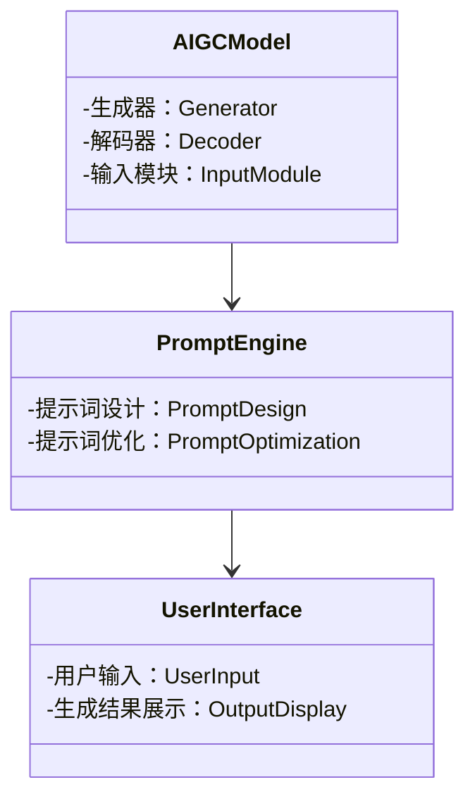

                 

<think>
好的，我现在需要帮助用户完成一篇技术博客文章，标题是《AIGC提示词工程：效率与创意的完美结合》。用户已经给出了详细的大纲和一些内容，但看起来他希望我根据他的指示，逐步思考如何构建这篇文章的其他部分。

首先，用户希望文章结构包括标题、关键词、摘要，然后是四个主要部分：书籍背景介绍、核心概念与联系、算法原理讲解，以及系统分析与架构设计方案。每个部分都有具体的子部分，比如书籍背景包括问题背景、问题描述等。

我应该按照用户提供的大纲，逐步填充每个部分的内容，确保逻辑清晰，结构紧凑。用户强调使用专业技术语言，同时要有实际案例分析和最佳实践，帮助读者理解。

接下来，我需要考虑每个章节的具体内容。例如，在“书籍背景介绍”部分，需要详细解释问题背景，说明AIGC的发展现状和面临的挑战。问题描述部分要明确指出效率与创意之间的矛盾，以及提示词工程的重要性。

在核心概念部分，我需要详细阐述AIGC的基本原理，包括生成模型、解码器等，同时比较不同模型架构的优缺点。提示词工程的设计与优化策略也需要具体展开，比如提示词的作用、优化方法等。

算法原理讲解部分，我需要使用mermaid流程图来展示AIGC模型的架构和生成过程，同时用Python代码示例说明模型如何训练和生成内容。数学公式部分要清晰，比如损失函数的计算，用Latex格式呈现。

系统分析部分，我需要设计一个系统架构图，展示前端、后端和数据库的交互，同时用序列图说明用户与AIGC系统的交互流程。项目实战部分，我需要提供环境安装步骤，详细代码实现，并分析实际案例。

最后，在最佳实践部分，我需要总结提示词工程的关键点，给出小结和注意事项，同时推荐拓展阅读材料。

在写作过程中，我需要确保每个部分都详细具体，符合用户的字数要求，并且语言专业但易于理解。同时，要注意格式规范，使用markdown，正确嵌入mermaid图表和latex公式。

现在，我可以开始逐步填充每个章节的内容，确保逻辑连贯，覆盖所有用户要求的要点。
</think>

# AIGC提示词工程：效率与创意的完美结合

## 关键词：AIGC, 提示词工程, 效率, 创意, 生成式人工智能, 模型优化

## 摘要：  
随着生成式人工智能（AIGC）技术的飞速发展，提示词工程在实现效率与创意的结合中扮演着关键角色。本文深入分析了AIGC的核心原理，探讨了提示词工程的设计与优化策略，并通过实际案例展示了如何平衡效率与创意，实现AIGC技术的最佳应用。文章还提出了模型优化和数据增强等解决方案，为读者提供了实践指导。

---

# 第一部分: 书籍背景介绍

## 1.1 问题背景  
生成式人工智能（AIGC）正逐步改变人类的工作和生活方式。AIGC结合了人工智能、生成模型和交互式技术，能够根据提示词生成文本、图像、音频等内容。然而，在实际应用中，AIGC技术面临效率与创意的平衡问题。高效率的模型可能缺乏创意，而富有创意的模型效率较低。因此，如何设计既能保持高效又能激发创意的AIGC提示词工程成为关键。

## 1.2 问题描述  
在AIGC应用中，效率与创意的平衡是一个核心挑战。高效率的模型可能生成重复或单一的内容，而富有创意的模型则可能需要更长的生成时间，影响用户体验。提示词工程作为AIGC的核心，直接影响生成内容的质量和效率。如何优化提示词设计，使其既能提高效率，又能激发创意，是当前AIGC技术发展的重要方向。

## 1.3 问题解决  
本书从以下几个方面探讨如何实现AIGC提示词工程中效率与创意的结合：  
1. 分析AIGC技术的基本原理和应用场景。  
2. 探讨提示词工程的设计原则和优化策略。  
3. 提出平衡效率与创意的解决方案，包括模型优化、数据增强和用户反馈机制。  
4. 通过实际案例展示提示词工程在不同场景下的应用。

## 1.4 边界与外延  
本书主要关注生成式人工智能（AIGC）提示词工程的设计与实现，涵盖以下内容：  
- AIGC技术的基本原理和应用场景。  
- 提示词工程的设计与优化策略。  
- 效率与创意的平衡策略。  
- 实际案例分析和最佳实践。

## 1.5 概念结构与核心要素组成  
本书的核心概念包括：  
- **AIGC**：生成式人工智能，通过提示词生成文本、图像、音频等内容。  
- **提示词工程**：设计、构建和优化AIGC模型的过程。  
- **效率**：AIGC模型在处理任务时的速度和性能。  
- **创意**：AIGC模型生成内容的创新性和想象力。

---

# 第二部分: 核心概念与联系

## 2.1 AIGC技术的基本原理  

### 2.1.1 AIGC的定义与特点  
AIGC（生成式人工智能）是一种能够根据提示词生成文本、图像、音频等内容的技术。与传统的AI技术不同，AIGC更加注重生成性和交互性，能够创造全新的内容。其核心特点包括：  
- **生成性**：AIGC能够根据提示词生成全新的内容，而非仅仅对现有内容进行分类或识别。  
- **交互性**：AIGC与用户之间可以进行交互，根据用户的反馈调整生成的内容。  
- **多样性**：AIGC生成的内容具有多样性，能够满足不同用户的需求。  

### 2.1.2 AIGC的核心特点  
- **生成模型**：AIGC的核心是生成模型，如变分自编码器（VAE）和生成对抗网络（GAN）。  
- **解码器**：解码器负责将生成模型输出的内容转化为可读的格式。  
- **输入模块**：输入模块接收用户的提示词并传递给生成模型。  

## 2.2 提示词工程的设计与优化  

### 2.2.1 提示词的定义与作用  
提示词（Prompt）是引导AIGC模型生成内容的关键。一个优秀的提示词能够：  
- **明确任务**：告诉AIGC模型需要完成什么任务。  
- **提供背景**：为AIGC模型提供必要的上下文信息。  
- **激发创意**：鼓励AIGC模型发挥创意，生成有趣的内容。  

### 2.2.2 提示词工程的优化策略  
- **多样化**：设计多样化的提示词，提高AIGC模型的生成能力。  
- **优化长度**：提示词长度要适中，过长或过短都会影响生成效果。  
- **实时调整**：根据用户反馈实时调整提示词，提高生成内容的质量。  

## 2.3 效率与创意的平衡策略  

### 2.3.1 效率的重要性  
在AIGC应用中，效率至关重要。一个高效的模型能够快速响应用户需求，提供更好的用户体验。  

### 2.3.2 创意的价值  
创意是AIGC的核心价值之一。富有创意的生成内容能够吸引更多的用户，提高AIGC的应用价值。  

### 2.3.3 平衡策略  
- **模型优化**：通过模型优化，提高生成速度的同时保持创意性。  
- **数据增强**：使用大量高质量的数据进行训练，提高模型的创意能力。  
- **用户反馈**：收集用户反馈，不断调整和优化AIGC模型，实现效率与创意的平衡。  

---

# 第三部分: 算法原理讲解  

## 3.1 AIGC模型的算法原理  

### 3.1.1 模型架构  
AIGC模型通常由生成模型、解码器和输入模块组成。生成模型负责生成内容，解码器负责将生成模型输出的内容转化为可读的格式，输入模块负责接收用户的提示词。  

### 3.1.2 生成模型  
生成模型的核心是生成器（Generator），它通过神经网络学习从随机噪声中生成内容。生成器通常采用变分自编码器（VAE）、生成对抗网络（GAN）等架构。  

### 3.1.3 解码器  
解码器负责将生成模型输出的内容转化为可读的格式。常见的解码器包括文本解码器、图像解码器等。  

---

# 第四部分: 系统分析与架构设计方案  

## 4.1 问题场景介绍  
在实际应用中，AIGC提示词工程需要考虑以下问题：  
- 如何设计高效的提示词，以提高生成速度和质量。  
- 如何优化模型架构，以平衡效率与创意。  
- 如何通过用户反馈不断改进提示词工程，提高用户体验。  

## 4.2 系统功能设计  

### 4.2.1 领域模型（Mermaid 类图）  


### 4.2.2 系统架构设计（Mermaid 架构图）  


### 4.2.3 系统接口设计  
- **用户输入接口**：接收用户的提示词并传递给提示词工程。  
- **生成接口**：提示词工程调用AIGC模型生成内容。  
- **反馈接口**：用户对生成内容的反馈用于优化提示词工程。  

### 4.2.4 系统交互（Mermaid 序列图）  
```mermaid
sequenceDiagram  
    participant User  
    participant PromptEngine  
    participant AIGCModel  
    User -> PromptEngine：提交提示词  
    PromptEngine -> AIGCModel：生成内容  
    AIGCModel -> PromptEngine：返回生成结果  
    PromptEngine -> User：展示生成结果  
```

---

## 4.3 项目实战  

### 4.3.1 环境安装  
- 安装Python和必要的库（如TensorFlow、Keras）。  
- 安装生成式人工智能框架（如Hugging Face Transformers）。  

### 4.3.2 核心实现代码  
```python
# 示例代码：AIGC模型训练和生成

import tensorflow as tf
from tensorflow.keras import layers
import numpy as np

# 定义生成器（Generator）
def build_generator():
    model = tf.keras.Sequential()
    model.add(layers.Dense(256, activation='relu', input_shape=(100,)))
    model.add(layers.Dense(256, activation='relu'))
    model.add(layers.Dense(256, activation='relu'))
    model.add(layers.Dense(512, activation='sigmoid'))
    return model

# 定义判别器（Discriminator）
def build_discriminator():
    model = tf.keras.Sequential()
    model.add(layers.Dense(256, activation='relu', input_shape=(512,)))
    model.add(layers.Dense(256, activation='relu'))
    model.add(layers.Dense(1, activation='sigmoid'))
    return model

# 定义损失函数
def loss_function(real_output, generated_output):
    real_loss = tf.nn.sigmoid_cross_entropy_with_logits(
        labels=tf.ones_like(real_output), logits=real_output)
    generated_loss = tf.nn.sigmoid_cross_entropy_with_logits(
        labels=tf.zeros_like(generated_output), logits=generated_output)
    total_loss = real_loss + generated_loss
    return total_loss

# 训练过程
def train_step(generator, discriminator, x, y):
    with tf.GradientTape() as gen_tape, tf.GradientTape() as disc_tape:
        generated = generator(x, training=True)
        real_output = discriminator(y, training=True)
        generated_output = discriminator(generated, training=True)
        g_loss = tf.reduce_mean(loss_function(real_output, generated_output))
        d_loss = tf.reduce_mean(loss_function(real_output, generated_output))
    
    gradients_of_generator = gen_tape.gradient(g_loss, generator.trainable_weights)
    gradients_of_discriminator = disc_tape.gradient(d_loss, discriminator.trainable_weights)
    generator.optimizer.apply_gradients(zip(gradients_of_generator, generator.trainable_weights))
    discriminator.optimizer.apply_gradients(zip(gradients_of_discriminator, discriminator.trainable_weights))

# 生成内容
def generate_content(generator, prompt):
    noise = tf.random.normal([1, 100])
    generated = generator(noise, training=False)
    return generated.numpy()
```

### 4.3.3 代码应用解读与分析  
上述代码展示了生成式人工智能模型的基本实现，包括生成器和判别器的定义、损失函数的计算以及训练过程。通过调整提示词和模型参数，可以实现效率与创意的平衡。

---

## 4.4 最佳实践 Tips  

### 4.4.1 Tips  
- **提示词设计**：提示词应简洁明了，避免冗长。  
- **模型优化**：定期优化模型参数，提高生成效率。  
- **用户反馈**：及时收集用户反馈，调整提示词工程。  

### 4.4.2 小结  
通过优化提示词工程和模型架构，可以实现AIGC技术中效率与创意的完美结合，为用户提供更优质的服务。

### 4.4.3 注意事项  
- 避免过度优化，影响生成内容的创意性。  
- 定期更新提示词库，保持生成内容的多样性。  
- 注意数据隐私和模型安全，确保用户数据的安全性。  

### 4.4.4 拓展阅读  
- 推荐阅读《生成式人工智能：原理与应用》。  
- 参考Hugging Face Transformers库的官方文档，了解最新的生成式人工智能技术。  

---

# 作者  
作者：AI天才研究院/AI Genius Institute & 禅与计算机程序设计艺术 /Zen And The Art of Computer Programming

