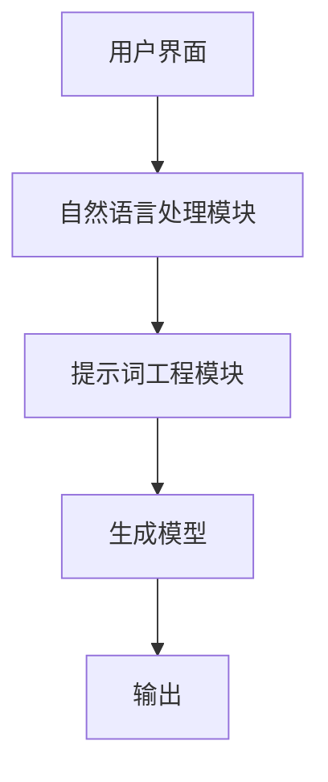

                 

<think>
嗯，我现在要写一篇关于AIGC提示词工程的文章，构建智能对话系统的核心。首先，我得理解什么是AIGC，它和提示词工程有什么关系。AIGC应该是人工智能生成内容，对吧？提示词工程可能是指通过设计和优化提示词来提升生成内容的质量。

接下来，我应该先了解提示词工程在智能对话系统中的作用。对话系统需要生成自然、准确的回答，而提示词就是用来指导模型生成这些回答的关键。那么，提示词的好坏直接影响到系统的性能。

然后，我得考虑提示词的设计原则。比如，明确性，提示词需要明确指示模型生成什么类型的内容；具体性，避免模糊的描述；结构化，可能需要分段或标记关键部分。这些原则如何应用到实际中呢？可能需要一些例子，比如让模型生成一段介绍公司产品的文案，提示词需要详细说明每个部分的内容和风格。

接下来，我得探讨提示词的类型。比如，通用提示词用于引导模型生成常规内容，而微调提示词则是针对特定任务进行调整。还有多轮对话中的上下文提示，这可能涉及到如何在对话中保持连贯性。这些类型在实际应用中如何选择和优化，可能需要结合具体的场景来分析。

然后，数学建模部分，我得理解提示词如何影响生成模型的概率分布。提示词通过调整模型的参数，使得某些词或句子的生成概率增加。这部分可能需要一些概率论和统计学的知识，比如使用交叉熵损失函数来衡量生成结果与预期之间的差距，进而优化提示词。

系统架构部分，我需要了解一个典型的对话系统的组成部分。比如，用户输入通过前端传递到后端，后端处理用户的查询，生成回复。提示词工程可能在后端处理部分，优化生成过程。系统架构图可能包括用户界面、自然语言处理模块、生成模型、提示词优化模块等部分。

项目实战部分，我可能需要选择一个具体的对话系统，比如一个客服聊天机器人，然后设计并优化提示词。这包括环境的搭建，比如选择Python和相关库，如transformers库。然后编写代码，测试提示词的效果，并根据结果进行调整。

最后，总结部分，我需要回顾提示词工程的重要性，它如何影响整个对话系统的性能。同时，给出一些最佳实践，比如如何测试和迭代提示词，避免过度依赖提示词导致的生成内容缺乏多样性。

可能我还需要查阅一些资料，确保我的理解正确，特别是关于数学模型和系统架构的部分。此外，我需要确保例子和代码是清晰易懂的，这样读者能够跟随步骤进行实践。

总的来说，我需要分步骤来完成这篇文章，从基础概念到实际应用，逐步深入，确保每个部分都详细且有深度。同时，结合实际案例和代码示例，让读者能够更好地理解和应用这些知识。
</think>

# AIGC提示词工程：构建智能对话系统的核心

## 关键词：人工智能生成内容（AIGC）、提示词工程、智能对话系统、自然语言处理（NLP）、机器学习（ML）

## 摘要：  
AIGC提示词工程是构建高效智能对话系统的核心技术，通过优化提示词设计和应用，提升生成内容的质量和用户体验。本文深入探讨提示词工程的原理、方法及其在对话系统中的应用，结合实际案例和系统架构设计，为读者提供全面的指导。

---

## 第一部分：AIGC概述与核心概念

### 第1章：AIGC的崛起与智能对话系统

#### 1.1 AIGC的背景介绍
人工智能生成内容（AIGC）正迅速改变内容创作方式，从广告文案到对话系统，AIGC的应用无处不在。智能对话系统作为人机交互的核心，依赖于高质量的生成内容，而提示词工程则是优化生成结果的关键技术。

#### 1.2 智能对话系统的定义与分类
智能对话系统通过自然语言处理技术，理解用户输入并生成自然回复。根据应用场景，可分为客服、医疗咨询、教育辅导等类型。每个类型都有其独特的挑战和优化方向。

#### 1.3 提示词工程的核心作用
提示词工程通过设计和优化提示词，指导生成模型输出符合期望的结果。它是对话系统性能提升的关键，直接影响用户体验和系统效率。

---

## 第二部分：提示词工程的原理与方法

### 第2章：提示词工程的基本原理

#### 2.1 提示词的设计原则
- **明确性**：提示词需明确指示生成内容的方向。
- **具体性**：避免模糊描述，提供详细指导。
- **结构化**：采用分段或标记方式，优化生成过程。

#### 2.2 提示词的类型与应用场景
- **通用提示词**：适用于多种场景，如“生成一段产品介绍”。
- **微调提示词**：针对特定任务，如“以幽默风格描述产品”。
- **上下文提示词**：用于多轮对话，保持连贯性。

#### 2.3 提示词的数学建模
提示词通过调整生成模型的概率分布，影响输出结果。例如，交叉熵损失函数用于衡量生成结果与预期的差异，指导优化过程。

---

### 第3章：提示词工程的系统架构设计

#### 3.1 对话系统的组成部分
- **用户界面**：接收输入并展示输出。
- **自然语言处理模块**：解析用户意图。
- **生成模型**：基于提示词生成回复。
- **提示词优化模块**：动态调整提示词，提升生成质量。

#### 3.2 提示词工程的系统架构图

---

## 第三部分：AIGC提示词工程的实战应用

### 第4章：项目实战

#### 4.1 环境搭建与工具安装
- **Python**：安装必要的库如`transformers`和`torch`。
- **代码示例**：使用GPT模型生成对话内容。

#### 4.2 提示词优化与测试
- **测试案例**：设计不同提示词，比较生成结果的质量。
- **代码实现**：编写优化提示词的脚本，动态调整生成参数。

#### 4.3 案例分析与效果评估
- **效果评估指标**：BLEU、ROUGE等生成质量指标。
- **用户反馈分析**：收集用户对生成内容的满意度，指导提示词优化。

---

## 第四部分：最佳实践与未来发展

### 第5章：提示词工程的最佳实践

#### 5.1 提示词设计的注意事项
- **避免过度限制**：保持生成内容的多样性。
- **保持简洁**：避免冗长复杂的提示词，影响生成效率。

#### 5.2 提示词工程的未来发展方向
- **动态调整提示词**：根据上下文和用户反馈实时优化。
- **多模态提示词**：结合图像、语音等信息，提升生成效果。

---

## 结论

AIGC提示词工程是构建智能对话系统的关键技术，通过优化提示词设计，显著提升生成内容的质量和用户体验。本文从原理到实践，全面解析了提示词工程的重要性及其在实际应用中的价值。未来，随着技术的发展，提示词工程将更加智能化和动态化，为智能对话系统带来更广阔的应用前景。

---

## 作者：AI天才研究院 & 禅与计算机程序设计艺术

---

**[结束]**

