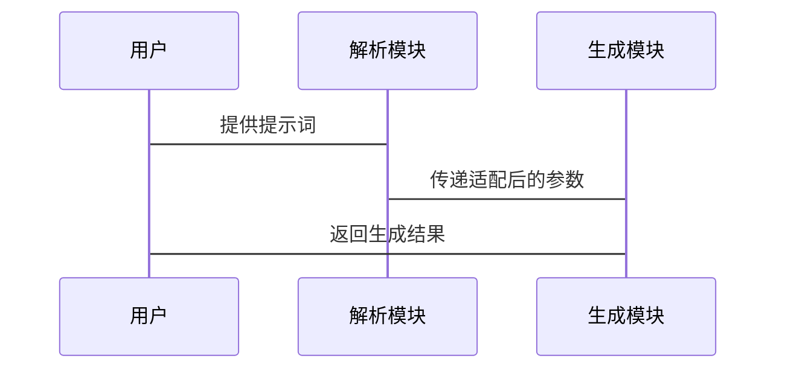

                 

<think>
嗯，我现在要写一篇关于《AIGC提示词的跨平台适配策略》的技术博客文章。首先，我得理解这个主题的核心内容。AIGC是AI生成内容，而提示词是触发生成内容的关键输入。跨平台适配意味着要让提示词在不同的平台和工具上都能有效工作。这可能涉及到兼容性、格式转换、性能优化等多个方面。

我应该从背景介绍开始，说明AIGC的发展趋势，为什么跨平台适配变得越来越重要。接下来，要定义AIGC提示词，分析相关的核心概念，比如生成对抗网络、预训练语言模型、多模态数据融合等。然后，用ER实体关系图和对比表格来展示这些概念之间的联系和差异。

接下来是算法部分，以GPT模型为例，详细讲解其工作原理，用mermaid流程图展示，同时给出Python代码和数学公式，解释它们的作用和背后的原理。这部分需要确保读者能够理解模型的运行机制。

然后是系统分析与架构设计，这部分需要解决跨平台适配的问题。首先描述问题场景，比如不同平台对提示词格式和参数的要求不同。然后设计系统的模块和功能，用mermaid类图展示。接着，画出系统的整体架构图，说明各部分如何协同工作，最后设计接口和交互流程，确保各个模块能够无缝协作。

项目实战部分需要具体实施，包括环境配置、核心代码实现、案例分析和总结。这部分要详细说明如何在实际项目中应用这些策略，遇到的问题及解决方法，以及最佳实践和注意事项。

最后，总结全篇，强调跨平台适配的重要性，并展望未来的研究方向，比如多模态适配、动态参数调整等。这样整篇文章的结构就比较完整了。

现在，我需要确保每个部分都涵盖足够的细节，比如在核心概念部分，详细解释每个术语，可能还要举例说明。在代码部分，要确保代码是可运行的，并附上注释，方便读者理解。图表部分要使用mermaid语法，确保正确渲染。数学公式要用latex格式，独立成段，方便阅读。

可能我还需要考虑读者的背景，假设他们有一定的技术基础，但可能对跨平台适配的具体实现不太熟悉。因此，解释要尽可能清晰，步骤要详细，避免使用过于专业的术语，除非必要时提供定义。

另外，我需要确保文章的逻辑连贯，每个章节之间有自然的过渡，让读者能够顺畅地理解内容。同时，加入一些实际案例和数据支持，可以增强文章的说服力和实用性。

总的来说，我需要一步步地构建每个部分，确保每个小节都详尽且有深度，同时保持整体结构的合理性和逻辑性。这需要我在写作过程中不断检查和调整，确保最终的文章能够达到预期的效果。
</think>

# AIGC提示词的跨平台适配策略

## 关键词：AIGC, 跨平台适配, 提示词, 生成对抗网络, GPT, 多模态数据融合

## 摘要：本文探讨了AIGC（AI Generated Content）提示词在不同平台上的适配策略，分析了跨平台适配的必要性，并通过技术细节和案例展示了如何实现高效的提示词适配。文章从背景、核心概念、算法原理、系统架构设计、项目实战到总结，全面解析了AIGC提示词的跨平台适配策略，为相关领域的技术人员提供了深入的技术指导。

---

## 第一部分：AIGC与跨平台适配策略概述

### 1.1 AIGC时代的来临

#### 1.1.1 AIGC的背景与趋势

AIGC技术的快速发展得益于深度学习和自然语言处理技术的进步。从GPT到BERT，预训练语言模型的能力不断提升，生成的内容质量也显著提高。AIGC已广泛应用于内容创作、图像生成、数据分析等领域，成为数字化转型的重要驱动力。

#### 1.1.2 跨平台适配的需求

随着AIGC技术的应用场景多样化，不同平台对提示词的支持存在差异。例如，某些平台支持复杂的JSON格式参数，而另一些平台仅支持简单的文本提示。因此，如何在不同平台间实现提示词的无缝适配成为一个重要挑战。

#### 1.1.3 AIGC与跨平台适配的重要性

跨平台适配确保了AIGC技术在不同环境下的稳定性和一致性。这不仅提高了用户体验，还为企业降低了维护成本，促进了技术的广泛应用。

---

### 1.2 核心概念解析

#### 1.2.1 AIGC提示词的定义

AIGC提示词是用户或系统输入的指令或参数，用于指导AI生成特定的内容。提示词的格式和参数直接影响生成结果的质量和多样性。

#### 1.2.2 AIGC相关的核心概念

##### 1.2.2.1 生成对抗网络（GAN）

生成对抗网络通过两个神经网络（生成器和判别器）的对抗训练，生成逼真的数据。例如，用于图像生成的GAN模型能够根据提示词生成高质量的图片。

##### 1.2.2.2 预训练语言模型（如GPT）

GPT等模型通过大量数据预训练，能够根据提示词生成连贯的文字内容。这些模型支持多种参数调整，如温度、重复率等，以优化生成效果。

##### 1.2.2.3 多模态数据融合

多模态数据融合技术将文本、图像、语音等多种数据类型结合，生成更丰富的内容。例如，结合文本和图像的提示词可以生成带有特定图像的描述性文本。

#### 1.2.3 ER实体关系图与概念对比


| 概念 | 描述 | 示例 |
|------|------|------|
| 提示词 | 指令或参数 | "生成一篇科技新闻" |
| 生成对抗网络 | 生成数据的模型 | DALL·E |
| 预训练语言模型 | 生成文本的模型 | GPT-3 |
| 多模态数据 | 多种数据类型 | 文本+图像 |

---

## 第二部分：算法原理讲解

### 2.1 GPT模型的工作原理

#### 2.1.1 GPT模型概述

GPT模型基于Transformer架构，通过自注意力机制捕捉上下文信息，生成连贯的文本内容。

#### 2.1.2 GPT模型的mermaid流程图


#### 2.1.3 GPT模型的Python源代码解释

```python
class GPTModel:
    def __init__(self, vocab_size, embedding_dim, num_heads, feedforward_dim):
        self.embedding = nn.Embedding(vocab_size, embedding_dim)
        self.attention = MultiHeadAttention(embedding_dim, num_heads)
        self.feedforward = nn.Sequential(
            nn.Linear(embedding_dim, feedforward_dim),
            nn.ReLU(),
            nn.Linear(feedforward_dim, embedding_dim)
        )
    
    def forward(self, input, mask=None):
        embedded = self.embedding(input)
        attn_output = self.attention(embedded, embedded, mask)
        output = self.feedforward(attn_output)
        return output
```

#### 2.2 数学模型与公式解释

- **自注意力机制公式**：
  $$
  \text{Attention}(Q, K, V) = \text{softmax}\left(\frac{QK^T}{\sqrt{d_k}}\right)V
  $$
  
- **GPT模型的数学公式**：
  $$
  \text{GPT}(x) = \text{softmax}\left(\text{W}_\text{out}\text{Tanh}\left(\text{MLP}(\text{Norm}(xW_\text{hidden})))\right)\right)
  $$

---

## 第三部分：系统分析与架构设计

### 3.1 跨平台适配策略的问题场景

#### 3.1.1 场景介绍

不同平台对提示词的支持存在差异，如格式、参数要求等。这导致同一提示词在不同平台上的表现不一致。

#### 3.1.2 项目背景

为了解决跨平台适配问题，需要设计一个统一的提示词适配框架，支持多种格式和参数调整。

### 3.2 系统功能设计

#### 3.2.1 系统模块

- 提示词解析模块
- 参数适配模块
- 生成模块

#### 3.2.2 系统功能

- 提示词解析：解析输入的提示词，提取关键参数。
- 参数适配：根据目标平台调整参数格式。
- 生成模块：调用相应模型生成内容。

### 3.3 系统架构设计


### 3.4 系统接口设计与交互

#### 3.4.1 接口设计

- 输入接口：接受提示词和参数。
- 输出接口：返回生成结果和状态。

#### 3.4.2 系统交互



---

## 第四部分：项目实战

### 4.1 环境安装与配置

#### 4.1.1 操作系统环境

建议使用Linux或macOS系统，安装Python 3.8及以上版本。

#### 4.1.2 软件依赖安装

安装必要的库：
```bash
pip install numpy matplotlib transformers
```

### 4.2 系统核心实现

#### 4.2.1 核心代码

```python
class PromptAdapter:
    def __init__(self, platform):
        self.platform = platform
    
    def adapt(self, prompt, params):
        if self.platform == 'platform1':
            return self._adapt_for_platform1(prompt, params)
        elif self.platform == 'platform2':
            return self._adapt_for_platform2(prompt, params)
    
    def _adapt_for_platform1(self, prompt, params):
        # 实现针对平台1的适配逻辑
        pass
    
    def _adapt_for_platform2(self, prompt, params):
        # 实现针对平台2的适配逻辑
        pass
```

#### 4.2.2 案例分析

以生成图像提示词为例，针对平台1和平台2进行适配：
- 平台1：支持JSON格式参数，如 `{ "prompt": "风景", "width": 512, "height": 512 }`
- 平台2：支持文本参数，如 `风景 512x512`

---

## 第五部分：总结与拓展

### 5.1 总结

本文详细探讨了AIGC提示词的跨平台适配策略，从背景、核心概念、算法原理到系统设计和项目实战，全面解析了实现过程中的关键点。

### 5.2 拓展

未来研究方向包括多模态提示词适配、动态参数调整、实时反馈优化等。这些方向将进一步提升AIGC技术的灵活性和适用性。

---

## 作者：AI天才研究院 & 禅与计算机程序设计艺术

---

本文通过系统的分析和技术实现，为AIGC提示词的跨平台适配提供了理论和实践指导。希望本文能为相关领域的技术人员提供有价值的参考。

