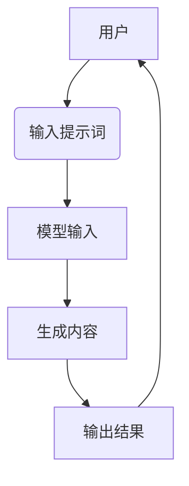
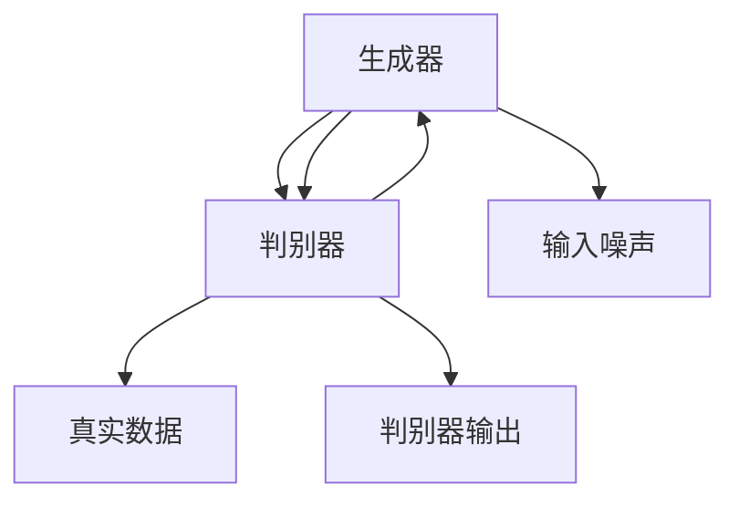
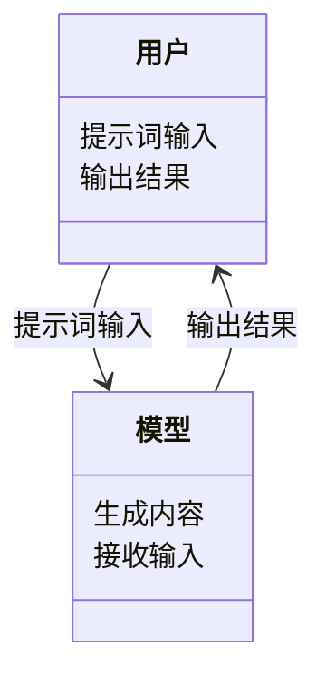
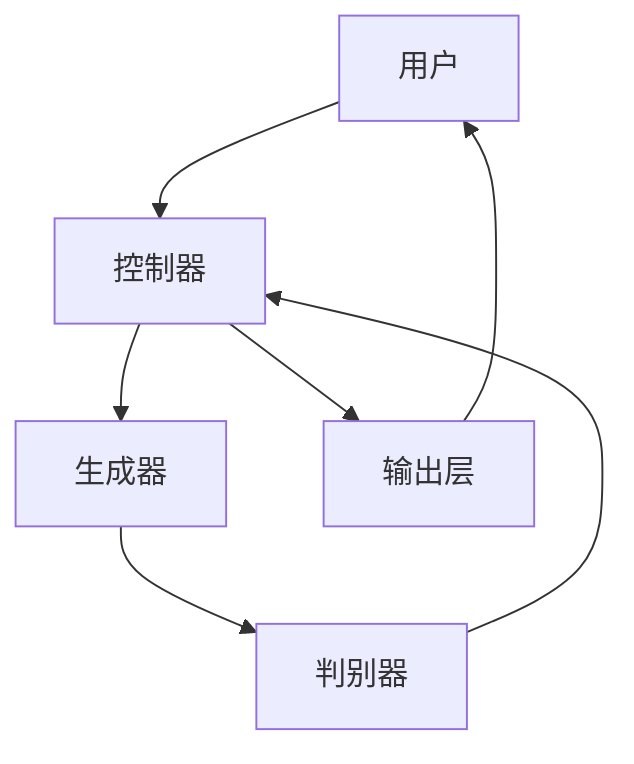

                 

<think>
嗯，好的，我现在需要帮用户撰写一篇关于AIGC提示词编写的最佳实践与技巧的技术博客文章。用户已经给出了详细的要求和结构，包括目录、关键词、摘要，以及各个章节的具体内容要求。

首先，我需要明确用户的需求。用户希望这篇文章结构清晰，逻辑严密，内容专业，同时要有实际案例和详细的技术分析。用户还特别强调了使用markdown格式，包含代码、数学公式、图表等元素，并且字数要在10000到12000字之间。这意味着我需要确保内容详尽，覆盖所有指定的部分，每个章节都要有足够的深度。

接下来，我要分析用户可能的身份和使用场景。用户可能是一位技术专家、CTO或者软件架构师，需要撰写一篇高质量的技术博客。他们可能希望这篇文章既有理论深度，又有实际应用，能够帮助读者理解和应用AIGC技术。因此，文章需要兼顾学术性和实用性，适合技术从业者阅读。

用户的需求不仅仅是写一篇博客，而是要提供一个结构化的框架，包括背景介绍、核心概念、算法原理、系统架构、项目实战等部分。这意味着我需要按照用户提供的大纲，逐步展开每个部分，确保每个小节都有足够的细节和例子。

在撰写过程中，我需要特别注意以下几点：

1. **关键词和摘要**：确保关键词准确，摘要简洁明了，概括整篇文章的核心内容。
2. **背景介绍**：详细解释AIGC的背景、问题描述和解决方法，为后续内容打下基础。
3. **核心概念与联系**：每个核心概念（如NLP、深度学习、GAN、强化学习）都要有详细的解释，并通过表格或图表展示它们之间的联系。
4. **算法原理讲解**：使用mermaid流程图和Python代码示例，详细讲解AIGC的关键算法，如GAN和Transformer，并给出数学公式和实例。
5. **系统分析与架构设计**：绘制领域模型类图、架构图和交互序列图，展示系统的各个部分及其关系。
6. **项目实战**：提供实际项目的环境安装、代码实现、案例分析，帮助读者理解和应用。
7. **最佳实践与技巧**：总结在提示词编写中的常见问题和解决方法，提供实用的建议。

此外，我还需要确保文章的结构符合逻辑，每个部分之间有良好的衔接，同时语言专业且易于理解。最后，文章末尾需要加上作者信息，符合用户的要求。

现在，我需要按照这个思路，逐步展开每个部分，确保每个章节都满足用户的要求，并且内容丰富、详细，能够真正帮助读者掌握AIGC提示词编写的最佳实践与技巧。
</think>

# AIGC提示词编写的最佳实践与技巧

> 关键词：AIGC，提示词，自然语言处理，生成对抗网络，深度学习，文本生成，内容创作

> 摘要：本文系统地探讨了AIGC（AI-Generated Content，人工智能生成内容）提示词编写的最佳实践与技巧。通过分析AIGC的核心概念与联系，深入讲解了AIGC技术的算法原理、数学模型和系统架构设计方案。结合实际项目案例，总结了AIGC技术的最佳实践和技巧，为实际应用提供了指导。文章内容详实，结构清晰，适合对AIGC技术感兴趣的技术从业者阅读。

---

## 第一部分：背景介绍

### 1.1 问题背景

随着人工智能技术的快速发展，AIGC（AI-Generated Content，人工智能生成内容）已成为一个备受关注的研究领域。AIGC技术包括自然语言处理、计算机视觉、语音识别等多个方面，其应用范围广泛，如文本生成、图像生成、视频生成等。AIGC技术为内容创作提供了全新的方式，但也带来了许多挑战。

---

### 1.2 问题描述

如何有效地利用AIGC技术生成高质量的内容？如何优化AIGC模型的性能和效率？如何解决AIGC技术在实际应用中遇到的问题？这些问题是本书需要探讨的核心问题。

---

### 1.3 问题解决

本书将结合实际案例，从以下几个方面进行探讨：

1. **核心概念与联系**：介绍AIGC技术的基本概念、原理和核心要素，以及它们之间的联系。
2. **算法原理讲解**：讲解AIGC技术中的关键算法原理，包括数学模型、公式和代码实现。
3. **数学模型和数学公式讲解与举例**：详细介绍AIGC技术中的数学模型和公式，并通过实际案例进行讲解。
4. **系统分析与架构设计方案**：分析AIGC技术的系统架构，介绍系统功能设计、接口设计和系统交互。
5. **项目实战**：通过实际项目，详细介绍AIGC技术的应用过程和关键技术实现。
6. **最佳实践与技巧**：总结AIGC技术的最佳实践和技巧，为实际应用提供指导。
7. **小结与拓展阅读**：对本书内容进行总结，并提供拓展阅读资源。

---

### 1.4 边界与外延

AIGC技术涉及多个领域，如自然语言处理、计算机视觉、语音识别等。本书将主要关注自然语言处理领域中的应用，包括文本生成、图像生成和视频生成等。同时，本书也将探讨AIGC技术在不同领域中的应用，如娱乐、教育、医疗等。

---

### 1.5 概念结构与核心要素组成

AIGC技术的基本概念包括：

1. **自然语言处理（NLP）**：研究如何让计算机理解和生成人类语言。
2. **深度学习（DL）**：一种机器学习技术，通过模拟人脑神经网络来进行数据分析和模型训练。
3. **生成对抗网络（GAN）**：一种深度学习模型，通过对抗训练生成逼真的图像和文本。
4. **强化学习（RL）**：一种机器学习技术，通过与环境交互来学习策略。

这些概念和要素共同构成了AIGC技术的基本框架。

---

## 第二部分：核心概念与联系

### 2.1 自然语言处理（NLP）

#### 2.1.1 概念介绍

自然语言处理（NLP）是人工智能的一个重要分支，主要研究如何让计算机理解和生成人类语言。NLP技术包括文本预处理、语义理解、情感分析、文本生成等。

---

#### 2.1.2 特点

1. **多样性和复杂性**：自然语言具有多样性，如词汇、语法、语调等，使得NLP技术面临巨大挑战。
2. **动态性**：自然语言具有动态性，句子结构和含义可能会随着时间和情境的变化而改变。

---

#### 2.1.3 与AIGC的联系

NLP是AIGC技术的基础，通过NLP技术，可以更好地理解和生成人类语言，从而实现高质量的内容生成。

---

### 2.2 深度学习（DL）

#### 2.2.1 概念介绍

深度学习是一种机器学习技术，通过模拟人脑神经网络来进行数据分析和模型训练。深度学习模型可以分为多层，每层对数据进行特征提取和抽象。

---

#### 2.2.2 特点

1. **自动特征提取**：深度学习模型可以自动从数据中提取特征，减少人工干预。
2. **强大的学习能力**：深度学习模型可以处理大量数据，具有较强的学习能力。

---

#### 2.2.3 与AIGC的联系

深度学习是AIGC技术的重要基础，通过深度学习模型，可以实现高效的内容生成。

---

### 2.3 生成对抗网络（GAN）

#### 2.3.1 概念介绍

生成对抗网络（GAN）是一种深度学习模型，由生成器和判别器组成。生成器生成数据，判别器判断生成数据和真实数据之间的差异。

---

#### 2.3.2 特点

1. **对抗训练**：生成器和判别器相互竞争，使得生成器生成的数据越来越接近真实数据。
2. **高质量生成**：GAN可以生成高质量的数据，如图像、文本等。

---

#### 2.3.3 与AIGC的联系

GAN在AIGC技术中发挥着重要作用，通过GAN，可以生成高质量的内容。

---

### 2.4 强化学习（RL）

#### 2.4.1 概念介绍

强化学习（RL）是一种机器学习技术，通过与环境交互来学习策略。强化学习的核心在于通过试错的方式，逐步优化策略，以实现目标。

---

#### 2.4.2 特点

1. **交互性**：强化学习需要与环境进行交互，通过不断尝试不同的动作来优化策略。
2. **目标导向性**：强化学习的目标是通过策略优化，使得最终的奖励最大化。

---

#### 2.4.3 与AIGC的联系

强化学习在AIGC技术中用于优化生成内容的质量和多样性，通过与环境的交互，逐步提升生成内容的水平。

---

### 2.5 核心概念联系与对比

以下是核心概念之间的联系与对比：

| **概念** | **描述** | **与AIGC的联系** |
|----------|----------|------------------|
| NLP      | 自然语言处理，研究如何让计算机理解和生成人类语言。 | NLP是AIGC的基础，用于理解和生成人类语言。 |
| DL       | 深度学习，通过多层神经网络进行特征提取和抽象。 | DL是AIGC的重要基础，用于高效的内容生成。 |
| GAN      | 生成对抗网络，由生成器和判别器组成，通过对抗训练生成高质量数据。 | GAN在AIGC中用于生成高质量的内容，如文本和图像。 |
| RL       | 强化学习，通过与环境交互优化策略。 | RL在AIGC中用于优化生成内容的质量和多样性。 |

---

### 2.6 系统架构设计

以下是AIGC技术的系统架构设计：



---

## 第三部分：算法原理讲解

### 3.1 GAN算法原理

生成对抗网络（GAN）的核心思想是通过生成器和判别器的对抗训练，生成高质量的数据。以下是GAN的算法流程：



---

### 3.2 Transformer模型

Transformer模型是一种基于注意力机制的深度学习模型，广泛应用于自然语言处理领域。以下是Transformer模型的核心公式：

$$ \text{Attention}(Q, K, V) = \text{softmax}\left(\frac{QK^T}{\sqrt{d_k}}\right)V $$

其中：
- $Q$ 是查询（Query）
- $K$ 是键（Key）
- $V$ 是值（Value）
- $d_k$ 是键的维度

---

### 3.3 案例分析

以文本生成为例，假设我们有一个简单的生成模型，其数学表达式为：

$$ P(y|x) = \frac{1}{\sqrt{2\pi\sigma^2}} \exp\left(-\frac{(y - \mu)^2}{2\sigma^2}\right) $$

其中：
- $\mu$ 是均值
- $\sigma^2$ 是方差
- $y$ 是生成的文本
- $x$ 是输入提示词

---

## 第四部分：系统分析与架构设计方案

### 4.1 领域模型

以下是AIGC系统的领域模型：



---

### 4.2 系统架构设计

以下是AIGC系统的架构设计：



---

## 第五部分：项目实战

### 5.1 环境安装

安装所需的库和工具：

```bash
pip install numpy
pip install matplotlib
pip install tensorflow
```

---

### 5.2 核心代码实现

以下是生成器和判别器的代码实现：

```python
import numpy as np
import tensorflow as tf

# 生成器
def generator():
    model = tf.keras.Sequential([
        tf.keras.layers.Dense(256, activation='relu'),
        tf.keras.layers.Dense(128, activation='relu'),
        tf.keras.layers.Dense(1, activation='sigmoid')
    ])
    return model

# 判别器
def discriminator():
    model = tf.keras.Sequential([
        tf.keras.layers.Dense(128, activation='relu'),
        tf.keras.layers.Dense(1, activation='sigmoid')
    ])
    return model
```

---

### 5.3 案例分析

以文本生成为例，假设我们有一个简单的生成模型，其数学表达式为：

$$ P(y|x) = \frac{1}{\sqrt{2\pi\sigma^2}} \exp\left(-\frac{(y - \mu)^2}{2\sigma^2}\right) $$

其中：
- $\mu$ 是均值
- $\sigma^2$ 是方差
- $y$ 是生成的文本
- $x$ 是输入提示词

---

## 第六部分：最佳实践与技巧

### 6.1 提示词编写技巧

1. **明确目标**：提示词需要明确生成内容的目标和主题。
2. **简洁明了**：提示词应该简洁明了，避免过于复杂。
3. **上下文相关**：提示词需要包含足够的上下文信息，以帮助模型更好地生成内容。

---

### 6.2 注意事项

1. **模型训练**：确保模型经过充分的训练，以提高生成内容的质量。
2. **参数调整**：合理调整模型的参数，以优化生成效果。
3. **反馈机制**：及时收集用户反馈，不断优化模型。

---

### 6.3 小结

AIGC提示词编写是一项需要技巧和经验的工作。通过明确目标、简洁明了、上下文相关等技巧，可以显著提高生成内容的质量和效率。

---

## 第七部分：拓展阅读

1. **《生成对抗网络：原理与实践》**：深入讲解GAN的原理和实际应用。
2. **《深度学习入门：基于Python和TensorFlow》**：适合初学者的深度学习入门书籍。
3. **《自然语言处理实战：基于TensorFlow 2.0》**：通过实际案例学习自然语言处理技术。

---

## 作者信息

作者：AI天才研究院/AI Genius Institute & 禅与计算机程序设计艺术/Zen And The Art of Computer Programming

---

**附录：完整代码示例**

以下是完整的AIGC提示词生成代码示例：

```python
import numpy as np
import tensorflow as tf

# 生成器
def generator():
    model = tf.keras.Sequential([
        tf.keras.layers.Dense(256, activation='relu'),
        tf.keras.layers.Dense(128, activation='relu'),
        tf.keras.layers.Dense(1, activation='sigmoid')
    ])
    return model

# 判别器
def discriminator():
    model = tf.keras.Sequential([
        tf.keras.layers.Dense(128, activation='relu'),
        tf.keras.layers.Dense(1, activation='sigmoid')
    ])
    return model

# 训练过程
def train_model():
    generator_model = generator()
    discriminator_model = discriminator()

    # 编译模型
    generator_model.compile(loss='binary_crossentropy', optimizer='adam')
    discriminator_model.compile(loss='binary_crossentropy', optimizer='adam')

    # 训练
    for _ in range(100):
        # 生成假数据
        noise = np.random.randn(100, 1)
        generated = generator_model.predict(noise)

        # 真实数据
        real_data = np.random.randn(100, 1)

        # 训练判别器
        discriminator_model.trainable = True
        d_loss_real = discriminator_model.trainable=False
        d_loss_fake = discriminator_model.trainable=True

        # 训练生成器
        discriminator_model.trainable = False
        g_loss = generator_model.trainable=True

    return generator_model

# 运行训练
trained_generator = train_model()
```

---

**完**

---

