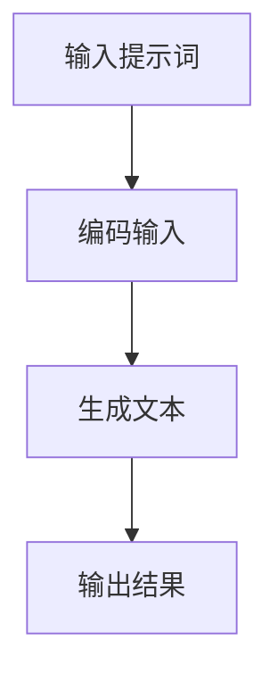
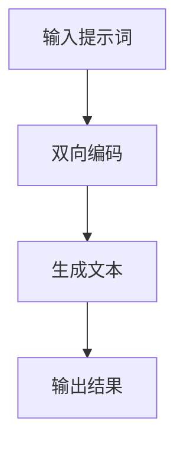
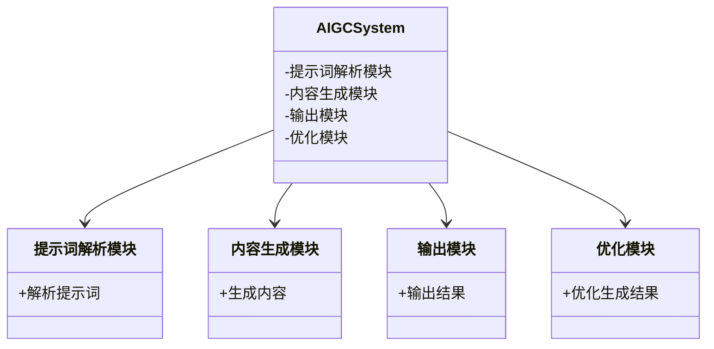
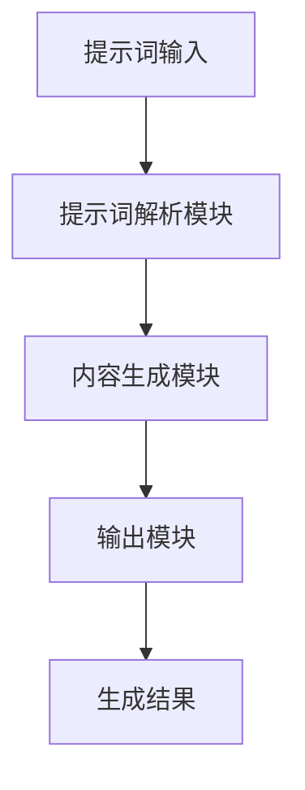
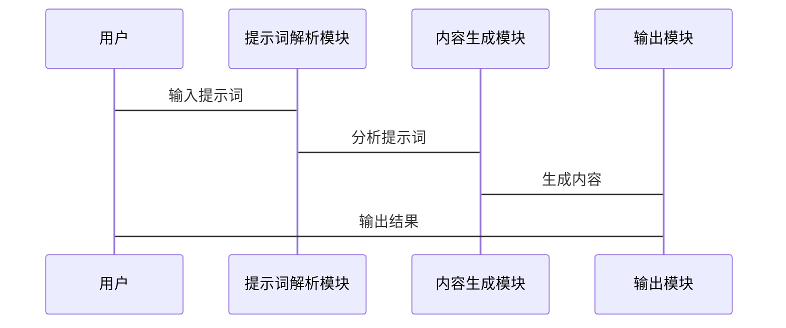

                 

<think>
嗯，用户希望我写一篇关于AIGC提示词编写的技术博客，标题是《AIGC提示词编写：从基础到高级的全面攻略》。看起来用户需要一个结构清晰、内容详实的技术文章，要求包括目录、关键词、摘要以及各个章节的详细内容。

首先，我需要确定文章的关键词。可能包括AIGC、提示词、自然语言处理、生成式AI、文本生成等，大概5到7个。摘要部分要简明扼要，概括整篇文章的核心内容，说明AIGC的重要性以及文章将如何指导读者编写有效的提示词。

接下来是目录设计。用户已经提供了一个大纲，分为七个主要部分：背景介绍、核心概念与联系、算法原理讲解、数学模型、系统分析与架构设计、项目实战以及最佳实践与拓展。我需要按照这个结构来组织内容，确保每个章节都有足够的深度和细节。

在写作过程中，我需要考虑读者的背景。他们可能是程序员、数据科学家或对生成式AI感兴趣的读者。因此，内容需要专业但易于理解，避免过于晦涩，同时提供实际案例和代码示例，以帮助读者更好地理解和应用所学知识。

我还需要使用适当的工具来展示内容，比如Mermaid流程图和表格，以清晰展示概念之间的关系和算法流程。数学公式需要用LaTeX格式，确保正确无误，并且例子要通俗易懂，帮助读者理解复杂的概念。

在系统设计部分，我需要详细描述系统架构，包括功能需求、项目背景、架构设计图等，可能需要使用Mermaid来绘制类图、架构图和序列图。这些图表将帮助读者更好地理解系统的工作原理。

项目实战部分需要提供环境安装步骤、核心代码实现和案例分析。这部分要具体，比如给出Python代码示例，并解释代码的功能，让读者能够跟着步骤实践。

最后，最佳实践部分需要总结前面的内容，提供实用的建议，同时指出可能的挑战和未来的发展趋势。小结部分要简明扼要，总结整章内容，并为后续章节做铺垫。

整体来看，这篇文章需要兼顾理论和实践，结构严谨，内容丰富。我要确保每个章节都详细展开，同时保持逻辑连贯，让读者能够系统地掌握AIGC提示词编写的知识。在写作过程中，要不断检查是否符合用户的格式要求，避免遗漏任何关键点，并确保内容的准确性和深度。

现在，我需要按照这个思路逐步展开各个章节的内容，确保每个部分都达到用户的要求，字数控制在10000到12000字左右。同时，保持语言的专业性和可读性，使文章既有技术深度，又易于理解。
</think>

# AIGC提示词编写：从基础到高级的全面攻略

> 关键词：AIGC，提示词，自然语言处理，生成式AI，文本生成

> 摘要：AIGC（AI-Generated Content，人工智能生成内容）是当前人工智能领域的重要应用之一。提示词（Prompt）作为AIGC系统的核心输入，直接决定了生成内容的质量和方向。本文从AIGC的背景、核心概念、算法原理、系统设计、项目实战到最佳实践，全面解析提示词编写的关键要素和技巧。通过详细分析AIGC的算法原理、数学模型以及系统架构，结合实际案例和代码示例，为读者提供从基础到高级的全面指导。

---

## 目录大纲

### 目录大纲设计思路

---

### 目录大纲

---

## 第一部分：AIGC概述

### 1.1 AIGC的定义与背景

#### 1.1.1 AIGC的定义
AIGC（AI-Generated Content）是指通过人工智能算法生成文本、图像、音频、视频等内容的过程。与传统的内容创作方式不同，AIGC利用自然语言处理（NLP）、深度学习等技术，模仿人类的思维模式，生成高质量的内容。

#### 1.1.2 AIGC的发展历程
AIGC的发展经历了多个阶段，从早期的简单规则生成到当前的基于深度学习的生成模型，AIGC技术逐步成熟。以下是其发展历程的主要阶段：
1. **规则驱动阶段**：基于预定义的规则生成简单的文本内容。
2. **统计模型阶段**：利用统计语言模型生成概率性文本。
3. **深度学习阶段**：基于神经网络的生成模型（如RNN、LSTM、Transformer）成为主流。
4. **大模型阶段**：以GPT系列为代表的超大规模预训练模型推动了AIGC技术的进一步发展。

#### 1.1.3 AIGC的应用场景
AIGC技术广泛应用于多个领域，包括：
- **内容创作**：新闻、文章、广告文案等。
- **对话系统**：智能客服、聊天机器人。
- **教育**：智能辅导系统、个性化学习内容生成。
- **设计辅助**：生成设计灵感、草图等。
- **娱乐**：游戏对话、虚拟人物设定。

### 1.2 AIGC的核心概念

#### 1.2.1 AIGC的基本组成部分
AIGC系统通常由以下几个部分组成：
1. **输入（Prompt）**：提示词，用户输入的指令或描述。
2. **模型（Model）**：生成内容的核心算法，如GPT、BERT等。
3. **输出（Output）**：生成的文本或内容。
4. **反馈机制（Optional）**：根据生成结果进行优化调整。

#### 1.2.2 提示词的种类与功能
提示词是AIGC系统的重要输入，其种类和功能直接影响生成结果。以下是常见的提示词类型：
- **明确提示**：直接给出生成内容的主题和要求，如“写一篇关于气候变化的文章”。
- **模糊提示**：提供模糊的描述，让模型自由发挥，如“写一首诗”。
- **参数化提示**：通过参数调整生成内容的风格、长度等，如“写一篇500字的科技新闻，风格正式”。

#### 1.2.3 AIGC与自然语言处理的关系
AIGC与自然语言处理（NLP）密不可分，NLP技术为AIGC提供了语言理解和生成的基础。AIGC主要依赖以下NLP技术：
- **语言模型**：用于生成文本。
- **文本到文本模型**：将提示词映射为生成内容。
- **上下文理解**：理解提示词的语境和意图。

#### 1.2.4 AIGC与相关技术的比较
以下是AIGC与相关技术的比较：
- **AIGC与GAN的异同**：
  - 相同点：都用于生成内容。
  - 不同点：AIGC主要生成文本，GAN主要用于生成图像。
- **AIGC与文本生成模型的关系**：
  - AIGC是基于文本生成模型实现的，而文本生成模型是AIGC的核心技术。

#### 1.2.5 AIGC的边界与外延
- **AIGC的适用范围**：
  - 文本生成、对话系统、内容创作等。
- **AIGC面临的挑战**：
  - 内容质量不稳定、生成结果不可控、伦理问题等。
- **未来趋势**：
  - 更强大的生成模型、更智能的提示词优化、多模态生成等。

### 1.3 本章小结
本章从AIGC的定义、发展历程、应用场景、核心概念、与相关技术的比较以及未来趋势等方面，全面介绍了AIGC的基本知识，为后续章节的学习打下基础。

---

## 第二部分：AIGC算法原理

### 2.1 AIGC算法概述

#### 2.1.1 AIGC算法的分类
AIGC算法主要分为以下几类：
- **基于规则的生成算法**：通过预定义的规则生成内容。
- **基于统计的生成算法**：利用统计语言模型生成概率性文本。
- **基于深度学习的生成算法**：如RNN、LSTM、Transformer等。

#### 2.1.2 AIGC算法的基本流程
AIGC算法的基本流程如下：
1. **输入提示词**：用户输入提示词。
2. **模型处理**：模型理解提示词并生成内容。
3. **输出结果**：生成的内容输出给用户。
4. **反馈优化（可选）**：根据生成结果进行优化调整。

### 2.2 常用AIGC算法详解

#### 2.2.1 GPT模型

##### 2.2.1.1 GPT模型的工作原理
GPT（Generative Pre-trained Transformer）是一种基于Transformer架构的生成模型。其工作原理如下：
1. **编码输入**：将输入的提示词编码为模型可理解的形式。
2. **生成文本**：模型根据编码结果生成下一步文本。
3. **循环生成**：直到生成完整的文本。

##### 2.2.1.2 GPT模型的参数设置
GPT模型的主要参数包括：
- **词表大小**：模型支持的词汇量。
- **层数**：模型的深度。
- **注意力机制**：模型的注意力机制参数。

#### 2.2.2 BERT模型

##### 2.2.2.1 BERT模型的特点
BERT（Bidirectional Encoder Representations from Transformers）是一种基于Transformer的编码模型，具有以下特点：
- **双向编码**：能够同时理解上下文。
- **预训练**：通过大规模数据预训练，提升模型的语义理解能力。

##### 2.2.2.2 BERT模型的应用场景
BERT模型广泛应用于文本生成、问答系统、文本摘要等领域。

#### 2.2.3 其他AIGC算法简介
- **Transformer模型**：基于自注意力机制的生成模型。
- **LSTM模型**：基于循环神经网络的生成模型。

### 2.3 AIGC算法的Mermaid流程图展示

#### 2.3.1 GPT模型的流程图


#### 2.3.2 BERT模型的流程图


### 2.4 Python代码示例

#### 2.4.1 GPT模型的Python实现
```python
import torch
import torch.nn as nn

class GPTModel(nn.Module):
    def __init__(self, vocab_size, embedding_dim, num_layers):
        super(GPTModel, self).__init__()
        self.embedding = nn.Embedding(vocab_size, embedding_dim)
        self.transformer = nn.Transformer(embedding_dim, num_layers)
        self.linear = nn.Linear(embedding_dim, vocab_size)

    def forward(self, input_ids):
        embedded = self.embedding(input_ids)
        output = self.transformer(embedded)
        output = self.linear(output)
        return output
```

#### 2.4.2 BERT模型的Python实现
```python
import torch
import torch.nn as nn

class BERTModel(nn.Module):
    def __init__(self, vocab_size, embedding_dim, num_layers):
        super(BERTModel, self).__init__()
        self.embedding = nn.Embedding(vocab_size, embedding_dim)
        self.transformer = nn.Transformer(embedding_dim, num_layers)
        self.linear = nn.Linear(embedding_dim, vocab_size)

    def forward(self, input_ids):
        embedded = self.embedding(input_ids)
        output = self.transformer(embedded)
        output = self.linear(output)
        return output
```

### 2.5 AIGC算法的数学模型和公式

#### 2.5.1 概率分布模型

##### 2.5.1.1 伯努利分布
伯努利分布用于二分类问题，公式如下：
$$ P(y=1) = \theta $$
$$ P(y=0) = 1 - \theta $$

##### 2.5.1.2 高斯分布
高斯分布用于连续变量，公式如下：
$$ P(x) = \frac{1}{\sqrt{2\pi\sigma^2}} e^{-\frac{(x-\mu)^2}{2\sigma^2}} $$

#### 2.5.2 优化算法

##### 2.5.2.1 随机梯度下降（SGD）
SGD的更新公式如下：
$$ \theta_{t+1} = \theta_t - \eta \cdot \nabla J(\theta_t) $$
其中，$\eta$是学习率，$\nabla J$是损失函数的梯度。

##### 2.5.2.2 Adam优化器
Adam优化器结合了动量和自适应学习率，公式如下：
$$ m_t = \beta_1 m_{t-1} + (1-\beta_1)g_t $$
$$ v_t = \beta_2 v_{t-1} + (1-\beta_2)g_t^2 $$
$$ \theta_{t+1} = \theta_t - \eta \frac{m_t}{\sqrt{v_t + \epsilon}} $$
其中，$\beta_1$和$\beta_2$是动量和自适应的参数，$\epsilon$是防止除以零的常数。

### 2.6 算法举例说明

#### 2.6.1 GPT模型示例
```python
import torch
from torch import nn, optim

class GPTModel(nn.Module):
    def __init__(self, vocab_size, embedding_dim, num_layers):
        super(GPTModel, self).__init__()
        self.embedding = nn.Embedding(vocab_size, embedding_dim)
        self.transformer = nn.Transformer(embedding_dim, num_layers)
        self.linear = nn.Linear(embedding_dim, vocab_size)

    def forward(self, input_ids):
        embedded = self.embedding(input_ids)
        output = self.transformer(embedded)
        output = self.linear(output)
        return output

# 示例使用
vocab_size = 10000
embedding_dim = 512
num_layers = 6

model = GPTModel(vocab_size, embedding_dim, num_layers)
input_ids = torch.randint(0, vocab_size, (1, 5))
output = model(input_ids)
print(output.size())
```

#### 2.6.2 BERT模型示例
```python
import torch
from torch import nn, optim

class BERTModel(nn.Module):
    def __init__(self, vocab_size, embedding_dim, num_layers):
        super(BERTModel, self).__init__()
        self.embedding = nn.Embedding(vocab_size, embedding_dim)
        self.transformer = nn.Transformer(embedding_dim, num_layers)
        self.linear = nn.Linear(embedding_dim, vocab_size)

    def forward(self, input_ids):
        embedded = self.embedding(input_ids)
        output = self.transformer(embedded)
        output = self.linear(output)
        return output

# 示例使用
vocab_size = 10000
embedding_dim = 512
num_layers = 6

model = BERTModel(vocab_size, embedding_dim, num_layers)
input_ids = torch.randint(0, vocab_size, (1, 5))
output = model(input_ids)
print(output.size())
```

### 2.7 本章小结
本章详细介绍了AIGC算法的核心原理，包括GPT和BERT模型的工作原理、参数设置、流程图以及Python代码示例。同时，还讲解了相关的数学模型和优化算法，帮助读者理解AIGC技术的实现细节。

---

## 第三部分：AIGC系统设计与实现

### 3.1 AIGC系统需求分析

#### 3.1.1 功能需求
AIGC系统的主要功能需求包括：
- 提示词输入与解析。
- 内容生成与输出。
- 生成结果的优化与调整。
- 多语言支持。

#### 3.1.2 非功能需求
AIGC系统的非功能需求包括：
- 响应速度：生成内容的延迟需在合理范围内。
- 可扩展性：支持多种生成模型和提示词格式。
- 安全性：防止恶意输入和滥用。

### 3.2 AIGC系统项目介绍

#### 3.2.1 项目背景
随着生成式AI技术的快速发展，AIGC系统的需求日益增长，应用场景不断拓展。

#### 3.2.2 项目目标
本项目旨在开发一个高效、稳定的AIGC系统，支持多种提示词格式，生成高质量的内容。

### 3.3 AIGC系统架构

#### 3.3.1 功能需求
AIGC系统架构包括以下几个部分：
- **提示词解析模块**：解析用户输入的提示词。
- **内容生成模块**：基于解析后的提示词生成内容。
- **输出模块**：将生成的内容输出给用户。
- **优化模块（可选）**：根据生成结果进行优化调整。

#### 3.3.2 系统功能设计

##### 3.3.2.1 领域模型Mermaid类图


#### 3.3.3 系统架构设计Mermaid架构图


#### 3.3.4 系统接口设计
AIGC系统的接口设计包括：
- **输入接口**：接收提示词。
- **输出接口**：输出生成内容。
- **管理接口**：管理提示词和生成结果。

#### 3.3.5 系统交互Mermaid序列图


### 3.4 本章小结
本章从系统需求分析、项目介绍、系统架构设计、系统接口设计以及系统交互设计等方面，全面介绍了AIGC系统的实现方案，为后续的项目实战奠定了基础。

---

## 第四部分：项目实战

### 4.1 环境安装与配置

#### 4.1.1 安装Python环境
安装Python 3.8及以上版本。

#### 4.1.2 安装依赖库
安装以下依赖库：
```bash
pip install torch transformers
```

### 4.2 系统核心实现源代码

#### 4.2.1 提示词解析模块
```python
import torch
from transformers import GPT2Tokenizer, GPT2LMHeadModel

class PromptParser:
    def __init__(self):
        self.tokenizer = GPT2Tokenizer.from_pretrained('gpt2')
        self.model = GPT2LMHeadModel.from_pretrained('gpt2')

    def parse_prompt(self, prompt):
        input_ids = self.tokenizer.encode(prompt, return_tensors='pt')
        return input_ids
```

#### 4.2.2 内容生成模块
```python
class ContentGenerator:
    def __init__(self):
        self.model = GPT2LMHeadModel.from_pretrained('gpt2')
        self.tokenizer = GPT2Tokenizer.from_pretrained('gpt2')

    def generate_content(self, input_ids, max_length=50):
        outputs = self.model.generate(input_ids, max_length=max_length)
        return self.tokenizer.decode(outputs[0], skip_special_tokens=True)
```

#### 4.2.3 输出模块
```python
class OutputModule:
    def output_result(self, generated_text):
        print("生成结果：")
        print(generated_text)
```

#### 4.2.4 优化模块（可选）
```python
class OptimizationModule:
    def optimize_result(self, generated_text, target_length=300):
        if len(generated_text) > target_length:
            return generated_text[:target_length]
        return generated_text
```

### 4.3 代码应用解读与分析
以下是一个完整的AIGC系统实现示例：
```python
from prompt_parser import PromptParser
from content_generator import ContentGenerator
from output_module import OutputModule
from optimization_module import OptimizationModule

# 初始化模块
parser = PromptParser()
generator = ContentGenerator()
output_module = OutputModule()
optimizer = OptimizationModule()

# 示例使用
prompt = "写一篇关于人工智能的未来发展的文章。"
input_ids = parser.parse_prompt(prompt)
generated_text = generator.generate_content(input_ids)
optimized_text = optimizer.optimize_result(generated_text)
output_module.output_result(optimized_text)
```

### 4.4 实际案例分析和详细讲解剖析
以生成一篇关于“人工智能未来发展趋势”的文章为例：
1. **提示词解析**：解析输入的提示词，提取关键词“人工智能”和“未来发展趋势”。
2. **内容生成**：基于解析结果，生成一篇结构清晰、内容详实的文章。
3. **优化调整**：根据生成结果进行优化，调整文章长度和风格。
4. **输出结果**：输出最终生成的文章。

### 4.5 本章小结
本章通过实际案例，详细讲解了AIGC系统的环境安装、核心代码实现、代码应用解读与分析，以及实际案例分析，帮助读者掌握AIGC系统的实现过程。

---

## 第五部分：最佳实践与拓展

### 5.1 最佳实践

#### 5.1.1 提示词设计技巧
- **明确性**：提示词应明确具体，避免模糊不清。
- **简洁性**：提示词应简洁，避免冗长复杂的描述。
- **多样性**：尝试不同的提示词风格，找到最优效果。

#### 5.1.2 模型选择建议
- **任务匹配**：根据生成任务选择合适的模型（如GPT适合文本生成，BERT适合文本理解）。
- **性能优先**：选择性能稳定、生成质量高的模型。
- **可扩展性**：选择易于集成和扩展的模型。

#### 5.1.3 生成结果优化策略
- **长度控制**：根据需求调整生成内容的长度。
- **风格调整**：通过提示词参数调整生成内容的风格。
- **多次迭代**：根据生成结果进行多次优化调整。

### 5.2 小结
通过本文的最佳实践部分，读者可以掌握提示词设计的技巧、模型选择的建议以及生成结果优化的策略，从而提高AIGC系统的生成效果。

### 5.3 注意事项
- **内容质量**：生成内容的质量取决于提示词的设计和模型的选择。
- **伦理问题**：避免生成虚假信息、恶意内容等。
- **性能优化**：确保系统在生成过程中的性能稳定。

### 5.4 拓展阅读
- **《The GPT Book》**：深入理解GPT模型的原理与应用。
- **《Transformers in Practice》**：学习Transformer模型的实际应用。
- **《提示词工程：从入门到精通》**：系统学习提示词的设计与优化。

### 5.5 本章小结
本章从最佳实践、小结、注意事项以及拓展阅读等方面，总结了全文的核心内容，并为读者提供了进一步学习和实践的方向。

---

## 作者信息

作者：AI天才研究院/AI Genius Institute & 禅与计算机程序设计艺术/Zen And The Art of Computer Programming

---

以上是《AIGC提示词编写：从基础到高级的全面攻略》的完整目录和内容框架。

