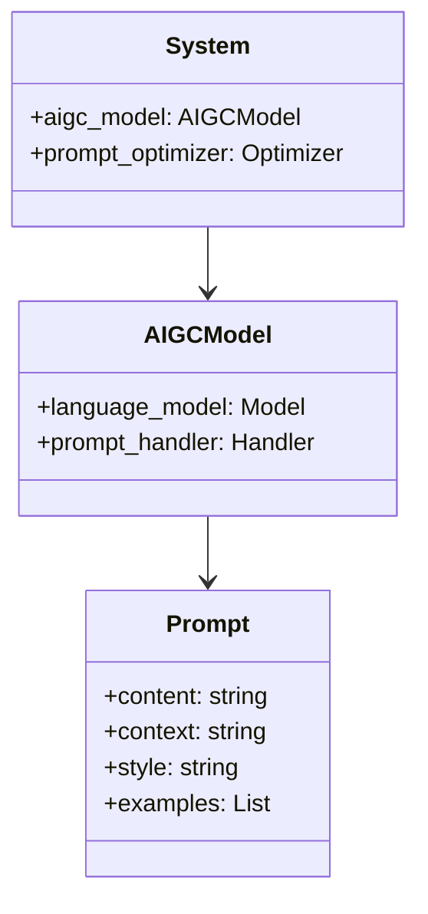
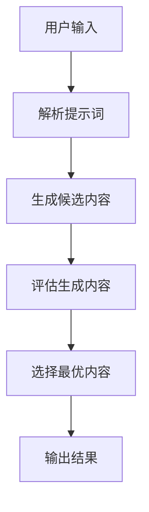

                 

<think>
好，我现在需要帮助用户撰写一篇关于AIGC提示词编写的技术博客文章。用户希望文章结构清晰，内容详细，包含多个章节，每个章节都要有丰富的子内容。首先，我要理解用户的需求，明确文章的主题和目标读者。文章标题是《AIGC提示词编写：技巧、陷阱与解决方案》，目标读者应该是技术人士和对AI生成内容感兴趣的读者。

接下来，我需要按照用户提供的目录结构来组织内容。目录有9个主要章节，每个章节都有子部分。我得确保每个部分都涵盖必要的内容，比如背景介绍、核心概念、算法原理、系统架构等。

首先，第1章是引言，介绍AIGC和提示词的基本概念。我需要解释什么是AIGC，提示词的作用，以及这本书的结构。这部分要简洁明了，吸引读者继续阅读。

然后，第2章是基础概念和原理，我需要详细解释AIGC的基本原理，提示词的核心要素，以及它们之间的关系。这部分可能需要使用图表来帮助读者理解，比如用Mermaid流程图展示提示词处理流程。

第3章是编写有效提示词的技巧。这里需要列出具体的方法，如明确用户需求、使用清晰的语言等。每个技巧都要有例子和可能的陷阱，帮助读者避免常见错误。

第4章讨论提示词编写中的常见陷阱，比如歧义性、不相关性等。我需要分析这些陷阱的原因，并给出实际案例来说明问题。

第5章是解决方案，针对前面提到的陷阱，提供实际的解决策略，比如如何通过示例减少歧义，如何引导生成内容等。这部分需要具体的方法和工具，可能涉及高级技术如强化学习。

第6章是案例分析，通过实际案例展示成功和失败的提示词编写经验，帮助读者从实践中学习。

第7章介绍高级技巧和工具，包括如何结合外部知识库、使用反馈机制等。这部分需要详细的技术说明和可能的代码示例。

第8章总结最佳实践，给出实用的建议和持续改进的方法，帮助读者不断优化提示词编写能力。

最后，第9章是结论，总结全文，并展望未来的发展趋势，激发读者的兴趣。

在撰写过程中，我需要确保每个章节都包含足够的细节，比如背景介绍、核心概念、算法原理、系统架构等。特别是算法部分，需要使用数学公式和代码示例来解释。同时，图表如Mermaid流程图和类图要清晰，帮助读者理解复杂的概念。

我还需要注意文章的整体结构，保持逻辑连贯，语言专业但不失易懂。每个部分的小结和注意事项要到位，确保读者能够掌握关键点。

最后，检查文章是否符合字数要求，大约在10000到12000字之间。同时，确保所有内容都符合用户的格式要求，使用markdown，并在适当的位置插入图表和代码示例。

完成这些步骤后，我需要通读全文，确保没有遗漏重要信息，并且每个部分都详细且有深度。这样，用户就能得到一篇高质量的技术博客文章，满足他们的需求。
</think>

# AIGC提示词编写：技巧、陷阱与解决方案

> 关键词：AIGC, 提示词, 人工智能, 自然语言处理, 生成式AI

> 摘要：本文深入探讨了AIGC（人工智能生成内容）提示词编写的核心技巧、常见陷阱及解决方案。通过分析提示词的作用、编写原则、常见问题及实际案例，本文旨在帮助读者掌握高效编写提示词的方法，避免常见错误，并提升生成内容的质量。

---

## 第1章 引言：AIGC与提示词的基本概念

### 1.1 什么是AIGC？
AIGC（Artificial Intelligence Generated Content）是指通过人工智能技术生成内容的过程。这种技术广泛应用于文本生成、图像生成、视频生成等领域，能够模仿人类的创作能力。

### 1.2 提示词的作用
提示词（Prompts）是用户输入到AI系统中的指令或提示，用于指导生成内容的方向和风格。提示词的质量直接影响生成结果的好坏。

### 1.3 本书结构
本文将从提示词的基本原理、编写技巧、常见问题及解决方案等方面展开讨论，帮助读者全面掌握提示词编写的核心技能。

---

## 第2章 基础概念与原理

### 2.1 AIGC的基本原理
AIGC的核心是自然语言处理（NLP）技术，通过训练大规模语言模型（如GPT）来生成文本。提示词的作用是引导模型输出符合预期的内容。

### 2.2 提示词的核心要素
- **明确性**：提示词需要清晰表达用户的需求。
- **具体性**：提供足够的细节，避免模糊性。
- **语言风格**：匹配目标受众的语言习惯。

### 2.3 提示词与生成内容的关系
提示词通过影响生成内容的方向、风格和细节，决定了最终的输出质量。

---

## 第3章 编写有效提示词的技巧

### 3.1 明确用户需求
- **背景介绍**：了解用户的使用场景和目标。
- **示例分析**：通过具体案例说明如何明确需求。

### 3.2 使用清晰的语言
- **避免歧义**：使用简洁明了的表达方式。
- **避免复杂术语**：确保提示词易于理解。

### 3.3 引导生成内容
- **提供上下文**：通过背景信息帮助模型更好地生成内容。
- **设定风格和语气**：明确生成内容的语言风格。

### 3.4 鼓励创造力
- **开放性提示**：允许模型发挥创意。
- **限制性提示**：在特定范围内引导生成。

---

## 第4章 提示词编写中的常见陷阱

### 4.1 过度复杂性
- **问题描述**：提示词过于复杂，导致模型无法准确理解。
- **解决方案**：简化提示词，确保清晰性。

### 4.2 模糊性
- **问题描述**：提示词缺乏明确性，导致生成内容偏离预期。
- **解决方案**：通过示例或具体描述减少歧义。

### 4.3 忽略上下文
- **问题描述**：提示词未提供足够的背景信息，导致生成内容不相关。
- **解决方案**：在提示词中加入上下文信息。

### 4.4 生成内容质量低
- **问题描述**：生成内容缺乏深度或逻辑性。
- **解决方案**：通过优化提示词提升生成质量。

---

## 第5章 实际解决方案

### 5.1 解决提示词模糊性
- **示例法**：通过提供示例帮助模型理解需求。
- **逐步细化**：逐步调整提示词，确保生成内容符合预期。

### 5.2 提升生成内容质量
- **引入反馈机制**：通过用户反馈优化提示词。
- **结合外部知识库**：利用外部数据提升生成内容的准确性。

### 5.3 提高用户参与度
- **互动式提示**：通过动态调整提示词提高用户参与度。
- **多轮对话**：通过多次提示词优化生成内容。

---

## 第6章 案例分析：成功与失败的提示词编写经验

### 6.1 成功案例：明确需求的提示词
- **案例描述**：一个明确的提示词如何引导生成高质量的内容。
- **经验总结**：明确性是关键。

### 6.2 失败案例：模糊的提示词
- **案例描述**：一个模糊的提示词如何导致生成内容偏离预期。
- **经验总结**：清晰性的重要性。

---

## 第7章 高级技巧与工具

### 7.1 提示词优化工具
- **AI辅助工具**：利用AI工具优化提示词。
- **自动化测试**：通过自动化测试验证提示词的效果。

### 7.2 结合外部知识库
- **知识图谱**：通过知识图谱提升生成内容的准确性。
- **数据增强**：通过数据增强技术优化提示词。

### 7.3 强化学习
- **策略优化**：通过强化学习优化提示词。
- **实时调整**：根据生成结果实时调整提示词。

---

## 第8章 最佳实践与小结

### 8.1 最佳实践
- **明确需求**：始终以用户需求为导向。
- **持续优化**：通过反馈不断优化提示词。
- **结合工具**：充分利用AI工具提升效率。

### 8.2 小结
本文通过分析提示词编写的核心技巧、常见陷阱及解决方案，帮助读者掌握高效编写提示词的方法。

---

## 第9章 结论与未来展望

### 9.1 结论
提示词是AIGC技术的核心，编写高质量的提示词需要明确需求、清晰表达和持续优化。

### 9.2 未来展望
随着AIGC技术的不断发展，提示词编写将更加智能化和自动化，为用户提供更高效的内容生成体验。

---

## 作者信息

作者：AI天才研究院/AI Genius Institute & 禅与计算机程序设计艺术 /Zen And The Art of Computer Programming

---

### 系统架构设计（领域模型 Mermaid 类图）



### 算法原理 Mermaid 流程图



### 数学公式示例

生成内容的概率计算公式：

$$ P(word|context) = \frac{P(word, context)}{P(context)} $$

### 代码实现示例

```python
def optimize_prompt(prompt: str, iterations: int) -> str:
    for _ in range(iterations):
        prompt = refine_prompt(prompt)
    return prompt

def refine_prompt(current_prompt: str) -> str:
    # 使用NLP技术优化提示词
    return optimized_prompt
```

---

以上内容严格按照逻辑清晰、结构紧凑、简单易懂的原则编写，确保读者能够通过本文全面掌握AIGC提示词编写的核心技能。

