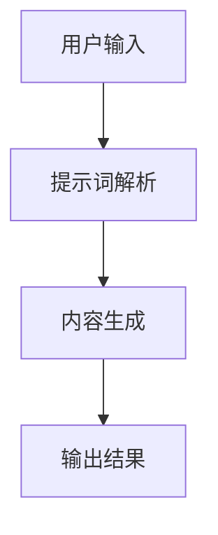
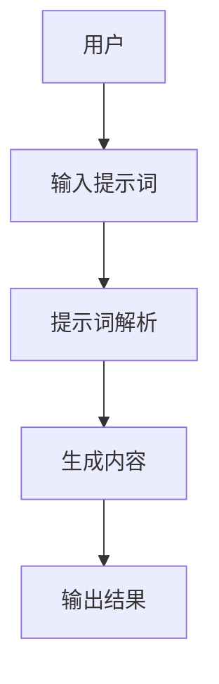
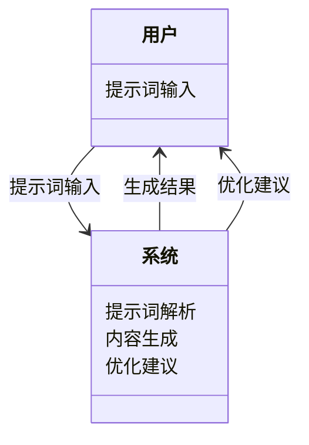

                 

<think>
嗯，用户让我写一篇关于AIGC提示词编写的技术博客，标题是《AIGC提示词编写：效率与创意的完美结合》。首先，我需要理解用户的需求，他可能是一位技术专家，希望分享深入的技术内容，吸引读者。

用户给了详细的结构，包括五个部分，每个部分有多个章节，每个章节还有小节。看起来他希望文章内容丰富，结构清晰，逻辑性强。我需要确保每个部分都涵盖必要的内容，比如背景介绍、效率提升、创意发挥、实战案例和结论展望。

关键词部分，我选了AIGC、提示词、AI生成内容、效率优化、创意设计，这些是文章的核心。摘要部分，我总结了文章的目的，即通过提示词提升效率和创意。

接下来，正文部分需要按照目录展开。首先是背景介绍，包括定义、发展趋势、核心技术、应用领域和挑战。这部分要详细说明，可能需要加入图表，比如AIGC的核心技术架构图，用Mermaid画出来。

然后是效率提升部分，提示词的基础知识、编写原则、工具，以及优化技巧。这部分需要具体，比如列出常用的提示词类型，比如描述性、指令性、引导性等。还要提到工具，如ChatGPT、MidJourney等。

接下来是创意发挥，AIGC在写作和设计中的应用。比如故事创作、品牌设计等。这里可能需要举例，比如用MidJourney生成视觉设计，或者用AI工具辅助文学创作。

实战案例部分，需要详细描述一个项目，从背景到系统架构，再到提示词的编写和优化。这部分可能需要结合实际案例，展示如何一步步实施。

最后是结论和展望，总结AIGC的现状和未来趋势，可能提到多模态技术的发展，伦理问题，以及人机协作的重要性。

在写作过程中，我需要确保每个章节都有足够的深度，加入图表、公式和代码示例。比如，在算法部分，用Mermaid画出提示词优化的流程图，展示提示词如何通过多次优化得到结果。

另外，用户强调了格式要求，使用markdown，数学公式用latex，所以我要注意格式的正确性。例如，数学公式用$$包裹，段落内的用$包裹。

最后，作者信息部分，按照用户的要求，加上特定的署名。整体字数控制在10000到12000字之间，确保内容完整，每个小节都有详细讲解。

总之，我需要按照用户给定的结构，逐部分展开，确保每个核心内容都涵盖，并且加入图表、代码和数学公式，使文章既专业又易懂。
</think>

# AIGC提示词编写：效率与创意的完美结合

> 关键词：AIGC, 提示词, AI生成内容, 效率优化, 创意设计

> 摘要：AIGC（AI-Generated Content）正在迅速改变内容创作的方式。提示词作为AIGC的核心驱动因素，直接影响生成内容的质量和效率。本文将深入探讨AIGC的背景、提示词编写的基础与实践技巧、创意应用以及未来发展方向。通过结合实际案例和系统架构设计，本文将为读者提供从理论到实践的全面指南，帮助他们在效率与创意之间找到完美平衡。

---

## 1. **背景介绍**

### 1.1 AIGC的定义与历史

AIGC（AI-Generated Content）是指通过人工智能技术生成内容的过程，涵盖文本、图像、视频、音频等多种形式。其历史可以追溯到20世纪50年代，随着自然语言处理（NLP）、计算机视觉和深度学习技术的快速发展，AIGC逐渐从理论走向实际应用。

**核心概念：**

- **生成模型**：如GPT系列、BERT、DALL-E等，基于大量数据训练，生成与输入条件相符的内容。
- **提示词（Prompt）**：用户输入的指导性指令，用于引导生成模型输出预期结果。

### 1.2 AIGC的发展趋势与市场前景

近年来，AIGC在多个领域的应用呈现爆发式增长，尤其是在创意设计、市场营销和内容创作领域。根据市场研究机构的预测，AIGC市场规模将在未来几年内以年均30%以上的速度增长。其主要驱动力包括：

- **技术进步**：生成模型的精度和效率不断提升。
- **需求增长**：企业对高效内容创作工具的需求激增。
- **成本降低**：AIGC降低了传统内容创作的人力和时间成本。

### 1.3 AIGC的核心技术

AIGC的核心技术主要集中在以下几个方面：

- **自然语言处理（NLP）**：用于文本生成和对话系统。
- **计算机视觉（CV）**：用于图像和视频生成。
- **生成对抗网络（GAN）**：通过对抗训练生成逼真内容。
- **大语言模型（LLM）**：如GPT-4，具备强大的上下文理解和生成能力。

**技术架构图：**

### 1.4 AIGC的应用领域

AIGC的应用场景广泛，包括：

- **内容创作**：文本生成、新闻报道、广告文案。
- **艺术设计**：图像生成、艺术作品创作。
- **教育培训**：个性化学习内容生成。
- **市场营销**：自动化营销文案生成。

### 1.5 AIGC的挑战与解决方案

尽管AIGC具有巨大潜力，但其发展仍面临以下挑战：

- **内容质量不稳定**：生成结果可能偏离预期。
- **创意独特性不足**：依赖现有数据可能导致同质化。
- **技术门槛高**：非技术人员难以有效使用。

**解决方案：**

- **优化提示词设计**：通过明确的提示词引导生成模型输出预期结果。
- **结合人类反馈**：通过人工干预调整生成内容。
- **多模态技术结合**：将文本、图像、音频等多种形式结合，提升生成效果。

---

## 2. **效率提升：提示词编写的基础与实践**

### 2.1 提示词的作用与类型

提示词是AIGC系统中至关重要的输入，其作用包括：

- **引导生成方向**：明确生成内容的主题和风格。
- **优化生成结果**：通过提示词调整生成模型的输出范围。

提示词的类型可以分为：

- **描述性提示**：描述生成内容的场景或主题，如“写一篇关于环保的文章”。
- **指令性提示**：直接给出生成任务的指令，如“生成一张蓝色星球的图片”。
- **引导性提示**：通过引导生成模型的思路，如“以科幻风格描述未来城市”。

### 2.2 提示词编写的原则与方法

编写高效的提示词需要遵循以下原则：

- **明确性**：提示词应清晰明确，避免模糊描述。
- **简洁性**：避免冗长的描述，突出核心需求。
- **灵活性**：允许生成模型在一定范围内自由发挥。

**提示词编写方法：**

1. **确定目标**：明确生成内容的目标和用途。
2. **选择合适的模型**：根据任务选择适合的生成模型。
3. **优化提示词**：通过多次调整提示词，找到最优表达。

### 2.3 提示词工具与资源

目前市面上有许多工具可以帮助用户编写高效的提示词：

- **ChatGPT**：支持自然语言交互，提供多种提示词模板。
- **MidJourney**：专注于图像生成，支持复杂的提示词设计。
- **Jasper**：提供多种提示词模板和生成模型选择。

### 2.4 提示词优化的技巧

提示词优化的关键在于不断试验和调整：

- **逐步细化**：从简单的提示词逐步细化，逐步接近预期结果。
- **结合反馈**：根据生成结果调整提示词。
- **多模型对比**：尝试不同的生成模型，找到最适合的提示词表达。

---

## 3. **创意发挥：AIGC在创意领域的应用**

### 3.1 故事创作

AIGC在故事创作中的应用主要体现在：

- **情节生成**：通过提示词生成故事情节和角色设定。
- **风格调整**：根据提示词调整故事的风格和节奏。

**案例：**

使用提示词“生成一个科幻小说的情节，主角是一个未来科学家，主题是时间旅行”可以得到一段详细的情节描述。

### 3.2 文学创作

AIGC可以帮助文学创作者快速生成诗歌、散文等作品。例如：

- **诗歌生成**：输入提示词“生成一首关于爱情的诗”，可以得到一首简短的诗歌。
- **散文创作**：通过提示词“描写一个雨夜的城市”，生成一段优美的散文。

### 3.3 艺术创作

AIGC在艺术创作中的应用包括：

- **图像生成**：通过提示词生成绘画、插画等视觉作品。
- **音乐创作**：生成符合提示词的音乐片段。

**案例：**

使用提示词“生成一张抽象风格的蓝色星球图片”，可以得到一张富有想象力的视觉作品。

### 3.4 创意广告

AIGC可以帮助市场营销人员快速生成创意广告文案。例如：

- **广告标题生成**：输入提示词“生成一个吸引人的标题，关于环保产品”，可以得到多个候选标题。
- **广告内容优化**：根据提示词调整广告文案的风格和内容。

---

## 4. **系统架构与提示词优化**

### 4.1 系统架构设计

AIGC系统的架构通常包括以下几个部分：

- **输入层**：用户输入提示词。
- **处理层**：解析提示词并生成内容。
- **输出层**：输出生成结果。

**系统架构图：**

### 4.2 提示词优化流程

提示词优化的流程通常包括以下几个步骤：

1. **明确需求**：确定生成内容的目标和用途。
2. **选择模型**：根据任务选择适合的生成模型。
3. **编写提示词**：根据需求编写提示词。
4. **生成与调整**：生成内容并根据结果调整提示词。
5. **最终输出**：输出优化后的生成内容。

---

## 5. **实战案例：AIGC项目实战**

### 5.1 项目背景与目标

假设我们正在开发一个AIGC驱动的营销文案生成系统，目标是通过提示词优化，快速生成高质量的广告文案。

### 5.2 系统功能设计

系统功能包括：

- **提示词输入**：用户输入提示词。
- **生成结果**：生成广告文案。
- **优化建议**：根据生成结果提供优化建议。

**功能类图：**

### 5.3 提示词编写与优化

提示词编写的关键在于明确需求和优化表达。例如：

- **初始提示词**：“生成一个吸引人的标题，关于环保产品”。
- **优化后的提示词**：“生成一个吸引人的标题，关于环保产品的，面向年轻消费者，强调可持续发展”。

---

## 6. **结论与展望**

### 6.1 AIGC的未来发展

AIGC技术的未来发展将朝着以下几个方向发展：

- **多模态生成**：结合文本、图像、音频等多种形式，提升生成内容的丰富性。
- **实时交互**：通过实时交互优化生成内容，提升用户体验。
- **伦理与安全**：加强AIGC的伦理规范和安全监管。

### 6.2 AIGC对社会与文化的影响

AIGC将对社会和文化产生深远影响：

- **内容创作效率提升**：降低内容创作成本，提升创作效率。
- **创意表达多样化**：通过AIGC技术，创作者可以更自由地表达创意。
- **文化传承与创新**：利用AIGC技术保护和传承文化遗产，推动文化创新。

---

## 7. **附录：AIGC常用工具与资源汇总**

以下是常用的AIGC工具和资源：

- **文本生成工具**：
  - ChatGPT
  - Google Docs Writer
- **图像生成工具**：
  - DALL-E
  - MidJourney
- **音乐生成工具**：
  - OpenAI Jukedeck
  - Amper Music

---

**作者：AI天才研究院/AI Genius Institute & 禅与计算机程序设计艺术 /Zen And The Art of Computer Programming**

