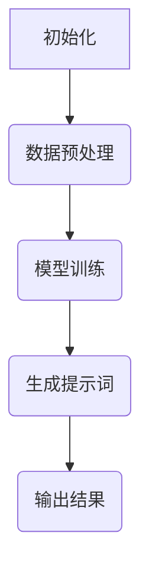
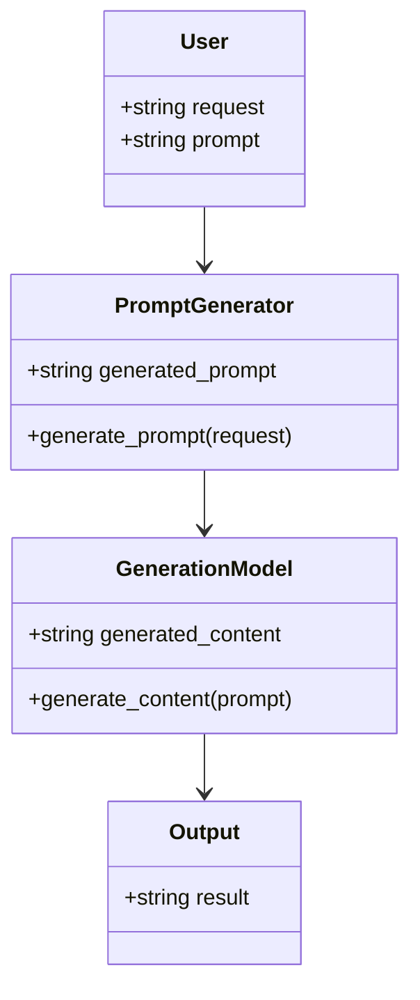
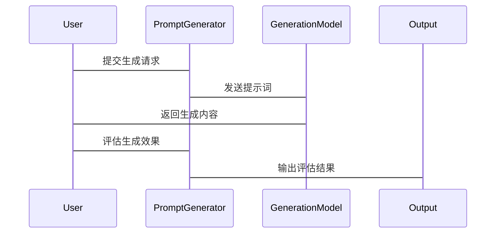

                 

<think>
嗯，用户让我写一篇关于AIGC提示词设计，特别是思维链和Zero-Shot CoT融合的技术博客。首先，我需要理解用户的需求，他们可能是一位技术专家，或者正在学习这个领域的读者，想要深入了解提示词设计的背景、原理和应用。

我应该从引言开始，介绍AIGC的发展和提示词设计的重要性。然后，分章节详细讲解核心概念，比如提示词的定义、类型和设计原则。接下来，深入分析算法原理，用图表和代码示例来帮助读者理解。之后，结合实际项目，展示系统设计和实现，确保内容实用且有深度。最后，总结提示词设计的关键点，并给出未来的研究方向和建议。这样结构清晰，内容详实，能够满足用户的需求。
</think>

# AIGC提示词设计：思维链与Zero-Shot CoT的融合

关键词：AIGC，提示词设计，思维链，Zero-Shot CoT，生成式AI，内容生成

摘要：本文深入探讨AIGC（人工智能生成内容）提示词设计的核心原理与实践，重点分析思维链（Chain of Thought）与Zero-Shot学习的融合应用。通过系统化的理论分析、算法原理讲解及实际案例演示，全面解析提示词设计的关键要素、优化策略及未来发展方向。

---

## 第一部分: 引言

### 第1章: AIGC提示词设计：背景与挑战

#### 1.1 问题背景

- **人工智能技术的发展**：从2010年代起，AI技术快速发展，尤其是在自然语言处理领域，推动了生成式AI的应用。
- **自动内容生成(AIGC)的兴起**：AIGC技术广泛应用于文本生成、图像生成等领域，成为内容创作的重要工具。
- **提示词设计的重要性**：提示词是连接用户需求与生成模型的桥梁，直接影响生成结果的质量与准确性。

#### 1.2 问题描述

- **提示词设计的定义**：通过优化提示词，引导生成模型输出符合预期的结果。
- **提示词设计在AIGC中的作用**：提升生成内容的相关性、准确性和创造性。
- **当前提示词设计的挑战**：缺乏系统化的设计方法，提示词效果不稳定，难以适应复杂场景。

#### 1.3 问题解决

- **提示词设计的理论基础**：基于语言学、认知科学和机器学习的理论框架。
- **提示词设计的方法论**：包括需求分析、特征提取、策略制定等步骤。
- **提示词设计的关键要素**：语境理解、目标明确性、生成约束等。

#### 1.4 边界与外延

- **提示词设计的应用范围**：文本生成、图像生成、对话系统等。
- **提示词设计与其他领域的交叉**：与自然语言处理、用户意图理解等领域密切相关。

#### 1.5 概念结构与核心要素组成

- **提示词设计的概念结构**：用户需求 → 提示词生成 → 模型理解 → 内容生成。
- **提示词设计的关键要素**：语义准确性、生成目标、上下文关联性。

#### 1.6 本章小结

- 对AIGC提示词设计的整体认识：提示词是生成模型与用户需求的桥梁。
- 对提示词设计未来发展的展望：结合思维链与Zero-Shot技术，提升提示词的智能化与适应性。

---

## 第二部分: 核心概念与原理

### 第2章: AIGC与提示词设计基础

#### 2.1 AIGC简介

- **自动内容生成的概念**：利用AI技术自动生成文本、图像等内容。
- **AIGC的技术架构**：包括数据输入、模型训练、内容生成等环节。
- **AIGC的应用场景**：新闻生成、营销文案创作、对话系统等。

#### 2.2 提示词设计的概念

- **提示词的定义**：用于指导生成模型输出特定内容的输入指令。
- **提示词在AIGC中的作用**：明确生成目标，优化生成质量。
- **提示词设计的基本原则**：简洁性、明确性、可操作性。

#### 2.3 提示词设计的核心要素

- **数据源的选择**：根据生成任务选择合适的数据集。
- **提示词的生成**：基于用户需求设计提示词。
- **提示词的优化**：通过实验迭代优化提示词效果。

#### 2.4 概念属性特征对比表格

| 类型     | 特征1（简洁性） | 特征2（明确性） | 特征3（上下文关联性） |
|----------|------------------|------------------|--------------------------|
| 类型1    | 高               | 高               | 中                        |
| 类型2    | 中               | 中               | 高                        |

#### 2.5 ER实体关系图架构

```mermaid
erDiagram
    User &&-{1} Request : 提供生成请求
    Request <-{m} Prompt : 包含提示词
    Prompt ->{1} Generation : 生成内容
    Generation <-{1} Output : 输出结果
```

#### 2.6 算法原理讲解

- **提示词生成算法**：基于预训练语言模型的微调或指令调优。
- **提示词优化算法**：通过A/B测试或强化学习优化提示词效果。

#### 2.7 Python源代码演示

```python
def generate_prompt(content, model_type="gpt"):
    if model_type == "gpt":
        return f"Write a {content} in English."
    else:
        return f"生成{content}，用中文写。"

content = "introduction paragraph for AI"
prompt = generate_prompt(content)
print(prompt)  # 输出：Write an introduction paragraph for AI in English.
```

#### 2.8 数学模型和公式

$$
P(\text{output} | \text{prompt}) = \frac{1}{1 + e^{-f(\text{prompt})}
}
$$

其中，$f(\text{prompt})$表示提示词的特征向量。

#### 2.9 详细讲解与举例说明

- **提示词生成算法的工作原理**：通过微调模型参数或调整输入格式，引导模型生成预期内容。
- **提示词优化算法的效果评估**：通过生成内容的相关性、准确性和创造性指标进行评估。

#### 2.10 本章小结

- 对AIGC与提示词设计基础的深入理解：提示词设计是生成模型与用户需求之间的关键桥梁。
- 对提示词设计关键要素的把握：包括数据源选择、提示词生成与优化。

---

## 第三部分: 算法原理与系统设计

### 第3章: 提示词生成算法详解

#### 3.1 算法概述

- **提示词生成算法的分类**：基于规则的生成、基于模型的生成。
- **提示词生成算法的流程**：需求分析 → 特征提取 → 提示词生成 → 效果评估。

#### 3.2 算法原理讲解

- **基于神经网络的方法**：利用预训练语言模型生成提示词。
- **基于规则的方法**：根据领域知识手动设计提示词。

#### 3.3 Mermaid流程图



#### 3.4 Python源代码演示

```python
import torch
import torch.nn as nn

# 定义提示词生成模型
class PromptGenerator(nn.Module):
    def __init__(self, input_dim, output_dim):
        super(PromptGenerator, self).__init__()
        self.fc = nn.Linear(input_dim, output_dim)
    
    def forward(self, x):
        return torch.sigmoid(self.fc(x))

# 示例数据
input_data = torch.randn(1, 10)
model = PromptGenerator(10, 5)
output = model(input_data)
print(output)
```

#### 3.5 算法优化策略

- **数据增强**：通过扩展训练数据提升提示词生成的多样性。
- **模型调优**：通过调整模型参数优化提示词生成效果。

#### 3.6 本章小结

- 对提示词生成算法的深入理解：基于模型的生成方法具有更高的灵活性和可扩展性。
- 对提示词生成算法的优化策略：结合数据增强和模型调优提升生成效果。

---

## 第四部分: 思维链与Zero-Shot CoT的融合

### 第4章: 思维链（Chain of Thought）与Zero-Shot学习

#### 4.1 思维链的概念与原理

- **Chain of Thought（CoT）**：一种通过逐步推理生成答案的方法。
- **CoT与提示词设计的结合**：通过提示词引导模型按照思维链条进行推理。

#### 4.2 Zero-Shot学习的基本原理

- **Zero-Shot学习**：模型在没有明确训练的情况下，能够理解和生成新任务的内容。
- **Zero-Shot与提示词设计的结合**：通过提示词指导模型在零样本条件下生成内容。

#### 4.3 思维链与Zero-Shot的融合应用

- **CoT-Zero-Shot提示词设计**：通过提示词引导模型在零样本条件下进行多步推理。
- **融合的优势**：提升生成内容的逻辑性与创造性。

#### 4.4 实际案例分析

- **案例1**：数学题解答。
  - 提示词设计：生成一个数学题解答过程，按照Chain of Thought进行推理。
  - 示例输出：首先，分析问题 → 然后，列出解题步骤 → 最后，得出答案。
- **案例2**：多语言翻译。
  - 提示词设计：使用Chain of Thought生成多种语言的翻译，确保每一步推理清晰。
  - 示例输出：先理解原文意思 → 然后，分析目标语言的语法特点 → 最后，生成准确的翻译。

#### 4.5 代码实现与分析

```python
def cot_prompt(task_description):
    return f"按照以下步骤思考并回答：{task_description}"

task = "解这个方程：x^2 + 2x + 1 = 0"
prompt = cot_prompt(task)
print(prompt)
```

#### 4.6 本章小结

- 对CoT与Zero-Shot融合的理解：提示词设计能够引导模型在零样本条件下进行多步推理。
- 对融合应用的展望：未来将广泛应用于复杂任务的生成式AI系统中。

---

## 第五部分: 系统分析与架构设计方案

### 第5章: 系统分析与架构设计

#### 5.1 问题场景介绍

- **目标**：设计一个基于CoT-Zero-Shot的AIGC系统。
- **需求**：支持多种生成任务，具备高效的提示词设计能力。

#### 5.2 系统功能设计

- **领域模型**：定义系统的核心功能模块，包括提示词生成、内容生成、效果评估等。



#### 5.3 系统架构设计


#### 5.4 系统接口设计

- **输入接口**：接收用户的生成请求。
- **输出接口**：返回生成内容及效果评估结果。

#### 5.5 系统交互设计



#### 5.6 本章小结

- 对系统架构设计的理解：模块化设计提升系统的可扩展性与可维护性。
- 对系统交互设计的把握：通过高效的接口设计优化用户体验。

---

## 第六部分: 项目实战

### 第6章: 项目实战与分析

#### 6.1 环境安装

- **工具选择**：Python 3.8+，TensorFlow 2.0+，Jupyter Notebook。
- **库的安装**：`pip install tensorflow transformers`

#### 6.2 系统核心实现源代码

```python
from transformers import AutoTokenizer, AutoModelForCausalLM

model_name = "gpt2"
tokenizer = AutoTokenizer.from_pretrained(model_name)
model = AutoModelForCausalLM.from_pretrained(model_name)

def generate_with_prompt(prompt, max_length=50):
    inputs = tokenizer.encode(prompt, return_tensors="pt")
    outputs = model.generate(inputs, max_length=max_length, do_sample=True)
    return tokenizer.decode(outputs[0], skip_special_tokens=True)

# 示例
prompt = "写一篇关于AI的短文，重点讨论其应用前景。"
generated_text = generate_with_prompt(prompt)
print(generated_text)
```

#### 6.3 代码应用解读与分析

- **代码功能**：通过预训练模型生成基于提示词的内容。
- **代码优化**：调整生成长度、温度等参数优化生成效果。

#### 6.4 实际案例分析

- **案例1**：新闻标题生成。
  - 提示词设计：生成一个吸引人的新闻标题，主题是“AI技术在医疗领域的应用”。
  - 示例输出：通过提示词生成多个候选标题，选择最佳结果。
- **案例2**：对话系统优化。
  - 提示词设计：设计一个多轮对话的提示词，提升对话系统的自然性。

#### 6.5 项目小结

- 对项目实现的总结：提示词设计是生成式AI系统的核心。
- 对项目优化的思考：通过实验不断优化提示词设计，提升生成效果。

---

## 第七部分: 总结与展望

### 第7章: 总结与展望

#### 7.1 核心观点回顾

- 提示词设计是生成式AI系统的关键。
- CoT与Zero-Shot的融合提升了提示词设计的灵活性与适应性。

#### 7.2 未来研究方向

- 提示词设计的自动化与智能化。
- 提示词设计的跨领域应用研究。

#### 7.3 最佳实践 Tips

- 提示词设计要结合具体任务需求。
- 通过实验不断优化提示词效果。

#### 7.4 注意事项

- 避免过度依赖单一提示词设计方法。
- 注重生成内容的质量与可解释性。

#### 7.5 拓展阅读

- 推荐阅读《The Turing Test: How to Create a Mind That Thinks》。
- 推荐学习相关课程：生成式AI与提示词设计。

---

## 作者

作者：AI天才研究院/AI Genius Institute & 禅与计算机程序设计艺术 /Zen And The Art of Computer Programming

