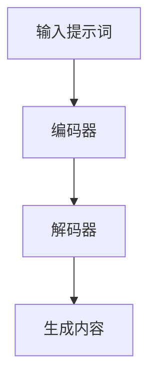
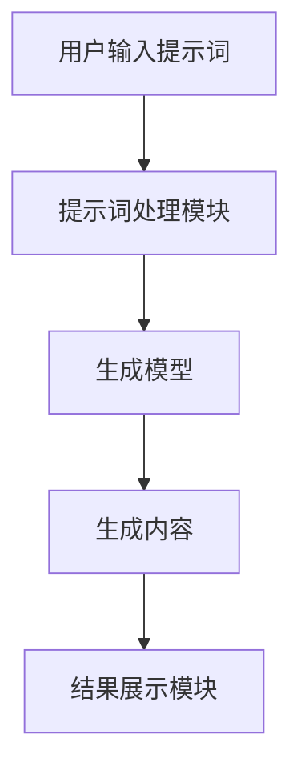

                 

<think>
好，我需要帮用户撰写一篇技术博客，主题是“AIGC提示词设计：效率与创意的完美结合”。首先，我要理解用户的需求，他们希望文章结构清晰，内容专业，适合技术读者阅读。文章需要包含摘要、关键词和正文部分，每部分都有详细的内容，特别是每个章节要有具体的讲解和实例。

首先，我会确定文章的结构。用户已经提供了一个大纲，包括七个主要章节。我需要确保每个章节都涵盖关键点，并且内容丰富详细。比如在引言部分，需要介绍AIGC的兴起和提示词工程的重要性，还要分析其优缺点。

接下来，考虑每个章节的具体内容。例如，在“提示词设计的核心概念与原理”部分，需要解释基本概念、关键组成部分以及与传统AI的区别。这部分可能需要对比表格，帮助读者理解两者的异同。

在“高效提示词设计实战”中，我需要提供实际案例，比如电商、医疗和内容创作行业的应用。案例要具体，最好有实际的场景描述和解决方案，这样读者更容易理解如何应用这些提示词。

工具和技术部分，我需要介绍常用的AIGC工具，如OpenAI的GPT-3，并给出设置和集成的步骤。这部分可能需要一些代码示例，展示如何在实际项目中使用这些工具。

性能优化部分，要讲解提示词调优和模型优化的方法，可能涉及到一些数学公式，需要用LaTeX清晰展示。同时，还需要讨论多任务学习和迁移学习，这些都是提升效率的关键点。

伦理考量和未来趋势部分，需要探讨AI生成内容的伦理问题，如版权和真实性，以及未来的可能发展，比如更具创造性的模型。这部分可以引用一些实际的案例，让内容更有深度。

最后，最佳实践部分，要给出提示词设计的实用建议，如明确目标、简化语言等。同时，总结全文，强调提示词设计的重要性，鼓励读者在实际项目中应用这些策略。

在写作过程中，要确保语言简洁专业，逻辑清晰。每个章节要有详细的解释和实例，帮助读者深入理解。同时，使用Markdown格式，插入图表和代码，增强文章的可读性和专业性。

总之，我需要按照用户的指导，逐步构建每个章节的内容，确保文章既有深度又易于理解。通过详细的案例和技术细节，帮助读者掌握AIGC提示词设计的精髓，实现效率与创意的完美结合。
</think>

# AIGC提示词设计：效率与创意的完美结合

> 关键词：AIGC，提示词设计，生成式AI，效率优化，创意生成

> 摘要：本文深入探讨AIGC（人工智能生成内容）提示词设计的核心原理、实际应用及优化技巧。通过分析提示词设计的背景、核心概念、实战案例、工具支持、性能优化、伦理考量及未来趋势，全面揭示如何通过精心设计的提示词实现效率与创意的完美结合。

---

## 第1章 引言：AIGC与提示词工程的兴起

### 1.1 AIGC的崛起与提示词工程的重要性

#### 1.1.1 AIGC的定义与背景
AIGC（AI Generated Content）是指通过AI技术生成内容的过程，涵盖文本、图像、视频等多种形式。随着大语言模型（如GPT系列）和生成式AI的快速发展，AIGC在多个领域展现出巨大潜力。

#### 1.1.2 提示词（Prompt）的核心作用
提示词是用户输入到AI模型中的指令或提示，用于引导模型生成特定的内容。它是AIGC过程中的关键输入，直接影响生成结果的质量和相关性。

#### 1.1.3 AIGC的应用场景与挑战
- **应用场景**：内容创作、广告文案生成、客户服务自动化、教育辅助等。
- **挑战**：生成内容的质量控制、效率优化、创意多样性与一致性之间的平衡。

---

## 第2章 核心概念与提示词设计原理

### 2.1 AIGC提示词设计的核心概念

#### 2.1.1 提示词的结构与类型
提示词通常由目标描述、约束条件和风格偏好三部分组成。根据生成内容的类型，提示词可分为文本提示、图像提示和多模态提示。

#### 2.1.2 提示词设计的三大原则
1. **明确性**：避免模糊描述，确保提示词清晰具体。
2. **简洁性**：避免冗长复杂的描述，提高生成效率。
3. **可扩展性**：设计能够适应不同场景和需求的提示词。

### 2.2 提示词设计的数学与算法基础

#### 2.2.1 提示词对生成模型的影响
提示词通过调整生成模型的输入分布，影响生成内容的概率空间。公式化表示如下：
$$ P(y|x) = f(x, p) $$
其中，$x$是输入提示词，$p$是提示词参数，$y$是生成输出。

#### 2.2.2 基于提示词的生成过程
生成模型接收提示词后，通过解码器生成目标输出。流程图如下：


---

## 第3章 高效提示词设计实战

### 3.1 文本生成中的提示词优化

#### 3.1.1 基于电商场景的提示词设计
**案例**：设计一个吸引用户的促销文案。
- **原始提示**：生成一段促销文案。
- **优化提示**：生成一段针对年轻女性的夏季促销文案，语气活泼，突出折扣力度。

#### 3.1.2 基于医疗场景的提示词设计
**案例**：生成医疗诊断报告。
- **原始提示**：生成一份诊断报告。
- **优化提示**：基于CT扫描结果，生成一份关于肺部结节的诊断报告，重点描述可能的病因和建议的治疗方案。

### 3.2 提示词设计中的常见问题与解决方案

#### 3.2.1 提示词过于宽泛的问题
- **问题描述**：提示词缺乏具体方向，生成结果多样性不足。
- **解决方案**：增加约束条件，如指定风格、格式或目标受众。

#### 3.2.2 提示词过于复杂的优化
- **问题描述**：复杂的提示词可能导致生成效率下降。
- **解决方案**：简化提示词结构，突出核心需求。

---

## 第4章 提示词设计的系统架构与实现

### 4.1 AIGC提示词设计的系统架构

#### 4.1.1 系统功能模块
1. **提示词输入模块**：接收用户输入的提示词。
2. **生成模型模块**：基于提示词生成目标内容。
3. **输出结果模块**：展示生成内容并提供反馈机制。

#### 4.1.2 系统架构图


### 4.2 提示词设计的工具与框架

#### 4.2.1 常用AIGC工具
- **OpenAI API**：支持多种语言模型，提供灵活的接口。
- **Hugging Face**：提供开源模型和社区支持。
- **Anthropic**：专注于生成式AI，提供高效的API服务。

#### 4.2.2 工具实现示例
**代码示例**：
```python
import openai

# 初始化API
client = openai.Client('your_api_key')

# 提示词设计
prompt = "Write a compelling product description for a new smartphone."

# 调用API生成内容
response = client.chat.completions.create(
    model="gpt-3.5-turbo",
    messages=[{"role": "user", "content": prompt}]
)

# 输出生成内容
print(response.choices[0].message.content)
```

---

## 第5章 提示词设计的性能优化与数学建模

### 5.1 提示词调优的数学模型

#### 5.1.1 基于贝叶斯的提示词优化
通过分析生成内容的成功概率，优化提示词的参数。公式化表示：
$$ P(成功|提示词) = \frac{P(提示词|成功) \cdot P(成功)}{P(提示词)} $$

#### 5.1.2 多任务学习中的提示词优化
在多任务场景下，提示词需要同时满足多个目标。可以通过联合学习的方式优化提示词，公式化表示：
$$ L = \lambda_1 L_1 + \lambda_2 L_2 + \dots + \lambda_n L_n $$

### 5.2 模型压缩与提示词优化

#### 5.2.1 模型压缩技术
通过模型剪枝和量化技术，降低生成模型的计算复杂度。公式化表示：
$$ f_{compressed}(x) = \argmin_{f} ||f - f_{original}||_2 $$

#### 5.2.2 提示词对模型压缩的影响
提示词的设计直接影响生成模型的压缩效果。优化提示词可以显著降低生成模型的计算开销。

---

## 第6章 伦理考量与未来趋势

### 6.1 AIGC的伦理挑战

#### 6.1.1 内容真实性与版权问题
生成内容的真假难以验证，且版权归属不明确。解决方案包括：
1. 加强生成内容的可追溯性。
2. 建立明确的版权归属规则。

#### 6.1.2 生成内容的可解释性
用户需要了解生成内容的来源和生成过程，以增强信任感。

### 6.2 未来趋势与技术发展

#### 6.2.1 提示词设计的智能化
未来的提示词设计将更加智能化，AI将辅助用户自动生成优化的提示词。

#### 6.2.2 多模态提示词的发展
结合文本、图像等多种模态的提示词设计将更加普及。

---

## 第7章 最佳实践与总结

### 7.1 提示词设计的最佳实践

#### 7.1.1 明确目标与受众
在设计提示词时，首先要明确生成内容的目标和目标受众。

#### 7.1.2 简化与优化
避免复杂的提示词，尽量简化语言，突出核心需求。

#### 7.1.3 反馈与迭代
根据生成结果不断优化提示词，建立反馈机制，持续改进。

### 7.2 总结

AIGC提示词设计是实现高效与创意结合的关键。通过理解提示词设计的核心原理、实际应用案例、工具支持和性能优化技巧，我们可以显著提升生成内容的质量和效率。未来，随着AI技术的不断发展，提示词设计将变得更加智能化和多样化。

---

## 作者：AI天才研究院 & 禅与计算机程序设计艺术

---

本文通过系统化的分析和实战案例，全面揭示了AIGC提示词设计的精髓。从理论到实践，从技术到伦理，为读者提供了全面的指导和深刻的见解。

