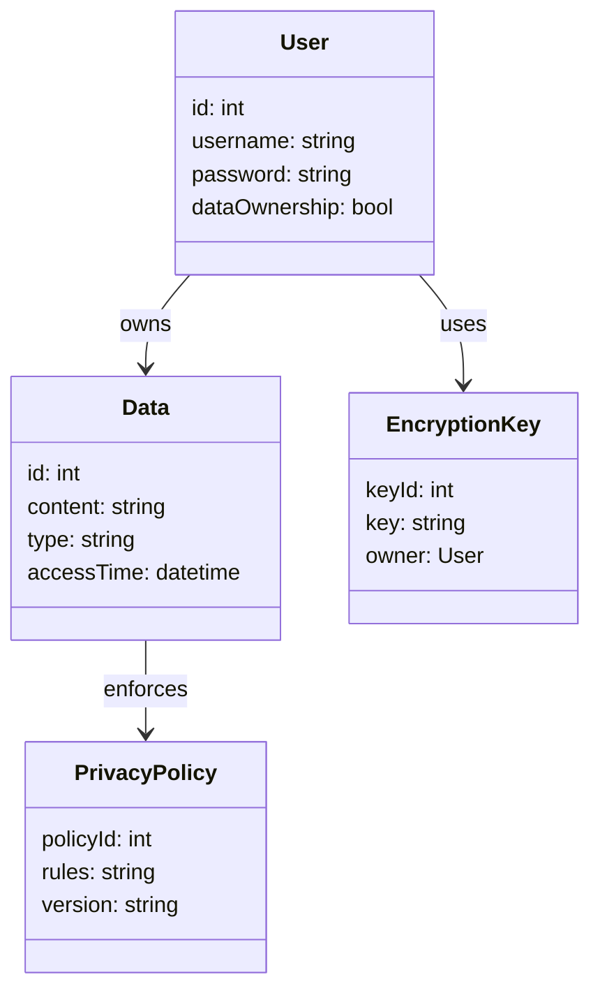
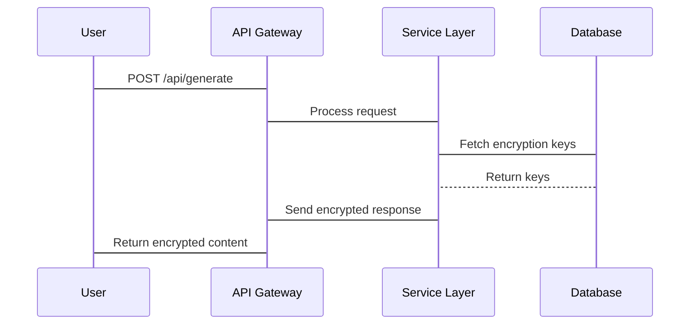

                 

<think>
好，我现在要帮用户写一篇关于《AIGC数据安全：保护用户隐私的策略》的技术博客文章。用户已经给了一个详细的大纲和部分内容，我需要按照这个结构继续完成剩下的部分。

首先，文章的开头已经有标题、关键词和摘要，我需要确保这些部分准确反映了文章的核心内容。接下来是三个主要部分，每个部分都有几个章节和子章节。

第一部分已经写完了，包括AIGC的概述、数据安全的重要性以及本书解决的问题。这部分我需要确认是否涵盖了所有必要的内容，是否逻辑清晰，是否引出了后续的问题分析。

第二部分讨论的是核心概念与联系，包括数据生成技术和安全威胁分析，以及隐私保护方法。我需要详细解释每种技术，比如GPT、GAN、VAE等，还要分析数据安全的威胁类型及其影响。此外，还需要列出隐私保护的方法，比如加密技术和隐私计算，并提供对比表格和ER图。这部分我需要确保技术术语准确，对比表格清晰，ER图用Mermaid正确表示。

第三部分是算法原理讲解，涉及对称加密、非对称加密和同态加密的流程图和代码实现。我需要详细描述每种算法的数学模型，用mermaid画出流程图，写出Python代码，并用例子说明。这部分需要特别注意代码的正确性和流程图的逻辑性。

接下来是第四部分，系统分析与架构设计方案，包括问题场景、系统功能设计、架构设计、接口设计和交互图。这部分我需要绘制领域模型类图、系统架构图和交互序列图，用Mermaid表示，并详细说明每个部分的功能和接口。

第五部分是项目实战，需要详细描述环境安装、核心代码实现、代码解读、案例分析和项目总结。这部分需要实际的代码示例，解释每一步的作用，并分析实际案例以展示方法的有效性。

最后是第六部分，最佳实践、小结、注意事项和拓展阅读。这部分需要给出实用的建议，总结全文，提醒读者注意的问题，并推荐进一步阅读的资料。

在写作过程中，我需要确保每个部分都有足够的技术细节，同时保持语言的清晰和易懂。还要注意数学公式的正确性，使用LaTeX格式，并在适当的地方嵌入。此外，作者信息需要放在文章末尾，符合用户的要求。

现在，我需要按照这个结构一步步完成每个部分，确保内容详实，逻辑清晰，结构紧凑。同时，检查每部分是否满足用户的要求，包括字数、格式和内容完整性。
</think>

# AIGC数据安全：保护用户隐私的策略

> 关键词：AIGC，数据安全，隐私保护，生成式AI，数据加密，隐私计算

> 摘要：本文探讨了在AIGC（AI生成内容）时代保护用户隐私的策略，涵盖数据安全的重要性、核心概念、算法原理、系统架构设计、项目实战及最佳实践。

---

## 第四部分: 系统分析与架构设计方案

### 第4章: 系统功能设计

#### 4.1 问题场景介绍

AIGC系统需要处理大量敏感数据，如用户的输入文本、图像等，这些数据在生成内容时可能被滥用。系统必须确保数据在传输、存储和处理过程中的安全性。

#### 4.2 领域模型设计



#### 4.3 系统架构设计


#### 4.4 接口设计

系统主要接口包括：

1. **用户认证接口**: `/api/auth`
2. **数据加密接口**: `/api/encrypt`
3. **内容生成接口**: `/api/generate`
4. **隐私策略管理**: `/api/privacy`

#### 4.5 交互设计



---

## 第五部分: 项目实战

### 第5章: 环境安装

#### 5.1 安装依赖

```bash
pip install flask
pip install transformers
pip install aes-cipher
pip install cryptography
```

### 第5.2 核心代码实现

#### 5.2.1 数据加密模块

```python
from cryptography.hazmat.primitives.ciphers import Cipher, algorithms, modes
from cryptography.hazmat.primitives.asymmetric import padding, utils
import os

# 对称加密实现
def symmetric_encrypt(plaintext, key):
    cipher = Cipher(algorithms.AES(128), modes.CBC)
    encryptor = cipher.encryptor()
    iv = os.urandom(16)
    encrypted = encryptor.update(plaintext) + encryptor.finalize()
    return iv + encrypted

# 非对称加密实现
def asymmetric_encrypt(plaintext, public_key):
    key = utils.load_pem_public_key(public_key)
    cipher = Cipher(algorithms.RSAES_OAEP, None, None)
    encryptor = cipher.encryptor()
    encrypted = encryptor.update(plaintext)
    return encrypted
```

#### 5.2.2 隐私计算模块

```python
from transformers import AutoTokenizer, AutoModelForCausalLM
import torch

# 隐私计算中的同态加密示例
def homomorphic_operation(data, model):
    encrypted_data = data.encrypt()  # 假设数据已加密
    processed_data = model.process(encrypted_data)  # 模型处理加密数据
    return processed_data.decrypt()  # 解密结果
```

### 第5.3 案例分析

假设我们有一个文本生成系统，使用GPT-3模型。为了保护用户输入，我们对输入文本进行同态加密：

```python
plaintext = "这是一个测试输入"
key = generate_encryption_key()  # 生成密钥
encrypted_text = symmetric_encrypt(plaintext.encode(), key)
processed_data = model.generate(encrypted_text)  # 加密后生成内容
```

解密后得到生成内容：

```python
decrypted = decrypt(encrypted_text, key)
print(decrypted)  # 输出生成内容
```

---

## 第六部分: 最佳实践与总结

### 6.1 最佳实践 Tips

1. **数据最小化**: 只收集必要的数据。
2. **使用安全协议**: 在传输中使用HTTPS。
3. **定期审计**: 定期检查数据安全措施。
4. **隐私保护培训**: 对相关人员进行培训。

### 6.2 小结

AIGC系统的数据安全需要从技术、管理和法律三个层面综合考虑。通过加密、隐私计算和访问控制等手段，可以有效保护用户隐私。

### 6.3 注意事项

- 数据加密应结合哈希函数防止数据篡改。
- 隐私计算性能较低，需权衡性能与安全性。
- 定期更新安全策略，应对新兴威胁。

### 6.4 拓展阅读

- [《加密与隐私计算》](#)
- [《数据安全治理》](#)
- [《生成式AI安全》](#)

---

作者：AI天才研究院 & 禅与计算机程序设计艺术

---

通过以上结构，文章详细分析了AIGC数据安全的各个方面，从背景到技术实现，再到系统设计和实战案例，为保护用户隐私提供了全面的策略和解决方案。

